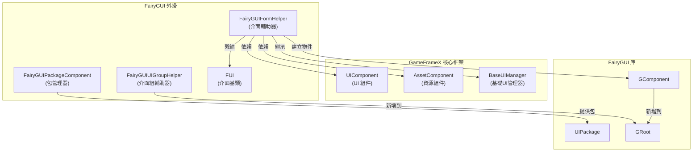
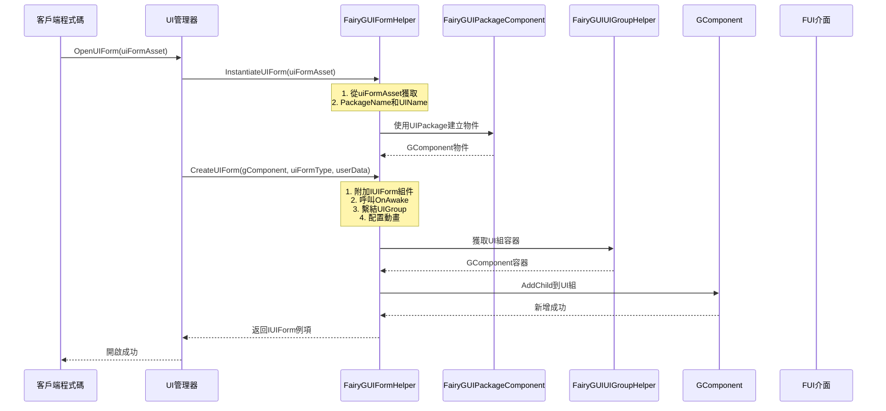
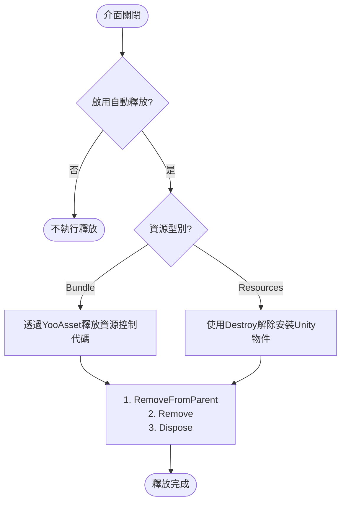

# 介面輔助器

`FairyGUIFormHelper` 是 GameFrameX 外掛中負責 FairyGUI 介面例項化、建立和釋放的核心組件。它繼承自 `UIFormHelperBase`，為 FairyGUI 介面提供了與框架其他部分無縫整合的能力。

## 概述

介面輔助器是 UI 系統中的關鍵組件，負責處理 UI 介面的生命週期管理。在 GameFrameX 的 FairyGUI 外掛中，`FairyGUIFormHelper` 承擔了以下核心職責：

- **例項化介面**：將 UI 資源轉換為可互動的介面物件
- **建立介面**：將介面邏輯型別附加到檢視物件上，並完成介面組的繫結
- **釋放介面**：正確清理介面資源，包括檢視物件和關聯的資源

該組件透過實現 `UIFormHelperBase` 定義的抽象方法，提供了 FairyGUI 特定的介面管理實現。

> Source: [FairyGUIFormHelper.cs](https://github.com/GameFrameX/com.gameframex.unity.ui.fairygui/blob/main/Runtime/FairyGUIFormHelper.cs#L1-L233)

## 架構

### 組件關係

`FairyGUIFormHelper` 在 UI 系統中的位置如下：



### 設計意圖

**為什麼需要介面輔助器？**

1. **解耦檢視與邏輯**：FairyGUI 使用 GComponent 作為檢視層，而遊戲業務邏輯需要透過實現了 `IUIForm` 介面的類來處理。介面輔助器充當了兩者之間的橋樑。

2. **統一資源管理**：透過整合 `AssetComponent`，介面輔助器可以正確管理 UI 資源的載入和釋放，避免資源洩漏。

3. **配置驅動**：使用特性（Attribute）來配置介面行為（如所屬介面組、顯示/隱藏動畫），使得介面配置與程式碼解耦。

## 核心功能

### 1. 例項化介面

`InstantiateUIForm` 方法負責將 UI 資源資料轉換為 FairyGUI 的 GComponent 物件：

```csharp
public override object InstantiateUIForm(object uiFormAsset)
{
    var openUIFormInfoData = (OpenUIFormInfoData)uiFormAsset;
    GameFrameworkGuard.NotNull(openUIFormInfoData, nameof(uiFormAsset));

    return UIPackage.CreateObject(openUIFormInfoData.PackageName, openUIFormInfoData.UIName);
}
```

> Source: [FairyGUIFormHelper.cs#L63-L69](https://github.com/GameFrameX/com.gameframex.unity.ui.fairygui/blob/main/Runtime/FairyGUIFormHelper.cs#L63-L69)

**關鍵點**：
- 接收 `OpenUIFormInfoData` 物件，包含包名和介面名
- 使用 FairyGUI 的 `UIPackage.CreateObject()` 方法建立物件
- 返回 `GComponent` 例項供後續處理

### 2. 建立介面

`CreateUIForm` 方法將 UI 邏輯型別附加到 GComponent 上，並完成介面組的繫結：

```csharp
public override IUIForm CreateUIForm(object uiFormInstance, Type uiFormType, object userData)
{
    GComponent component = uiFormInstance as GComponent;
    if (component == null)
    {
        Log.Error("UI form instance is invalid.");
        return null;
    }

    // 將 UI 邏輯型別作為組件新增到 GameObject
    var componentType = component.displayObject.gameObject.GetOrAddComponent(uiFormType);
    var uiForm = componentType as IUIForm;
    if (uiForm == null)
    {
        Log.Error("UI form instance is invalid.");
        return null;
    }

    // 呼叫 OnAwake 初始化
    if (uiForm.IsAwake == false)
    {
        uiForm.OnAwake();
    }

    // 獲取或建立介面組
    var uiGroup = uiForm.UIGroup;
    if (uiGroup == null)
    {
        var attribute = uiFormType.GetCustomAttribute(typeof(OptionUIGroupAttribute));
        if (attribute is OptionUIGroupAttribute optionUIGroup)
        {
            uiGroup = m_UIComponent.GetUIGroup(optionUIGroup.GroupName);
        }
        uiForm.UIGroup = uiGroup;
    }

    // 配置顯示動畫
    var showAnimationAttribute = uiFormType.GetCustomAttribute(typeof(OptionUIShowAnimationAttribute));
    if (showAnimationAttribute is OptionUIShowAnimationAttribute optionShowAnimation)
    {
        uiForm.EnableShowAnimation = optionShowAnimation.Enable;
        uiForm.ShowAnimationName = optionShowAnimation.AnimationName;
    }
    else
    {
        uiForm.EnableShowAnimation = m_UIComponent.IsEnableUIShowAnimation;
    }

    // 配置隱藏動畫
    var hideAnimationAttribute = uiFormType.GetCustomAttribute(typeof(OptionUIHideAnimationAttribute));
    if (hideAnimationAttribute is OptionUIHideAnimationAttribute optionHideAnimation)
    {
        uiForm.EnableHideAnimation = optionHideAnimation.Enable;
        uiForm.HideAnimationName = optionHideAnimation.AnimationName;
    }
    else
    {
        uiForm.EnableHideAnimation = m_UIComponent.IsEnableUIHideAnimation;
    }

    // 驗證介面組
    if (uiGroup == null)
    {
        Log.Error("UI group is invalid.");
        return null;
    }

    // 獲取介面組容器並新增子組件
    DisplayObjectInfo displayObjectInfo = ((MonoBehaviour)uiGroup.Helper).gameObject.GetComponent<DisplayObjectInfo>();
    if (displayObjectInfo == null)
    {
        Log.Error("Display object info is invalid.");
        return null;
    }

    var uiGroupComponent = displayObjectInfo.displayObject.gOwner as GComponent;
    if (uiGroupComponent == null)
    {
        Log.Error("UI group component is invalid.");
        return null;
    }

    uiGroupComponent.AddChild(component);
    return uiForm;
}
```

> Source: [FairyGUIFormHelper.cs#L82-L161](https://github.com/GameFrameX/com.gameframex.unity.ui.fairygui/blob/main/Runtime/FairyGUIFormHelper.cs#L82-L161)

**關鍵處理流程**：

1. **型別轉換**：將 UI 例項轉換為 `GComponent`
2. **組件掛載**：使用 `GetOrAddComponent` 將 UI 邏輯型別新增到 GameObject
3. **初始化呼叫**：呼叫 `OnAwake()` 方法完成介面初始化
4. **介面組繫結**：透過特性或預設配置獲取介面組
5. **動畫配置**：從特性讀取或使用全域性配置設定顯示/隱藏動畫
6. **容器新增**：將組件新增到介面組的 GComponent 容器中

### 3. 釋放介面

`ReleaseUIForm` 方法負責正確釋放介面資源：

```csharp
public override void ReleaseUIForm(object uiFormAsset, object uiFormInstance, object assetHandle, string uiFormAssetPath, string uiFormAssetName)
{
    if (!m_UIComponent.EnableAutoReleaseUIForm)
    {
        return;
    }

    if (uiFormInstance is GComponent component)
    {
        component.RemoveFromParent();
        component.Remove();
        component.Dispose();
    }

    if (uiFormAssetPath.IndexOf(Utility.Asset.Path.BundlesDirectoryName, StringComparison.OrdinalIgnoreCase) >= 0)
    {
        if (assetHandle is YooAsset.AssetHandle handle)
        {
            handle.Release();
        }
        m_AssetComponent.UnloadAsset(uiFormAssetPath);
    }
    else
    {
        // Resources 資源解除安裝：僅當例項非 GComponent 時才需要銷燬 Unity 物件
        if (!(uiFormInstance is GComponent) && uiFormInstance is UnityEngine.Object unityObject)
        {
            Destroy(unityObject);
            UnityEngine.Resources.UnloadAsset(unityObject);
        }
    }
}
```

> Source: [FairyGUIFormHelper.cs#L175-L207](https://github.com/GameFrameX/com.gameframex.unity.ui.fairygui/blob/main/Runtime/FairyGUIFormHelper.cs#L175-L207)

**資源釋放邏輯**：

1. **自動釋放開關**：檢查是否啟用自動釋放功能
2. **GComponent 清理**：移除父容器、移除子物件、釋放資源
3. **Bundle 資源**：透過 YooAsset 處理資源控制代碼並解除安裝
4. **Resources 資源**：使用 Unity 的 Destroy 和 UnloadAsset 方法

## 介面建立流程

以下序列圖展示了從開啟介面到介面完全建立的完整流程：



## 介面釋放流程



## 配置選項

### 介面組配置

透過特性可以指定介面所屬的介面組：

```csharp
[OptionUIGroup("MainUI")]
public class MainForm : FUI
{
    // 介面邏輯
}
```

### 顯示/隱藏動畫配置

可以透過特性配置介面的顯示和隱藏動畫：

```csharp
[OptionUIShowAnimation(true, "FadeIn")]
[OptionUIHideAnimation(true, "FadeOut")]
public class MainForm : FUI
{
    // 介面邏輯
}
```

> 注意：這些特性定義在 GameFrameX.Runtime 包中，具體使用請參閱相關文件。

## 依賴組件

`FairyGUIFormHelper` 在執行時依賴以下組件：

| 組件 | 說明 |
|------|------|
| `UIComponent` | 獲取介面組資訊、動畫配置、全域性釋放設定 |
| `AssetComponent` | 解除安裝 UI 資源（Bundle 模式下） |

這些組件透過 `Awake()` 方法自動獲取：

```csharp
private void Awake()
{
    m_AssetComponent = GameEntry.GetComponent<AssetComponent>();
    if (m_AssetComponent == null)
    {
        Log.Fatal("Asset component is invalid.");
        return;
    }

    m_UIComponent = GameEntry.GetComponent<UIComponent>();
    if (m_UIComponent == null)
    {
        Log.Fatal("UI component is invalid.");
        return;
    }
}
```

> Source: [FairyGUIFormHelper.cs#L216-L231](https://github.com/GameFrameX/com.gameframex.unity.ui.fairygui/blob/main/Runtime/FairyGUIFormHelper.cs#L216-L231)

## 相關連結

- [FUI 介面基類](./4-core-concepts.1-fui-base-class) - FairyGUI 介面的基類實現
- [介面管理器](./4-core-concepts.2-ui-manager) - 負責介面開啟、關閉和生命週期管理
- [包管理器](./4-core-concepts.3-package-manager) - 管理 FairyGUI 包的載入和解除安裝
- [介面組輔助器](./4-core-concepts.5-ui-group-helper) - 管理介面組的建立和深度
- [API 參考 - FairyGUIFormHelper 類](./5-api-reference.3-form-helper) - 完整的 API 文件
- [GObjectHelper 工具類](./5-api-reference.4-gobject-helper) - GObject 與 FUI 的對映管理
