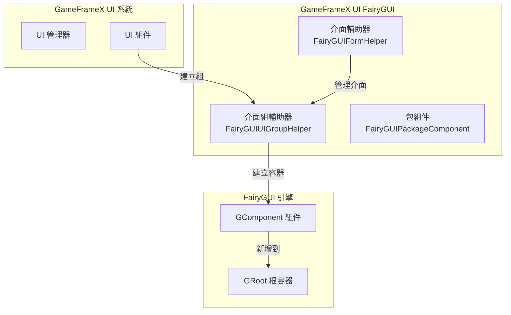
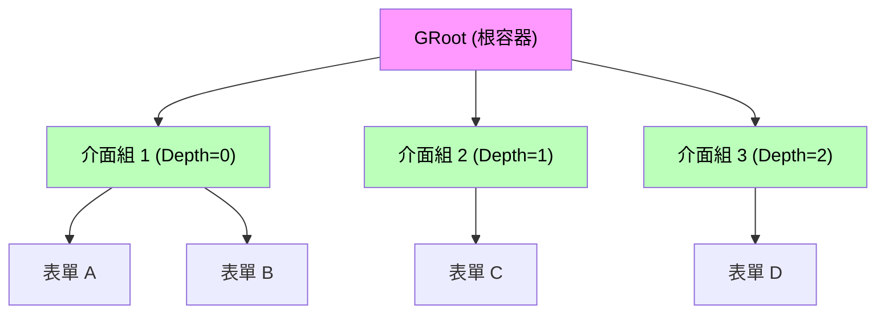
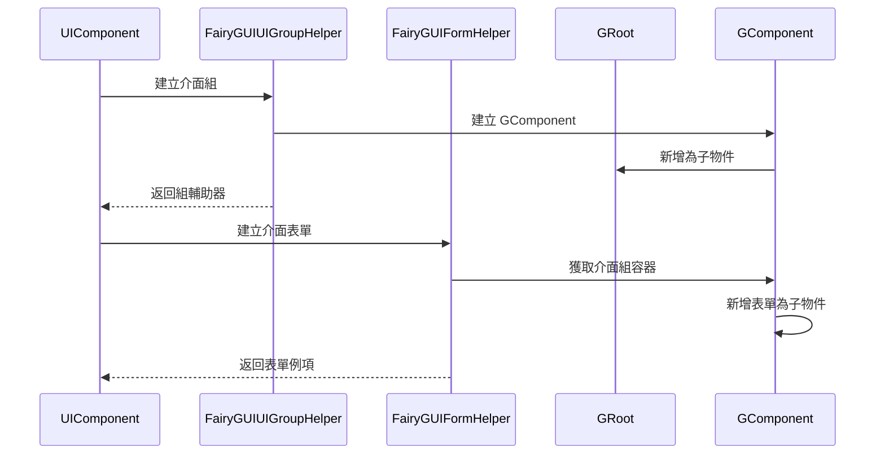

# 介面組輔助器

`FairyGUIUIGroupHelper` 是 GameFrameX UI FairyGUI 外掛的核心組件之一，負責在 FairyGUI 渲染引擎中建立和管理 UI 介面組。介面組是組織和管理多個介面表單（視窗）的容器，透過深度（Depth）控制介面的顯示層級。

## 概述

介面組輔助器是 GameFrameX UI 系統與 FairyGUI 渲染引擎之間的橋樑組件。它繼承自 `UIGroupHelperBase` 抽象類，提供了 FairyGUI 特定的介面組實現。在 UI 系統中，介面組用於將相關的介面表單組織在一起，並透過深度值控制介面的遮擋關係和顯示順序。

**核心職責：**
- 建立 FairyGUI 介面組容器（GComponent）
- 管理介面組的深度（Z 順序）
- 設定介面組全屏顯示
- 與 GameFrameX 核心系統整合

> Source: [FairyGUIUIGroupHelper.cs](https://github.com/GameFrameX/com.gameframex.unity.ui.fairygui/blob/main/Runtime/FairyGUIUIGroupHelper.cs#L36-L97)

## 架構設計

### 類圖結構

```mermaid
classDiagram
    class UIGroupHelperBase {
        <<abstract>>
        +Depth: int { get; protected set; }
        +Handler(root, groupName, helperTypeName, customHelper, depth) IUIGroupHelper
        +SetDepth(depth) void
    }
    
    class FairyGUIUIGroupHelper {
        +Depth: int { get; protected set; }
        +Handler(root, groupName, helperTypeName, customHelper, depth) IUIGroupHelper
        +SetDepth(depth) void
    }
    
    class GComponent {
        +name: string
        +opaque: bool
        +displayObject: DisplayObject
        +AddRelation(target, type) void
        +MakeFullScreen() void
    }
    
    class GRoot {
        +inst: GRoot
    }
    
    UIGroupHelperBase <|-- FairyGUIUIGroupHelper
    FairyGUIUIGroupHelper --> GComponent : creates
    GComponent --> GRoot : added as child
```

### 系統整合架構



### 介面組層級關係



## 核心功能

### 建立介面組

`Handler` 方法是介面組輔助器的核心方法，負責建立並初始化一個新的 FairyGUI 介面組。

```csharp
public override IUIGroupHelper Handler(Transform root, string groupName, string uiGroupHelperTypeName, IUIGroupHelper customUIGroupHelper, int depth = 0)
{
    SetDepth(depth);
    GComponent component = new GComponent();
    GRoot.inst.AddChild(component);
    var comName = groupName;
    component.displayObject.name = comName;
    component.gameObjectName = comName;
    component.name = comName;
    component.opaque = false;
    component.AddRelation(GRoot.inst, RelationType.Width);
    component.AddRelation(GRoot.inst, RelationType.Height);
    component.MakeFullScreen();
    return GameFrameX.Runtime.Helper.CreateHelper(component.displayObject.gameObject, uiGroupHelperTypeName, (UIGroupHelperBase)customUIGroupHelper, 0);
}
```

> Source: [FairyGUIUIGroupHelper.cs](https://github.com/GameFrameX/com.gameframex.unity.ui.fairygui/blob/main/Runtime/FairyGUIUIGroupHelper.cs#L82-L96)

**建立流程說明：**

1. **設定深度**：呼叫 `SetDepth(depth)` 設定介面組的 Z 順序
2. **建立組件**：使用 `new GComponent()` 建立 FairyGUI 容器組件
3. **新增到根容器**：將組件新增到 `GRoot.inst`（FairyGUI 全域性根容器）
4. **設定名稱**：設定組件的 `name`、`gameObjectName` 和 `displayObject.name`
5. **設定透明**：設定 `opaque = false` 使介面組容器本身透明
6. **全屏設定**：新增寬度和高度關聯，使用 `MakeFullScreen()` 使組件佔滿全屏
7. **建立輔助器**：使用 `GameFrameX.Runtime.Helper.CreateHelper` 建立實際的輔助器例項

### 設定介面深度

`SetDepth` 方法用於設定介面組的深度值，該值決定了介面的顯示層級。

```csharp
public override void SetDepth(int depth)
{
    Depth = depth;
    transform.localPosition = new Vector3(0, 0, depth * 100);
}
```

> Source: [FairyGUIUIGroupHelper.cs](https://github.com/GameFrameX/com.gameframex.unity.ui.fairygui/blob/main/Runtime/FairyGUIUIGroupHelper.cs#L63-L67)

**深度設定原理：**
- FairyGUI 使用 Z 軸座標控制顯示層級
- 每個深度等級對應 100 單位的 Z 軸距離
- 深度值越大，介面顯示越靠前（覆蓋深度值較小的介面）

## 介面組與表單的關係

介面組與介面表單（Form）之間是一對多的包含關係：



### 介面組分配

在 FairyGUI 系統中，介面表單透過 `OptionUIGroupAttribute` 特性分配到指定的介面組：

```csharp
[OptionUIGroup("MainUI")]
public class MainMenuForm : FUI
{
    // 介面表單邏輯
}
```

> Source: [FairyGUIFormHelper.cs](https://github.com/GameFrameX/com.gameframex.unity.ui.fairygui/blob/main/Runtime/FairyGUIFormHelper.cs#L108-L115)

系統會根據 `OptionUIGroup` 特性中指定的組名稱獲取對應的介面組例項，並將介面表單新增到該介面組的 GComponent 容器中。

## 使用示例

### 基本配置

在使用介面組輔助器之前，需要在 GameFrameX 啟動配置中註冊 FairyGUI 相關的組件：

```csharp
// 在 GameFrameworkComponent 中配置
// 使用 FairyGUIUIGroupHelper 作為介面組輔助器實現
```

### 介面組定義示例

```csharp
// 介面組透過 UIManager 在執行時自動建立
// 以下是系統內部的建立邏輯

// 1. 當需要建立新介面時，檢查是否存在對應的介面組
// 2. 如果不存在，使用 FairyGUIUIGroupHelper 建立新的介面組
// 3. 介面組的深度由系統根據配置或自動遞增分配
```

## API 參考

### `FairyGUIUIGroupHelper` 類

**名稱空間：** `GameFrameX.UI.FairyGUI.Runtime`

**繼承：** `UIGroupHelperBase`

---

### 屬性

#### `Depth`

```csharp
public override int Depth { get; protected set; }
```

獲取介面組的深度值。

- **型別：** `int`
- **說明：** 表示介面組的 Z 軸深度，用於控制介面的顯示層級

---

### 方法

#### `Handler`

```csharp
public override IUIGroupHelper Handler(
    Transform root,
    string groupName,
    string uiGroupHelperTypeName,
    IUIGroupHelper customUIGroupHelper,
    int depth = 0
)
```

建立並初始化一個 FairyGUI 介面組。

**引數：**
- `root` (Transform): 根節點（當前實現未使用）
- `groupName` (string): 介面組的名稱
- `uiGroupHelperTypeName` (string): 介面組輔助器型別名稱
- `customUIGroupHelper` (IUIGroupHelper): 自定義的介面組輔助器例項
- `depth` (int): 介面組的深度值，預設為 0

**返回值：** 
- `IUIGroupHelper`: 建立的介面組輔助器例項

**實現說明：**
1. 設定介面組深度
2. 建立 `GComponent` 作為介面組容器
3. 將容器新增到 `GRoot.inst`
4. 配置全屏顯示屬性
5. 建立並返回輔助器例項

---

#### `SetDepth`

```csharp
public override void SetDepth(int depth)
```

設定介面組的深度。

**引數：**
- `depth` (int): 介面組的深度值

**實現說明：**
透過修改 `transform.localPosition` 的 Z 座標來實現深度設定，Z 座標計算公式為：`depth * 100`。這種設計確保不同深度的介面之間有足夠的 Z 軸間隔，避免渲染衝突。

---

## 相關連結

- [FUI 介面基類](./4-core-concepts.1-fui-base-class) - FairyGUI 介面表單的基類實現
- [介面管理器](./4-core-concepts.2-ui-manager) - 介面系統的核心管理器
- [包管理器](./4-core-concepts.3-package-manager) - FairyGUI 資源包管理
- [介面輔助器](./4-core-concepts.4-form-helper) - 介面表單的建立和釋放管理
- [介面組配置](./6-configuration.2-ui-group-config) - 介面組的配置選項
- [GitHub 倉庫](https://github.com/GameFrameX/com.gameframex.unity.ui.fairygui.git) - 外掛原始碼
