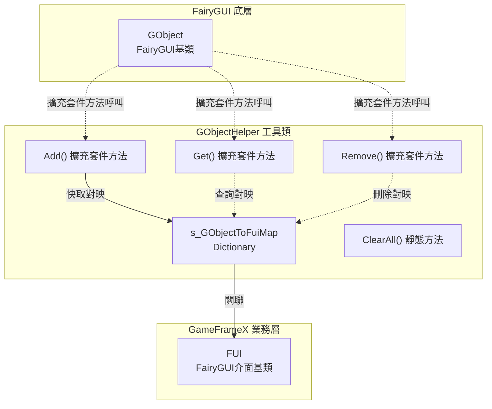
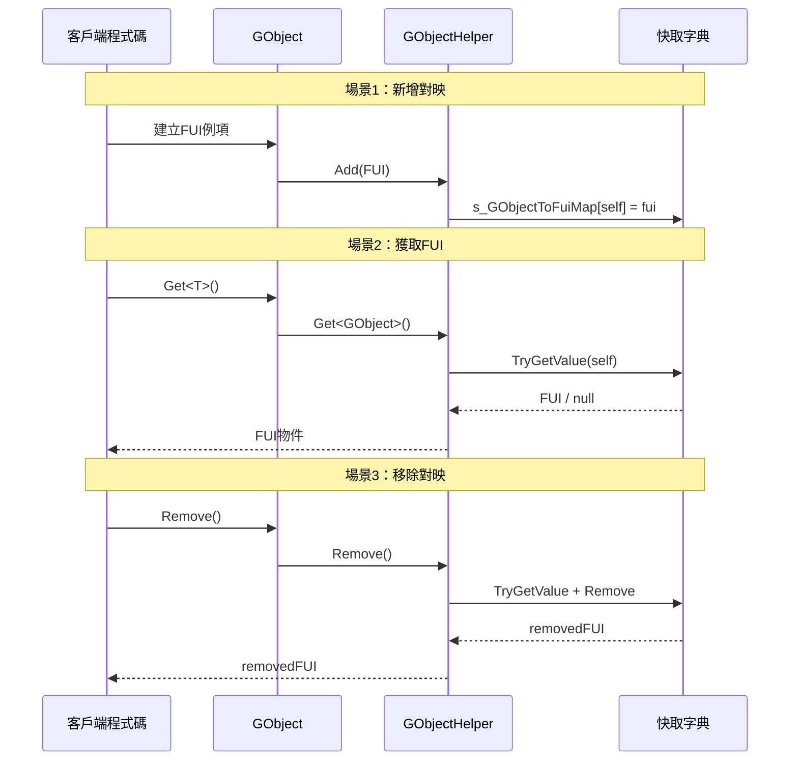

# GObjectHelper 工具類

GObjectHelper 是一個靜態工具類，用於管理 FairyGUI 的 GObject 物件與 FUI 介面物件之間的對映關係，提供快取和查詢功能。

## 概述

GObjectHelper 是 GameFrameX 外掛中用於連線 FairyGUI 底層物件（FUI 的 GObject）與業務邏輯層（FUI 介面類）的橋樑。在 FairyGUI 介面系統中，每個介面都由一個 GObject 例項表示，而 GObjectHelper 提供了在執行時根據 GObject 快速獲取對應 FUI 物件的能力。

**設計意圖：**
- 解決 FairyGUI 的 GObject 與業務層 FUI 物件之間的關聯問題
- 提供高效的查詢機制，避免在複雜介面樹中逐層遍歷
- 支援介面的動態建立和銷燬時的資源管理

**使用場景：**
- 在事件回呼中需要獲取觸發事件的介面物件
- 在組件級別操作時需要快速關聯到對應的 FUI
- 介面解除安裝時清理相關資源

## 架構



**架構說明：**
- GObjectHelper 維護一個私有的靜態字典 `s_GObjectToFuiMap`，用於儲存 GObject 到 FUI 的對映關係
- 透過 C# 擴充套件方法的形式為 GObject 新增 Get、Add、Remove 方法
- 所有操作都是執行緒安全的（內部使用 Dictionary）

## 核心功能

### 1. 獲取關聯的 FUI 物件

透過 GObject 擴充套件方法，可以快速獲取與之關聯的 FUI 物件：

```csharp
// 假設有一個 GObject 例項
GObject gObject = someComponent.GetChild("Button");

// 獲取關聯的 FUI 物件（需要型別轉換）
MyFUI fui = gObject.Get<MyFUI>();
```
> Source: [GObjectHelper.cs](https://github.com/GameFrameX/com.gameframex.unity.ui.fairygui/blob/main/Runtime/GObjectHelper.cs#L69-L77)

**方法簽名：**
```csharp
public static T Get<T>(this GObject self) where T : FUI
```

### 2. 新增 FUI 對映

將 FUI 物件新增到快取池中，建立 GObject 與 FUI 的關聯：

```csharp
// 建立 FUI 例項
FUI fui = new MyFUI(gObject);

// 新增到快取
gObject.Add(fui);
```
> Source: [GObjectHelper.cs](https://github.com/GameFrameX/com.gameframex.unity.ui.fairygui/blob/main/Runtime/GObjectHelper.cs#L88-L94)

### 3. 移除 FUI 對映

從快取中移除指定的 FUI 對映，並返回被移除的 FUI 物件：

```csharp
// 移除對映並獲取被刪除的 FUI
FUI removedFui = gObject.Remove();
```
> Source: [GObjectHelper.cs](https://github.com/GameFrameX/com.gameframex.unity.ui.fairygui/blob/main/Runtime/GObjectHelper.cs#L105-L114)

### 4. 清理所有快取

在介面系統關閉或重新初始化時，清空所有快取的對映關係：

```csharp
// 清理所有快取
GObjectHelper.ClearAll();
```
> Source: [GObjectHelper.cs](https://github.com/GameFrameX/com.gameframex.unity.ui.fairygui/blob/main/Runtime/GObjectHelper.cs#L54-L57)

## 使用流程



## 使用示例

### 基礎用法

```csharp
using FairyGUI;
using GameFrameX.UI.FairyGUI.Runtime;

// 假設有一個按鈕組件
GObject buttonObj = container.GetChild("SubmitButton");

// 獲取關聯的 FUI
MainPanelFUI fui = buttonObj.Get<MainPanelFUI>();

if (fui != null)
{
    // 可以對 FUI 進行操作
    fui.Visible = true;
}
```

### 介面建立時的對映

```csharp
// 在 FairyGUIFormHelper 建立介面時
public override IUIForm CreateUIForm(object uiFormInstance, Type uiFormType, object userData)
{
    GComponent component = uiFormInstance as GComponent;
    var componentType = component.displayObject.gameObject.GetOrAddComponent(uiFormType);
    var uiForm = componentType as IUIForm;
    
    // 建立對映關係
    component.Add(uiForm as FUI);
    
    return uiForm;
}
```

### 清理資源

```csharp
// 在遊戲退出或重新載入場景時
private void OnDestroy()
{
    // 清理所有 FUI 對映
    GObjectHelper.ClearAll();
}
```

## API 參考

### `Get<T>(this GObject self): T`

從快取中獲取與當前 GObject 關聯的 FUI 物件。

**泛型引數：**
- `T`: FUI 的派生型別

**引數：**
- `self` (GObject): 呼叫擴充套件方法的 GObject 例項

**返回：**
- 關聯的 FUI 物件；如果不存在則返回型別預設值（reference type 為 null）

**示例：**
```csharp
MyPanelFUI fui = gObject.Get<MyPanelFUI>();
```

---

### `Add(this GObject self, FUI fui): void`

將 FUI 物件新增到快取，建立 GObject 與 FUI 的對映關係。

**引數：**
- `self` (GObject): 呼叫擴充套件方法的 GObject 例項
- `fui` (FUI): 要新增的 FUI 物件

**示例：**
```csharp
gObject.Add(new MyPanelFUI(gObject));
```

---

### `Remove(this GObject self): FUI`

從快取中移除指定 GObject 的 FUI 對映，並返回被移除的 FUI 物件。

**引數：**
- `self` (GObject): 呼叫擴充套件方法的 GObject 例項

**返回：**
- 被移除的 FUI 物件；如果不存在則返回預設值

**示例：**
```csharp
FUI removed = gObject.Remove();
```

---

### `ClearAll(): void`

清空所有快取的 FUI 對映關係。

**注意：** 此操作不可逆，呼叫後所有 GObject 與 FUI 的關聯將被清除。

**示例：**
```csharp
GObjectHelper.ClearAll();
```

## 相關連結

- [FUI 類](./5-api-reference.1-fui-class) - FairyGUI 介面基類
- [FairyGUIFormHelper 類](./5-api-reference.3-form-helper) - 介面輔助器
- [FairyGUIPackageComponent 類](./5-api-reference.2-package-component) - 包管理器組件
- [介面管理器](./4-core-concepts.2-ui-manager) - 介面管理核心概念
- [快速開始：開啟和關閉介面](./3-getting-started.2-open-close-ui)
