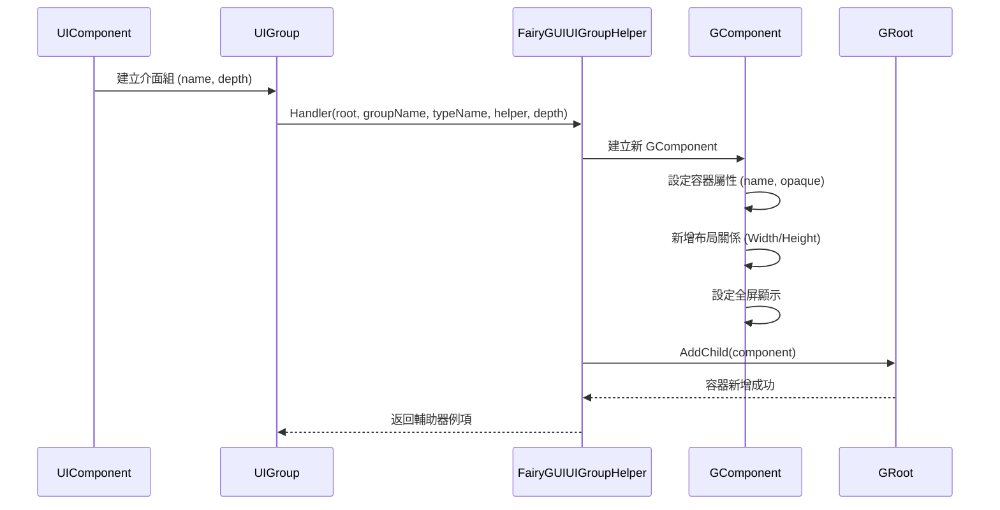
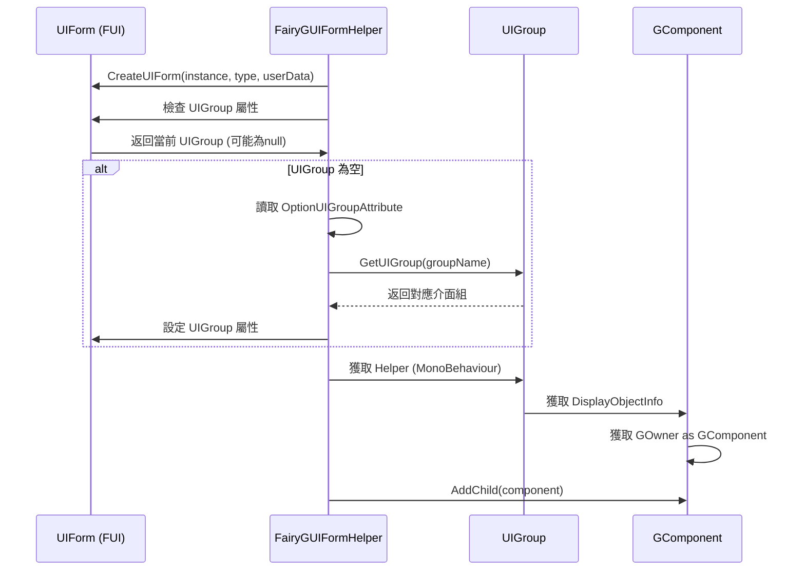

# 介面組配置

介面組（UI Group）是 GameFrameX 框架中用於管理 UI 介面層級和顯示順序的核心機制。FairyGUI 外掛提供了 `FairyGUIUIGroupHelper` 類來實現符合 FairyGUI 渲染特性的介面組功能。

## 概述

介面組配置主要用於：

- **層級管理**：控制不同型別介面的顯示層級（如彈窗、對話方塊、主介面等）
- **深度控制**：透過設定 Z 軸位置來決定介面的前後順序
- **容器組織**：將相關介面組織在同一個容器中，便於管理和控制

在 FairyGUI 整合中，介面組透過 GComponent 容器實現，每個組對應一個獨立的容器，介面作為子元素新增到對應的組容器中。

## 架構

```mermaid
flowchart TD
    subgraph GameFrameX_UI["GameFrameX UI 系統"]
        UIComponent[UIComponent<br/>UI組件]
        UIGroup[UIGroup<br/>介面組]
        UIForm[UIForm<br/>介面]
    end

    subgraph FairyGUI_Integration["FairyGUI 整合"]
        FairyGUIUIGroupHelper["FairyGUIUIGroupHelper<br/>介面組輔助器"]
        FairyGUIFormHelper["FairyGUIFormHelper<br/>介面輔助器"]
        FairyGUIPackageComponent["FairyGUIPackageComponent<br/>包管理組件"]
    end

    subgraph FairyGUI_Runtime["FairyGUI 執行時"]
        GRoot[GRoot<br/>根容器"]
        GComponent["GComponent<br/>容器組件"]
    end

    UIComponent -->|建立/獲取| UIGroup
    UIGroup -->|使用| FairyGUIUIGroupHelper
    FairyGUIUIGroupHelper -->|建立容器| GComponent
    GComponent -->|新增到| GRoot
    FairyGUIFormHelper -->|新增介面到組| UIGroup
    UIForm -->|屬於| UIGroup
```

**架構說明：**

1. **UIComponent**：GameFrameX 核心組件，負責管理所有介面組和介面例項
2. **UIGroup**：介面組抽象，持有對 `IUIGroupHelper` 的引用
3. **FairyGUIUIGroupHelper**： FairyGUI 特定的介面組輔助器實現，負責建立 GComponent 容器並管理深度
4. **FairyGUIFormHelper**：介面輔助器，負責將介面例項新增到對應的介面組容器中
5. **GRoot**： FairyGUI 的根容器，所有介面組容器都新增到此處

## 核心機制

### 介面組建立流程



### 介面分配到組



## 配置選項

### FairyGUIUIGroupHelper 屬性

| 屬性 | 型別 | 描述 |
|------|------|------|
| `Depth` | int | 獲取或設定介面組深度，用於控制 Z 軸順序 |

### FairyGUIUIGroupHelper 方法

#### `SetDepth(int depth)`

設定介面組深度。該方法透過修改 transform.localPosition 的 Z 座標來實現深度控制。

```csharp
csharp
public override void SetDepth(int depth)
{
    Depth = depth;
    transform.localPosition = new Vector3(0, 0, depth * 100);
}
```

> Source: [FairyGUIUIGroupHelper.cs](https://github.com/GameFrameX/com.gameframex.unity.ui.fairygui/blob/main/Runtime/FairyGUIUIGroupHelper.cs#L63-L67)

**引數：**
- `depth` (int): 介面組深度值，數值越大越靠前顯示

#### `Handler(Transform root, string groupName, string uiGroupHelperTypeName, IUIGroupHelper customUIGroupHelper, int depth = 0)`

建立介面組處理器。

```csharp
csharp
public override IUIGroupHelper Handler(Transform root, string groupName, string uiGroupHelperTypeName, IUIGroupHelper customUIGroupHelper, int depth = 0)
{
    SetDepth(depth);
    GComponent component = new GComponent();
    GRoot.inst.AddChild(component);
    var comName = groupName;
    component.displayObject.name = comName;
    component.gameObjectName = comName;
    component.name = comName;
    component.opaque = false;
    component.AddRelation(GRoot.inst, RelationType.Width);
    component.AddRelation(GRoot.inst, RelationType.Height);
    component.MakeFullScreen();
    return GameFrameX.Runtime.Helper.CreateHelper(component.displayObject.gameObject, uiGroupHelperTypeName, (UIGroupHelperBase)customUIGroupHelper, 0);
}
```

> Source: [FairyGUIUIGroupHelper.cs](https://github.com/GameFrameX/com.gameframex.unity.ui.fairygui/blob/main/Runtime/FairyGUIUIGroupHelper.cs#L82-L96)

**引數：**
- `root` (Transform): 根節點
- `groupName` (string): 介面組名稱
- `uiGroupHelperTypeName` (string): 介面組輔助器型別名稱
- `customUIGroupHelper` (IUIGroupHelper): 自定義的介面組輔助器
- `depth` (int): 介面組深度，預設為 0

**返回值：** 建立的介面組輔助器例項

## 使用方式

### 宣告介面所屬組

透過 `OptionUIGroupAttribute` 屬性標記，將介面分配到指定的介面組：

```csharp
csharp
using GameFrameX.UI.Runtime;

[OptionUIGroup("Dialog")]
public class MyDialogForm : FUI
{
    // 介面實現
}
```

> Source: [FairyGUIFormHelper.cs](https://github.com/GameFrameX/com.gameframex.unity.ui.fairygui/blob/main/Runtime/FairyGUIFormHelper.cs#L108-L114)

**說明：**
- 介面組名稱在 GameFrameX 核心框架的 UIComponent 中配置
- FairyGUIUIGroupHelper 會自動建立對應名稱的 GComponent 容器
- 深度值決定了介面的顯示順序，數值越大越靠前

### 配置介面組深度

介面組的深度通常在遊戲框架初始化時配置：

```csharp
csharp
// 在 UIComponent 配置中設定介面組深度
// 不同介面組可以使用不同的深度值來實現層級分離
// 例如: Background=0, Normal=10, Dialog=20, Toast=30
```

## 常見場景

### 場景 1：彈窗介面組

將所有彈窗類介面放在獨立的介面組中，確保彈窗始終顯示在普通介面之上：

```csharp
csharp
[OptionUIGroup("Dialog")]
public class ConfirmDialog : FUI { }

[OptionUIGroup("Dialog")]
public class AlertDialog : FUI { }
```

### 場景 2：Toast 提示組

將臨時提示資訊放在最高層級：

```csharp
csharp
[OptionUIGroup("Toast")]
public class ToastForm : FUI { }
```

### 場景 3：背景介面組

將背景介面放在最低層級：

```csharp
csharp
[OptionUIGroup("Background")]
public class MainBackground : FUI { }
```

## 相關連結

- [FUI 介面基類](../4-core-concepts.1-fui-base-class)
- [介面管理器](../4-core-concepts.2-ui-manager)
- [介面輔助器](../4-core-concepts.4-form-helper)
- [包管理器](../4-core-concepts.3-package-manager)
- [編輯器配置](./6-configuration.1-editor-config)
- [API 參考 - FairyGUIUIGroupHelper 類](./5-api-reference.3-form-helper)
