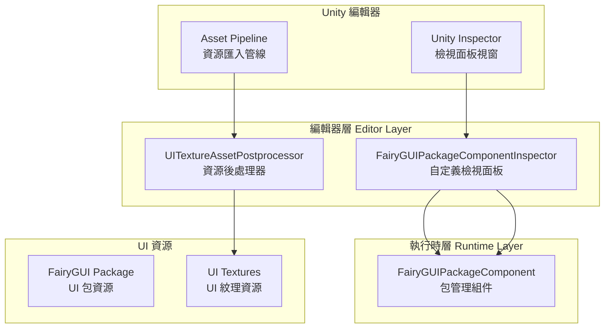
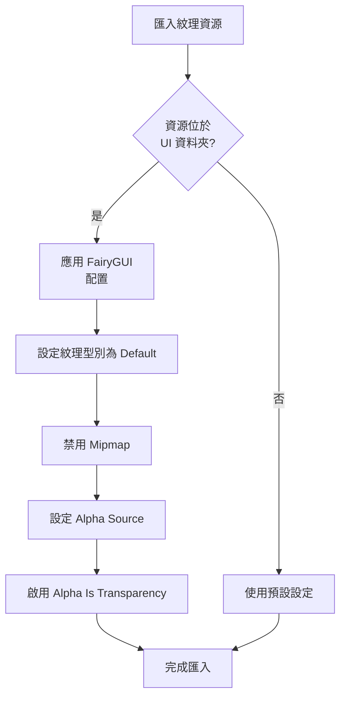

# 編輯器配置

編輯器配置文件介紹 GameFrameX UI FairyGUI 外掛在 Unity 編輯器中的配置功能，包括自定義檢視面板和資源後處理器。

## 概述

GameFrameX UI FairyGUI 外掛提供了一套完整的編輯器配置機制，用於簡化在 Unity 編輯器中的 UI 開發工作流程。這些編輯器功能主要包含以下兩個核心組件：

1. **自定義檢視面板 (Custom Inspector)** - 為 FairyGUIPackageComponent 提供視覺化配置介面
2. **資源後處理器 (Asset Postprocessor)** - 自動配置 UI 紋理資源的匯入設定

這些編輯器配置功能可以顯著提升開發效率，減少手動配置工作，並確保 UI 資源使用最佳實踐。

## 架構



## 自定義檢視面板

### FairyGUIPackageComponentInspector

自定義檢視面板繼承自 GameFrameX 基礎編輯器框架，提供了 FairyGUIPackageComponent 組件的視覺化配置介面。

```csharp
// Source: Editor/Inspector/FairyGUIPackageComponentInspector.cs
using GameFrameX.Editor;
using GameFrameX.UI.FairyGUI.Runtime;
using UnityEditor;

namespace GameFrameX.UI.FairyGUI.Editor
{
    [CustomEditor(typeof(FairyGUIPackageComponent))]
    internal sealed class UIFairyGUIPackageComponentInspector : GameFrameworkInspector
    {
        public override void OnInspectorGUI()
        {
            base.OnInspectorGUI();
            Repaint();
        }
    }
}
```

> Source: [FairyGUIPackageComponentInspector.cs](https://github.com/GameFrameX/com.gameframex.unity.ui.fairygui/blob/main/Editor/Inspector/FairyGUIPackageComponentInspector.cs#L38-L46)

**功能特點：**
- 自動整合到 Unity Inspector 面板
- 繼承自 GameFrameworkInspector 基類，提供統一的編輯器介面風格
- 支援組件的執行時配置檢視
- 新增了 `GameFrameX/FairyGUIPackage` 選單項，方便快速建立組件

**使用方式：**
1. 在 Unity 場景中建立空物體
2. 新增 `FairyGUIPackageComponent` 組件（可透過選單 `GameFrameX/FairyGUIPackage` 快速新增）
3. 在 Inspector 面板中檢視和配置組件屬性

## 資源後處理器

### UITextureAssetPostprocessor

資源後處理器是編輯器配置的核心組件，它會在 UI 紋理資源匯入時自動應用正確的設定，確保 UI 資源符合 FairyGUI 的要求。

```csharp
// Source: Editor/UITextureAssetPostprocessor.cs
#if ENABLE_UI_FAIRYGUI
using GameFrameX.Runtime;
using UnityEditor;

namespace GameFrameX.UI.FairyGUI.Editor
{
    internal sealed class UITextureAssetPostprocessor : AssetPostprocessor
    {
        void OnPreprocessTexture()
        {
            if (assetPath.Contains(PathHelper.Combine(Utility.Asset.Path.BundlesPath, "UI")))
            {
                TextureImporter textureImporter = (TextureImporter)assetImporter;
                if (textureImporter.textureType != TextureImporterType.Default)
                {
                    textureImporter.textureType = TextureImporterType.Default;
                }

                if (textureImporter.mipmapEnabled)
                {
                    textureImporter.mipmapEnabled = false;
                }

                textureImporter.alphaSource = TextureImporterAlphaSource.FromInput;
                textureImporter.alphaIsTransparency = true;
            }
        }
    }
}
#endif
```

> Source: [UITextureAssetPostprocessor.cs](https://github.com/GameFrameX/com.gameframex.unity.ui.fairygui/blob/main/Editor/UITextureAssetPostprocessor.cs#L41-L59)

### 自動配置屬性說明

| 配置項 | 設定值 | 說明 |
|--------|--------|------|
| Texture Type | Default | 使用預設紋理型別，確保 FairyGUI 能正確識別 |
| Mipmap | 禁用 | UI 紋理通常不需要 Mipmap，禁用可節省記憶體 |
| Alpha Source | FromInput | 從紋理通道讀取 Alpha 資訊 |
| Alpha Is Transparency | 啟用 | 將 Alpha 通道視為透明度，最佳化渲染 |

### 處理範圍

資源後處理器僅處理位於 UI 資料夾中的紋理資源。UI 資料夾路徑由 `PathHelper.Combine(Utility.Asset.Path.BundlesPath, "UI")` 決定，通常為 `Assets/Bundles/UI`。

### 工作流程



## 配置選項彙總

### 編輯器程式集定義

編輯器程式碼位於獨立的程式集中，與執行時程式碼分離：

```json
// Source: Editor/GameFrameX.UI.FairyGUI.Editor.asmdef
{
  "name": "GameFrameX.UI.FairyGUI.Editor",
  "references": [
    "GameFrameX.UI.FairyGUI.Runtime",
    "GameFrameX.Editor",
    "GameFrameX.Runtime",
    "FairyGUI.Editor",
    "FairyGUI.Runtime"
  ],
  "includePlatforms": [
    "Editor"
  ]
}
```

> Source: [GameFrameX.UI.FairyGUI.Editor.asmdef](https://github.com/GameFrameX/com.gameframex.unity.ui.fairygui/blob/main/Editor/GameFrameX.UI.FairyGUI.Editor.asmdef#L1-L21)

### 編譯條件

編輯器程式碼受 `ENABLE_UI_FAIRYGUI` 編譯符號控制，確保只有在啟用 FairyGUI 模組時才會編譯相關程式碼。

## 常見配置問題

### 紋理匯入問題

如果 UI 紋理未自動應用正確配置，請檢查：

1. **確認 UI 資源路徑**：紋理必須位於 UI 資料夾中（如 `Assets/Bundles/UI/`）
2. **檢查編譯符號**：確認 `ENABLE_UI_FAIRYGUI` 已定義
3. **重新整理資源資料庫**：在 Unity 中選擇 `Assets > Refresh` 或按 `Ctrl+R` 強制重新整理

### Inspector 不顯示自定義面板

如果自定義檢視面板未正常顯示：

1. 確認已安裝 GameFrameX.Editor 依賴包
2. 檢查 FairyGUIPackageComponentInspector 類是否正確繼承
3. 確保程式集定義正確包含 Editor 平臺

## 相關連結

- [FUI 介面基類](../4-core-concepts.1-fui-base-class) - 瞭解 FUI 基類的使用方法
- [FairyGUIPackageComponent 類](../5-api-reference.2-package-component) - 包管理組件的詳細 API 文件
- [介面管理器](../4-core-concepts.2-ui-manager) - 瞭解介面管理器的配置和使用
- [安裝指南](../2-installation.1-install-methods) - 外掛安裝說明
- [依賴配置](../2-installation.2-dependencies) - 依賴項配置說明
