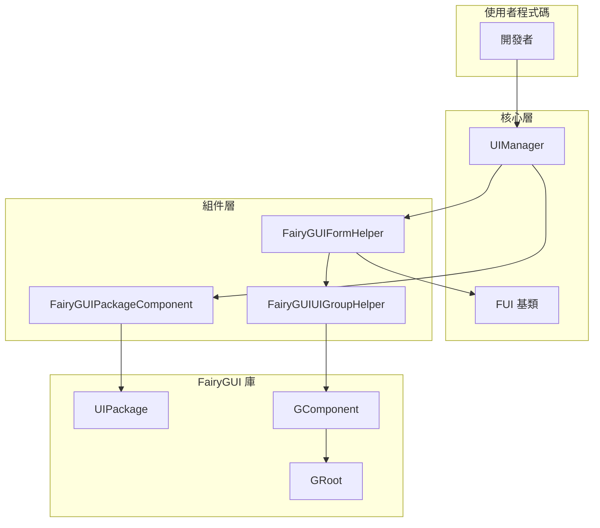

# 常見問題解答

本文件收集了使用 GameFrameX Unity UI FairyGUI 外掛過程中常見的問題及其解決方案。

## 概述

GameFrameX Unity UI FairyGUI 外掛為 Unity 遊戲提供了 FairyGUI UI 組件的整合封裝。在使用過程中，開發者可能會遇到介面載入失敗、組件未找到、資源路徑錯誤等問題。本文件旨在幫助開發者快速定位和解決這些常見問題。

## 安裝與配置問題

### Q1: 如何正確安裝 FairyGUI 外掛？

**問題描述**：在 Unity 專案中安裝外掛後，出現編譯錯誤或功能異常。

**解決方案**：
1. 確保已安裝所有依賴項：
   - `com.gameframex.unity` (1.1.1+)
   - `com.gameframex.unity.ui` (1.0.0+)
   - `com.gameframex.unity.asset` (1.0.6+)
   - `com.gameframex.unity.event` (1.0.0+)

2. 安裝方式（任選其一）：
   - 在 `manifest.json` 中新增：
     ```json
     {"com.gameframex.unity.ui.fairygui": "https://github.com/GameFrameX/com.gameframex.unity.ui.fairygui.git"}
     ```
   - 在 Unity 的 Package Manager 中使用 Git URL 新增：`https://github.com/gameframex/com.gameframex.unity.ui.fairygui.git`
   - 直接下載倉庫放置到 Unity 專案的 `Packages` 目錄下

3. Unity 版本要求：2019.4 或更高版本

> 詳細資訊請參閱 [安裝方式](./2-installation.1-install-methods)

---

### Q2: FairyGUIPackageComponent 組件未找到？

**問題描述**：執行時提示 `FairyGuiPackage is invalid` 或類似錯誤。

**解決方案**：
1. 確保場景中存在 FairyGUIPackageComponent 組件
2. 該組件必須掛載在 GameObject 上
3. 檢查組件是否正確初始化

> 詳細資訊請參閱 [包管理器](./4-core-concepts.3-package-manager)

---

## 介面載入問題

### Q3: 介面開啟失敗，提示 "Load UI form failure"？

**問題描述**：呼叫介面開啟方法時失敗，錯誤資訊包含 "Load UI form failure"。

**可能原因**：
1. 資源路徑不正確
2. FairyGUI 包未正確載入
3. 資原始檔不存在

**解決方案**：
1. 確認資源路徑格式正確
2. 確保 FairyGUI 包（.bin 檔案）已放置在正確目錄
3. 檢查 UI 資源是否已打包

> 詳細資訊請參閱 [開啟和關閉介面](./3-getting-started.2-open-close-ui)

---

### Q4: UI 包載入失敗？

**問題描述**：提示 UI 包載入失敗或包名為空。

**可能原因**：
1. 包路徑格式不正確
2. 包名與資源名不一致

**解決方案**：
1. 資源路徑格式：`{包名}/{資源名}` 或 `{包名}`
2. 確保包名與 FairyGUI 編輯器中釋出的包名一致
3. 檢查資源是否在正確的目錄下（Resources 或 Bundles）

---

### Q5: 非同步載入介面時介面空白？

**問題描述**：使用非同步方式開啟介面，介面顯示但內容為空。

**可能原因**：
1. 包載入時機過早
2. 資源尚未完全載入完成

**解決方案**：
1. 確保使用 `await` 等待包載入完成
2. 檢查 `isLoadAsset` 引數是否正確設定

```csharp
// 正確示例
var package = await FairyGuiPackage.AddPackageAsync("uipackage");
var ui = UIPackage.CreateObject("uipackage", "MainForm");
```

> 詳細資訊請參閱 [FairyGUIPackageComponent](./5-api-reference.2-package-component)

---

## 介面組件問題

### Q6: 提示 "UI form instance is invalid"？

**問題描述**：介面例項化失敗，提示 "UI form instance is invalid"。

**可能原因**：
1. 介面型別未繼承 FUI 基類
2. FairyGUIFormHelper 未正確配置

**解決方案**：
1. 確保介面類繼承自 FUI：
   ```csharp
   public class MainForm : FUI
   {
       // 介面邏輯
   }
   ```
2. 確保 FairyGUIFormHelper 已新增到場景

> 詳細資訊請參閱 [FUI 介面基類](./4-core-concepts.1-fui-base-class)

---

### Q7: 提示 "UI group is invalid"？

**問題描述**：介面無法新增到介面組，提示 "UI group is invalid"。

**可能原因**：
1. 介面組未正確建立
2. 介面組名稱不匹配

**解決方案**：
1. 在 UI 配置中正確配置介面組
2. 使用 `[OptionUIGroup]` 屬性指定介面組：
   ```csharp
   [OptionUIGroup("MainUI")]
   public class MainForm : FUI
   {
   }
   ```

> 詳細資訊請參閱 [介面組配置](./6-configuration.2-ui-group-config)

---

### Q8: 提示 "Display object info is invalid"？

**問題描述**：介面顯示物件資訊無效。

**可能原因**：
1. 介面組輔助器未正確初始化
2. GComponent 未正確新增到 GRoot

**解決方案**：
1. 確保 FairyGUIUIGroupHelper 正確建立
2. 檢查 GRoot 是否已初始化

> 詳細資訊請參閱 [介面組輔助器](./4-core-concepts.5-ui-group-helper)

---

## 資源載入問題

### Q9: 資源載入失敗，提示 "Unknown file type"？

**問題描述**：載入資源時提示未知檔案型別。

**可能原因**：
1. 資源型別不在支援列表中
2. 副檔名不正確

**解決方案**：
FairyGUIPackageComponent 支援以下資源型別：
- `.bytes` - 二進位制資源
- `.atlas` - 圖集資源
- `.png` / `.jpg` - 圖片資源
- Spine 動畫資源
- DragonBones 動畫資源

請確保資源副檔名正確，且已新增到 FairyGUI 包中。

> 詳細資訊請參閱 [FairyGUIPackageComponent](./5-api-reference.2-package-component)

---

### Q10: YooAsset 資源解除安裝失敗？

**問題描述**：介面關閉後資源未正確釋放。

**可能原因**：
1. EnableAutoReleaseUIForm 未啟用
2. 資源控制代碼未正確傳遞

**解決方案**：
1. 確保 UIComponent 的 EnableAutoReleaseUIForm 設定為 true
2. 檢查資源路徑是否包含 "Bundles" 目錄標識

```csharp
// 資源路徑格式示例
string uiFormAssetPath = "Bundles/UI/MainForm";  // YooAsset 資源
// 或
string uiFormAssetPath = "Resources/UI/MainForm";  // Resources 資源
```

---

## 路徑查詢問題

### Q11: 提示 "Invalid UI path"？

**問題描述**：使用路徑查詢介面組件時失敗。

**可能原因**：
1. 路徑格式不正確
2. 組件名稱不存在
3. 索引超出範圍

**解決方案**：
1. 使用正確的路徑格式：`"父組件/子組件"` 或 `"組件名[index]"`
2. 確保組件名稱存在
3. 檢查索引值是否在有效範圍內

```csharp
// 正確示例
var button = UIForm.GObject.GetChild("Btn_Confirm");
var dialog = UIForm.GObject.asCom.GetChildAt(0);

// 路徑查詢
var deepChild = FairyGUIPathFinderHelper.GetChild(UIForm.GObject, "Panel/Content/Button");
```

> 詳細資訊請參閱 [GObjectHelper 工具類](./5-api-reference.4-gobject-helper)

---

## 組件初始化問題

### Q12: Asset Component 或 UI Component 未找到？

**問題描述**：執行時提示 "Asset component is invalid" 或 "UI component is invalid"。

**解決方案**：
1. 確保 GameEntry 已正確初始化
2. 確保以下組件已新增到 GameEntry：
   - AssetComponent
   - UIComponent
   - FairyGUIPackageComponent

> 詳細資訊請參閱 [編輯器配置](./6-configuration.1-editor-config)

---

## 架構圖



## 常見錯誤碼錶

| 錯誤資訊 | 可能原因 | 解決方案 |
|---------|---------|---------|
| UI form instance is invalid | 介面型別未繼承 FUI | 確保介面類繼承自 FUI |
| UI group is invalid | 介面組未配置 | 配置介面組或使用屬性 |
| Display object info is invalid | 介面組輔助器未初始化 | 檢查 FairyGUIUIGroupHelper |
| Asset component is invalid | AssetComponent 未註冊 | 確保 GameEntry 初始化 |
| UI component is invalid | UIComponent 未註冊 | 確保 GameEntry 初始化 |
| Load UI form failure | 資源路徑錯誤 | 檢查資源路徑和包名 |
| Invalid UI path | 路徑格式錯誤 | 使用正確的路徑格式 |

## 相關連結

- [外掛介紹](./1-overview.1-introduction)
- [功能特性](./1-overview.2-features)
- [系統要求](./1-overview.3-requirements)
- [安裝方式](./2-installation.1-install-methods)
- [依賴配置](./2-installation.2-dependencies)
- [建立第一個介面](./3-getting-started.1-first-ui-form)
- [開啟和關閉介面](./3-getting-started.2-open-close-ui)
- [FUI 介面基類](./4-core-concepts.1-fui-base-class)
- [介面管理器](./4-core-concepts.2-ui-manager)
- [包管理器](./4-core-concepts.3-package-manager)
- [介面輔助器](./4-core-concepts.4-form-helper)
- [介面組輔助器](./4-core-concepts.5-ui-group-helper)
- [FUI 類 API](./5-api-reference.1-fui-class)
- [FairyGUIPackageComponent API](./5-api-reference.2-package-component)
- [FairyGUIFormHelper API](./5-api-reference.3-form-helper)
- [GObjectHelper API](./5-api-reference.4-gobject-helper)
- [編輯器配置](./6-configuration.1-editor-config)
- [介面組配置](./6-configuration.2-ui-group-config)
