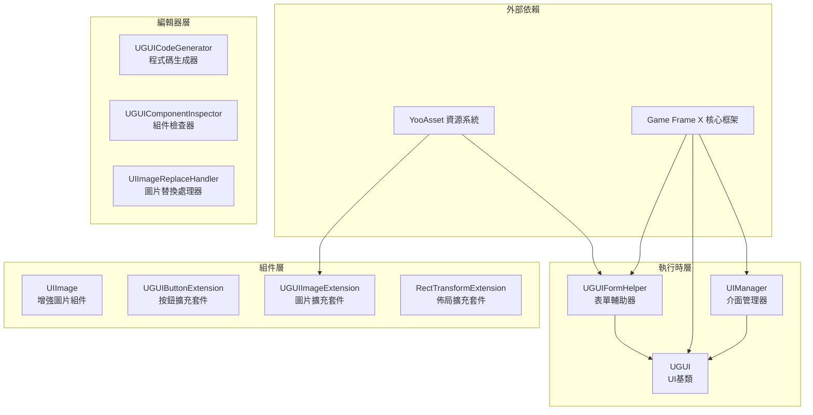
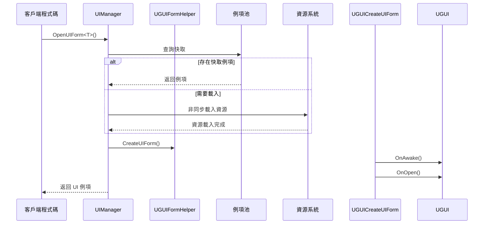

# 外掛介紹

Game Frame X UGUI 組件是 Unity UI 功能包，提供 UGUI 組件的封裝，使 UGUI 組件的使用更加簡單高效。該外掛是 Game Frame X 遊戲開發框架的核心組成部分，專門針對 Unity 的 UGUI 系統進行了深度最佳化和功能擴充套件。

## 概述

Game Frame X UGUI 外掛旨在為 Unity 遊戲開發者提供一套完整、高效、可擴充套件的 UI 解決方案。該外掛透過封裝 Unity 原生的 UGUI 系統，提供了更加便捷的 API 呼叫方式，同時內建了強大的程式碼生成器，可以顯著提升 UI 開發效率。

作為 Game Frame X 框架的一部分，本外掛依賴於核心框架（`com.gameframex.unity`）、UI 基礎包（`com.gameframex.unity.ui`）、資源管理包（`com.gameframex.unity.asset`）和事件系統（`com.gameframex.unity.event`）。透過模組化的設計，開發者可以根據需要選擇性使用外掛的各個功能模組。

本外掛支援 Unity 2019.4 及以上版本，採用 MIT 許可證與 Apache License 2.0 雙許可證分發。

## 核心架構



### 架構層次說明

**執行時層**包含外掛的核心業務邏輯：

- **UIManager**：負責 UI 介面的開啟、關閉和生命週期管理，支援介面例項池和自動回收機制
- **UGUI**：抽象 UI 基類，提供 UI 顯示狀態控制、介面顯示/隱藏動畫支援
- **UGUIFormHelper**：UI 表單輔助器，處理 UI 例項化和建立，支援透過特性配置 UI 分組和動畫

**組件層**提供擴充套件功能：

- **UIImage**：繼承自 Unity 的 Image 組件，支援透過資源路徑非同步載入圖示
- **擴充套件方法**：包括按鈕擴充套件、圖片擴充套件和 RectTransform 擴充套件，簡化常見操作

**編輯器層**提供開發效率工具：

- **UGUICodeGenerator**：根據 UGUI 預製體自動生成程式碼
- **UGUIComponentInspector**：在編輯器中視覺化檢查組件屬性
- **UIImageReplaceHandler**：批次處理圖片資源替換

## 主要特性

### UGUI 組件封裝

外掛對 Unity 原生 UGUI 組件進行了高階封裝，提供了更加物件導向的介面設計。開發者無需直接操作 Unity 的 GameObject 和 Component，而是透過繼承 `UGUI` 基類來建立自己的 UI 介面，享受統一的生命週期管理和事件回呼機制。

```csharp
using GameFrameX.UI.UGUI.Runtime;
using UnityEngine;

public class MainMenuUI : UGUI
{
    protected override void OnInit(object userData)
    {
        base.OnInit(userData);
        // 初始化 UI 邏輯
    }
    
    protected override void OnOpen(object userData)
    {
        base.OnOpen(userData);
        // UI 開啟時的邏輯
    }
    
    protected override void OnClose(bool isShutdown, object userData)
    {
        base.OnClose(isShutdown, userData);
        // UI 關閉時的邏輯
    }
}
```
> Source: [README.md](https://github.com/GameFrameX/com.gameframex.unity.ui.ugui/blob/main/README.md#L78-L101)

### UI 管理器

`UIManager` 是整個外掛的核心管理器，負責處理 UI 介面的完整生命週期。它繼承自 `BaseUIManager`，提供了介面載入、快取、回收等完整功能。透過例項池技術，可以有效減少介面頻繁建立銷燬帶來的效能開銷。



### 程式碼生成器

編輯器工具 `UGUICodeGenerator` 可以大幅提升 UI 開發效率。開發者只需在 Unity 編輯器中建立一個 UGUI 預製體，選中後右鍵選擇 `GameObject/UI/Generate UGUI Code(生成UGUI程式碼)` 選單項，即可自動生成對應的 C# 程式碼檔案。

生成的程式碼包含：
- 所有子組件的序列化欄位引用
- 按鈕點選事件繫結方法
- 組件獲取完成的回呼方法

### 擴充套件方法

外掛提供了豐富的擴充套件方法，簡化日常 UI 開發工作：

**按鈕擴充套件** - 簡化事件繫結：
```csharp
startButton.onClick.Add(OnStartButtonClick);
startButton.onClick.Clear();
startButton.onClick.Set(OnClickHandler);
```
> Source: [UGUIButtonExtension.cs](https://github.com/GameFrameX/com.gameframex.unity.ui.ugui/blob/main/Runtime/UGUIButtonExtension.cs#L52-L101)

**圖片擴充套件** - 非同步圖示載入：
```csharp
iconImage.SetIconAsync("UI/Icons/StartIcon");
```
> Source: [UGUIImageExtension.cs](https://github.com/GameFrameX/com.gameframex.unity.ui.ugui/blob/main/Runtime/UGUIImageExtension.cs#L56-L74)

**佈局擴充套件** - 全屏設定：
```csharp
panel.MakeFullScreen();
```
> Source: [RectTransformExtension.cs](https://github.com/GameFrameX/com.gameframex.unity.ui.ugui/blob/main/Runtime/RectTransformExtension.cs#L56-L62)

## 依賴關係

本外掛依賴以下 Game Frame X 組件：

| 依賴包 | 最低版本 | 說明 |
|--------|----------|------|
| com.gameframex.unity | 1.1.1 | 核心框架，提供基礎服務 |
| com.gameframex.unity.ui | 1.0.0 | UI 基礎包，定義 UIForm 介面 |
| com.gameframex.unity.asset | 1.0.6 | 資源管理系統 |
| com.gameframex.unity.event | 1.0.0 | 事件系統 |

## 快速開始

### 基本使用流程

1. **建立 UI 介面類**：繼承 `UGUI` 基類，實現生命週期方法
2. **配置 UI 預製體**：在預製體上新增繼承自 `UGUI` 的組件
3. **透過管理器開啟介面**：使用 `UIManager` 開啟/關閉介面

```csharp
// 開啟介面
var mainMenu = await UIManager.Instance.OpenUIForm<MainMenuUI>("UI/");

// 關閉介面
UIManager.Instance.CloseUIForm(mainMenu);
```

### 使用 UIImage 組件

`UIImage` 組件支援透過設定 `icon` 屬性非同步載入圖片資源：

```csharp
public class IconDisplay : MonoBehaviour
{
    [SerializeField] private UIImage iconImage;
    
    void Start()
    {
        // 設定圖示，支援非同步載入
        iconImage.icon = "UI/Icons/PlayerAvatar";
    }
}
```
> Source: [README.md](https://github.com/GameFrameX/com.gameframex.unity.ui.ugui/blob/main/README.md#L143-L156)

## 相關連結

- [功能特性](./1-overview.features) - 詳細功能列表
- [依賴要求](./2-installation.dependencies) - 依賴項詳情
- [安裝方式](./2-installation.methods) - 安裝配置指南
- [建立UI介面](./3-getting-started.create-ui) - UI 建立教程
- [程式碼生成器](./3-getting-started.code-generator) - 程式碼生成器使用
- [UGUI基類](./4-core-concepts.ugui-base) - UGUI 基類詳解
- [UI管理器](./4-core-concepts.ui-manager) - 管理器 API 參考
- [表單輔助器](./4-core-concepts.form-helper) - 輔助器詳解
- [UIImage組件](./5-components.uiimage) - 增強圖片組件
- [擴充套件方法](./5-components.extensions) - 擴充套件方法 API
- [程式碼生成器工具](./6-editor-tools.code-generator) - 編輯器工具
- [組件檢查器](./6-editor-tools.inspector) - 檢查器說明
- [圖片替換處理器](./6-editor-tools.image-replace) - 資源處理工具
- [配置說明](./7-configuration) - 框架配置
- [常見問題](./8-troubleshooting) - FAQ 疑難解答
- [官方文件](https://gameframex.doc.alianblank.com)
- [GitHub 倉庫](https://github.com/GameFrameX/com.gameframex.unity.ui.ugui)
