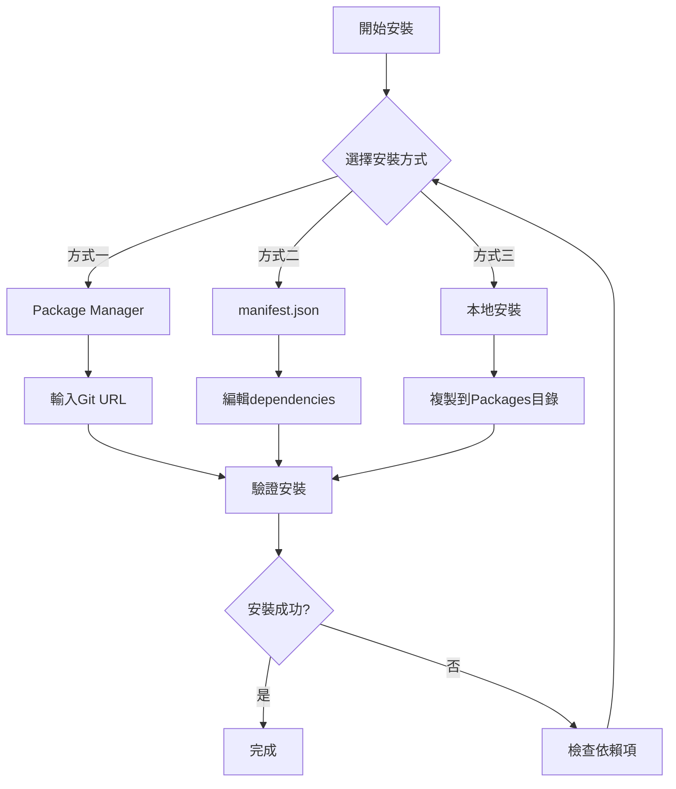
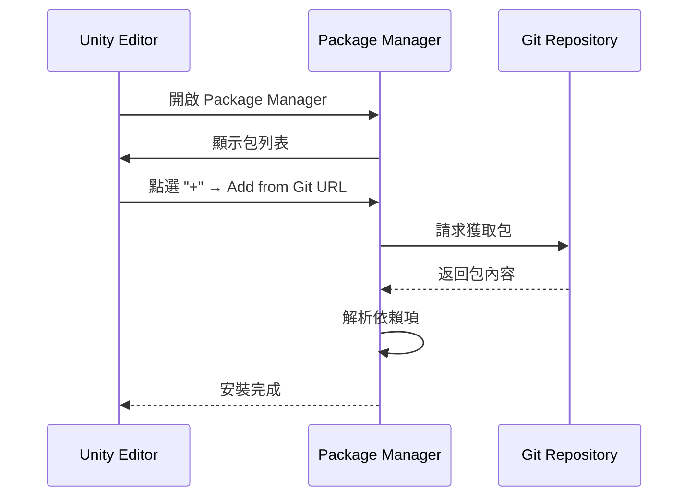

# 安裝方式

本文件介紹 Game Frame X UI UGUI 包的多種安裝方法，幫助開發者根據專案需求選擇最適合的安裝方式。

## 概述

Game Frame X UI UGUI 是 Unity UGUI 的增強組件庫，提供了 UI 管理器、程式碼生成器、擴充套件方法等功能模組。該包遵循 Unity Package Manager (UPM) 標準，支援多種安裝方式。

**包基本資訊：**
- 包名：`com.gameframex.unity.ui.ugui`
- 當前版本：2.3.6
- Unity 版本要求：2019.4+
- Git 倉庫：https://github.com/GameFrameX/com.gameframex.unity.ui.ugui.git

## 安裝流程概覽



## 前置依賴項

在安裝本包之前，需要確保以下依賴包已正確安裝：

| 依賴包 | 版本要求 | 說明 |
|--------|----------|------|
| com.gameframex.unity | 1.1.1 | 核心框架 |
| com.gameframex.unity.ui | 1.0.0 | UI基礎包 |
| com.gameframex.unity.asset | 1.0.6 | 資源管理 |
| com.gameframex.unity.event | 1.0.0 | 事件系統 |

> **注意**：上述依賴包會在安裝本包時自動嘗試解析，如果依賴項安裝失敗，請參考 [依賴要求](./2-installation.dependencies) 文件進行手動處理。

## 安裝方式

### 方式一：Package Manager（推薦）

使用 Unity 的 Package Manager 透過 Git URL 安裝是官方推薦的方式，具有以下優點：
- 自動版本管理
- 依賴自動解析
- 便於更新到最新版本

**操作步驟：**

1. 開啟 Unity 編輯器
2. 導航到 `Window` → `Package Manager`（視窗 → 包管理器）
3. 在包管理器左上角點選 **+** 按鈕
4. 選擇 **Add package from git URL**（從 Git URL 新增包）
5. 在輸入框中貼上以下地址：
   ```
   https://github.com/GameFrameX/com.gameframex.unity.ui.ugui.git
   ```
6. 點選 **Add**（新增）按鈕等待安裝完成



### 方式二：直接編輯 manifest.json

這種方式適合需要鎖定特定版本或在沒有網路環境的情況下進行開發。

**操作步驟：**

1. 找到專案中的 `Packages/manifest.json` 檔案
2. 使用文字編輯器開啟該檔案
3. 在 `dependencies` 節點下新增以下內容：

```json
{
  "dependencies": {
    "com.gameframex.unity.ui.ugui": "https://github.com/GameFrameX/com.gameframex.unity.ui.ugui.git",
    "com.gameframex.unity": "1.1.1",
    "com.gameframex.unity.ui": "1.0.0",
    "com.gameframex.unity.asset": "1.0.6",
    "com.gameframex.unity.event": "1.0.0"
  }
}
```

> Source: [README.md](https://github.com/GameFrameX/com.gameframex.unity.ui.ugui/blob/main/README.md#L66-L69)

4. 儲存檔案並返回 Unity 編輯器
5. 等待 Unity 自動重新匯入包

**版本鎖定方式：**

如果需要安裝特定版本，可以使用 Git 的版本標籤：

```json
{
  "dependencies": {
    "com.gameframex.unity.ui.ugui": "https://github.com/GameFrameX/com.gameframex.unity.ui.ugui.git#2.3.6"
  }
}
```

### 方式三：本地安裝

適用於無法訪問外網或需要離線開發的場景。

**操作步驟：**

1. 克隆或下載 Git 倉庫：
   ```
   https://github.com/GameFrameX/com.gameframex.unity.ui.ugui.git
   ```
2. 將倉庫資料夾複製到 Unity 專案的 `Packages` 目錄下
3. Unity 會自動識別並載入該包

> Source: [README.md](https://github.com/GameFrameX/com.gameframex.unity.ui.ugui/blob/main/README.md#L71-L72)

**目錄結構要求：**

```
YourUnityProject/
└── Packages/
    └── com.gameframex.unity.ui.ugui/    ← 包根目錄
        ├── package.json                  ← 必須
        ├── Runtime/                      ← 執行時程式集
        │   └── GameFrameX.UI.UGUI.Runtime.asmdef
        ├── Editor/                       ← 編輯器程式集
        │   └── GameFrameX.UI.UGUI.Editor.asmdef
        └── ...
```

## 安裝驗證

安裝完成後，可以透過以下方式驗證是否成功：

### 方法一：檢查 Package Manager

在 Package Manager 視窗中搜尋 `Game Frame X UI UGUI`，確認包已顯示在列表中。

### 方法二：檢查程式集

在 Unity 專案中確認以下程式集已正確載入：
- `GameFrameX.UI.UGUI.Runtime`
- `GameFrameX.UI.UGUI.Editor`

### 方法三：建立測試指令碼

建立一個簡單的測試指令碼驗證名稱空間可用：

```csharp
using GameFrameX.UI.UGUI.Runtime;

public class InstallationTest : MonoBehaviour
{
    void Start()
    {
        Debug.Log("Game Frame X UI UGUI 安裝成功！");
    }
}
```

> Source: [README.md](https://github.com/GameFrameX/com.gameframex.unity.ui.ugui/blob/main/README.md#L78-L102)

## 常見問題

### Q1: 安裝後出現依賴項錯誤

**原因**：依賴的包版本不相容或未安裝

**解決方案**：
1. 開啟 `Window` → `Package Manager`
2. 檢查所有依賴包是否已正確安裝
3. 參考 [依賴要求](./2-installation.dependencies) 手動安裝缺失的依賴

### Q2: 無法從 Git URL 安裝

**原因**：網路問題或 Git 憑證配置不正確

**解決方案**：
1. 確認網路可以訪問 GitHub
2. 嘗試使用本地安裝方式
3. 配置 Git 憑證管理器

### Q3: 版本號字尾 ".git" 是什麼含義

這是 Git 倉庫的 URL 字尾，表示從遠端倉庫拉取程式碼。使用此格式時，Unity 會自動拉取最新版本。如果需要特定版本，請使用 `#version` 格式指定版本標籤。

## 相關連結

- [依賴要求](./2-installation.dependencies) - 詳細的依賴項說明
- [官方文件](https://gameframex.doc.alianblank.com)
- [GitHub 倉庫](https://github.com/GameFrameX/com.gameframex.unity.ui.ugui)
- [快速開始](../3-getting-started.create-ui)
- [核心概念](../4-core-concepts.ugui-base)
