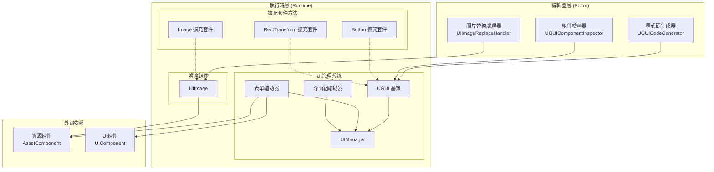
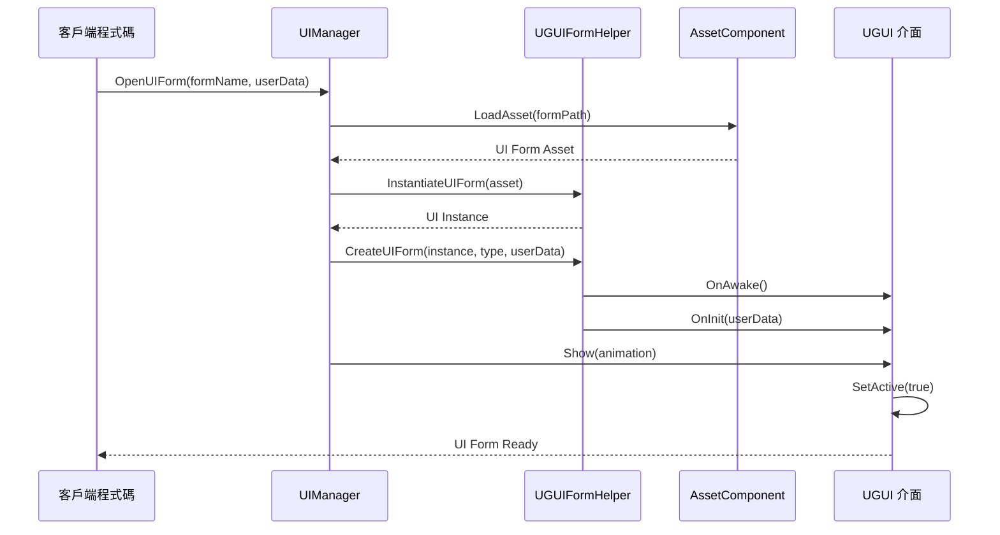
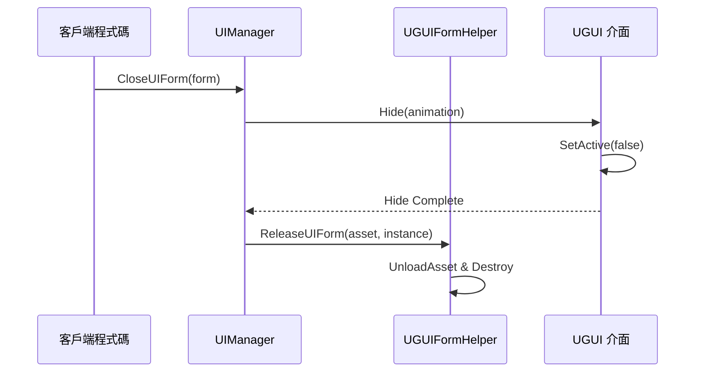

# 功能特性

GameFrameX UGUI 組件是 Unity UI 功能包，提供對 Unity UGUI 組件的高階封裝，使 UGUI 組件的使用更加簡單高效。該外掛與 Game Frame X 框架無縫整合，提供完整的 UI 介面管理、程式碼生成和擴充套件方法功能。

## 概述

本外掛為 Unity 遊戲開發提供了一套完整的 UGUI 解決方案，主要包括以下幾個核心功能模組：

- **UGUI組件封裝**：提供對 Unity UGUI 組件的高階封裝，簡化 UI 開發流程
- **UI管理器**：完整的 UI 介面管理系統，處理介面的開啟、關閉和生命週期管理
- **程式碼生成器**：自動從 UI 預製體生成程式碼，大幅提高開發效率
- **擴充套件方法**：為常用 UGUI 組件提供豐富的鏈式擴充套件方法
- **表單輔助器**：UI 表單建立和管理的輔助工具

這些功能模組相互協作，共同構成了一個完整的 UGUI 開發解決方案。外掛設計遵循 Game Frame X 框架的架構規範，可以與框架的其他組件（如資源管理、事件系統）無縫整合。

## 架構

外掛採用分層架構設計，主要分為執行時層和編輯器層。執行時層包含 UI 管理的核心邏輯和擴充套件功能，編輯器層提供視覺化的開發工具。



### 架構說明

**編輯器層** 提供了三個主要的開發工具：程式碼生成器用於自動生成 UI 程式碼、組件檢查器用於在 Inspector 面板中視覺化操作 UI 組件、圖片替換處理器用於將標準 Image 組件替換為增強的 UIImage 組件。

**執行時層** 是外掛的核心，包含三個主要部分：UI 管理系統負責介面的生命週期管理，增強組件提供了功能擴充套件的 UI 元素，擴充套件方法為常用的 UGUI 組件新增了便捷的操作方法。

**外部依賴** 部分展示了外掛與 Game Frame X 框架其他組件的整合關係，包括資源組件和 UI 組件。

## 核心功能詳解

### UI 管理系統

UI 管理系統是外掛的核心，負責管理遊戲中所有 UI 介面的生命週期。該系統由四個主要類組成：UGUI 作為所有 UI 介面的基類、UIManager 作為介面管理器、UGUIFormHelper 作為表單輔助器、UGUIUIGroupHelper 作為介面組輔助器。

**UGUI 基類** 繼承自 UIForm，提供了 UGUI 特定的介面功能實現。它負責處理介面的顯示和隱藏操作，透過可選的動畫效果增強使用者體驗，同時提供可見性控制功能。

```csharp
public class MainMenuUI : UGUI
{
    protected override void OnInit(object userData)
    {
        base.OnInit(userData);
        // 初始化UI邏輯
    }
    
    protected override void OnOpen(object userData)
    {
        base.OnOpen(userData);
        // UI開啟時的邏輯
    }
    
    protected override void OnClose(bool isShutdown, object userData)
    {
        base.OnClose(isShutdown, userData);
        // UI關閉時的邏輯
    }
}
```
> Source: [README.md](https://github.com/GameFrameX/com.gameframex.unity.ui.ugui/blob/main/README.md#L78-L102)

**UIManager** 是介面管理器的具體實現，繼承自 BaseUIManager，負責處理 UI 表單的載入、快取和生命週期管理。它與框架的 UI 組件緊密整合，提供統一的介面訪問介面。

**UGUIFormHelper** 是預設的介面輔助器，實現了 UIFormHelperBase 介面。它負責處理 UI 表單的例項化、建立和釋放。在建立介面時，它會自動處理介面組分配、動畫配置等細節。

**UGUIUIGroupHelper** 是介面組輔助器，管理 UI 組的層級和層次結構。它提供深度設定功能，確保不同介面組之間的正確遮擋關係。

### 增強組件

**UIImage** 是對 Unity 標準 Image 組件的擴充套件，增加了透過資源路徑非同步載入圖示的功能。當設定 icon 屬性時，它會自動從資源系統載入紋理並建立 Sprite。

```csharp
[DisallowMultipleComponent]
public class UIImage : UnityEngine.UI.Image
{
    public string icon
    {
        get { return m_icon; }
        set
        {
            if (m_icon != value)
            {
                m_icon = value;
                _ = this.SetIconAsync(m_icon);
            }
        }
    }
}
```
> Source: [Runtime/UIImage.cs](https://github.com/GameFrameX/com.gameframex.unity.ui.ugui/blob/main/Runtime/UIImage.cs#L40-L72)

使用 UIImage 組件可以簡化圖示載入的程式碼：

```csharp
public class IconDisplay : MonoBehaviour
{
    [SerializeField] private UIImage iconImage;
    
    void Start()
    {
        // 設定圖示，支援非同步載入
        iconImage.icon = "UI/Icons/PlayerAvatar";
    }
}
```
> Source: [README.md](https://github.com/GameFrameX/com.gameframex.unity.ui.ugui/blob/main/README.md#L143-L156)

### 擴充套件方法

外掛提供了三個主要的擴充套件方法類，分別針對 Button、Image 和 RectTransform 組件。

**UGUIButtonExtension** 為按鈕的點選事件提供了便捷的擴充套件方法，包括新增、移除、清除和設定點選事件。

```csharp
public static class UGUIBOttonExtension
{
    // 新增按鈕點選事件
    public static void Add(this Button.ButtonClickedEvent self, UnityAction action);
    
    // 移除按鈕點選事件
    public static void Remove(this Button.ButtonClickedEvent self, UnityAction action);
    
    // 清除按鈕點選事件
    public static void Clear(this Button.ButtonClickedEvent self);
    
    // 設定按鈕點選事件（替換現有事件）
    public static void Set(this Button.ButtonClickedEvent self, UnityAction action);
}
```
> Source: [Runtime/UGUIButtonExtension.cs](https://github.com/GameFrameX/com.gameframex.unity.ui.ugui/blob/main/Runtime/UGUIButtonExtension.cs#L42-L101)

使用擴充套件方法的示例：

```csharp
startButton.onClick.Add(OnStartButtonClick);
```
> Source: [README.md](https://github.com/GameFrameX/com.gameframex.unity.ui.ugui/blob/main/README.md#L119-L119)

**UGUIImageExtension** 提供了非同步設定圖示的功能，它透過資源系統載入紋理並建立 Sprite。

```csharp
public static class UGUIImageExtension
{
    public static async Task SetIconAsync(this UnityEngine.UI.Image self, string icon)
    {
        var assetComponent = GameEntry.GetComponent<AssetComponent>();
        using (var valueHandle = await assetComponent.LoadAssetAsync<Texture2D>(icon))
        {
            if (valueHandle.IsDone && valueHandle.Status == EOperationStatus.Succeed)
            {
                var texture2D = valueHandle.GetAssetObject<Texture2D>();
                self.sprite = Sprite.Create(texture2D, new Rect(0, 0, texture2D.width, texture2D.height), new Vector2(0.5f, 0.5f));
            }
        }
    }
}
```
> Source: [Runtime/UGUIImageExtension.cs](https://github.com/GameFrameX/com.gameframex.unity.ui.ugui/blob/main/Runtime/UGUIImageExtension.cs#L44-L74)

**RectTransformExtension** 提供了 MakeFullScreen 方法，可以將 RectTransform 設定為全屏。

```csharp
public static class RectTransformExtension
{
    public static void MakeFullScreen(this RectTransform rectTransform)
    {
        rectTransform.anchorMin = Vector2.zero;
        rectTransform.anchorMax = Vector2.one;
        rectTransform.anchoredPosition = Vector2.zero;
        rectTransform.sizeDelta = Vector2.zero;
    }
}
```
> Source: [Runtime/RectTransformExtension.cs](https://github.com/GameFrameX/com.gameframex.unity.ui.ugui/blob/main/Runtime/RectTransformExtension.cs#L56-L62)

### 編輯器工具

外掛提供了三個編輯器工具來提高開發效率。

**UGUICodeGenerator** 是 UGUI 程式碼生成器，可以從 UI 預製體自動生成程式碼。它透過選單項 `GameObject/UI/Generate UGUI Code(生成UGUI程式碼)` 訪問，自動掃描預製體中的所有 UI 組件並生成對應的程式碼。

```csharp
[MenuItem("GameObject/UI/Generate UGUI Code(生成UGUI程式碼)", false, 1)]
static void Code()
{
    // 程式碼生成邏輯
}
```
> Source: [Editor/UGUICodeGenerator.cs](https://github.com/GameFrameX/com.gameframex.unity.ui.ugui/blob/main/Editor/UGUICodeGenerator.cs#L56-L73)

生成的程式碼包含以下特性：

- 自動識別所有 UI 子節點並生成屬性宣告
- 使用 `UGUIElementPropertyAttribute` 標記每個控制組件的路徑
- 生成 `InitView()` 方法進行初始化繫結
- 支援自定義型別轉換處理器

**UGUIComponentInspector** 是 UGUI 組件的自定義檢查器，提供了兩個主要功能按鈕："重新生成程式碼"和"重新繫結列表"。

```csharp
[CustomEditor(typeof(Runtime.UGUI), true)]
internal sealed class UGUIComponentInspector : GameFrameworkInspector
{
    public override void OnInspectorGUI()
    {
        // 提供"重新生成程式碼"和"重新繫結列表"功能
    }
}
```
> Source: [Editor/UGUIComponentInspector.cs](https://github.com/GameFrameX/com.gameframex.unity.ui.ugui/blob/main/Editor/UGUIComponentInspector.cs#L43-L153)

**UIImageReplaceHandler** 提供了將標準 Image 組件替換為 UIImage 組件的功能，透過選單項 `CONTEXT/Image/Replace To UIImage(替換為UIImage)` 訪問。

```csharp
[MenuItem("CONTEXT/Image/Replace To UIImage(替換為UIImage)", false, 10)]
static void Run()
{
    // 替換邏輯，保留原Image的所有屬性
}
```
> Source: [Editor/UIImageReplaceHandler.cs](https://github.com/GameFrameX/com.gameframex.unity.ui.ugui/blob/main/Editor/UIImageReplaceHandler.cs#L42-L76)

### 屬性特性

**UGUIElementPropertyAttribute** 用於標記 UI 控制組件在預製體中的路徑，配合程式碼生成器使用。

```csharp
public sealed class UGUIElementPropertyAttribute : Attribute
{
    public string Path { get; }
    
    public UGUIElementPropertyAttribute(string path)
    {
        Path = path;
    }
}
```
> Source: [Runtime/UGUIElementPropertyAttribute.cs](https://github.com/GameFrameX/com.gameframex.unity.ui.ugui/blob/main/Runtime/UGUIElementPropertyAttribute.cs#L40-L64)

## 介面開啟與關閉流程

UI 介面在遊戲中的開啟和關閉遵循特定的流程，涉及到多個組件的協作。



當需要關閉介面時，流程如下：



## 使用示例

### 建立自定義 UI 介面

繼承 UGUI 基類建立自定義介面，重寫生命週期方法處理業務邏輯：

```csharp
using GameFrameX.UI.UGUI.Runtime;
using UnityEngine;

public class MainMenuUI : UGUI
{
    protected override void OnInit(object userData)
    {
        base.OnInit(userData);
        // 初始化UI邏輯
    }
    
    protected override void OnOpen(object userData)
    {
        base.OnOpen(userData);
        // UI開啟時的邏輯
    }
    
    protected override void OnClose(bool isShutdown, object userData)
    {
        base.OnClose(isShutdown, userData);
        // UI關閉時的邏輯
    }
}
```
> Source: [README.md](https://github.com/GameFrameX/com.gameframex.unity.ui.ugui/blob/main/README.md#L78-L102)

### 使用擴充套件方法

在 MonoBehaviour 中使用擴充套件方法簡化 UI 操作：

```csharp
using GameFrameX.UI.UGUI.Runtime;
using UnityEngine.UI;

public class UIController : MonoBehaviour
{
    [SerializeField] private Button startButton;
    [SerializeField] private Image iconImage;
    [SerializeField] private RectTransform panel;
    
    void Start()
    {
        // 按鈕擴充套件方法
        startButton.onClick.Add(OnStartButtonClick);
        
        // 圖片擴充套件方法
        iconImage.SetIcon("UI/Icons/StartIcon");
        
        // RectTransform擴充套件方法
        panel.MakeFullScreen();
    }
    
    private void OnStartButtonClick()
    {
        Debug.Log("Start button clicked!");
    }
}
```
> Source: [README.md](https://github.com/GameFrameX/com.gameframex.unity.ui.ugui/blob/main/README.md#L106-L133)

### 使用程式碼生成器

1. 在 Hierarchy 中選擇一個 UGUI 預製體
2. 右鍵選擇 `GameObject/UI/Generate UGUI Code(生成UGUI程式碼)`
3. 程式碼將自動生成到 `Assets/Hotfix/UI/UGUI/` 目錄下

生成的程式碼結構如下：

```csharp
[DisallowMultipleComponent]
[OptionUIConfig(null, "Assets/Prefabs/UI")]
public sealed partial class MainMenuUI : UGUI
{
    public GameObject self { get; private set; }

    [SerializeField] [UGUIElementProperty("Background")]
    private UnityEngine.UI.Image m_Background;

    [SerializeField] [UGUIElementProperty("StartButton")]
    private UnityEngine.UI.Button m_StartButton;

    protected override void InitView()
    {
        if (_isInitView) return;
        _isInitView = true;
        this.self = this.gameObject;
        m_Background = gameObject.transform.FindChildName("Background").GetComponent<UnityEngine.UI.Image>();
        m_StartButton = gameObject.transform.FindChildName("StartButton").GetComponent<UnityEngine.UI.Button>();
    }
}
```
> Source: [Editor/UGUICodeGenerator.cs](https://github.com/GameFrameX/com.gameframex.unity.ui.ugui/blob/main/Editor/UGUICodeGenerator.cs#L199-L230)

## 相關連結

- [外掛介紹](./1-overview.introduction) - 瞭解外掛的概述和設計理念
- [安裝方式](./2-installation.methods) - 獲取外掛的安裝步驟
- [UGUI基類](./4-core-concepts.ugui-base) - UGUI 基類的詳細文件
- [UI管理器](./4-core-concepts.ui-manager) - UI 管理器的詳細文件
- [表單輔助器](./4-core-concepts.form-helper) - 表單輔助器的詳細文件
- [UIImage組件](./5-components.uiimage) - UIImage 組件的詳細文件
- [擴充套件方法](./5-components.extensions) - 擴充套件方法的詳細文件
- [程式碼生成器](./6-editor-tools.code-generator) - 程式碼生成器的詳細文件
- [組件檢查器](./6-editor-tools.inspector) - 組件檢查器的詳細文件
- [圖片替換處理器](./6-editor-tools.image-replace) - 圖片替換處理器的詳細文件
