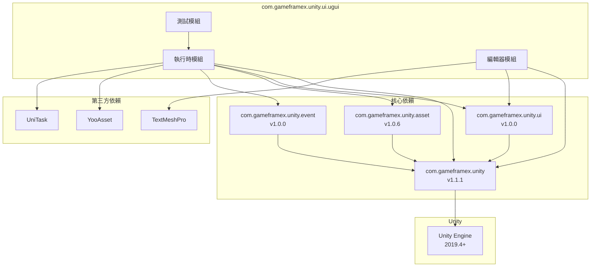

# 依賴要求

本文件詳細介紹 Game Frame X UGUI 組件包的所有依賴要求，包括 Unity 版本要求、程式包依賴和程式集引用。

## 概述

Game Frame X UGUI 組件包是一個基於 Unity UGUI 的高階 UI 框架，需要依賴 Game Frame X 核心框架和其他相關組件包。瞭解這些依賴要求是正確安裝和使用的第一步。

## Unity 版本要求

| 專案 | 要求 |
|------|------|
| 最低 Unity 版本 | 2019.4 |
| 推薦 Unity 版本 | 2020.3 LTS 或更高 |

> Source: [package.json](https://github.com/GameFrameX/com.gameframex.unity.ui.ugui/blob/main/package.json#L7)

## 程式包依賴

在安裝 UGUI 組件包之前，需要確保以下依賴包已正確安裝。這些依賴包透過 Unity Package Manager 進行管理。

### 核心依賴

| 包名 | 最低版本 | 說明 |
|------|---------|------|
| com.gameframex.unity | 1.1.1 | Game Frame X 核心框架，提供基礎架構和通用功能 |
| com.gameframex.unity.ui | 1.0.0 | Game Frame X UI 基礎包，提供 UI 抽象層和基礎介面 |
| com.gameframex.unity.asset | 1.0.6 | Game Frame X 資源管理包，提供資源載入和管理功能 |
| com.gameframex.unity.event | 1.0.0 | Game Frame X 事件系統包，提供事件分發和監聽功能 |

> Source: [package.json](https://github.com/GameFrameX/com.gameframex.unity.ui.ugui/blob/main/package.json#L21-L26)

### 安裝依賴

在 Unity 專案的 `manifest.json` 檔案中新增以下依賴：

```json
{
  "dependencies": {
    "com.gameframex.unity": "1.1.1",
    "com.gameframex.unity.ui": "1.0.0",
    "com.gameframex.unity.asset": "1.0.6",
    "com.gameframex.unity.event": "1.0.0",
    "com.gameframex.unity.ui.ugui": "2.3.6"
  }
}
```

## 程式集引用

### 執行時程式集 (Runtime)

UGUI 執行時程式集需要引用以下程式集：

| 程式集 | 說明 |
|--------|------|
| GameFrameX.Runtime | 核心執行時 |
| GameFrameX.Asset.Runtime | 資源管理執行時 |
| GameFrameX.Event.Runtime | 事件系統執行時 |
| GameFrameX.UI.Runtime | UI 基礎執行時 |
| YooAsset.Runtime | YooAsset 資源引擎執行時 |
| YooAsset | YooAsset 主程式集 |
| UniTask.Runtime | UniTask 非同步執行時 |

> Source: [Runtime/GameFrameX.UI.UGUI.Runtime.asmdef](https://github.com/GameFrameX/com.gameframex.unity.ui.ugui/blob/main/Runtime/GameFrameX.UI.UGUI.Runtime.asmdef#L4-L11)

### 編輯器程式集 (Editor)

UGUI 編輯器程式集需要引用以下程式集：

| 程式集 | 說明 |
|--------|------|
| GameFrameX.Editor | 核心編輯器 |
| GameFrameX.Runtime | 核心執行時 |
| GameFrameX.UI.Runtime | UI 基礎執行時 |
| GameFrameX.UI.UGUI.Runtime | UGUI 執行時 |
| Unity.TextMeshPro | TextMeshPro（條件依賴） |

> Source: [Editor/GameFrameX.UI.UGUI.Editor.asmdef](https://github.com/GameFrameX/com.gameframex.unity.ui.ugui/blob/main/Editor/GameFrameX.UI.UGUI.Editor.asmdef#L4-L9)

#### TextMeshPro 條件引用

編輯器程式集使用版本定義來條件引用 TextMeshPro：

```json
{
  "name": "com.unity.textmeshpro",
  "expression": "",
  "define": "ENABLE_UI_TEXT_MESH_PRO"
}
```

這意味著 TextMeshPro 是可選依賴，當專案中有 TextMeshPro 時會自動啟用相關功能。

> Source: [Editor/GameFrameX.UI.UGUI.Editor.asmdef](https://github.com/GameFrameX/com.gameframex.unity.ui.ugui/blob/main/Editor/GameFrameX.UI.UGUI.Editor.asmdef#L20-L26)

## 依賴關係圖



## 安裝順序

為確保依賴正確解析，請按照以下順序安裝：

1. **第一步：安裝核心依賴**
   - com.gameframex.unity (1.1.1)
   - com.gameframex.unity.ui (1.0.0)
   - com.gameframex.unity.asset (1.0.6)
   - com.gameframex.unity.event (1.0.0)

2. **第二步：安裝第三方依賴**
   - YooAsset（透過 Asset 或 UI 包自動引入）
   - UniTask（如未自動引入需手動安裝）

3. **第三步：安裝 UGUI 組件**
   - com.gameframex.unity.ui.ugui (2.3.6)

4. **第四步（可選）：安裝編輯器增強**
   - TextMeshPro（如需使用增強的文字功能）

## 版本相容性

| UGUI 版本 | Unity 版本 | 核心框架版本 | 包狀態 |
|-----------|-----------|-------------|--------|
| 2.3.6 | 2019.4+ | 1.1.1 | 當前穩定版 |
| 2.0.0 | 2019.4+ | 1.0.0 | 歷史版本 |

## 常見問題

### Q1: 安裝時提示缺少依賴怎麼辦？

請確保按照上述安裝順序依次安裝所有依賴包。如果使用 Git URL 安裝方式，依賴包通常會自動下載。

### Q2: YooAsset 和 UniTask 從哪裡獲取？

這兩個包通常是作為 Game Frame X 生態的一部分自動引入。如果未自動引入：
- YooAsset：可從 GitHub 倉庫 `YooAsset` 獲取
- UniTask：可從 Unity Package Manager 獲取 `com.cysharp.unitask`

### Q3: TextMeshPro 是必需的嗎？

不是。TextMeshPro 是可選依賴，不影響核心功能使用。但推薦安裝以獲得完整的文字處理能力。

## 相關連結

- [安裝方式](./2-installation.methods) - 詳細安裝步驟
- [外掛介紹](./1-overview.introduction) - 外掛功能概述
- [功能特性](./1-overview.features) - 完整功能列表
- [Game Frame X 官方文件](https://gameframex.doc.alianblank.com)
- [GitHub 倉庫](https://github.com/gameframex/com.gameframex.unity.ui.ugui.git)
