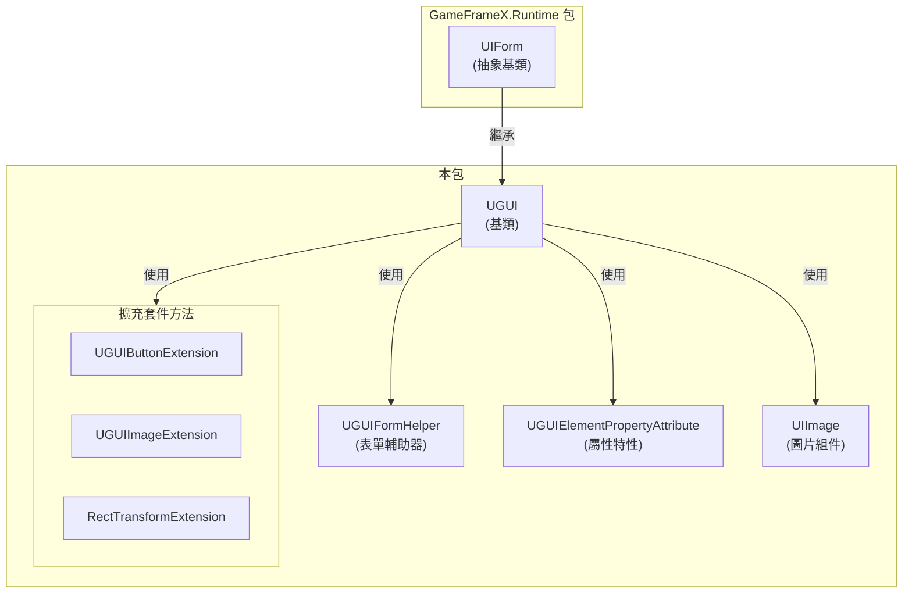
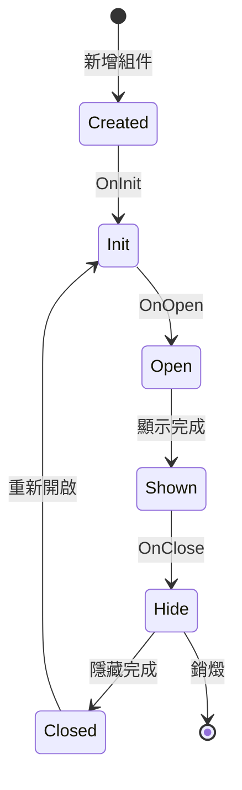

# UGUI基類

UGUI基類是GameFrameX UGUI模組的核心類，提供UGUI特定的介面功能實現。所有UGUI介面都需要繼承此類來獲得完整的UI生命週期管理和顯示控制能力。

## 概述

`UGUI` 類是Unity UGUI介面的基類，繼承自 `UIForm`。它封裝了Unity UGUI的特定實現，提供了介面顯示/隱藏、可見性控制、全屏佈局等核心功能。透過繼承此基類，開發者可以快速建立、管理和操作UGUI介面，同時與GameFrameX的UI管理系統無縫整合。

該類使用 `[DisallowMultipleComponent]` 特性確保每個GameObject只能新增一個UGUI組件，防止重複新增導致的邏輯錯誤。

## 核心功能

### 介面顯示與隱藏

UGUI基類重寫了父類的顯示和隱藏方法，支援帶動畫的介面切換效果：

- **Show方法**: 顯示介面，支援透過 `IUIFormShowHandler` 處理顯示動畫
- **Hide方法**: 隱藏介面，支援透過 `IUIFormHideHandler` 處理隱藏動畫

### 可見性管理

提供了兩種控制介面可見性的方式：

1. **受保護的InternalSetVisible方法**: 設定UI的顯示狀態，不發出任何事件，適用於內部狀態同步
2. **公共Visible屬性**: 獲取或設定介面的可見性，會觸發GameObject的啟用/停用狀態

### 全屏佈局

`MakeFullScreen` 方法可以將UI元素設定為全屏模式，自動配置錨點、位置和尺寸：
- 錨點設定為 (0,0) 到 (1,1)
- 錨點位置設定為 (0,0)
- 尺寸增量設定為 Vector2.zero

## 架構設計



### 類關係說明

| 組件 | 角色 | 說明 |
|------|------|------|
| UIForm | 父類抽象基 | 提供UI介面的抽象介面和生命週期管理 |
| UGUI | 核心類 | UGUI特定的介面實現，處理Unity UGUI細節 |
| UGUIFormHelper | 輔助器 | 處理UI表單的例項化、建立和釋放 |
| UGUIElementPropertyAttribute | 特性 | 標記UI控制組件在預製體中的路徑 |
| UIImage | 組件 | 擴充套件的圖片組件，支援非同步圖示載入 |
| 擴充套件方法 | 工具集 | 提供便捷的組件操作方法 |

## 介面生命週期



## 使用示例

### 建立自定義UGUI介面

```csharp
using GameFrameX.UI.UGUI.Runtime;
using UnityEngine;

public class MainMenuUI : UGUI
{
    protected override void OnInit(object userData)
    {
        base.OnInit(userData);
        // 初始化UI邏輯
    }
    
    protected override void OnOpen(object userData)
    {
        base.OnOpen(userData);
        // UI開啟時的邏輯
    }
    
    protected override void OnClose(bool isShutdown, object userData)
    {
        base.OnClose(isShutdown, userData);
        // UI關閉時的邏輯
    }
}
```
> Source: [UGUI.cs](https://github.com/GameFrameX/com.gameframex.unity.ui.ugui/blob/main/Runtime/UGUI.cs#L46-L179)

### 使用UGUIElementPropertyAttribute繫結控制組件

```csharp
using GameFrameX.UI.UGUI.Runtime;
using UnityEngine;
using UnityEngine.UI;

public class GameStartUI : UGUI
{
    // 使用特性標記控制組件路徑
    [SerializeField]
    [UGUIElementProperty("StartButton")]
    private Button m_StartButton;

    [SerializeField]
    [UGUIElementProperty("Title/Text")]
    private Text m_TitleText;

    public Button StartButton => m_StartButton;
    public Text TitleText => m_TitleText;

    protected override void OnInit(object userData)
    {
        base.OnInit(userData);
        // 繫結按鈕事件
        m_StartButton.onClick.AddListener(OnStartClick);
    }

    private void OnStartClick()
    {
        Debug.Log("開始遊戲按鈕被點選");
    }
}
```
> Source: [UGUIElementPropertyAttribute.cs](https://github.com/GameFrameX/com.gameframex.unity.ui.ugui/blob/main/Runtime/UGUIElementPropertyAttribute.cs#L40-L64)

### 設定全屏UI

```csharp
using GameFrameX.UI.UGUI.Runtime;
using UnityEngine;

public class FullScreenPanel : MonoBehaviour
{
    private void Start()
    {
        // 獲取或新增RectTransform並設定為全屏
        gameObject.GetOrAddComponent<RectTransform>().MakeFullScreen();
    }
}
```
> Source: [RectTransformExtension.cs](https://github.com/GameFrameX/com.gameframex.unity.ui.ugui/blob/main/Runtime/RectTransformExtension.cs#L56-L62)

## 程式碼生成器整合

UGUI基類與程式碼生成器緊密整合。程式碼生成器會自動為UGUI預製體生成繼承自UGUI的程式碼類：

```csharp
// 程式碼生成器生成的程式碼結構示例
namespace Hotfix.UI
{
    /// <summary>
    /// 程式碼生成的UI程式碼MainMenu
    /// </summary>
    [DisallowMultipleComponent]
    [OptionUIConfig(null, "Assets/Prefabs/UI/MainMenu")]
    public sealed partial class MainMenu : UGUI
    {
        public GameObject self { get; private set; }

        [SerializeField]
        [UGUIElementProperty("Panel/StartButton")]
        private Button m_StartButton;

        public Button m_StartButton => m_StartButton;

        private bool _isInitView = false;

        protected override void InitView()
        {
            if (_isInitView)
            {
                return;
            }

            _isInitView = true;
            this.self = this.gameObject;
            m_StartButton = gameObject.transform.FindChildName("Panel/StartButton").GetComponent<Button>();
        }
    }
}
```
> Source: [UGUICodeGenerator.cs](https://github.com/GameFrameX/com.gameframex.unity.ui.ugui/blob/main/Editor/UGUICodeGenerator.cs#L195-L230)

## 相關連結

- [UI管理器](./4-core-concepts.ui-manager) - 瞭解UI介面的整體管理系統
- [表單輔助器](./4-core-concepts.form-helper) - 瞭解UI表單建立和管理輔助工具
- [UIImage組件](./5-components.uiimage) - 瞭解擴充套件的圖片組件
- [擴充套件方法](./5-components.extensions) - 瞭解按鈕、圖片、RectTransform的擴充套件方法
- [程式碼生成器](./6-editor-tools.code-generator) - 瞭解如何自動生成UGUI程式碼
- [官方文件](https://gameframex.doc.alianblank.com) - 獲取更多詳細資訊
