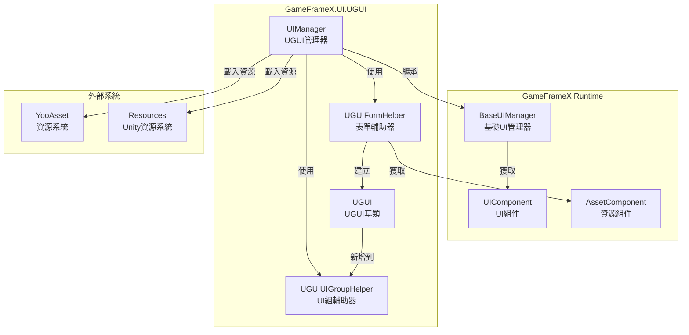
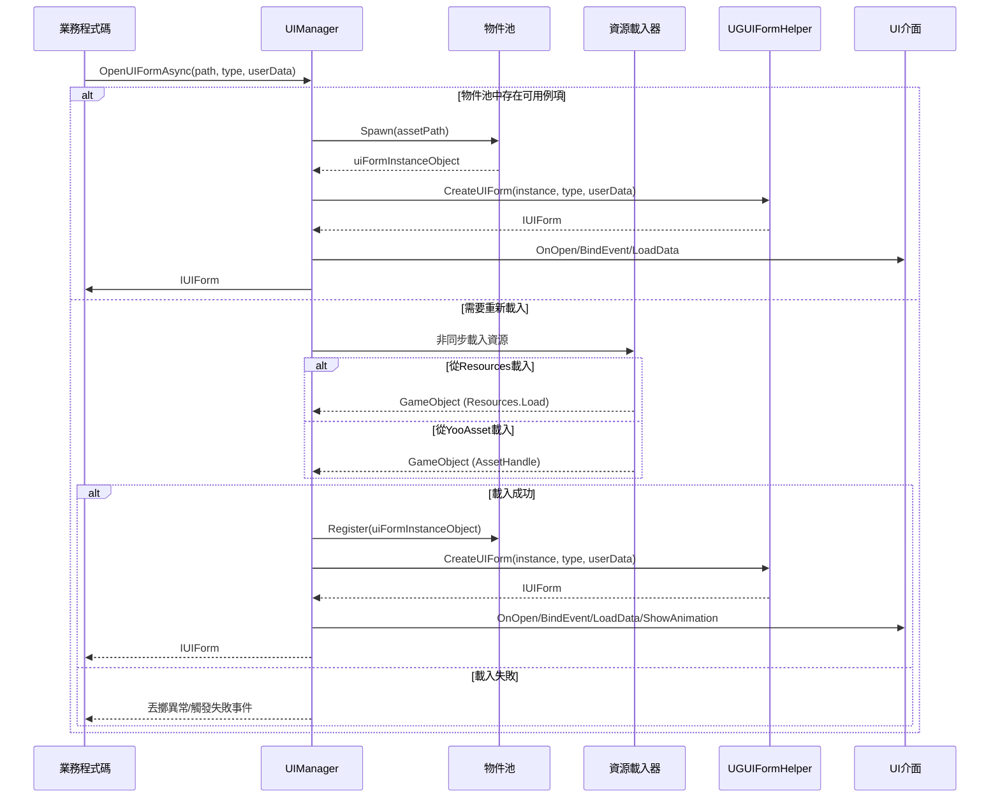
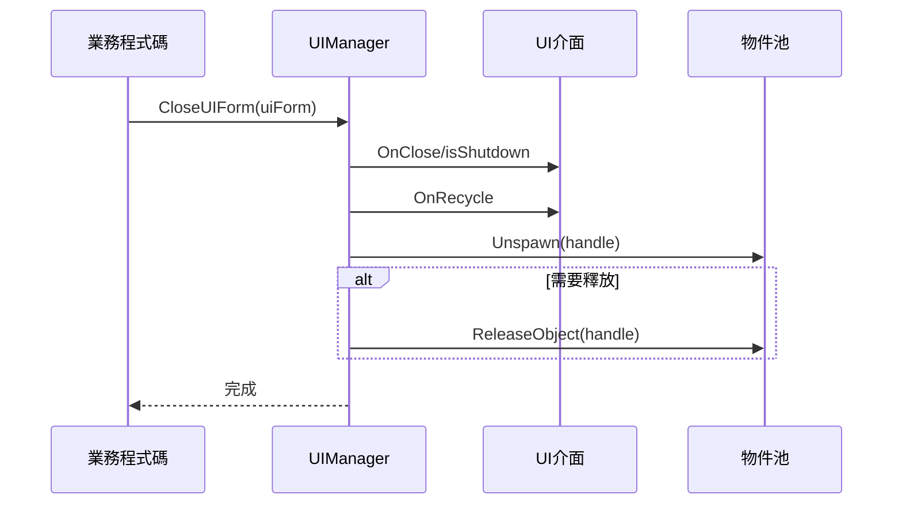

# UI管理器

UI管理器（UIManager）是GameFrameX UGUI外掛的核心組件，負責管理UI介面的完整生命週期，包括介面的載入、顯示、隱藏、關閉和回收等操作。

## 概述

UIManager是整個UI系統的中樞組件，它繼承自`BaseUIManager`，提供了完整的UI介面管理功能。該管理器支援從Resources資源目錄或YooAsset資源包非同步載入UI介面，並實現了物件池機制來最佳化記憶體使用。

### 核心職責

- **介面生命週期管理**：負責UI介面的開啟、關閉、顯示、隱藏等生命週期操作
- **資源載入**：支援從Resources和YooAsset資源包非同步載入UI介面
- **物件池管理**：使用物件池快取已關閉的UI介面例項，減少資源載入開銷
- **事件回呼**：提供完整的事件回呼機制，用於通知介面開啟/關閉的成功或失敗狀態
- **UI組管理**：管理多個UI組的層級和顯示順序

### 設計意圖

UIManager採用非同步載入模式，避免阻塞主執行緒，提升使用者體驗。物件池機制可以有效減少頻繁例項化UI介面帶來的記憶體抖動和效能開銷。事件驅動的設計模式使得UI邏輯與業務邏輯解耦，便於維護和擴充套件。

## 架構



### 組件說明

| 組件 | 名稱空間 | 說明 |
|------|----------|------|
| UIManager | GameFrameX.UI.UGUI.Runtime | UGUI介面管理器，負責介面生命週期管理 |
| UGUIFormHelper | GameFrameX.UI.UGUI.Runtime | 表單輔助器，處理UI介面例項化和建立 |
| UGUIUIGroupHelper | GameFrameX.UI.UGUI.Runtime | UI組輔助器，管理UI組的深度和層級 |
| UGUI | GameFrameX.UI.UGUI.Runtime | UGUI介面基類，繼承自UIForm |

## 介面開啟流程

UIManager的核心功能之一是非同步開啟UI介面。以下是開啟介面的完整流程：



### 詳細流程說明

1. **檢查物件池**：首先檢查物件池中是否存在可複用的UI例項
2. **資源載入**：如果物件池中沒有可用例項，則非同步載入資源
3. **資源來源判斷**：根據路徑判斷從Resources還是YooAsset包載入
4. **建立UI表單**：使用UGUIFormHelper建立UI介面例項
5. **初始化UI**：呼叫介面的OnOpen、BindEvent、LoadData等方法
6. **播放動畫**：如果啟用顯示動畫，則播放動畫
7. **事件回呼**：觸發開啟成功事件

> Source: [UIManager.Open.cs](https://github.com/GameFrameX/com.gameframex.unity.ui.ugui/blob/main/Runtime/UIManager.Open.cs#L78-L115)

## 介面關閉與回收

關閉UI介面時，UIManager會根據配置決定是回收例項還是直接銷燬：



> Source: [UIManager.Close.cs](https://github.com/GameFrameX/com.gameframex.unity.ui.ugui/blob/main/Runtime/UIManager.Close.cs#L50-L67)

## 核心方法

### InnerOpenUIFormAsync

非同步開啟UI介面的核心方法。

```csharp
protected override async Task<IUIForm> InnerOpenUIFormAsync(
    string uiFormAssetPath,  // UI資源路徑
    Type uiFormType,         // UI介面型別
    bool pauseCoveredUIForm,// 是否暫停被覆蓋的介面
    object userData,         // 使用者自定義資料
    bool isFullScreen = false // 是否全屏顯示
)
```

> Source: [UIManager.Open.cs](https://github.com/GameFrameX/com.gameframex.unity.ui.ugui/blob/main/Runtime/UIManager.Open.cs#L78-L115)

**實現邏輯**：

1. 檢查物件池是否已有可用例項，如有則直接使用
2. 否則呼叫`InnerLoadUIFormAsync`非同步載入資源
3. 根據資源路徑判斷從Resources還是YooAsset包載入
4. 載入成功後建立UI表單並初始化
5. 觸發開啟成功事件回呼

### InnerLoadUIFormAsync

非同步載入UI介面資源。

```csharp
private async Task<IUIForm> InnerLoadUIFormAsync(
    string uiFormAssetPath,
    Type uiFormType,
    bool pauseCoveredUIForm,
    object userData,
    bool isFullScreen,
    string uiFormAssetName,
    string assetPath
)
```

> Source: [UIManager.Open.cs](https://github.com/GameFrameX/com.gameframex.unity.ui.ugui/blob/main/Runtime/UIManager.Open.cs#L131-L163)

**資源載入邏輯**：

```csharp
// 判斷資源路徑是否包含"Bundles"目錄
if (uiFormAssetPath.IndexOf(Utility.Asset.Path.BundlesDirectoryName, StringComparison.OrdinalIgnoreCase) < 0)
{
    // 從Resources中載入
    var original = (GameObject)Resources.Load(assetPath);
    var gameObject = UnityEngine.Object.Instantiate(original);
}
else
{
    // 從YooAsset包中載入
    var assetHandle = await m_AssetManager.LoadAssetAsync<UnityEngine.Object>(assetPath);
    var gameObject = assetHandle.InstantiateSync();
}
```

> Source: [UIManager.Open.cs](https://github.com/GameFrameX/com.gameframex.unity.ui.ugui/blob/main/Runtime/UIManager.Open.cs#L137-L162)

### RecycleUIForm

回收UI介面例項物件。

```csharp
protected override void RecycleUIForm(IUIForm uiForm, bool isDispose = false)
{
    uiForm.OnRecycle();
    var formHandle = uiForm.Handle as GameObject;
    
    m_InstancePool.Unspawn(uiForm.Handle);
    
    if (isDispose)
    {
        m_InstancePool.ReleaseObject(uiForm.Handle);
    }
}
```

> Source: [UIManager.Close.cs](https://github.com/GameFrameX/com.gameframex.unity.ui.ugui/blob/main/Runtime/UIManager.Close.cs#L52-L67)

## 表單輔助器

UGUIFormHelper負責UI介面的例項化、建立和釋放。

### 建立UI介面

```csharp
public override IUIForm CreateUIForm(object uiFormInstance, Type uiFormType, object userData)
{
    var uiGameObject = uiFormInstance as GameObject;
    
    // 新增UI介面指令碼組件
    var componentType = uiGameObject.GetOrAddComponent(uiFormType);
    
    // 呼叫OnAwake初始化
    if (uiForm.IsAwake == false)
    {
        uiForm.OnAwake();
    }
    
    // 根據特性獲取UI組
    var attribute = uiFormType.GetCustomAttribute(typeof(OptionUIGroupAttribute));
    if (attribute is OptionUIGroupAttribute optionUIGroup)
    {
        uiGroup = m_UIComponent.GetUIGroup(optionUIGroup.GroupName);
    }
    
    // 設定父物件
    uiTransform.SetParent(helper.transform);
    uiTransform.localScale = Vector3.one;
    
    return uiForm;
}
```

> Source: [UGUIFormHelper.cs](https://github.com/GameFrameX/com.gameframex.unity.ui.ugui/blob/main/Runtime/UGUIFormHelper.cs#L92-L164)

### 釋放UI介面

```csharp
public override void ReleaseUIForm(
    object uiFormAsset,
    object uiFormInstance,
    object assetHandle,
    string uiFormAssetPath,
    string uiFormAssetName)
{
    if (!m_UIComponent.EnableAutoReleaseUIForm)
    {
        return;
    }
    
    // 根據路徑判斷資源型別並解除安裝
    if (uiFormAssetPath.IndexOf(Utility.Asset.Path.BundlesDirectoryName, StringComparison.OrdinalIgnoreCase) >= 0)
    {
        m_AssetComponent.UnloadAsset(uiFormAssetPath);
    }
    else
    {
        UnityEngine.Resources.UnloadAsset((Object)uiFormInstance);
    }
    
    Destroy((Object)uiFormInstance);
}
```

> Source: [UGUIFormHelper.cs](https://github.com/GameFrameX/com.gameframex.unity.ui.ugui/blob/main/Runtime/UGUIFormHelper.cs#L177-L195)

## UI組輔助器

UGUIUIGroupHelper負責管理UI組的層級和深度。

```csharp
public override void SetDepth(int depth)
{
    Depth = depth;
    // 透過調整Z軸位置來實現深度控制
    transform.localPosition = new Vector3(0, 0, depth * 1000);
}

public override IUIGroupHelper Handler(
    Transform root,
    string groupName,
    string uiGroupHelperTypeName,
    IUIGroupHelper customUIGroupHelper,
    int depth = 0)
{
    SetDepth(depth);
    
    // 建立UI組容器
    GameObject component = new GameObject();
    component.name = groupName;
    component.transform.SetParent(root, false);
    
    // 設定UI層
    var uiLayer = LayerMask.NameToLayer("UI");
    component.SetLayerRecursively(uiLayer);
    
    // 建立全屏RectTransform
    RectTransform rectTransform = component.GetOrAddComponent<RectTransform>();
    rectTransform.MakeFullScreen();
    
    return uiGroupHelper;
}
```

> Source: [UGUIUIGroupHelper.cs](https://github.com/GameFrameX/com.gameframex.unity.ui.ugui/blob/main/Runtime/UGUIUIGroupHelper.cs#L64-L105)

## 使用示例

### 開啟UI介面

```csharp
// 獲取UI組件
var uiComponent = GameEntry.GetComponent<UIComponent>();

// 非同步開啟UI介面
var uiForm = await uiComponent.OpenUIFormAsync("UI/MainMenu", typeof(MainMenuUI), false, null);
```

### 關閉UI介面

```csharp
// 關閉指定的UI介面
uiComponent.CloseUIForm(uiForm);
```

### 使用UI組特性

```csharp
// 為UI介面指定UI組
[OptionUIGroup("DialogGroup")]
public class DialogUI : UGUI
{
    // UI介面邏輯
}
```

> Source: [UGUIFormHelper.cs](https://github.com/GameFrameX/com.gameframex.unity.ui.ugui/blob/main/Runtime/UGUIFormHelper.cs#L117-L124)

### 使用顯示動畫特性

```csharp
// 為UI介面指定顯示動畫
[OptionUIShowAnimation(true, "FadeIn")]
[OptionUIHideAnimation(true, "FadeOut")]
public class MainMenuUI : UGUI
{
    // UI介面邏輯
}
```

> Source: [UGUIFormHelper.cs](https://github.com/GameFrameX/com.gameframex.unity.ui.ugui/blob/main/Runtime/UGUIFormHelper.cs#L126-L146)

## 相關連結

- [UGUI基類](./4-core-concepts.ugui-base) - UGUI介面基類的詳細文件
- [表單輔助器](./4-core-concepts.form-helper) - 表單輔助器的詳細文件
- [UIImage組件](./5-components.uiimage) - 增強的圖片組件
- [擴充套件方法](./5-components.extensions) - UGUI組件擴充套件方法
- [官方文件](https://gameframex.doc.alianblank.com)
- [GitHub倉庫](https://github.com/GameFrameX/com.gameframex.unity.ui.ugui)
