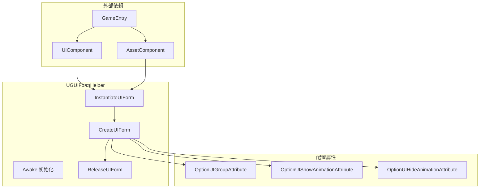
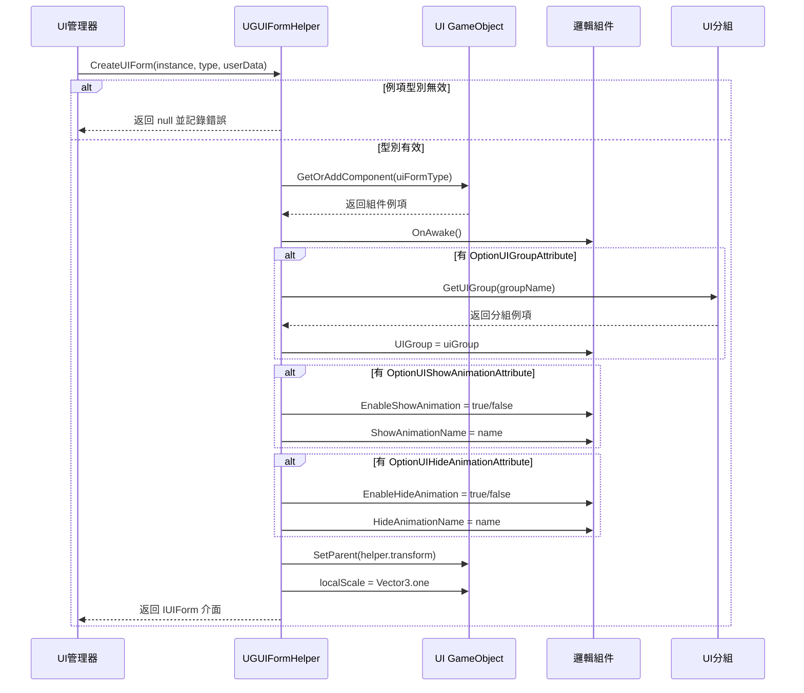

# 表單輔助器

表單輔助器（Form Helper）是 GameFrameX UGUI 系統中負責 UI 表單例項化、建立和釋放的核心組件。它作為 UI 管理器與實際 UI 資源之間的橋樑，封裝了介面建立的所有底層邏輯。

## 概述

`UGUIFormHelper` 是 UGUI 介面的預設表單輔助器，繼承自 `UIFormHelperBase` 抽象類。它承擔了三個核心職責：

1. **例項化介面**：將 UI 資源載入為可用的 GameObject 例項
2. **建立介面**：為例項新增邏輯組件、設定分組、配置動畫等
3. **釋放介面**：解除安裝資源並銷燬例項

透過使用表單輔助器，UI 管理系統可以將介面資源的載入方式與業務邏輯解耦，使得系統能夠支援不同的資源載入方式（如 AssetBundle、Resources 等）。

> 注意：`UIFormHelperBase` 抽象類定義在 `GameFrameX.UI.Runtime` 包中，屬於框架的基礎 UI 組件。本文件主要介紹 `UGUIFormHelper` 的具體實現。

## Architecture



**架構說明：**
- `UGUIFormHelper` 依賴於 `UIComponent` 和 `AssetComponent`，透過 `GameEntry` 獲取組件例項
- 三個配置屬性用於在程式碼層面指定介面的分組和動畫行為
- 核心流程按照例項化 → 建立 → 釋放的順序執行

## 核心功能

### 例項化介面

```csharp
public override object InstantiateUIForm(object uiFormAsset)
{
    return (Object)uiFormAsset;
}
```

> Source: [UGUIFormHelper.cs](https://github.com/GameFrameX/com.gameframex.unity.ui.ugui/blob/main/Runtime/UGUIFormHelper.cs#L77-L80)

例項化過程相對簡單，直接將載入的資源物件返回。在 UGUI 系統中，載入的資源本身就是可用的 Unity Object。

### 建立介面

建立介面是表單輔助器的核心功能，它完成了以下工作：

1. **型別驗證**：確保傳入的例項是有效的 GameObject
2. **組件新增**：為 GameObject 新增介面邏輯組件
3. **初始化呼叫**：呼叫介面的 `OnAwake` 方法
4. **分組設定**：根據 `OptionUIGroupAttribute` 獲取並設定 UI 分組
5. **動畫配置**：根據 `OptionUIShowAnimationAttribute` 和 `OptionUIHideAnimationAttribute` 配置顯示/隱藏動畫
6. **層級設定**：將介面設定為正確的父子關係和縮放

```csharp
public override IUIForm CreateUIForm(object uiFormInstance, Type uiFormType, object userData)
{
    var uiGameObject = uiFormInstance as GameObject;
    if (uiGameObject == null)
    {
        Log.Error($"UI form instance type {uiFormType} is invalid.");
        return null;
    }

    var componentType = uiGameObject.GetOrAddComponent(uiFormType);
    if (!(componentType is IUIForm uiForm))
    {
        Log.Error($"UI form instance type {uiFormType} is invalid.");
        return null;
    }

    if (uiForm.IsAwake == false)
    {
        uiForm.OnAwake();
    }
    // ... 分組和動畫配置
}
```

> Source: [UGUIFormHelper.cs](https://github.com/GameFrameX/com.gameframex.unity.ui.ugui/blob/main/Runtime/UGUIFormHelper.cs#L93-L164)

### 釋放介面

釋放介面時，輔助器會根據配置決定是否自動釋放資源：

```csharp
public override void ReleaseUIForm(object uiFormAsset, object uiFormInstance, object assetHandle, string uiFormAssetPath, string uiFormAssetName)
{
    if (!m_UIComponent.EnableAutoReleaseUIForm)
    {
        return;
    }

    if (uiFormAssetPath.IndexOf(Utility.Asset.Path.BundlesDirectoryName, StringComparison.OrdinalIgnoreCase) >= 0)
    {
        m_AssetComponent.UnloadAsset(uiFormAssetPath);
    }
    else
    {
        UnityEngine.Resources.UnloadAsset((Object)uiFormInstance);
    }

    Destroy((Object)uiFormInstance);
}
```

> Source: [UGUIFormHelper.cs](https://github.com/GameFrameX/com.gameframex.unity.ui.ugui/blob/main/Runtime/UGUIFormHelper.cs#L178-L195)

**釋放策略：**
- 如果 `EnableAutoReleaseUIForm` 為 false，則不執行釋放
- 如果資源路徑包含 bundles 目錄，則使用 AssetComponent 解除安裝
- 否則使用 Resources.UnloadAsset 解除安裝
- 最後銷燬 GameObject 例項

## 介面建立流程



## 使用配置屬性

### OptionUIGroupAttribute

用於指定介面所屬的 UI 分組：

```csharp
[OptionUIGroup("MainPanel")]
public class MainMenuUI : UGUI
{
    // ...
}
```

### OptionUIShowAnimationAttribute

用於配置介面顯示動畫：

```csharp
[OptionUIShowAnimation(true, "FadeIn")]
public class MainMenuUI : UGUI
{
    // ...
}
```

### OptionUIHideAnimationAttribute

用於配置介面隱藏動畫：

```csharp
[OptionUIHideAnimation(true, "FadeOut")]
public class MainMenuUI : UGUI
{
    // ...
}
```

## 配置選項

| 配置項 | 型別 | 預設值 | 說明 |
|--------|------|--------|------|
| EnableAutoReleaseUIForm | bool | true | 是否在介面關閉時自動釋放資源 |

> 注意：UIComponent 的配置項在 `GameFrameX.UI.Runtime` 包中定義，詳情請參閱 [UI管理器](./4-core-concepts.ui-manager) 文件。

## API 參考

### `InstantiateUIForm(uiFormAsset: object): object`

例項化 UI 介面資源。

**引數：**
- `uiFormAsset` (object): 要例項化的介面資源

**返回：** 例項化後的 Unity Object

---

### `CreateUIForm(uiFormInstance: object, uiFormType: Type, userData: object): IUIForm`

建立 UI 介面，完成組件新增和初始化。

**引數：**
- `uiFormInstance` (object): 介面例項（GameObject）
- `uiFormType` (Type): 介面邏輯類型別
- `userData` (object): 使用者自定義資料

**返回：** IUIForm 介面例項

**可能返回 null 的情況：**
- uiFormInstance 不是有效的 GameObject
- 新增的組件不實現 IUIForm 介面
- UI 分組無效

---

### `ReleaseUIForm(uiFormAsset: object, uiFormInstance: object, assetHandle: object, uiFormAssetPath: string, uiFormAssetName: string): void`

釋放 UI 介面資源。

**引數：**
- `uiFormAsset` (object): 介面資源
- `uiFormInstance` (object): 介面例項
- `assetHandle` (object): 資源控制代碼
- `uiFormAssetPath` (string): 介面資源路徑
- `uiFormAssetName` (string): 介面資源名稱

---

## 相關連結

- [UGUI 基類](./4-core-concepts.ugui-base) - UGUI 介面的基類實現
- [UI 管理器](./4-core-concepts.ui-manager) - UI 管理器的完整功能
- [程式碼生成器](./6-editor-tools.code-generator) - 自動生成 UI 程式碼
- [官方文件](https://gameframex.doc.alianblank.com)
