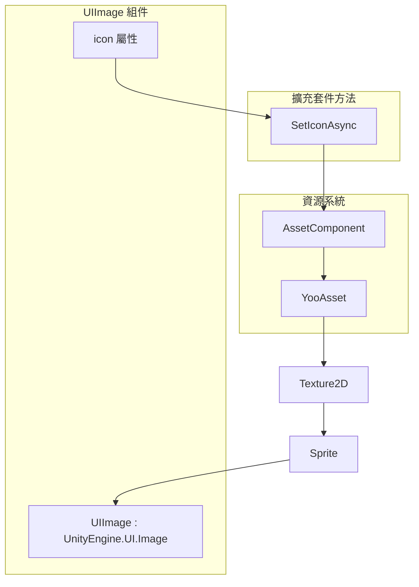
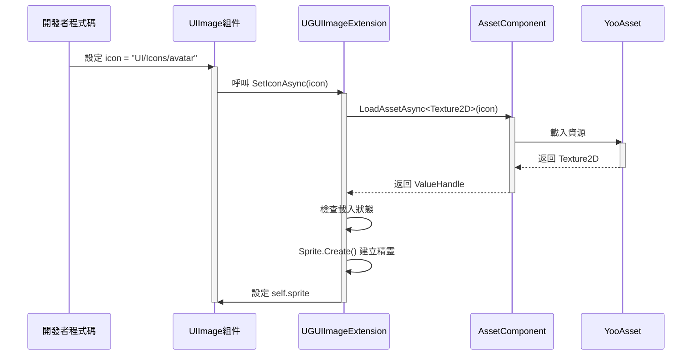

# UIImage組件

UIImage 組件是 GameFrameX UGUI 系統中的增強型圖片組件，繼承自 Unity 原生的 `UnityEngine.UI.Image`，並新增了非同步圖示載入功能。透過資源路徑即可自動載入並顯示圖片，極大簡化了 UI 圖片的管理工作。

## 概述

UIImage 組件旨在解決 Unity UGUI 中圖片管理的常見痛點。在傳統做法中，開發者需要手動處理 Sprite 的載入、記憶體管理以及非同步載入的協程程式碼。UIImage 組件透過整合資源系統，提供了一個簡潔的 API，只需設定資源路徑即可自動完成圖片的非同步載入和顯示。

該組件繼承自 Unity 的 `Image` 類，因此完全相容現有的 UGUI 系統，包括 Image 的所有屬性（如 Type、FillAmount、Color 等）和功能。開發者可以像使用普通 Image 組件一樣使用 UIImage，同時獲得非同步載入的額外能力。

### 核心功能

UIImage 組件的核心功能圍繞非同步圖示載入展開。當設定 `icon` 屬性時，組件會自動從資源系統中載入對應的 Texture2D，並將其轉換為 Sprite 顯示在 Image 上。整個過程是非同步進行的，不會阻塞主執行緒，這對於需要載入大量圖片的 UI 介面尤為重要。

組件內部使用了 GameFrameX 的資源管理系統（AssetComponent）來載入資源，確保了資源載入的統一性和可追蹤性。載入失敗時會記錄錯誤日誌，但不會丟擲異常，這種溫和的錯誤處理方式適合 UI 場景，保證介面的穩定性。

## 架構設計



### 組件層次結構

UIImage 組件在 UGUI 系統中的定位如上圖所示。它位於 UI 表現層，直接繼承自 Unity 的 Image 組件。在組件內部，當設定 icon 屬性時，會呼叫擴充套件方法 SetIconAsync 與資源系統進行互動。資源系統底層使用 YooAsset 進行實際的資源載入，這種分層設計使得各部分職責清晰，便於維護和擴充套件。

擴充套件方法 UGUIImageExtension 充當了 UIImage 與資源系統之間的橋樑，它負責將資源路徑轉換為 Texture2D，再將 Texture2D 轉換為 Sprite 設定到 Image 上。這個轉換過程是非同步的，使用了 async/await 模式，確保了 UI 的流暢性。

## 核心流程

### 圖示載入流程

當開發者設定 UIImage 的 icon 屬性時，會觸發以下非同步載入流程：



從序列圖中可以看出，整個載入流程是非同步的，不會阻塞呼叫執行緒。開發者設定屬性後可以立即返回繼續其他操作，圖片載入完成會自動顯示。如果載入失敗，會透過日誌系統記錄錯誤，但不會中斷程式執行。

### 編輯器替換流程

UIImageReplaceHandler 提供了將標準 Image 轉換為 UIImage 的編輯器功能：

```mermaid
flowchart TD
    A[開發者右鍵點選Image] --> B[選擇選單項<br/>"Replace To UIImage"]
    B --> C[獲取原Image所有屬性]
    C --> D[銷燬原Image組件]
    D --> E[新增UIImage組件]
    E --> F[恢復所有屬性]
    F --> G[完成轉換]
```

這個轉換過程保留了原始 Image 的所有設定，包括型別、材質、Sprite、顏色、射線cast設定等，確保轉換是無損的。

## 使用示例

### 基本用法

在 Unity 場景中建立一個 UIImage 組件並設定圖示資源路徑：

```csharp
using GameFrameX.UI.UGUI.Runtime;
using UnityEngine;

public class IconDisplayExample : MonoBehaviour
{
    [SerializeField]
    private UIImage iconImage;

    void Start()
    {
        // 設定圖示，只需傳入資源路徑
        iconImage.icon = "UI/Icons/PlayerAvatar";
    }
}
```
> Source: [UIImage.cs](https://github.com/GameFrameX/com.gameframex.unity.ui.ugui/blob/main/Runtime/UIImage.cs#L58-L71)

### 擴充套件方法直接使用

除了透過 UIImage 組件使用，也可以直接對普通 Image 呼叫擴充套件方法：

```csharp
using GameFrameX.UI.UGUI.Runtime;
using UnityEngine.UI;

public class ImageExtensionExample : MonoBehaviour
{
    [SerializeField]
    private Image normalImage;

    async void Start()
    {
        // 使用擴充套件方法非同步載入圖示
        await normalImage.SetIconAsync("UI/Icons/StartButton");
    }
}
```
> Source: [UGUIImageExtension.cs](https://github.com/GameFrameX/com.gameframex.unity.ui.ugui/blob/main/Runtime/UGUIImageExtension.cs#L56-L74)

### 編輯器中替換

在 Unity 編輯器中，可以透過上下文選單將現有的 Image 組件替換為 UIImage：

1. 在 Hierarchy 中選擇帶有 Image 組件的遊戲物件
2. 右鍵點選該物件
3. 選擇 "CONTEXT/Image/Replace To UIImage(替換為UIImage)"

此操作會將 Image 組件的所有屬性（型別、材質、Sprite、顏色等）完整遷移到 UIImage。
> Source: [UIImageReplaceHandler.cs](https://github.com/GameFrameX/com.gameframex.unity.ui.ugui/blob/main/Editor/UIImageReplaceHandler.cs#L42-L76)

## API 參考

### UIImage 類

繼承自 `UnityEngine.UI.Image`，新增了 icon 屬性用於非同步圖示載入。

```csharp
[DisallowMultipleComponent]
public class UIImage : UnityEngine.UI.Image
```

#### 屬性

**icon** (string)

獲取或設定圖示資源路徑。當設定此屬性時，會自動從資源系統載入對應的圖片並顯示。

```csharp
public string icon
{
    get { return m_icon; }
    set
    {
        if (m_icon != value)
        {
            m_icon = value;
            _ = this.SetIconAsync(m_icon);
        }
    }
}
```

**引數說明：**

| 引數 | 型別 | 說明 |
|------|------|------|
| value | string | 圖示資源路徑，相對於資源根目錄 |

**設計意圖：** 使用屬性而不是方法的好處是可以在 Unity 編輯器中直接拖拽或輸入資源路徑，同時支援資料繫結場景。當值發生變化時才觸發載入，避免重複載入相同的資源。

### UGUIImageExtension 擴充套件方法類

提供對 UnityEngine.UI.Image 的擴充套件方法。

```csharp
public static class UGUIImageExtension
```

#### SetIconAsync

非同步設定圖示，透過資源系統載入紋理並建立 Sprite。

```csharp
public static async Task SetIconAsync(this UnityEngine.UI.Image self, string icon)
```

**引數：**

- `self` (UnityEngine.UI.Image): 目標圖片組件
- `icon` (string): 圖示資源地址

**返回值：** Task 非同步任務

**實現邏輯：**

1. 獲取 AssetComponent 例項
2. 非同步載入 Texture2D 資源
3. 檢查載入狀態是否成功
4. 使用 Sprite.Create 建立精靈並設定到 Image

**錯誤處理：** 載入失敗時會捕獲異常並輸出錯誤日誌，不會丟擲異常。

```csharp
public static async Task SetIconAsync(this UnityEngine.UI.Image self, string icon)
{
    try
    {
        var assetComponent = GameEntry.GetComponent<AssetComponent>();
        using (var valueHandle = await assetComponent.LoadAssetAsync<Texture2D>(icon))
        {
            if (valueHandle.IsDone && valueHandle.Status == EOperationStatus.Succeed)
            {
                var texture2D = valueHandle.GetAssetObject<Texture2D>();
                self.sprite = Sprite.Create(
                    texture2D, 
                    new Rect(0, 0, texture2D.width, texture2D.height), 
                    new Vector2(0.5f, 0.5f)
                );
            }
        }
    }
    catch (System.Exception e)
    {
        Log.Error($"Failed to load icon '{icon}': {e.Message}");
    }
}
```
> Source: [UGUIImageExtension.cs](https://github.com/GameFrameX/com.gameframex.unity.ui.ugui/blob/main/Runtime/UGUIImageExtension.cs#L56-L74)

### UIImageReplaceHandler 編輯器類

提供編輯器中的 Image 到 UIImage 轉換功能。

```csharp
[CustomEditor(typeof(UnityEngine.UI.Image))]
public class UIImageReplaceHandler : UnityEditor.Editor
```

#### 選單項

**CONTEXT/Image/Replace To UIImage(替換為UIImage)**

將選中的 Image 組件替換為 UIImage，保留所有原有屬性設定。

> Source: [UIImageReplaceHandler.cs](https://github.com/GameFrameX/com.gameframex.unity.ui.ugui/blob/main/Editor/UIImageReplaceHandler.cs#L42-L76)

## 相關連結

- [擴充套件方法](./5-components.extensions) - 檢視更多 UGUI 擴充套件方法
- [UGUI基類](./4-core-concepts.ugui-base) - 瞭解 UGUI 介面基類
- [UI管理器](./4-core-concepts.ui-manager) - 瞭解 UI 管理系統
- [程式碼生成器](./6-editor-tools.code-generator) - 瞭解自動程式碼生成工具
- [組件檢查器](./6-editor-tools.inspector) - 瞭解編輯器檢查器工具
