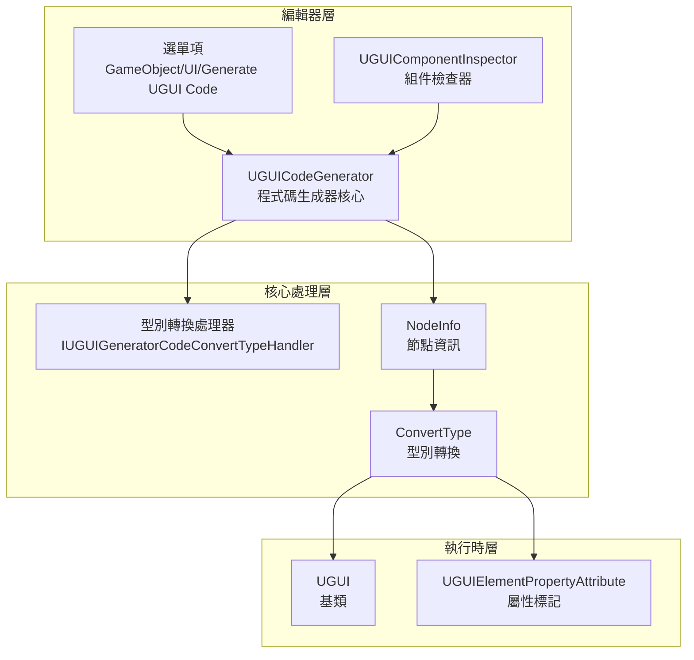
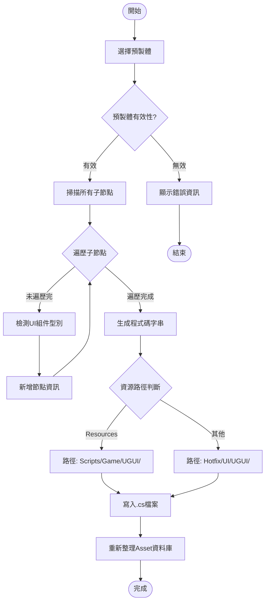

# 程式碼生成器

程式碼生成器是 GameFrameX UGUI 外掛的核心編輯器工具，能夠自動從 Unity UGUI 預製體生成對應的 C# 程式碼，大幅提升 UI 開發效率。

## 概述

程式碼生成器（UGUICodeGenerator）是一個 Unity 編輯器工具，用於自動將 UGUI 預製體轉換為可用的 C# 程式碼。它能夠：

- **自動遍歷 UI 層級**：遞迴掃描預製體中的所有子物件
- **智慧型別識別**：自動識別 Button、Text、Image、Toggle 等 UI 組件型別
- **可擴充套件的轉換機制**：透過介面支援自定義 UI 組件型別識別
- **一鍵程式碼生成**：從選單或檢查器觸發程式碼生成

### 使用場景

當需要建立新的 UI 介面時，無需手動編寫大量重複的 UI 引用程式碼，只需：
1. 在 Unity 編輯器中建立或選擇 UGUI 預製體
2. 右鍵選擇生成程式碼選單
3. 系統自動生成包含所有 UI 引用的程式碼檔案

## 架構

程式碼生成器採用模組化設計，主要包含以下組件：



### 組件說明

| 組件 | 檔案路徑 | 職責 |
|------|----------|------|
| UGUICodeGenerator | `Editor/UGUICodeGenerator.cs` | 主程式碼生成器，處理預製體遍歷和程式碼生成 |
| IUGUIGeneratorCodeConvertTypeHandler | `Editor/IUGUIGeneratorCodeConvertTypeHandler.cs` | 型別轉換處理器介面，支援擴充套件 |
| UGUIComponentInspector | `Editor/UGUIComponentInspector.cs` | Unity 檢查器，提供重新生成和繫結功能 |
| UGUIElementPropertyAttribute | `Runtime/UGUIElementPropertyAttribute.cs` | 屬性標記，標識 UI 元素路徑 |

## 核心功能

### 選單觸發方式

程式碼生成器透過 Unity 選單項提供兩種觸發方式：

```csharp
/// <summary>
/// 生成UI程式碼的選單項
/// </summary>
[MenuItem("GameObject/UI/Generate UGUI Code(生成UGUI程式碼)", false, 1)]
static void Code()
```

> Source: [UGUICodeGenerator.cs](https://github.com/GameFrameX/com.gameframex.unity.ui.ugui/blob/main/Editor/UGUICodeGenerator.cs#L56-L73)

### 程式碼生成流程



### UI 組件型別識別

程式碼生成器按照優先順序依次檢測以下 UI 組件型別：

```csharp
// 依次檢查是否包含各種UI組件
UIBehaviour component = transform.GetComponent<Button>();
if (component != null) { return typeof(Button).FullName; }

component = transform.GetComponent<Text>();
if (component != null) { return typeof(Text).FullName; }

component = transform.GetComponent<Toggle>();
if (component != null) { return typeof(Toggle).FullName; }

// ... 更多組件型別
```

> Source: [UGUICodeGenerator.cs](https://github.com/GameFrameX/com.gameframex.unity.ui.ugui/blob/main/Editor/UGUICodeGenerator.cs#L400-L497)

**支援的 UI 組件型別包括：**

- UnityEngine.UI.Button
- UnityEngine.UI.Text
- UnityEngine.UI.Image
- UnityEngine.UI.RawImage
- UnityEngine.UI.Toggle
- UnityEngine.UI.ToggleGroup
- UnityEngine.UI.InputField
- UnityEngine.UI.ScrollRect
- UnityEngine.UI.Dropdown
- UnityEngine.UI.Scrollbar
- UnityEngine.UI.Slider
- UnityEngine.UI.RectTransform
- UnityEngine.Transform
- GameFrameX.UI.UGUI.Runtime.UIImage（擴充套件組件）
- TMPro.TextMeshProUGUI（條件編譯）

### 型別轉換處理器擴充套件

透過實現 `IUGUIGeneratorCodeConvertTypeHandler` 介面，可以新增自定義的 UI 組件型別識別邏輯：

```csharp
/// <summary>
/// UI控制組件型別轉換介面
/// </summary>
public interface IUGUIGeneratorCodeConvertTypeHandler
{
    /// <summary>
    /// 處理器優先順序,數值越小優先順序越高
    /// </summary>
    int Priority { get; }

    /// <summary>
    /// 執行型別轉換
    /// </summary>
    /// <param name="transform">要轉換的Transform</param>
    /// <returns>轉換後的型別名稱</returns>
    string Run(Transform transform);
}
```

> Source: [IUGUIGeneratorCodeConvertTypeHandler.cs](https://github.com/GameFrameX/com.gameframex.unity.ui.ugui/blob/main/Editor/IUGUIGeneratorCodeConvertTypeHandler.cs#L39-L52)

處理器按優先順序排序後依次執行，一旦某個處理器返回非空型別，即採用該型別：

```csharp
// 首先使用自定義處理器進行處理
if (_handler != null)
{
    foreach (var handler in _handler)
    {
        var type = handler.Run(transform);
        if (type != null)
        {
            return type;
        }
    }
}
```

> Source: [UGUICodeGenerator.cs](https://github.com/GameFrameX/com.gameframex.unity.ui.ugui/blob/main/Editor/UGUICodeGenerator.cs#L387-L398)

## 使用示例

### 基本使用流程

1. **選擇 UGUI 預製體**：在 Unity 編輯器 Hierarchy 或 Project 視窗中選擇需要生成程式碼的 UGUI 預製體

2. **觸發程式碼生成**：
   - 方式一：右鍵點選預製體 → `GameObject/UI/Generate UGUI Code(生成UGUI程式碼)`
   - 方式二：在預製體的 Inspector 中點選"重新生成程式碼"按鈕

3. **檢視生成的程式碼**：程式碼會自動生成到指定目錄

### 生成的程式碼示例

生成的程式碼結構如下：

```csharp
/** This is an automatically generated class by UGUI. Please do not modify it. **/

#if ENABLE_UI_UGUI
using Cysharp.Threading.Tasks;
using GameFrameX.Entity.Runtime;
using GameFrameX.UI.Runtime;
using GameFrameX.Runtime;
using GameFrameX.UI.UGUI.Runtime;
using UnityEngine;

namespace Hotfix.UI
{
    /// <summary>
    /// 程式碼生成的UI程式碼MainMenu
    /// </summary>
    [DisallowMultipleComponent]
    [OptionUIConfig(null, "UI/Forms/MainMenu")]
    public sealed partial class MainMenu : UGUI
    {
        public GameObject self { get; private set; }

        #region Properties

        [SerializeField] [UGUIElementProperty("Background")]
        private UnityEngine.UI.Image m_Background;

        public UnityEngine.UI.Image m_Background
        {
            get { return m_Background;}
        }

        [SerializeField] [UGUIElementProperty("Title")]
        private UnityEngine.UI.Text m_Title;

        public UnityEngine.UI.Text m_Title
        {
            get { return m_Title;}
        }

        [SerializeField] [UGUIElementProperty("StartButton")]
        private UnityEngine.UI.Button m_StartButton;

        public UnityEngine.UI.Button m_StartButton
        {
            get { return m_StartButton;}
        }

        #endregion

        private bool _isInitView = false;

        protected override void InitView()
        {
            if (_isInitView)
            {
                return;
            }

            _isInitView = true;
            this.self = this.gameObject;
            m_Background = gameObject.transform.FindChildName("Background").GetComponent<UnityEngine.UI.Image>();
            m_Title = gameObject.transform.FindChildName("Title").GetComponent<UnityEngine.UI.Text>();
            m_StartButton = gameObject.transform.FindChildName("StartButton").GetComponent<UnityEngine.UI.Button>();
        }
    }
}
#endif
```

> Source: [UGUICodeGenerator.cs](https://github.com/GameFrameX/com.gameframex.unity.ui.ugui/blob/main/Editor/UGUICodeGenerator.cs#L147-L230)

### 重新繫結功能

在預製體的 Inspector 面板中，可以點選"重新繫結列表"按鈕來重新繫結所有 UI 引用：

```csharp
bool buttonClicked = EditorGUILayout.DropdownButton(_reBind, FocusType.Passive, CustomButtonStyle);
if (buttonClicked && !EditorApplication.isPlaying)
{
    // 重新繫結
    Dictionary<string, string> fieldMap = new Dictionary<string, string>();
    foreach (var fieldInfo in fieldInfos)
    {
        var serializeFieldAttributes = fieldInfo.GetCustomAttribute(typeof(SerializeField));
        if (serializeFieldAttributes == null) { continue; }

        var uguiElementPropertyAttribute = fieldInfo.GetCustomAttribute(typeof(UGUIElementPropertyAttribute));
        if (uguiElementPropertyAttribute == null) { continue; }

        var elementPropertyAttribute = (UGUIElementPropertyAttribute)uguiElementPropertyAttribute;
        fieldMap[fieldInfo.Name] = elementPropertyAttribute.Path;
    }
    // ... 繫結邏輯
}
```

> Source: [UGUIComponentInspector.cs](https://github.com/GameFrameX/com.gameframex.unity.ui.ugui/blob/main/Editor/UGUIComponentInspector.cs#L96-L132)

## 配置說明

### 程式碼生成路徑規則

程式碼生成器根據預製體位置自動選擇生成路徑：

| 預製體位置 | 生成路徑 |
|------------|----------|
| 包含 "Resources" 目錄 | `Assets/Scripts/Game/UGUI/{預製體名稱}/` |
| 其他位置 | `Assets/Hotfix/UI/UGUI/{預製體名稱}/` |

```csharp
if (assetPath.Contains(nameof(Resources)))
{
    savePath = System.IO.Path.Combine(Application.dataPath, "Scripts", "Game", "UGUI", className);
}
else
{
    savePath = System.IO.Path.Combine(Application.dataPath, "Hotfix", "UI", "UGUI", className);
}
```

> Source: [UGUICodeGenerator.cs](https://github.com/GameFrameX/com.gameframex.unity.ui.ugui/blob/main/Editor/UGUICodeGenerator.cs#L117-L127)

### 名稱空間規則

生成的程式碼根據路徑自動設定名稱空間：

- Resources 目錄下的預製體：`namespace Unity.Startup`
- 其他位置：`namespace Hotfix.UI`

> Source: [UGUICodeGenerator.cs](https://github.com/GameFrameX/com.gameframex.unity.ui.ugui/blob/main/Editor/UGUICodeGenerator.cs#L169-L177)

## 擴充套件開發

### 建立自定義型別轉換處理器

可以透過實現 `IUGUIGeneratorCodeConvertTypeHandler` 介面來新增自定義的 UI 組件識別邏輯：

```csharp
using UnityEngine;
using GameFrameX.UI.UGUI.Editor;

public class CustomTypeHandler : IUGUIGeneratorCodeConvertTypeHandler
{
    public int Priority => 0; // 優先順序，數值越小越先執行

    public string Run(Transform transform)
    {
        // 自定義型別檢測邏輯
        var customComponent = transform.GetComponent<CustomUIComponent>();
        if (customComponent != null)
        {
            return typeof(CustomUIComponent).FullName;
        }
        return null; // 返回 null 表示不處理，繼續使用其他處理器
    }
}
```

該處理器會在內建型別檢測之前執行，可以用於：
- 支援第三方 UI 組件庫
- 自定義組件型別對映
- 特殊命名規則的自動識別

## 相關連結

- [UGUI 基類](./4-core-concepts.ugui-base)
- [UI 管理器](./4-core-concepts.ui-manager)
- [UIImage 組件](./5-components.uiimage)
- [組件檢查器](./6-editor-tools.inspector)
- [圖片替換處理器](./6-editor-tools.image-replace)
- [官方文件](https://gameframex.doc.alianblank.com)
