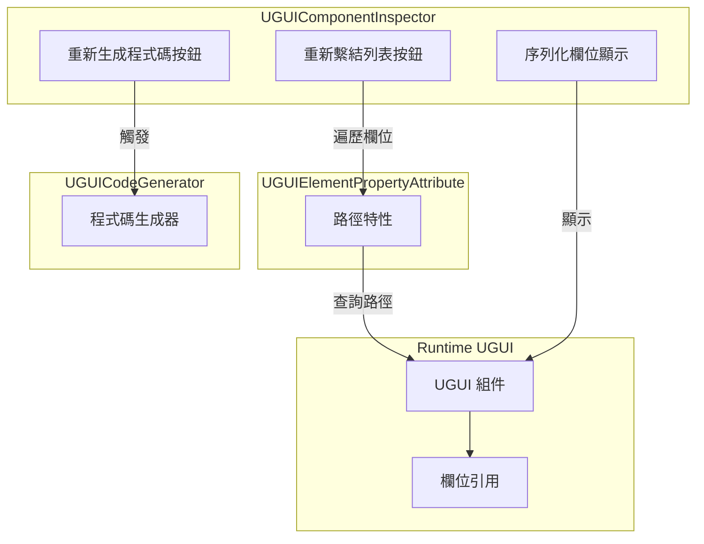
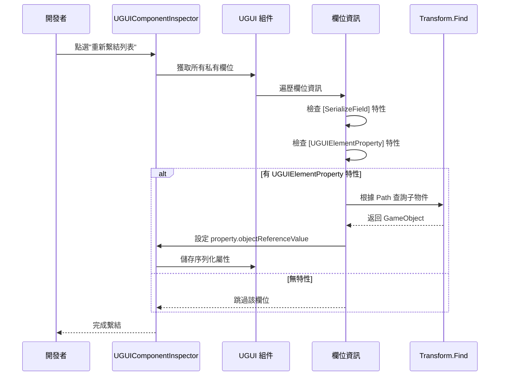

# 組件檢查器

組件檢查器是 UGUI 外掛的核心編輯器工具之一，用於在 Unity Editor 中自定義 UGUI 組件的檢視面板。該檢查器為開發者提供了便捷的程式碼生成和引用繫結功能，大大提升了 UI 開發效率。

## 概述

組件檢查器（`UGUIComponentInspector`）是專門為 `UGUI` 基類組件定製的 Unity Editor 自定義檢視面板。它繼承自 `GameFrameworkInspector` 基類，提供了兩個核心功能按鈕，用於自動化 UI 開發流程中的重複性工作。

### 設計目的

在傳統的 UGUI 開發模式中，開發者需要手動建立 UI 預製體、編寫程式碼來引用各個 UI 元素，並在 Inspector 中逐個拖拽繫結引用。這種方式不僅效率低下，而且當 UI 結構發生變化時，需要手動更新大量引用。

組件檢查器透過以下設計來解決這些問題：

1. **程式碼自動生成**：透過程式碼生成器自動遍歷 UI 預製體結構，生成帶有 `[UGUIElementProperty]` 特性的屬性程式碼
2. **引用自動繫結**：透過檢查器按鈕一鍵重新繫結所有 UI 元素引用，無需手動拖拽

### 核心功能

- **重新生成程式碼**：基於當前預製體結構重新生成 UI 程式碼檔案
- **重新繫結列表**：根據特性中的路徑資訊，自動查詢並繫結 UI 元素引用

> Source: [UGUIComponentInspector.cs](https://github.com/GameFrameX/com.gameframex.unity.ui.ugui/blob/main/Editor/UGUIComponentInspector.cs#L44-L153)

## 架構設計

組件檢查器的架構設計遵循了 Unity Editor 擴充套件的開發模式，透過自定義 Inspector 來增強 Editor 的功能。



### 組件說明

| 組件 | 檔案位置 | 職責 |
|------|----------|------|
| UGUIComponentInspector | Editor/UGUIComponentInspector.cs | 自定義檢視面板，提供按鈕互動 |
| UGUIElementPropertyAttribute | Runtime/UGUIElementPropertyAttribute.cs | 特性類，標記 UI 元素路徑 |
| UGUICodeGenerator | Editor/UGUICodeGenerator.cs | 程式碼生成器，生成 UI 程式碼 |
| UGUI | Runtime/UGUI.cs | UGUI 基類，被檢查器擴充套件 |

> Source: [UGUIElementPropertyAttribute.cs](https://github.com/GameFrameX/com.gameframex.unity.ui.ugui/blob/main/Runtime/UGUIElementPropertyAttribute.cs#L40-L64)

## 核心實現

### 檢查器類定義

檢查器使用 `[CustomEditor]` 特性來宣告自定義編輯器，繼承自 `GameFrameworkInspector` 基類：

```csharp
[CustomEditor(typeof(Runtime.UGUI), true)]
internal sealed class UGUIComponentInspector : GameFrameworkInspector
{
    private GUIStyle _customButtonStyle;

    private readonly GUIContent _reBind = new GUIContent("重新繫結列表");
    private readonly GUIContent _reGenerate = new GUIContent("重新生成程式碼");

    public override void OnInspectorGUI()
    {
        // 檢查器 GUI 實現
    }
}
```

> Source: [UGUIComponentInspector.cs](https://github.com/GameFrameX/com.gameframex.unity.ui.ugui/blob/main/Editor/UGUIComponentInspector.cs#L43-L80)

### 自定義按鈕樣式

檢查器提供了自定義的按鈕樣式，採用大號字型和彩色文字設計，方便開發者識別操作按鈕：

```csharp
private GUIStyle CustomButtonStyle
{
    get
    {
        if (_customButtonStyle == null)
        {
            _customButtonStyle = new GUIStyle(GUI.skin.button)
            {
                fontSize = 32,
                normal = { textColor = Color.green },
                hover = { textColor = Color.yellow },
                active = { textColor = Color.green },
                alignment = TextAnchor.MiddleCenter,
            };
        }
        return _customButtonStyle;
    }
}
```

> Source: [UGUIComponentInspector.cs](https://github.com/github.com/GameFrameX/com.gameframex.unity.ui.ugui/blob/main/Editor/UGUIComponentInspector.cs#L48-L75)

## 核心流程

### 重新繫結流程

當開發者點選"重新繫結列表"按鈕時，檢查器會執行以下流程：



### 重新繫結實現程式碼

```csharp
bool buttonClicked = EditorGUILayout.DropdownButton(_reBind, FocusType.Passive, CustomButtonStyle);
if (buttonClicked && !EditorApplication.isPlaying)
{
    // 重新繫結
    Dictionary<string, string> fieldMap = new Dictionary<string, string>();
    foreach (var fieldInfo in fieldInfos)
    {
        var serializeFieldAttributes = fieldInfo.GetCustomAttribute(typeof(SerializeField));
        if (serializeFieldAttributes == null)
        {
            continue;
        }

        var uguiElementPropertyAttribute = fieldInfo.GetCustomAttribute(typeof(UGUIElementPropertyAttribute));
        if (uguiElementPropertyAttribute == null)
        {
            continue;
        }

        var elementPropertyAttribute = (UGUIElementPropertyAttribute)uguiElementPropertyAttribute;
        fieldMap[fieldInfo.Name] = elementPropertyAttribute.Path;
    }

    foreach (var kv in fieldMap)
    {
        var property = serializedObject.FindProperty(kv.Key);
        if (property != null)
        {
            var targetFind = targetGameObject.transform.Find(kv.Value);
            if (targetFind != null)
            {
                property.objectReferenceValue = targetFind.gameObject;
            }
        }
    }
}
```

> Source: [UGUIComponentInspector.cs](https://github.com/GameFrameX/com.gameframex.unity.ui.ugui/blob/main/Editor/UGUIComponentInspector.cs#L96-L131)

### 欄位顯示（只讀模式）

檢查器還會顯示所有序列化欄位，但設定為只讀模式，防止在 Editor 中意外修改：

```csharp
// 編輯器下不允許修改
GUI.enabled = false;
foreach (var fieldInfo in fieldInfos)
{
    var attributes = fieldInfo.GetCustomAttributes(typeof(SerializeField));
    if (!attributes.Any())
    {
        continue;
    }

    EditorGUILayout.ObjectField(fieldInfo.Name, fieldInfo.GetValue(targetUGUI) as Object, fieldInfo.FieldType, true);
}

GUI.enabled = true;
```

> Source: [UGUIComponentInspector.cs](https://github.com/GameFrameX/com.gameframex.unity.ui.ugui/blob/main/Editor/UGUIComponentInspector.cs#L134-L147)

## UGUIElementProperty 特性

`UGUIElementPropertyAttribute` 是組件檢查器工作的核心特性，用於標記 UI 控制組件在預製體中的路徑。

### 特性定義

```csharp
/// <summary>
/// UGUI控制組件屬性特性，用於標記UI控制組件在預製體中的路徑。
/// </summary>
public sealed class UGUIElementPropertyAttribute : Attribute
{
    /// <summary>
    /// 獲取控制組件路徑。
    /// </summary>
    [UnityEngine.Scripting.Preserve]
    public string Path { get; }

    /// <summary>
    /// 初始化 <see cref="UGUIElementPropertyAttribute"/> 類的新例項。
    /// </summary>
    /// <param name="path">控制組件路徑</param>
    [UnityEngine.Scripting.Preserve]
    public UGUIElementPropertyAttribute(string path)
    {
        Path = path;
    }
}
```

> Source: [UGUIElementPropertyAttribute.cs](https://github.com/GameFrameX/com.gameframex.unity.ui.ugui/blob/main/Runtime/UGUIElementPropertyAttribute.cs#L34-L64)

### 使用示例

程式碼生成器會自動生成帶有此特性的屬性程式碼：

```csharp
[SerializeField]
[UGUIElementProperty("Panel/Button_Start")]
private Button m_Button_Start;

public Button m_Button_Start
{
    get { return m_Button_Start; }
}
```

> Source: [UGUICodeGenerator.cs](https://github.com/GameFrameX/com.gameframex.unity.ui.ugui/blob/main/Editor/UGUICodeGenerator.cs#L259-L269)

## 使用場景

### 場景一：UI 結構變更後的重新繫結

當 UI 預製體結構發生變化（如重新命名、調整層級）後，原有的引用會失效。此時只需：

1. 重新生成程式碼（或手動更新路徑）
2. 點選"重新繫結列表"按鈕
3. 檢查器會自動根據新的路徑查詢並繫結 UI 元素

### 場景二：程式碼重構後的引用更新

在程式碼重構過程中，可能會修改欄位名稱或調整預製體結構。重新繫結功能可以快速恢復所有引用，而無需手動逐個拖拽。

### 場景三：多平臺資源路徑調整

當需要調整 UI 資源的組織結構時，透過重新生成程式碼和重新繫結，可以快速適應新的資源組織方式。

## 相關連結

- [程式碼生成器](./6-editor-tools.code-generator) - 瞭解程式碼自動生成功能
- [UGUI 基類](./4-core-concepts.ugui-base) - 瞭解 UGUI 基類實現
- [圖片替換處理器](./6-editor-tools.image-replace) - 瞭解 UI 圖片替換功能
- [快速開始 - 使用程式碼生成器](./3-getting-started.code-generator) - 快速上手指南
