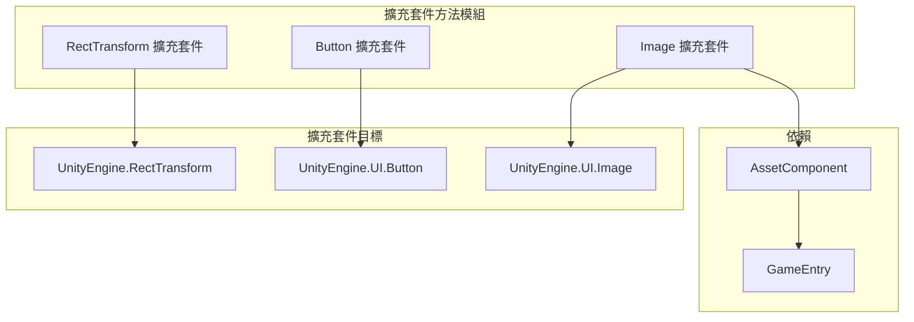

# 擴充套件方法

提供便捷的擴充套件方法，增強 UGUI 組件的功能，簡化常見 UI 操作的程式碼編寫。

## 概述

擴充套件方法是 GameFrameX UGUI 外掛提供的一組靜態擴充套件方法，透過 C# 擴充套件方法語法為 Unity 內建的 UGUI 組件新增便捷功能。這些擴充套件方法涵蓋了 UI 佈局、按鈕事件處理和圖片非同步載入等常見場景，能夠顯著減少樣板程式碼，提升開發效率。

所有擴充套件方法都位於 `GameFrameX.UI.UGUI.Runtime` 名稱空間下，使用 `[Preserve]` 屬性標記以確保在 IL2CPP 等程式碼裁剪環境中不會丟失。

## 架構

擴充套件方法按照目標組件進行分類，主要分為三類：



### 擴充套件方法分類

| 擴充套件類 | 目標組件 | 主要功能 |
|--------|----------|----------|
| `RectTransformExtension` | `RectTransform` | 快速設定全屏佈局 |
| `UGUIButtonExtension` | `Button.ButtonClickedEvent` | 簡化按鈕事件繫結 |
| `UGUIImageExtension` | `UnityEngine.UI.Image` | 非同步載入圖示資源 |

## RectTransform 擴充套件

`RectTransformExtension` 類為 `RectTransform` 組件提供佈局相關的擴充套件方法。

### MakeFullScreen

將當前 UI 物件設定為全屏顯示。

```csharp
public static void MakeFullScreen(this RectTransform rectTransform)
```

**實現原理：**

該方法透過設定 RectTransform 的四個關鍵屬性來實現全屏效果：

1. `anchorMin = Vector2.zero` - 設定錨點最小值為 (0,0)，即父容器左下角
2. `anchorMax = Vector2.one` - 設定錨點最大值為 (1,1)，即父容器右上角
3. `anchoredPosition = Vector2.zero` - 重置錨點位置為零
4. `sizeDelta = Vector2.zero` - 設定尺寸增量為零，使元素完全填滿父容器

> Source: [RectTransformExtension.cs](https://github.com/GameFrameX/com.gameframex.unity.ui.ugui/blob/main/Runtime/RectTransformExtension.cs#L56-L62)

**使用示例：**

```csharp
using GameFrameX.UI.UGUI.Runtime;

// 假設有一個 RectTransform 引用
RectTransform fullScreenPanel = someUIObject.GetComponent<RectTransform>();

// 一行程式碼設定為全屏
fullScreenPanel.MakeFullScreen();
```

## Button 擴充套件

`UGUIButtonExtension` 類為 `Button.ButtonClickedEvent` 提供事件處理相關的擴充套件方法，簡化按鈕點選事件的繫結和管理。

### 方法列表

| 方法 | 功能描述 |
|------|----------|
| `Add` | 新增按鈕點選事件監聽器 |
| `Remove` | 移除按鈕點選事件監聽器 |
| `Clear` | 清除所有按鈕點選事件監聽器 |
| `Set` | 設定按鈕點選事件（替換現有事件） |
| `Set(action, userData)` | 設定帶使用者資料的點選事件 |

### Add

新增按鈕點選事件監聽器。

```csharp
public static void Add(this Button.ButtonClickedEvent self, UnityAction action)
```

**引數：**
- `self`: 按鈕的點選事件集合
- `action`: 點選時要執行的回呼

> Source: [UGUIButtonExtension.cs](https://github.com/GameFrameX/com.gameframex.unity.ui.ugui/blob/main/Runtime/UGUIButtonExtension.cs#L52-L57)

### Remove

移除指定的按鈕點選事件監聽器。

```csharp
public static void Remove(this Button.ButtonClickedEvent self, UnityAction action)
```

> Source: [UGUIButtonExtension.cs](https://github.com/GameFrameX/com.gameframex.unity.ui.ugui/blob/main/Runtime/UGUIButtonExtension.cs#L67-L72)

### Clear

清除所有按鈕點選事件監聽器。

```csharp
public static void Clear(this Button.ButtonClickedEvent self)
```

> Source: [UGUIButtonExtension.cs](https://github.com/GameFrameX/com.gameframex.unity.ui.ugui/blob/main/Runtime/UGUIButtonExtension.cs#L81-L85)

### Set

設定按鈕點選事件，將原有事件全部替換為新事件。

```csharp
public static void Set(this Button.ButtonClickedEvent self, UnityAction action)
```

> Source: [UGUIButtonExtension.cs](https://github.com/GameFrameX/com.gameframex.unity.ui.ugui/blob/main/Runtime/UGUIButtonExtension.cs#L95-L101)

### Set (帶使用者資料)

設定帶使用者資料的按鈕點選事件。

```csharp
public static void Set(this Button.ButtonClickedEvent self, UnityAction<object> action, object userData)
```

**引數：**
- `self`: 按鈕的點選事件集合
- `action`: 帶使用者資料引數的回呼函式
- `userData`: 傳遞給回呼的使用者自定義資料

> Source: [UGUIButtonExtension.cs](https://github.com/GameFrameX/com.gameframex.unity.ui.ugui/blob/main/Runtime/UGUIButtonExtension.cs#L112-L124)

**使用示例：**

```csharp
using GameFrameX.UI.UGUI.Runtime;
using UnityEngine.UI;
using UnityEngine;

// 獲取按鈕組件
Button button = GetComponent<Button>();

// 新增點選事件
button.onClick.Add(() => {
    Debug.Log("按鈕被點選");
});

// 使用帶引數的事件
button.onClick.Set((userData) => {
    Debug.Log($"按鈕被點選，使用者資料: {userData}");
}, "自定義資料");

// 清除所有事件
button.onClick.Clear();
```

## Image 擴充套件

`UGUIImageExtension` 類為 `UnityEngine.UI.Image` 提供非同步載入圖示的功能。

### SetIconAsync

非同步設定圖片圖示。

```csharp
public static async Task SetIconAsync(this UnityEngine.UI.Image self, string icon)
```

**引數：**
- `self`: 目標圖片組件
- `icon`: 圖示資源路徑（相對於資源目錄）

**返回值：**
- 返回 `Task` 非同步任務

**實現原理：**

1. 透過 `GameEntry.GetComponent<AssetComponent>()` 獲取資源組件
2. 使用 `LoadAssetAsync<Texture2D>` 非同步載入紋理資源
3. 將載入的 `Texture2D` 轉換為 `Sprite` 物件
4. 將生成的 Sprite 賦值給 Image 組件的 sprite 屬性

> Source: [UGUIImageExtension.cs](https://github.com/GameFrameX/com.gameframex.unity.ui.ugui/blob/main/Runtime/UGUIImageExtension.cs#L55-L74)

**異常處理：**

該方法內建了 try-catch 異常處理機制，載入失敗時會輸出錯誤日誌但不會丟擲異常，確保 UI 不會因資源載入失敗而崩潰。

**使用示例：**

```csharp
using GameFrameX.UI.UGUI.Runtime;
using UnityEngine.UI;

// 獲取 Image 組件
Image iconImage = GetComponent<Image>();

// 非同步載入並設定圖示
await iconImage.SetIconAsync("icons/player_avatar");

// 可以配合 UIFormHelper 使用
await iconImage.SetIconAsync(formHelper.GetIconPath("item_001"));
```

## 常見使用場景

### 場景一：建立全屏彈窗

```csharp
// 建立全屏半透明背景
GameObject bgObj = new GameObject("PopupBackground");
bgObj.transform.SetParent(canvas.transform);
RectTransform bgRT = bgObj.AddComponent<RectTransform>();
Image bgImage = bgObj.AddComponent<Image>();
bgImage.color = new Color(0, 0, 0, 0.5f);

// 設定為全屏
bgRT.MakeFullScreen();
```

### 場景二：批次設定按鈕事件

```csharp
// 批次繫結按鈕事件
Button[] buttons = GetComponentsInChildren<Button>();
foreach (var btn in buttons)
{
    btn.onClick.Set(() => OnButtonClick(btn.name));
}
```

### 場景三：非同步載入物品圖示

```csharp
// 在 UIForm 的載入流程中非同步設定圖示
public async void LoadItemIcon(Image iconImage, string itemId)
{
    await iconImage.SetIconAsync($"icons/items/{itemId}");
}
```

## 相關連結

- [UIImage 組件](./5-components.uiimage) - UIImage 組件文件
- [UGUI 基類](./4-core-concepts.ugui-base) - UGUI 基類介紹
- [UI 管理器](./4-core-concepts.ui-manager) - UI 管理器文件
- [表單輔助器](./4-core-concepts.form-helper) - 表單輔助器文件
