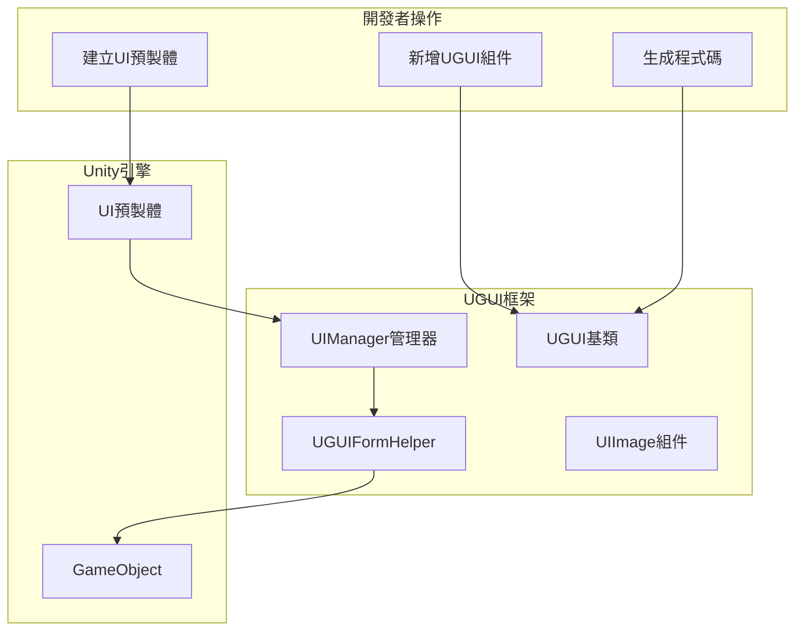
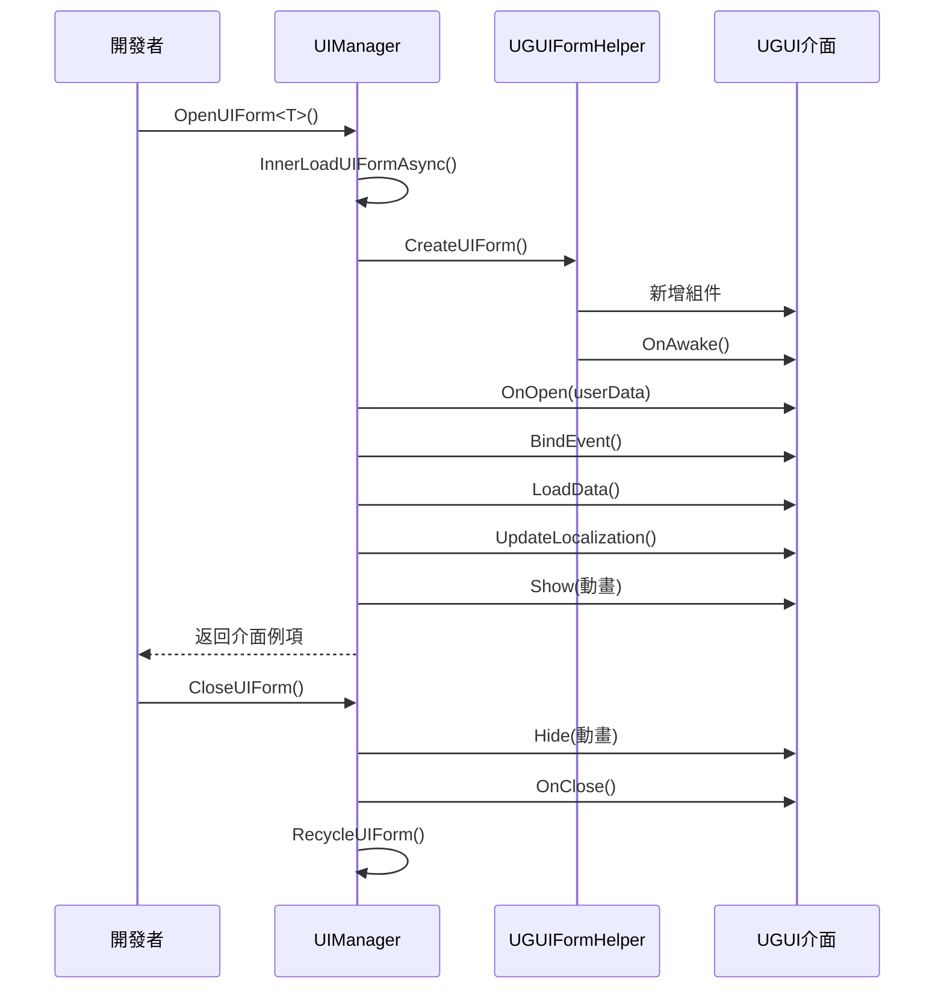

# 建立UI介面

本文件介紹如何在 GameFrameX UGUI 外掛中建立和管理 UI 介面。

## 概述

GameFrameX UGUI 外掛提供了一套完整的 UI 介面建立和管理體系。透過繼承 `UGUI` 基類，開發者可以快速建立 UI 介面，並利用程式碼生成器自動生成介面組件的引用程式碼。UI 介面由 `UIManager` 統一管理，支援非同步載入、物件池快取、顯示/隱藏動畫等功能。

> 瞭解更多核心概念： [UGUI基類](./4-core-concepts.ugui-base)、[UI管理器](./4-core-concepts.ui-manager)、[表單輔助器](./4-core-concepts.form-helper)

## 核心架構

UI 介面的建立和管理涉及以下核心組件：



## 建立流程

### 步驟一：建立UI預製體

在 Unity 專案中建立 UI 介面預製體（Prefab），通常包含以下結構：

```
Canvas (畫布)
├── UGUI (根節點，新增UGUI組件)
│   ├── Panel_xxx (背景面板)
│   │   ├── Image_xxx (圖片)
│   │   ├── Text_xxx (文字)
│   │   └── Button_xxx (按鈕)
│   └── ...
```

> Source: [Runtime/UGUI.cs](https://github.com/GameFrameX/com.gameframex.unity.ui.ugui/blob/main/Runtime/UGUI.cs#L44-L50)

### 步驟二：新增UGUI組件

在預製體的根 GameObject 上新增 `UGUI` 組件：

1. 選中預製體的根節點
2. 在 Inspector 面板中點選 "Add Component"
3. 搜尋並新增 `GameFrameX.UI.UGUI.Runtime.UGUI`

`UGUI` 組件繼承自 `UIForm`，提供了以下功能：
- 介面的顯示和隱藏（支援動畫）
- 可見性狀態管理
- 全屏模式設定

```csharp
// UGUI 基類定義
namespace GameFrameX.UI.UGUI.Runtime
{
    [Preserve]
    [DisallowMultipleComponent]
    public class UGUI : UIForm
    {
        // 顯示介面
        public override void Show(IUIFormShowHandler handler, Action complete)

        // 隱藏介面
        public override void Hide(IUIFormHideHandler handler, Action complete)

        // 設定可見性
        protected override void InternalSetVisible(bool value)

        // 獲取/設定可見性
        public override bool Visible { get; protected set; }

        // 設定全屏
        protected override void MakeFullScreen()
    }
}
```

> Source: [Runtime/UGUI.cs](https://github.com/GameFrameX/com.gameframex.unity.ui.ugui/blob/main/Runtime/UGUI.cs#L36-L179)

### 步驟三：生成UI程式碼

使用程式碼生成器自動生成 UI 組件引用程式碼：

1. 在 Unity 選單中選擇 **GameObject → UI → Generate UGUI Code**
2. 選中要生成程式碼的 UGUI 預製體
3. 程式碼生成器會自動遍歷預製體中的所有子節點，生成對應的屬性程式碼

生成的程式碼具有以下結構：

```csharp
#if ENABLE_UI_UGUI
using Cysharp.Threading.Tasks;
using GameFrameX.Entity.Runtime;
using GameFrameX.UI.Runtime;
using GameFrameX.Runtime;
using GameFrameX.UI.UGUI.Runtime;
using UnityEngine;

namespace Hotfix.UI
{
    /// <summary>
    /// 程式碼生成的UI程式碼 LoginPanel
    /// </summary>
    [DisallowMultipleComponent]
    [OptionUIConfig(null, "Assets/Prefabs/UI/Login")]
    public sealed partial class LoginPanel : UGUI
    {
        public GameObject self { get; private set; }

        #region Properties

        [SerializeField] [UGUIElementProperty("Panel_Bg/Image_Logo")]
        private UnityEngine.UI.Image m_Image_Logo;

        public UnityEngine.UI.Image m_Image_Logo => m_Image_Logo;

        [SerializeField] [UGUIElementProperty("Panel_Bg/Button_Login")]
        private UnityEngine.UI.Button m_Button_Login;

        public UnityEngine.UI.Button m_Button_Login => m_Button_Login;

        #endregion

        private bool _isInitView = false;

        protected override void InitView()
        {
            if (_isInitView)
            {
                return;
            }

            _isInitView = true;
            this.self = this.gameObject;
            m_Image_Logo = gameObject.transform.FindChildName("Panel_Bg/Image_Logo").GetComponent<UnityEngine.UI.Image>();
            m_Button_Login = gameObject.transform.FindChildName("Panel_Bg/Button_Login").GetComponent<UnityEngine.UI.Button>();
        }
    }
}
#endif
```

> Source: [Editor/UGUICodeGenerator.cs](https://github.com/GameFrameX/com.gameframex.unity.ui.ugui/blob/main/Editor/UGUICodeGenerator.cs#L84-L230)

### 步驟四：掛載生成的程式碼

生成程式碼後，需要將程式碼掛載到預製體上：

1. 將生成的 `.UI.cs` 檔案掛載到預製體的根節點
2. 在 Inspector 中點選 **"重新繫結列表"** 按鈕，將預製體中的子節點繫結到程式碼屬性上

> 詳細瞭解程式碼生成器： [使用程式碼生成器](./3-getting-started.code-generator)

## 開啟和關閉UI介面

### 開啟UI介面

透過 `UIManager` 非同步開啟 UI 介面：

```csharp
// 開啟UI介面
var uiForm = await GameEntry.UI.OpenUIForm<LoginPanel>();
```

`OpenUIForm` 方法會：
1. 檢查物件池是否有可用例項
2. 如果沒有，從 Resources 或 AssetBundle 非同步載入
3. 呼叫 `UGUIFormHelper` 建立介面
4. 觸發 `OnOpen` 回呼
5. 執行顯示動畫（如果啟用）

```csharp
// 開啟介面的核心流程
protected override async Task<IUIForm> InnerOpenUIFormAsync(
    string uiFormAssetPath, 
    Type uiFormType, 
    bool pauseCoveredUIForm, 
    object userData, 
    bool isFullScreen = false)
{
    // 1. 檢查物件池
    var uiFormInstanceObject = m_InstancePool.Spawn(assetPath);
    if (uiFormInstanceObject != null)
    {
        return InternalOpenUIForm(...);
    }

    // 2. 非同步載入資源
    var uiForm = InnerLoadUIFormAsync(...);
    return await uiForm;
}
```

> Source: [Runtime/UIManager.Open.cs](https://github.com/GameFrameX/com.gameframex.unity.ui.ugui/blob/main/Runtime/UIManager.Open.cs#L79-L115)

### 關閉UI介面

```csharp
// 關閉UI介面
GameEntry.UI.CloseUIForm(loginPanel);
```

### UIForm生命週期



## UI組件引用

程式碼生成器會自動為預製體中的每個 UI 控制組件生成引用屬性。使用 `[UGUIElementProperty]` 特性標記控制組件路徑：

```csharp
[SerializeField] 
[UGUIElementProperty("Panel_Bg/Button_Start")]
private UnityEngine.UI.Button m_Button_Start;

public UnityEngine.UI.Button m_Button_Start => m_Button_Start;
```

> 瞭解更多UI組件： [UIImage組件](./5-components.uiimage)、[擴充套件方法](./5-components.extensions)

## UI介面配置

可以透過特性配置 UI 介面的行為：

### OptionUIConfig 特性

配置介面的資源載入方式：

```csharp
[OptionUIConfig(true)]  // 從Resources載入
[OptionUIConfig(null, "Assets/Prefabs/UI/Login")]  // 從AssetBundle載入
```

### OptionUIGroupAttribute 特性

配置介面所屬的 UI 組：

```csharp
[OptionUIGroup("MainUI")]
```

### OptionUIShowAnimationAttribute 特性

配置顯示動畫：

```csharp
[OptionUIShowAnimation(true, "FadeIn")]
```

### OptionUIHideAnimationAttribute 特性

配置隱藏動畫：

```csharp
[OptionUIHideAnimation(true, "FadeOut")]
```

## 完整示例

以下是一個完整的 UI 介面建立示例：

```csharp
using GameFrameX.UI.UGUI.Runtime;
using UnityEngine;
using UnityEngine.UI;

namespace Hotfix.UI
{
    /// <summary>
    /// 登入介面
    /// </summary>
    [DisallowMultipleComponent]
    [OptionUIConfig(null, "Assets/Prefabs/UI/Login")]
    public sealed partial class LoginPanel : UGUI
    {
        public GameObject self { get; private set; }

        #region Properties

        [SerializeField] 
        [UGUIElementProperty("Background")]
        private Image m_Background;

        public Image m_Background => m_Background;

        [SerializeField] 
        [UGUIElementProperty("Button_Login")]
        private Button m_Button_Login;

        public Button m_Button_Login => m_Button_Login;

        [SerializeField] 
        [UGUIElementProperty("InputField_Username")]
        private InputField m_InputField_Username;

        public InputField m_InputField_Username => m_InputField_Username;

        #endregion

        private bool _isInitView = false;

        protected override void InitView()
        {
            if (_isInitView)
            {
                return;
            }

            _isInitView = true;
            this.self = this.gameObject;
            
            m_Background = gameObject.transform.FindChildName("Background").GetComponent<Image>();
            m_Button_Login = gameObject.transform.FindChildName("Button_Login").GetComponent<Button>();
            m_InputField_Username = gameObject.transform.FindChildName("InputField_Username").GetComponent<InputField>();

            // 繫結按鈕點選事件
            m_Button_Login.onClick.AddListener(OnLoginClick);
        }

        private void OnLoginClick()
        {
            Debug.Log("登入按鈕點選，使用者名稱：" + m_InputField_Username.text);
            // 處理登入邏輯
        }

        protected override void OnClose(bool isShutdown, bool pauseCovered)
        {
            base.OnClose(isShutdown, pauseCovered);
            // 清理資源
        }
    }
}
```

## 相關連結

- [使用程式碼生成器](./3-getting-started.code-generator) - 詳細瞭解程式碼生成器的使用
- [UGUI基類](./4-core-concepts.ugui-base) - UGUI 基類的詳細說明
- [UI管理器](./4-core-concepts.ui-manager) - UI 管理器的詳細說明
- [表單輔助器](./4-core-concepts.form-helper) - 表單輔助器的詳細說明
- [UIImage組件](./5-components.uiimage) - UIImage 組件說明
- [擴充套件方法](./5-components.extensions) - UGUI 擴充套件方法
- [程式碼生成器](./6-editor-tools.code-generator) - 編輯器程式碼生成器工具
- [組件檢查器](./6-editor-tools.inspector) - UGUI 組件檢查器
