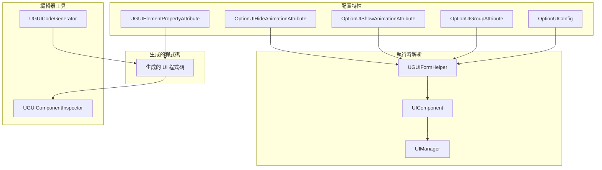
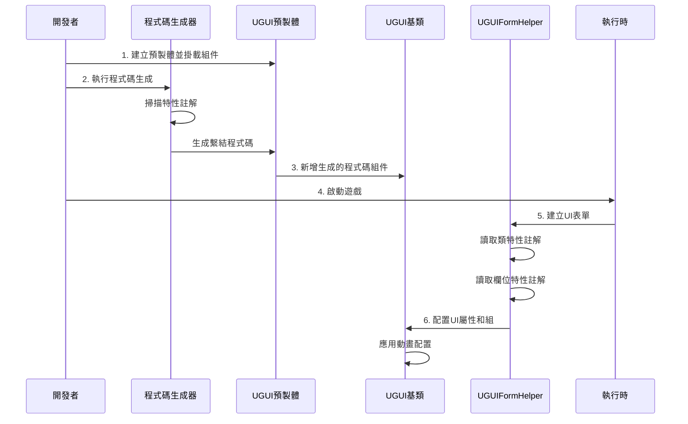

# 配置

本文件詳細介紹 GameFrameX UGUI 外掛的配置系統，包括特性配置、屬性繫結、程式碼生成器設定等。

## 概述

GameFrameX UGUI 外掛採用**特性驅動（Attribute-Driven）**的配置模式，透過 C# 特性（Attribute）在程式碼中宣告式地定義 UI 介面的各種行為和屬性。這種方式具有以下優勢：

- **宣告式配置**：透過特性標記即可配置 UI 行為，無需編寫繁瑣的初始化程式碼
- **型別安全**：配置在編譯時進行檢查，減少執行時錯誤
- **程式碼生成整合**：特性與程式碼生成器深度整合，自動生成繫結程式碼
- **執行時解析**：特性在 UI 介面建立時自動被解析和應用

配置系統主要包含以下幾個維度：

1. **UI 表單配置**：定義介面的資源路徑、所屬組、動畫等
2. **UI 元素繫結**：宣告式繫結預製體中的控制組件引用
3. **程式碼生成器配置**：自定義程式碼生成行為和輸出路徑
4. **UI 組配置**：管理介面的層級和深度關係

## 架構



### 配置流程



## UI 表單配置

### OptionUIConfig 特性

`OptionUIConfig` 特性用於配置 UI 表單的基本資訊，包括資源載入方式和資源路徑。

```csharp
[OptionUIConfig(null, "Assets/Resources/UI/Prefabs")]
public partial class MainMenuUI : UGUI
{
    // UI介面邏輯
}
```

> Source: [UGUICodeGenerator.cs#L188](https://github.com/GameFrameX/com.gameframex.unity.ui.ugui/blob/main/Editor/UGUICodeGenerator.cs#L188)

**引數說明：**

| 引數 | 型別 | 預設值 | 說明 |
|------|------|--------|------|
| isResources | bool? | null | 是否從 Resources 載入，true 表示從 Resources 載入，false 表示從 AB 包載入，null 表示使用預設配置 |
| assetPath | string | null | 資源路徑，當 isResources 為 false 時指定 AB 包的相對路徑 |

**使用場景：**

- **從 Resources 載入**：`[OptionUIConfig(true)]` - 資源必須放在 `Resources` 目錄下
- **從 AB 包載入**：`[OptionUIConfig(false, "Assets/UI/Prefabs")]` - 資源透過 AB 包管理
- **使用預設配置**：`[OptionUIConfig(null, "Assets/UI/Prefabs")]` - 使用 UIComponent 的預設設定

### OptionUIGroupAttribute 特性

`OptionUIGroupAttribute` 特性用於指定 UI 介面所屬的 UI 組（UIGroup）。

```csharp
[OptionUIGroup("MainUI")]
public partial class MainMenuUI : UGUI
{
    // UI介面邏輯
}
```

> Source: [UGUIFormHelper.cs#L117-L121](https://github.com/GameFrameX/com.gameframex.unity.ui.ugui/blob/main/Runtime/UGUIFormHelper.cs#L117-L121)

**引數說明：**

| 引數 | 型別 | 說明 |
|------|------|------|
| GroupName | string | UI 組的名稱，用於將介面分配到特定的組 |

**UI 組的作用：**

- 管理同組介面的顯示層級（Depth）
- 控制同組介面的顯示/隱藏策略
- 統一管理同組介面的資源釋放

### OptionUIShowAnimationAttribute 特性

`OptionUIShowAnimationAttribute` 特性用於配置 UI 介面開啟時的動畫效果。

```csharp
[OptionUIShowAnimation(true, "MainMenuEnter")]
public partial class MainMenuUI : UGUI
{
    // UI介面邏輯
}
```

> Source: [UGUIFormHelper.cs#L126-L131](https://github.com/GameFrameX/com.gameframex.unity.ui.ugui/blob/main/Runtime/UGUIFormHelper.cs#L126-L131)

**引數說明：**

| 引數 | 型別 | 預設值 | 說明 |
|------|------|--------|------|
| Enable | bool | false | 是否啟用顯示動畫 |
| AnimationName | string | "" | 動畫名稱，對應動畫系統中的動畫標識 |

### OptionUIHideAnimationAttribute 特性

`OptionUIHideAnimationAttribute` 特性用於配置 UI 介面關閉時的動畫效果。

```csharp
[OptionUIHideAnimation(true, "MainMenuExit")]
public partial class MainMenuUI : UGUI
{
    // UI介面邏輯
}
```

> Source: [UGUIFormHelper.cs#L137-L142](https://github.com/GameFrameX/com.gameframex.unity.ui.ugui/blob/main/Runtime/UGUIFormHelper.cs#L137-L142)

**引數說明：**

| 引數 | 型別 | 預設值 | 說明 |
|------|------|--------|------|
| Enable | bool | false | 是否啟用隱藏動畫 |
| AnimationName | string | "" | 動畫名稱，對應動畫系統中的動畫標識 |

### 組合配置示例

可以同時使用多個特性進行組合配置：

```csharp
[OptionUIConfig(false, "Assets/UI/Prefabs/MainMenu")]
[OptionUIGroup("MainUI")]
[OptionUIShowAnimation(true, "MainMenuEnter")]
[OptionUIHideAnimation(true, "MainMenuExit")]
public partial class MainMenuUI : UGUI
{
    // 介面邏輯
}
```

## UI 元素繫結

### UGUIElementPropertyAttribute 特性

`UGUIElementPropertyAttribute` 特性用於標記 UI 控制組件在預製體中的路徑，使程式碼生成器能夠自動生成屬性繫結程式碼。

```csharp
public partial class MainMenuUI : UGUI
{
    [SerializeField]
    [UGUIElementProperty("StartButton")]
    private Button m_StartButton;

    [SerializeField]
    [UGUIElementProperty("Panel/Title")]
    private Text m_Title;

    public Button m_StartButton => m_StartButton;
    public Text m_Title => m_Title;
}
```

> Source: [UGUIElementPropertyAttribute.cs#L40-L64](https://github.com/GameFrameX/com.gameframex.unity.ui.ugui/blob/main/Runtime/UGUIElementPropertyAttribute.cs#L40-L64)

**引數說明：**

| 引數 | 型別 | 說明 |
|------|------|------|
| Path | string | 控制組件在預製體中的路徑，使用 "/" 分隔層級 |

**路徑規則：**

- 相對於當前 UI 預製體的根節點
- 使用 "/" 表示子節點層級
- 例如：`"Panel/Content/Button"` 表示從根節點開始，依次進入 Panel -> Content -> Button

**工作原理：**

1. 程式碼生成器掃描帶有 `[UGUIElementProperty]` 特性的欄位
2. 根據 Path 路徑在預製體中查詢對應的 Transform
3. 自動獲取對應型別的組件並賦值

### 生成的程式碼結構

程式碼生成器會為每個 UI 控制組件生成以下程式碼結構：

```csharp
[SerializeField]
[UGUIElementProperty("StartButton")]
private Button m_StartButton;

public Button m_StartButton => m_StartButton;
```

這種模式的優勢：

- `[SerializeField]` 確保欄位可在編輯器中序列化
- `[UGUIElementProperty]` 提供路徑資訊供程式碼生成器使用
- 屬性封裝（Property）提供只讀訪問

## 程式碼生成器配置

### 程式碼生成路徑

程式碼生成器根據預製體的位置自動選擇生成路徑：

```csharp
if (assetPath.Contains(nameof(Resources)))
{
    // Resources 目錄下的預製體
    savePath = System.IO.Path.Combine(Application.dataPath, "Scripts", "Game", "UGUI", className);
}
else
{
    // 其他位置的預製體（熱更程式碼）
    savePath = System.IO.Path.Combine(Application.dataPath, "Hotfix", "UI", "UGUI", className);
}
```

> Source: [UGUICodeGenerator.cs#L120-L127](https://github.com/GameFrameX/com.gameframex.unity.ui.ugui/blob/main/Editor/UGUICodeGenerator.cs#L120-L127)

**生成路徑規則：**

| 預製體位置 | 生成路徑 |
|------------|----------|
| `Resources/` 目錄 | `Assets/Scripts/Game/UGUI/<預製體名>/` |
| 其他目錄 | `Assets/Hotfix/UI/UGUI/<預製體名>/` |

### 自定義型別轉換處理器

程式碼生成器支援透過實現 `IUGUIGeneratorCodeConvertTypeHandler` 介面來擴充套件支援的 UI 控制組件型別。

```csharp
public interface IUGUIGeneratorCodeConvertTypeHandler
{
    /// <summary>
    /// 處理器優先順序，數值越小優先順序越高
    /// </summary>
    int Priority { get; }

    /// <summary>
    /// 執行型別轉換
    /// </summary>
    /// <param name="transform">目標 Transform</param>
    /// <returns>轉換後的型別名稱，返回 null 表示不處理</returns>
    string Run(Transform transform);
}
```

> Source: [UGUICodeGenerator.cs#L78-L115](https://github.com/GameFrameX/com.gameframex.unity.ui.ugui/blob/main/Editor/UGUICodeGenerator.cs#L78-L115)

程式碼生成器會自動掃描所有實現了該介面的型別，並按優先順序順序執行。

### 內建型別支援

程式碼生成器內建支援以下 UI 控制組件型別：

| 組件型別 | 優先順序 | 說明 |
|----------|--------|------|
| Button | 內建 | 按鈕組件 |
| Text | 內建 | 文字組件 |
| Toggle | 內建 | 開關組件 |
| ToggleGroup | 內建 | 開關組組件 |
| InputField | 內建 | 輸入框組件 |
| ScrollRect | 內建 | 滾動檢視組件 |
| Dropdown | 內建 | 下拉框組件 |
| Scrollbar | 內建 | 捲軸組件 |
| Slider | 內建 | 滑動條組件 |
| RawImage | 內建 | 原始圖片組件 |
| UIImage | 內建 | 擴充套件圖片組件 |
| Image | 內建 | 圖片組件 |
| RectTransform | 內建 | 矩形變換組件 |
| TextMeshProUGUI | 條件編譯 | TMP 文字組件 |
| TMP_InputField | 條件編譯 | TMP 輸入框組件 |
| TMP_Dropdown | 條件編譯 | TMP 下拉框組件 |

## UI 組配置

### UGUIUIGroupHelper

`UGUIUIGroupHelper` 是 UGUI 的 UI 組輔助器，負責管理 UI 組的深度和層級關係。

```csharp
public sealed class UGUIUIGroupHelper : UIGroupHelperBase
{
    /// <summary>
    /// 設定介面組深度
    /// </summary>
    public override void SetDepth(int depth)
    {
        Depth = depth;
        // 使用 Z 軸位置區分不同深度的 UI 組
        transform.localPosition = new Vector3(0, 0, depth * 1000);
    }
}
```

> Source: [UGUIUIGroupHelper.cs#L44-L68](https://github.com/GameFrameX/com.gameframex.unity.ui.ugui/blob/main/Runtime/UGUIUIGroupHelper.cs#L44-L68)

**UI 組深度機制：**

- 每個 UI 組有唯一的深度值（Depth）
- 深度值決定 UI 在 Z 軸上的位置：`z = depth * 1000`
- 深度值越大，UI 越靠前顯示
- 引擎渲染時後繪製的 UI 會覆蓋先繪製的 UI

### 建立 UI 組

UI 組透過 `Handler` 方法建立：

```csharp
public override IUIGroupHelper Handler(
    Transform root,           // 根節點
    string groupName,         // 組名稱
    string uiGroupHelperTypeName,  // 輔助器型別名
    IUIGroupHelper customUIGroupHelper,  // 自定義輔助器
    int depth = 0             // 深度值
)
```

> Source: [UGUIUIGroupHelper.cs#L84-L105](https://github.com/GameFrameX/com.gameframex.unity.ui.ugui/blob/main/Runtime/UGUIUIGroupHelper.cs#L84-L105)

**建立流程：**

1. 建立空 GameObject，名稱為組名
2. 設定父節點為 root
3. 設定 Layer 為 "UI"
4. 新增 RectTransform 並設為全屏
5. 建立輔助器組件

## 編輯器配置

### UGUIComponentInspector

`UGUIComponentInspector` 是 UGUI 基類的自定義檢視面板，提供編輯器內的配置功能。

```csharp
[CustomEditor(typeof(Runtime.UGUI), true)]
internal sealed class UGUIComponentInspector : GameFrameworkInspector
{
    // 重新繫結列表按鈕
    private readonly GUIContent _reBind = new GUIContent("重新繫結列表");
    
    // 重新生成程式碼按鈕
    private readonly GUIContent _reGenerate = new GUIContent("重新生成程式碼");
}
```

> Source: [UGUIComponentInspector.cs#L43-L78](https://github.com/GameFrameX/com.gameframex.unity.ui.ugui/blob/main/Editor/UGUIComponentInspector.cs#L43-L78)

**功能說明：**

| 功能 | 說明 |
|------|------|
| 重新繫結列表 | 重新掃描預製體並繫結所有帶 `[UGUIElementProperty]` 特性的欄位 |
| 重新生成程式碼 | 重新生成 UI 程式碼檔案 |
| 檢視繫結欄位 | 顯示所有已繫結的 UI 元素（只讀） |

### 圖片替換處理器

`UIImageReplaceHandler` 提供將標準 Image 組件替換為 UIImage 組件的功能。

```csharp
[MenuItem("CONTEXT/Image/Replace To UIImage(替換為UIImage)", false, 10)]
static void Run()
{
    // 保留原 Image 的所有屬性
    var imageType = image.type;
    var material = image.material;
    var sprite = image.sprite;
    // ... 其他屬性
    
    // 銷燬原 Image 組件
    DestroyImmediate(image);
    
    // 新增 UIImage 組件並恢復屬性
    var uiImage = Selection.activeGameObject.GetOrAddComponent<UIImage>();
    // ... 恢復所有屬性
}
```

> Source: [UIImageReplaceHandler.cs#L42-L76](https://github.com/GameFrameX/com.gameframex.unity.ui.ugui/blob/main/Editor/UIImageReplaceHandler.cs#L42-L76)

## 執行時配置解析

### UGUIFormHelper 配置解析

`UGUIFormHelper` 在建立 UI 表單時自動解析特性配置：

```csharp
public override IUIForm CreateUIForm(object uiFormInstance, Type uiFormType, object userData)
{
    // 1. 解析 UI 組配置
    var attribute = uiFormType.GetCustomAttribute(typeof(OptionUIGroupAttribute));
    if (attribute is OptionUIGroupAttribute optionUIGroup)
    {
        uiGroup = m_UIComponent.GetUIGroup(optionUIGroup.GroupName);
    }

    // 2. 解析顯示動畫配置
    var showAnimationAttribute = uiFormType.GetCustomAttribute(typeof(OptionUIShowAnimationAttribute));
    if (showAnimationAttribute is OptionUIShowAnimationAttribute optionShowAnimation)
    {
        uiForm.EnableShowAnimation = optionShowAnimation.Enable;
        uiForm.ShowAnimationName = optionShowAnimation.AnimationName;
    }
    else
    {
        // 使用 UIComponent 的全域性預設設定
        uiForm.EnableShowAnimation = m_UIComponent.IsEnableUIShowAnimation;
    }

    // 3. 解析隱藏動畫配置
    var hideAnimationAttribute = uiFormType.GetCustomAttribute(typeof(OptionUIHideAnimationAttribute));
    if (hideAnimationAttribute is OptionUIHideAnimationAttribute optionHideAnimation)
    {
        uiForm.EnableHideAnimation = optionHideAnimation.Enable;
        uiForm.HideAnimationName = optionHideAnimation.AnimationName;
    }
    else
    {
        // 使用 UIComponent 的全域性預設設定
        uiForm.EnableHideAnimation = m_UIComponent.IsEnableUIHideAnimation;
    }
}
```

> Source: [UGUIFormHelper.cs#L93-L164](https://github.com/GameFrameX/com.gameframex.unity.ui.ugui/blob/main/Runtime/UGUIFormHelper.cs#L93-L164)

**解析優先順序：**

1. **類級別特性** > **UIComponent 全域性設定**
2. 如果類上沒有配置特性，則使用 UIComponent 的全域性預設值
3. 如果類上有配置特性，則使用特性指定的值

## 配置最佳實踐

### 1. 合理的 UI 組劃分

建議按功能或場景劃分 UI 組：

```csharp
// 主介面組
[OptionUIGroup("MainUI")]
public class MainMenuUI : UGUI { }

// 彈出對話方塊組
[OptionUIGroup("Dialog")]
public class ConfirmDialogUI : UGUI { }

// HUD 組（最高優先順序）
[OptionUIGroup("HUD")]
public class ScoreDisplayUI : UGUI { }
```

### 2. 動畫配置建議

- 常用的簡單介面可以使用全域性預設動畫配置
- 需要特殊動畫效果的介面使用特性單獨配置
- 確保動畫名稱與專案中的動畫系統一致

### 3. 程式碼生成後維護

- 修改預製體結構後記得重新生成程式碼
- 手動新增的繫結欄位不要刪除 `[UGUIElementProperty]` 特性
- 使用"重新繫結列表"功能快速更新繫結關係

## 相關連結

- [UI管理器](./4-core-concepts.ui-manager)
- [UGUI基類](./4-core-concepts.ugui-base)
- [表單輔助器](./4-core-concepts.form-helper)
- [程式碼生成器](./6-editor-tools.code-generator)
- [組件檢查器](./6-editor-tools.inspector)
- [快速開始 - 使用程式碼生成器](./3-getting-started.code-generator)
