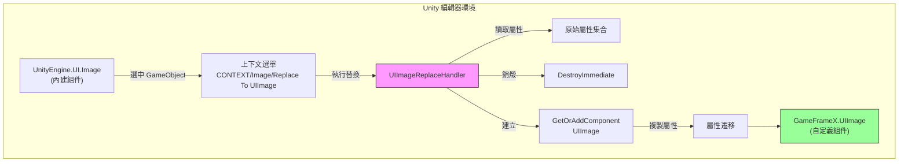
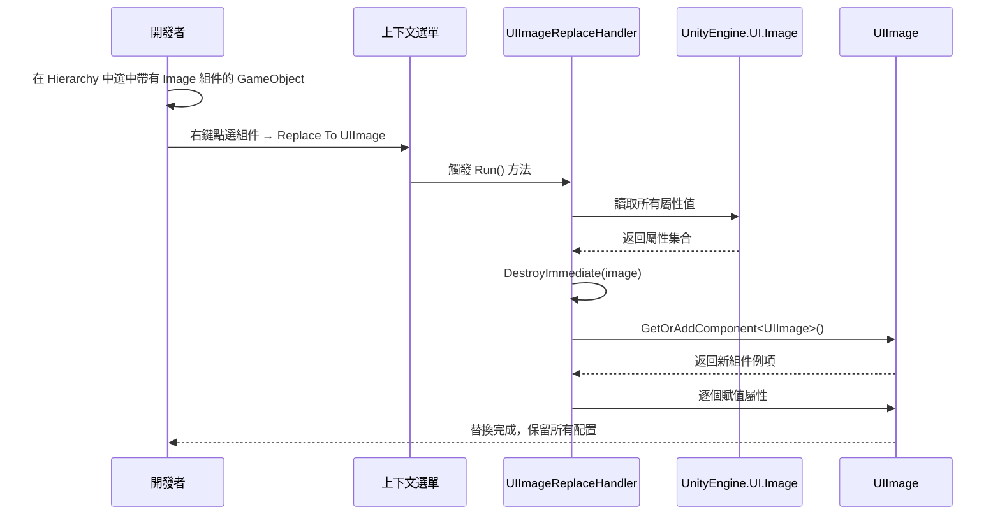

# 圖片替換處理器

圖片替換處理器是 GameFrameX UGUI 編輯器工具集中的核心組件，用於將 Unity 內建的 `Image` 組件一鍵替換為自定義的 `UIImage` 組件，同時保留所有原有屬性配置。

## 概述

在開發 Unity UGUI 專案時，我們經常需要將現有的 UI 介面遷移到 GameFrameX 框架中。手動替換每個 Image 組件為 UIImage 不僅耗時，還容易遺漏屬性配置。圖片替換處理器透過上下文選單的方式，提供了快速、安全的組件替換功能。

該工具會在替換過程中自動儲存以下屬性：
- 圖片型別（Simple、Sliced、Tiled、Filled）
- 材質（Material）
- 精靈圖（Sprite）
- 填充中心（fillCenter）
- 填充方法（fillMethod）
- 填充量（fillAmount）
- 透明度閾值（alphaHitTestMinimumThreshold）
- 使用精靈網格（useSpriteMesh）
- 覆蓋精靈（overrideSprite）
- 顏色（color）
- 射線檢測目標（raycastTarget）
- 可遮罩性（maskable）

## 工作原理

圖片替換處理器基於 Unity Editor 的擴充套件機制實現，透過 `CustomEditor` 和 `MenuItem` 屬性為內建 Image 組件新增上下文選單入口。



### 替換流程



## 使用方法

### 觸發替換

1. 在 Unity 編輯器的 Hierarchy 面板中，選中包含 `Image` 組件的 GameObject
2. 在 Inspector 面板中，右鍵點選 `Image` 組件標題
3. 在彈出的上下文選單中，選擇 **Replace To UIImage(替換為UIImage)**

```csharp
// 使用方式：在 Unity 編輯器中透過上下文選單觸發
// 選單路徑：CONTEXT/Image/Replace To UIImage(替換為UIImage)
```
> Source: [UIImageReplaceHandler.cs](https://github.com/GameFrameX/com.gameframex.unity.ui.ugui/blob/main/Editor/UIImageReplaceHandler.cs#L42-L43)

### 執行邏輯

當使用者點選選單項時，替換處理器執行以下步驟：

```csharp
[MenuItem("CONTEXT/Image/Replace To UIImage(替換為UIImage)", false, 10)]
static void Run()
{
    // 1. 獲取選中的 Image 組件
    var image = Selection.activeGameObject.GetComponent<UnityEngine.UI.Image>();
    
    // 2. 讀取所有屬性值
    var imageType = image.type;
    var material = image.material;
    var sprite = image.sprite;
    var color = image.color;
    var raycastTarget = image.raycastTarget;
    // ... 其他屬性
    
    // 3. 銷燬原 Image 組件
    DestroyImmediate(image);
    
    // 4. 新增 UIImage 組件
    var uiImage = Selection.activeGameObject.GetOrAddComponent<UIImage>();
    
    // 5. 複製所有屬性到新組件
    uiImage.type = imageType;
    uiImage.material = material;
    uiImage.sprite = sprite;
    uiImage.color = color;
    // ... 賦值所有屬性
}
```
> Source: [UIImageReplaceHandler.cs](https://github.com/GameFrameX/com.gameframex.unity.ui.ugui/blob/main/Editor/UIImageReplaceHandler.cs#L43-L76)

## 核心實現

### CustomEditor 註冊

工具透過 `CustomEditor` 特性註冊到 Unity 編輯器，使其成為 `UnityEngine.UI.Image` 的自定義檢查器：

```csharp
[CustomEditor(typeof(UnityEngine.UI.Image))]
public class UIImageReplaceHandler : UnityEditor.Editor
{
    // ...
}
```
> Source: [UIImageReplaceHandler.cs](https://github.com/GameFrameX/com.gameframex.unity.ui.ugui/blob/main/Editor/UIImageReplaceHandler.cs#L39-L40)

### MenuItem 選單項

使用 `MenuItem` 特性在 Image 組件的上下文選單中新增入口：

```csharp
[MenuItem("CONTEXT/Image/Replace To UIImage(替換為UIImage)", false, 10)]
static void Run()
```
> Source: [UIImageReplaceHandler.cs](https://github.com/GameFrameX/com.gameframex.unity.ui.ugui/blob/main/Editor/UIImageReplaceHandler.cs#L42-L43)

## UIImage 組件說明

替換後生成的 `UIImage` 組件繼承自 `UnityEngine.UI.Image`，並額外提供了圖示資源路徑設定功能：

```csharp
public class UIImage : UnityEngine.UI.Image
{
    /// <summary>
    /// 獲取或設定圖示資源路徑。
    /// 設定後自動從資源系統載入圖示。
    /// </summary>
    public string icon
    {
        get { return m_icon; }
        set
        {
            if (m_icon != value)
            {
                m_icon = value;
                _ = this.SetIconAsync(m_icon);
            }
        }
    }
}
```
> Source: [UIImage.cs](https://github.com/GameFrameX/com.gameframex.unity.ui.ugui/blob/main/Runtime/UIImage.cs#L41-L72)

## 適用場景

| 場景 | 說明 |
|------|------|
| 專案初始化遷移 | 將現有 Unity UGUI 專案遷移到 GameFrameX 框架 |
| 批次替換測試 | 先替換單個組件測試 UIImage 功能，再批次遷移 |
| 組件升級 | 為現有 Image 組件新增圖示路徑載入功能 |

## 注意事項

1. **替換不可逆**：執行替換後會立即銷燬原 Image 組件，建議在替換前備份場景
2. **依賴項保留**：確保專案中已正確配置 GameFrameX.Runtime 依賴，因為使用了 `GetOrAddComponent` 擴充套件方法
3. **多組件場景**：如果 GameObject 上有多個組件依賴 Image 組件（如其他指令碼的引用），替換前請確保這些引用已更新

## 相關連結

- [UIImage 組件](./5-components.uiimage)
- [組件檢查器](./6-editor-tools.inspector)
- [程式碼生成器](./6-editor-tools.code-generator)
- [UGUI 基類](./4-core-concepts.ugui-base)
