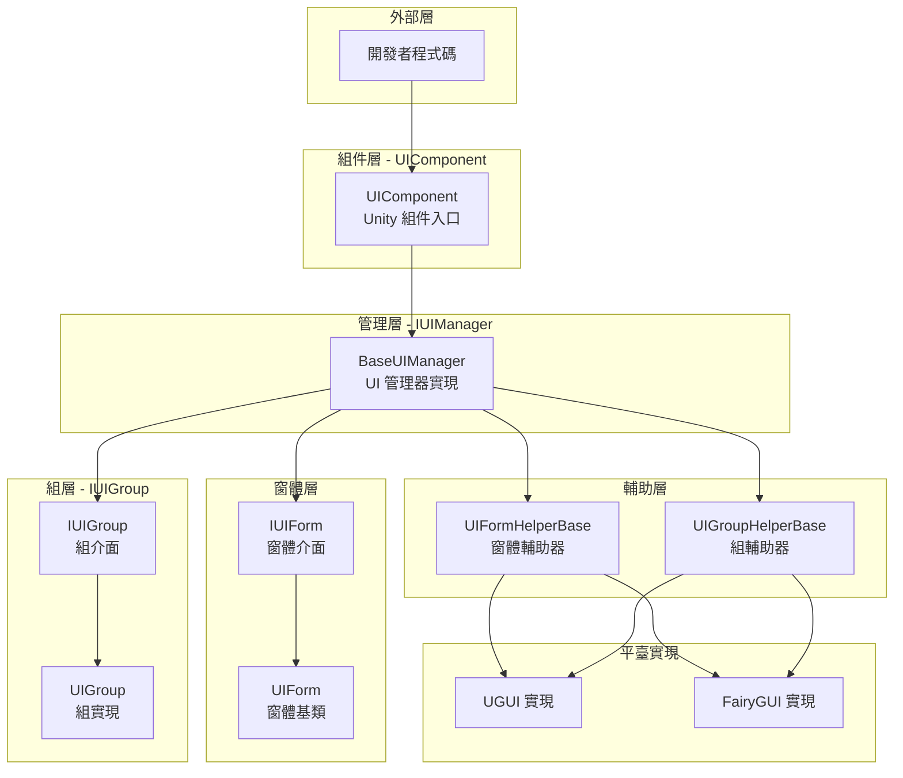
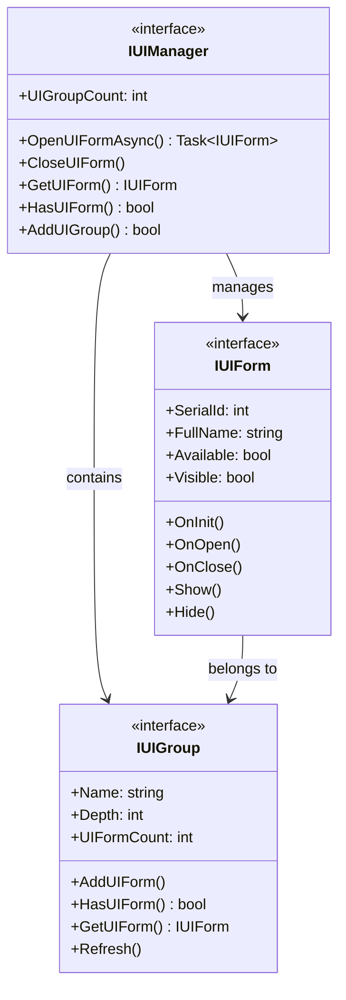
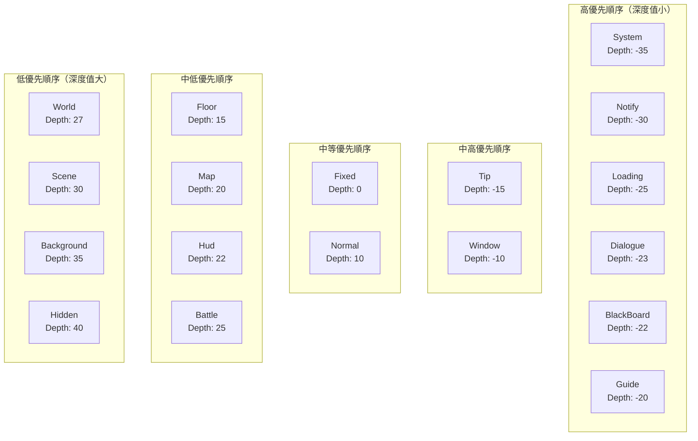
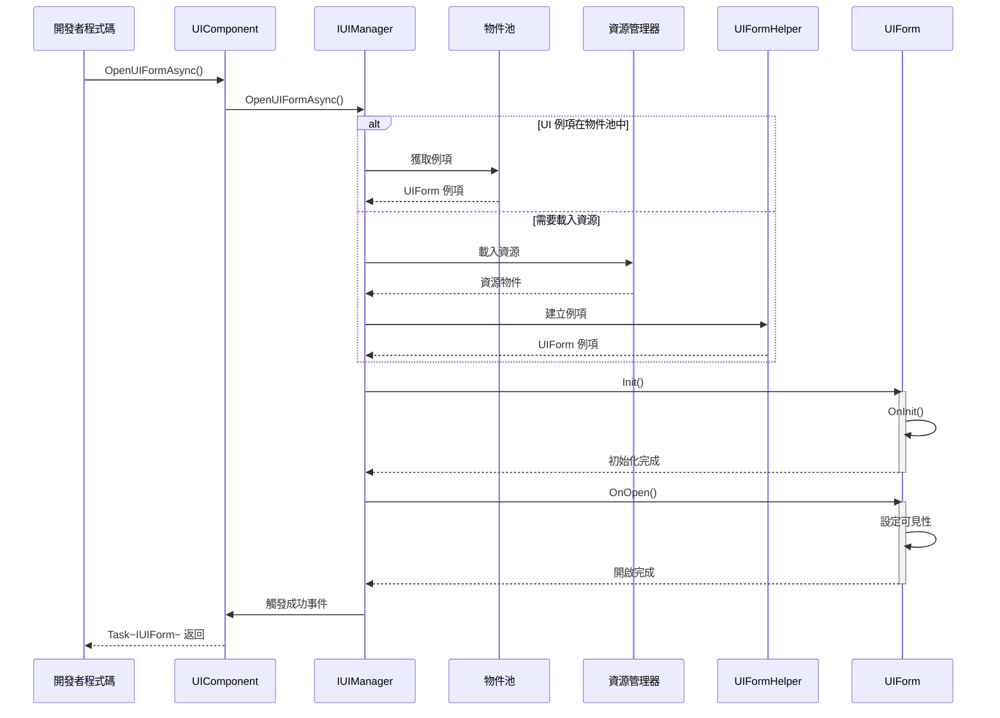
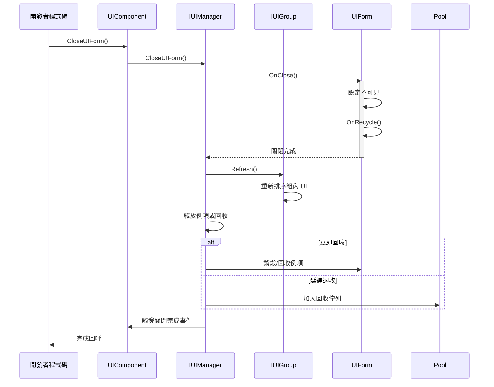

# 概述

Game Frame X UI 是 GameFrameX 框架的 UI 組件，提供了一套完整的 Unity UI 管理解決方案。該系統支援 UGUI 和 FairyGUI 兩種主流 UI 系統，提供了統一的介面設計、分層管理、物件池複用和完整的事件驅動機制。

## 概述

Game Frame X UI 是 GameFrameX 遊戲框架的核心 UI 管理系統，專為 Unity 遊戲開發設計。該系統採用了現代化的架構設計，支援 UGUI 和 FairyGUI 兩種 UI 渲染系統，開發者可以根據專案需求靈活選擇。UI 系統提供了完整的生命週期管理，從介面載入、顯示、隱藏到關閉回收，每個環節都有完善的事件回呼機制，讓開發者能夠精確控制 UI 的行為。

該系統的核心設計理念是"統一介面、靈活配置"。無論底層使用哪種 UI 系統，開發者都透過統一的 `IUIManager` 介面進行 UI 的開啟、關閉、查詢等操作。同時，系統支援高度定製化，開發者可以配置不同的 UI 組輔助器和 UI 窗體輔助器來實現特定的功能需求。這種設計既保證了程式碼的簡潔性，又提供了足夠的靈活性來應對各種複雜的遊戲 UI 場景。

Game Frame X UI 還深度整合了 GameFrameX 框架的其他核心組件，包括資源管理系統、物件池系統和事件系統。這種深度整合使得 UI 系統能夠高效地管理 UI 資源的載入和回收，同時透過事件系統實現了模組間的松耦合通訊。開發者可以透過訂閱 UI 事件來實現跨系統的邏輯聯動，而無需直接依賴具體的 UI 實現類。

## 架構設計

Game Frame X UI 採用了分層架構設計，從底層到頂層依次包括：介面層、實現層、組件層和編輯器層。每一層都有明確的職責劃分，層與層之間透過介面進行通訊，這種設計極大地提高了程式碼的可維護性和可擴充套件性。



**架構說明：**

- **組件層（UIComponent）**：作為 Unity 遊戲物件的組件，是整個 UI 系統的入口點，負責初始化和管理 IUIManager 實現
- **管理層（IUIManager）**：核心介面，定義了 UI 窗體和 UI 組的所有操作，包括開啟、關閉、查詢等方法
- **窗體層（IUIForm/UIForm）**：UI 窗體的介面定義和基類實現，提供了完整的生命週期方法
- **組層（IUIGroup）**：UI 組介面，用於管理同一層級的 UI 窗體，控制顯示深度和優先順序
- **輔助層（Helper）**：平臺特定的實現輔助類，分別處理 UGUI 和 FairyGUI 的底層差異
- **平臺實現層**：具體的 UGUI 或 FairyGUI 實現，封裝了各自平臺的 API 呼叫

### 核心介面關係

UI 系統的核心介面包括 IUIManager、IUIForm 和 IUIGroup，它們共同構成了 UI 管理的基礎。IUIManager 負責整體的 UI 管理，包括建立和銷燬 UI 窗體、管理 UI 組、排程事件等。IUIForm 定義了單個 UI 窗體的行為規範，包括初始化、開啟、關閉、顯示、隱藏等生命週期方法。IUIGroup 則負責管理一組相關的 UI 窗體，控制它們的深度和顯示順序。



這種介面設計遵循了依賴倒置原則，上層模組依賴於抽象介面而不是具體實現，使得系統具有良好的可測試性和可替換性。開發者可以透過實現自定義的輔助器來替換預設的 UGUI 或 FairyGUI 實現，而無需修改上層的業務邏輯程式碼。

## 核心概念

### UI 窗體（UIForm）

UI 窗體是 UI 系統中最基本的操作單元，每個可見的 UI 介面都對應一個 UIForm 例項。UIForm 繼承自 Unity 的 MonoBehaviour，可以直接掛載到 Prefab 上使用。作為基類，它提供了完整的生命週期鉤子，開發者透過重寫這些方法來處理 UI 的具體邏輯。

```csharp
using GameFrameX.UI.Runtime;
using UnityEngine;

public class MainMenuUI : UIForm
{
    protected override void OnInit(object userData)
    {
        base.OnInit(userData);
        // 初始化 UI 元素引用
        // 繫結按鈕事件等
    }

    protected override void OnOpen(object userData)
    {
        base.OnOpen(userData);
        // UI 開啟時的邏輯
        // 播放入場動畫
        // 重新整理介面資料
    }

    protected override void OnClose(bool isShutdown, object userData)
    {
        base.OnClose(isShutdown, userData);
        // UI 關閉時的清理工作
    }
}
```
> Source: [UIForm.cs](https://github.com/GameFrameX/com.gameframex.unity.ui/blob/main/Runtime/UIForm.cs#L39-L100)

UIForm 的生命週期包括以下關鍵方法：OnAwake 在 UI 例項建立後立即呼叫，適合進行事件訂閱等初始化操作；OnInit 在 UI 首次初始化時呼叫，用於設定 UI 元素和繫結事件處理器；OnOpen 在 UI 顯示時呼叫，可以接收和處理傳入的使用者資料；OnClose 在 UI 關閉時呼叫，用於清理資源和儲存狀態；OnPause 和 OnResume 分別在 UI 被遮擋和恢復時呼叫。

### UI 組件（UIComponent）

UIComponent 是 Unity 遊戲場景中的核心組件，繼承自 GameFrameworkComponent。它是開發者與 UI 系統互動的主要入口點，提供了所有 UI 操作的靜態方法封裝。在實際使用中，開發者通常透過 `GameEntry.GetComponent<UIComponent>()` 獲取例項，然後呼叫其方法來管理 UI。

```csharp
// 獲取 UI 組件例項
var uiComponent = GameEntry.GetComponent<UIComponent>();

// 同步開啟 UI
uiComponent.OpenUIForm("MainMenuUI", "Normal");

// 非同步開啟 UI
var mainMenu = await uiComponent.OpenUIFormAsync("MainMenuUI", "Normal");

// 關閉 UI
uiComponent.CloseUIForm("MainMenuUI");

// 查詢 UI 是否存在
if (uiComponent.HasUIForm("MainMenuUI"))
{
    // UI 已開啟
}
```
> Source: [UIComponent.cs](https://github.com/GameFrameX/com.gameframex.unity.ui/blob/main/Runtime/UIComponent.cs#L48-L114)

UIComponent 封裝了 IUIManager 的所有功能，並新增了一些便捷方法。它還負責管理物件池的相關配置，包括例項容量、過期時間和自動回收間隔等。透過配置這些引數，開發者可以最佳化記憶體使用和效能表現。

### UI 組系統

UI 組是用於組織和管理 UI 窗體的容器，每個 UI 組有一個名稱和一個深度值。深度值決定了 UI 的顯示優先順序，深度值越小，UI 顯示在越上層。當開啟一個新的 UI 窗體時，需要指定它所屬的 UI 組，系統會根據組的深度值和窗體在組內的順序來確定最終的顯示層級。

```csharp
// 新增自定義 UI 組
uiComponent.AddUIGroup("CustomGroup", -5);

// 獲取 UI 組
var group = uiComponent.GetUIGroup("Window");
```
> Source: [UIComponent.cs](https://github.com/GameFrameX/com.gameframex.unity.ui/blob/main/Runtime/BaseUIManager.cs#L200-L230)

系統預定義了 18 個標準 UI 組，涵蓋了遊戲中常見的 UI 場景，從系統公告到戰鬥介面都有對應的層級。開發者可以直接使用這些預定義組，也可以根據需要建立自定義組。

## UI 組層級

Game Frame X UI 預定義了 18 個 UI 組，每個組都有特定的深度值。深度值越小，顯示層級越高。這意味著深度值為 -35 的 System 組會顯示在深度值為 40 的 Hidden 組之上。



### 預定義 UI 組

| 組名 | 深度值 | 典型用途 |
|------|--------|----------|
| System | -35 | 系統公告、VIP 提示等頂級介面 |
| Notify | -30 | 通知彈窗、跑馬燈 |
| Loading | -25 | 載入介面 |
| Dialogue | -23 | 對話劇情介面 |
| BlackBoard | -22 | 黑板/任務面板 |
| Guide | -20 | 新手引導遮罩 |
| Tip | -15 | 提示彈窗、Toast |
| Window | -10 | 視窗類介面 |
| Fixed | 0 | 固定在底部的 UI |
| Normal | 10 | 普通介面 |
| Floor | 15 | 底板 UI |
| Map | 20 | 地圖介面 |
| Hud | 22 | 頭頂資訊、BUFF 顯示 |
| Battle | 25 | 戰鬥相關 UI |
| World | 27 | 世界地圖 UI |
| Scene | 30 | 場景切換介面 |
| Background | 35 | 背景 UI |
| Hidden | 40 | 隱藏 UI（不可見） |

> Source: [UIGroupConstants.cs](https://github.com/GameFrameX/com.gameframex.unity.ui/blob/main/Runtime/UIGroupConstants.cs#L38-L202)

深度值的設計遵循以下原則：負深度用於顯示在遊戲場景之上的 UI，如對話方塊、提示等；零和正深度用於遊戲內的 HUD 元素；較大的正深度用於背景和低優先順序 UI。這種設計確保了重要的 UI 始終顯示在最上層。

## 核心流程

### UI 開啟流程

開啟 UI 窗體是 UI 系統最常用的操作之一。整個流程涉及資源載入、例項建立、初始化和顯示等多個步驟。下面是完整的非同步開啟流程：



### UI 關閉流程

關閉 UI 窗體同樣涉及多個步驟，包括隱藏、回收和事件觸發。系統支援立即回收和延遲迴收兩種模式。



## 事件系統

Game Frame X UI 提供了完整的事件系統，用於通知 UI 狀態的變更。開發者可以透過訂閱這些事件來響應 UI 的各種狀態變化，實現松耦合的程式碼架構。

### 事件型別

| 事件類 | 事件 ID | 說明 |
|--------|---------|------|
| OpenUIFormSuccessEventArgs | 開啟介面成功事件 | UI 成功開啟時觸發 |
| OpenUIFormFailureEventArgs | 開啟介面失敗事件 | UI 開啟失敗時觸發 |
| CloseUIFormCompleteEventArgs | 關閉介面完成事件 | UI 關閉完成時觸發 |
| UIFormVisibleChangedEventArgs | 介面可見性變化事件 | UI 顯示狀態改變時觸發 |

> Source: [Runtime/EventArgs/](https://github.com/GameFrameX/com.gameframex.unity.ui/blob/main/Runtime/EventArgs/)

### 事件訂閱示例

```csharp
using GameFrameX.UI.Runtime;
using GameFrameX.Event.Runtime;

// 在遊戲初始化時訂閱事件
var eventComponent = GameEntry.GetComponent<EventComponent>();
eventComponent.Subscribe(OpenUIFormSuccessEventArgs.EventId, OnOpenUIFormSuccess);
eventComponent.Subscribe(OpenUIFormFailureEventArgs.EventId, OnOpenUIFormFailure);
eventComponent.Subscribe(CloseUIFormCompleteEventArgs.EventId, OnCloseUIFormComplete);

private void OnOpenUIFormSuccess(object sender, GameEventArgs e)
{
    var args = (OpenUIFormSuccessEventArgs)e;
    Debug.Log($"UI 開啟成功: {args.UIForm.UIFormAssetName}");
}

private void OnOpenUIFormFailure(object sender, GameEventArgs e)
{
    var args = (OpenUIFormFailureEventArgs)e;
    Debug.LogError($"UI 開啟失敗: {args.UIFormAssetName}, 錯誤: {args.ErrorMessage}");
}

private void OnCloseUIFormComplete(object sender, GameEventArgs e)
{
    var args = (CloseUIFormCompleteEventArgs)e;
    Debug.Log($"UI 關閉完成: {args.UIFormAssetName}");
}
```
> Source: [UIComponent.cs](https://github.com/GameFrameX/com.gameframex.unity.ui/blob/main/Runtime/UIComponent.cs#L436-L465)

## 平臺支援

Game Frame X UI 同時支援 Unity 的 UGUI 系統和 FairyGUI 外掛。這種雙軌支援透過條件編譯和輔助器模式實現，開發者可以根據專案需求選擇合適的渲染後端，而業務程式碼無需任何修改。

### UGUI 支援

UGUI 是 Unity 內建的 UI 系統，相容性好，是大多數 Unity 專案的首選。系統提供了完整的 UGUI 實現，包括 Canvas 管理、事件處理和資源載入等。

### FairyGUI 支援

FairyGUI 是功能強大的第三方 UI 編輯器，提供了視覺化的 UI 編輯體驗和高效的資源管理。對於需要複雜 UI 互動和高效迭代的專案，FairyGUI 是很好的選擇。

切換 UI 系統非常簡單，只需在 Unity 的 Scripting Define Symbols 中新增對應的編譯符號（`ENABLE_UI_UGUI` 或 `ENABLE_UI_FAIRYGUI`）即可。UIComponent 會根據編譯符號自動載入對應的輔助器實現。

## 依賴項

Game Frame X UI 依賴於 GameFrameX 框架的其他核心組件：

| 依賴項 | 最低版本 | 說明 |
|--------|----------|------|
| com.gameframex.unity | >= 1.1.1 | 核心框架 |
| com.gameframex.unity.asset | >= 1.0.6 | 資源管理 |
| com.gameframex.unity.event | >= 1.0.0 | 事件系統 |
| com.gameframex.unity.localization | >= 1.0.0 | 本地化支援 |

> Source: [package.json](https://github.com/GameFrameX/com.gameframex.unity.ui/blob/main/package.json)

## 相關連結

- [安裝指南](./2-installation)
- [快速開始](./3-getting-started)
- [UI 組件詳解](./4-core-concepts.ui-component)
- [UI 窗體詳解](./4-core-concepts.ui-form)
- [UI 組系統](./4-core-concepts.ui-group)
- [物件池管理](./4-core-concepts.object-pool)
- [API 參考 - IUIManager](./5-api-reference.iuimanager)
- [API 參考 - UIComponent](./5-api-reference.ui-component)
- [API 參考 - UIForm](./5-api-reference.ui-form)
- [API 參考 - IUIGroup](./5-api-reference.iuigroup)
- [事件系統詳解](./6-event-system)
- [UI 組層級詳解](./7-ui-group-hierarchy)
- [編輯器配置](./8-configuration.editor)
- [UI 屬性配置](./8-configuration.attributes)
- [平臺支援](./9-platforms)
- [常見問題](./10-troubleshooting)
- 官方文件: https://gameframex.doc.alianblank.com/
- GitHub 倉庫: https://github.com/GameFrameX/com.gameframex.unity.ui
