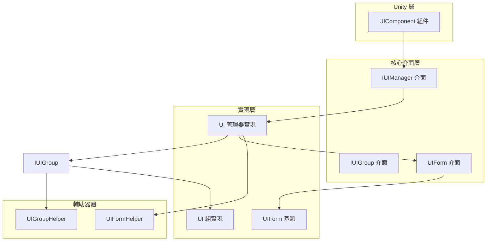
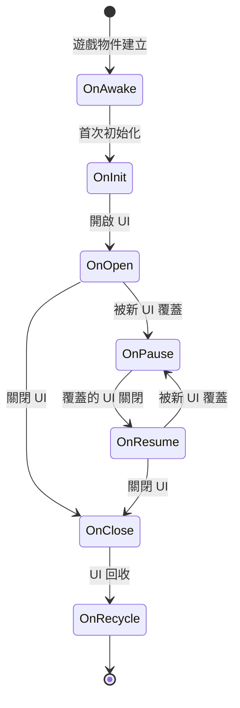
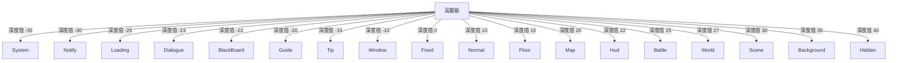

# 快速開始

本指南將幫助您快速上手 GameFrameX Unity UI 系統。透過本指南，您將瞭解如何配置 UI 組件、建立 UI 窗體以及進行基本的 UI 操作。

## 概述

GameFrameX Unity UI 是一套完整的 UI 管理解決方案，支援 UGUI 和 FairyGUI 兩種 UI 系統。該系統提供了統一的 UI 管理介面、分層 UI 系統、物件池管理、事件驅動機制以及非同步載入功能。

**前置條件：**
- Unity 2019.4 或更高版本
- 已安裝 GameFrameX 核心框架

## 系統架構

GameFrameX UI 系統採用組件化架構設計，主要由以下幾個核心部分組成：



**架構說明：**
- **UIComponent**：Unity 組件，提供了面向開發者的 API 入口
- **IUIManager**：UI 管理器介面，定義了 UI 窗體的核心操作
- **IUIGroup**：UI 組介面，管理 UI 的層級關係
- **UIForm**：UI 窗體基類，所有自定義 UI 窗體都應繼承此類

## 配置 UI 組件

### 步驟 1：新增 UIComponent 組件

在 Unity 場景中建立一個空 GameObject，並新增 `UIComponent` 組件：

1. 在 Hierarchy 面板中右鍵選擇 **Create Empty**
2. 將 GameObject 命名為 "UI"
3. 在 Inspector 面板中點選 **Add Component**
4. 搜尋並新增 **GameFrameX/UI** 組件

> Source: [UIComponent.cs](https://github.com/GameFrameX/com.gameframex.unity.ui/blob/main/Runtime/UIComponent.cs#L48-L50)

### 步驟 2：配置組件屬性

在 Inspector 面板中配置 UIComponent 的屬性：

| 屬性 | 型別 | 預設值 | 說明 |
|------|------|--------|------|
| Enable Open UI Form Success Event | bool | true | 是否啟用 UI 開啟成功事件 |
| Enable Open UI Form Failure Event | bool | true | 是否啟用 UI 開啟失敗事件 |
| Enable Auto Release UI Form | bool | true | 是否自動回收 UI |
| Enable Close UI Form Complete Event | bool | true | 是否在關閉 UI 時觸發完成事件 |
| Is Enable UI Show Animation | bool | false | 是否啟用 UI 顯示動畫 |
| Is Enable UI Hide Animation | bool | false | 是否啟用 UI 隱藏動畫 |
| Instance Auto Release Interval | float | 60f | UI 例項自動釋放間隔（秒） |
| Instance Capacity | int | 16 | UI 例項物件池容量 |
| Instance Expire Time | float | 60f | UI 例項過期時間（秒） |
| Recycle Interval | int | 60 | UI 回收間隔（秒） |

### 步驟 3：設定 UI 根節點

根據您使用的 UI 系統配置相應的根節點：

- **UGUI Root**：如果使用 UGUI，設定 UGUI Canvas 所在的 Transform
- **FairyGUI Root**：如果使用 FairyGUI，設定 FairyGUI 根容器所在的 Transform

> Source: [UIComponent.cs](https://github.com/GameFrameX/com.gameframex.unity.ui/blob/main/Runtime/UIComponent.cs#L145-L161)

## 建立 UI 窗體

### 繼承 UIForm 建立自定義 UI

所有自定義 UI 窗體都需要繼承 `UIForm` 基類。以下是一個完整的主選單 UI 示例：

```csharp
using GameFrameX.UI.Runtime;
using UnityEngine;
using UnityEngine.UI;

public class MainMenuUI : UIForm
{
    [SerializeField] private Button startButton;
    [SerializeField] private Button settingsButton;
    [SerializeField] private Button exitButton;

    protected override void OnInit(object userData)
    {
        base.OnInit(userData);
        
        // 繫結按鈕事件
        startButton.onClick.AddListener(OnStartButtonClick);
        settingsButton.onClick.AddListener(OnSettingsButtonClick);
        exitButton.onClick.AddListener(OnExitButtonClick);
    }

    protected override void OnOpen(object userData)
    {
        base.OnOpen(userData);
        
        // UI 開啟時的邏輯
        Debug.Log("主選單已開啟");
    }

    protected override void OnClose(bool isShutdown, object userData)
    {
        base.OnClose(isShutdown, userData);
        
        // 清理資源
    }

    private void OnStartButtonClick()
    {
        // 關閉當前 UI 並開啟遊戲 UI
        UIComponent.CloseUIForm(this);
        GameEntry.GetComponent<UIComponent>().OpenUIFormAsync<GameUI>("UI/Game");
    }

    private void OnSettingsButtonClick()
    {
        // 開啟設定 UI
        GameEntry.GetComponent<UIComponent>().OpenUIFormAsync<SettingsUI>("UI/Settings");
    }

    private void OnExitButtonClick()
    {
        // 退出遊戲
        Application.Quit();
    }
}
```

> Source: [UIForm.cs](https://github.com/GameFrameX/com.gameframex.unity.ui/blob/main/Runtime/UIForm.cs#L47-L100)

### UIForm 生命週期方法

`UIForm` 提供了完整的生命週期鉤子：



| 生命週期方法 | 呼叫時機 | 用途 |
|-------------|---------|------|
| OnAwake | Unity Awake 時 | 初始化事件訂閱器 |
| OnInit | UI 首次初始化時 | 繫結 UI 元素、初始化資料 |
| OnOpen | UI 每次開啟時 | 重新整理 UI 資料、播放動畫 |
| OnClose | UI 關閉時 | 清理臨時資料、儲存狀態 |
| OnRecycle | UI 回收時 | 重置 UI 狀態 |
| OnPause | UI 被覆蓋時 | 暫停 UI 相關邏輯 |
| OnResume | UI 恢復顯示時 | 恢復 UI 邏輯 |
| OnUpdate | 每幀更新 | 輪詢邏輯處理 |

> Source: [UIForm.cs](https://github.com/GameFrameX/com.gameframex.unity.ui/blob/main/Runtime/UIForm.cs#L530-L610)

## 基本操作

### 獲取 UIComponent 例項

```csharp
// 透過 GameEntry 獲取 UIComponent
var uiComponent = GameEntry.GetComponent<UIComponent>();
```

> Source: [UIComponent.cs](https://github.com/GameFrameX/com.gameframex.unity.ui/blob/main/Runtime/UIComponent.cs#L48-L50)

### 開啟 UI 窗體

**非同步方式（推薦）：**

```csharp
var uiComponent = GameEntry.GetComponent<UIComponent>();

// 方式1：使用泛型方法自動解析路徑
var mainMenu = await uiComponent.OpenUIFormAsync<MainMenuUI>();

// 方式2：指定資源路徑
var mainMenu = await uiComponent.OpenUIFormAsync<MainMenuUI>("UI/MainMenu");

// 方式3：傳遞使用者資料
var userData = new { playerName = "Player1", level = 10 };
var mainMenu = await uiComponent.OpenUIFormAsync<MainMenuUI>("UI/MainMenu", userData);

// 方式4：指定是否暫停被覆蓋的 UI
var mainMenu = await uiComponent.OpenUIFormAsync<MainMenuUI>("UI/MainMenu", false); // false 表示不暫停
```

> Source: [UIComponent.Open.cs](https://github.com/GameFrameX/com.gameframex.unity.ui/blob/main/Runtime/UIComponent.Open.cs#L115-L155)

### 關閉 UI 窗體

```csharp
var uiComponent = GameEntry.GetComponent<UIComponent>();

// 方式1：關閉當前 UI（從 UIForm 內部）
UIComponent.CloseUIForm(this);

// 方式2：透過型別關閉
uiComponent.CloseUIForm<MainMenuUI>();

// 方式3：透過例項關閉
uiComponent.CloseUIForm(mainMenuUI);

// 方式4：透過序列編號關閉
uiComponent.CloseUIForm(serialId);

// 方式5：關閉所有已載入的 UI
uiComponent.CloseAllLoadedUIForms();

// 方式6：立即回收（跳過物件池）
uiComponent.CloseUIForm(mainMenuUI, true); // isNowRecycle = true
```

> Source: [IUIManager.cs](https://github.com/GameFrameX/com.gameframex.unity.ui/blob/main/Runtime/UI/IUIManager.cs#L385-L455)

### 獲取 UI 窗體

```csharp
var uiComponent = GameEntry.GetComponent<UIComponent>();

// 透過序列編號獲取
var uiForm = uiComponent.GetUIForm(serialId);

// 透過資源名稱獲取
var uiForm = uiComponent.GetUIForm("MainMenuUI");

// 檢查 UI 是否存在
if (uiComponent.HasUIForm("MainMenuUI"))
{
    // UI 已開啟
}
```

> Source: [IUIManager.cs](https://github.com/GameFrameX/com.gameframex.unity.ui/blob/main/Runtime/UI/IUIManager.cs#L252-L290)

## UI 組系統

### 什麼是 UI 組

UI 組用於管理 UI 的層級關係。框架預定義了 18 個 UI 組，每個組有特定的深度值。

### UI 組層級



**深度值說明：** 深度值越小，顯示層級越高（越靠前）。例如，System 組（-35）會顯示在所有其他 UI 之上。

> Source: [UIGroupConstants.cs](https://github.com/GameFrameX/com.gameframex.unity.ui/blob/main/Runtime/UIGroupConstants.cs#L38-L202)

### 使用 UI 組

開啟 UI 時可以指定所屬的 UI 組：

```csharp
var uiComponent = GameEntry.GetComponent<UIComponent>();

// 開啟普通 UI（使用預設 Normal 組）
await uiComponent.OpenUIFormAsync<MainMenuUI>("UI/MainMenu");

// 開啟對話方塊（使用 Dialogue 組）
await uiComponent.OpenUIFormAsync<DialogueUI>("UI/Dialogue");

// 開啟提示（使用 Tip 組）
await uiComponent.OpenUIFormAsync<TipUI>("UI/Tip");
```

### 預定義的 UI 組常量

| 組名 | 深度值 | 典型用途 |
|------|--------|---------|
| System | -35 | 系統公告、版本資訊 |
| Notify | -30 | 通知、跑馬燈 |
| Loading | -25 | 載入介面 |
| Dialogue | -23 | 對話方塊 |
| BlackBoard | -22 | 黑板介面 |
| Guide | -20 | 新手引導 |
| Tip | -15 | 提示資訊 |
| Window | -10 | 視窗介面 |
| Fixed | 0 | 固定 UI（如底部導航） |
| Normal | 10 | 普通介面 |
| Floor | 15 | 底板介面 |
| Map | 20 | 地圖介面 |
| Hud | 22 | 頭頂資訊 |
| Battle | 25 | 戰鬥 UI |
| World | 27 | 世界 UI |
| Scene | 30 | 場景 UI |
| Background | 35 | 背景 UI |
| Hidden | 40 | 隱藏 UI |

> Source: [UIGroupConstants.cs](https://github.com/GameFrameX/com.gameframex.unity.ui/blob/main/Runtime/UIGroupConstants.cs#L38-L202)

## 事件系統

### 訂閱 UI 事件

GameFrameX UI 系統提供了完整的事件通知機制：

```csharp
using GameFrameX.UI.Runtime;
using GameFrameX.Event.Runtime;

public class UIManagerExample : MonoBehaviour
{
    private void Start()
    {
        var eventComponent = GameEntry.GetComponent<EventComponent>();
        
        // 訂閱 UI 開啟成功事件
        eventComponent.Subscribe(OpenUIFormSuccessEventArgs.EventId, OnOpenUIFormSuccess);
        
        // 訂閱 UI 開啟失敗事件
        eventComponent.Subscribe(OpenUIFormFailureEventArgs.EventId, OnOpenUIFormFailure);
        
        // 訂閱 UI 關閉完成事件
        eventComponent.Subscribe(CloseUIFormCompleteEventArgs.EventId, OnCloseUIFormComplete);
    }

    private void OnOpenUIFormSuccess(object sender, GameEventArgs e)
    {
        var args = (OpenUIFormSuccessEventArgs)e;
        Debug.Log($"UI 開啟成功: {args.UIForm.UIFormAssetName}");
    }

    private void OnOpenUIFormFailure(object sender, GameEventArgs e)
    {
        var args = (OpenUIFormFailureEventArgs)e;
        Debug.LogError($"UI 開啟失敗: {args.UIFormAssetName}, 錯誤: {args.ErrorMessage}");
    }

    private void OnCloseUIFormComplete(object sender, GameEventArgs e)
    {
        var args = (CloseUIFormCompleteEventArgs)e;
        Debug.Log($"UI 關閉完成: {args.UIFormAssetName}");
    }
}
```

> Source: [IUIManager.cs](https://github.com/GameFrameX/com.gameframex.unity.ui/blob/main/Runtime/UI/IUIManager.cs#L109-L142)

### 可用事件型別

| 事件型別 | 說明 | 觸發時機 |
|---------|------|---------|
| OpenUIFormSuccessEventArgs | UI 開啟成功 | UI 成功開啟後 |
| OpenUIFormFailureEventArgs | UI 開啟失敗 | UI 開啟失敗時 |
| CloseUIFormCompleteEventArgs | UI 關閉完成 | UI 關閉完成後 |
| UIFormVisibleChangedEventArgs | UI 可見性改變 | UI 顯示/隱藏時 |

## 資料傳遞

### 開啟 UI 時傳遞資料

```csharp
// 建立資料類
public class ShopUIData
{
    public int PlayerId { get; set; }
    public List<Item> Items { get; set; }
    public string CurrencyType { get; set; }
}

// 開啟 UI 並傳遞資料
var shopData = new ShopUIData 
{ 
    PlayerId = 123, 
    Items = itemList,
    CurrencyType = "Gold"
};
await uiComponent.OpenUIFormAsync<ShopUI>("UI/Shop", shopData);
```

### 在 UI 中接收資料

```csharp
public class ShopUI : UIForm
{
    private ShopUIData _shopData;

    protected override void OnOpen(object userData)
    {
        base.OnOpen(userData);
        
        // 接收傳遞的資料
        _shopData = userData as ShopUIData;
        if (_shopData != null)
        {
            // 使用資料初始化 UI
            Debug.Log($"商店資料: 玩家 ID = {_shopData.PlayerId}");
            RefreshShopItems(_shopData.Items);
        }
    }
}
```

> Source: [IUIManager.cs](https://github.com/GameFrameX/com.gameframex.unity.ui/blob/main/Runtime/UI/IUIManager.cs#L358-L383)

## 效能最佳化

### 物件池配置

透過配置物件池引數可以最佳化記憶體使用：

```csharp
var uiComponent = GameEntry.GetComponent<UIComponent>();

// 設定物件池容量
uiComponent.InstanceCapacity = 20;

// 設定例項過期時間（秒）
uiComponent.InstanceExpireTime = 120f;

// 設定自動釋放間隔（秒）
uiComponent.InstanceAutoReleaseInterval = 60f;

// 設定回收間隔（秒）
uiComponent.RecycleInterval = 60;
```

> Source: [UIComponent.cs](https://github.com/GameFrameX/com.gameframex.unity.ui/blob/main/Runtime/UIComponent.cs#L320-L351)

### 效能最佳實踐

1. **合理使用 UI 組**：將頻繁切換的 UI 放在同一組，減少深度調整開銷
2. **啟用物件池**：保持預設的物件池配置，避免頻繁建立銷燬
3. **非同步載入**：使用非同步 API 開啟 UI，避免阻塞主執行緒
4. **關閉不需要的 UI**：及時關閉不再使用的 UI，釋放資源
5. **禁用不必要的動畫**：如不需要顯示/隱藏動畫，關閉以提升效能

## 完整示例

以下是一個完整的遊戲入口示例，展示瞭如何初始化和使用 UI 系統：

```csharp
using GameFrameX.UI.Runtime;
using GameFrameX.Event.Runtime;
using UnityEngine;

public class GameEntryExample : MonoBehaviour
{
    private UIComponent _uiComponent;
    private EventComponent _eventComponent;

    private void Start()
    {
        // 獲取組件
        _uiComponent = GetComponent<UIComponent>();
        _eventComponent = GetComponent<EventComponent>();
        
        // 配置 UI 組件
        ConfigureUIComponent();
        
        // 訂閱事件
        SubscribeEvents();
        
        // 開啟主選單
        OpenMainMenu();
    }

    private void ConfigureUIComponent()
    {
        _uiComponent.InstanceCapacity = 16;
        _uiComponent.InstanceExpireTime = 60f;
        _uiComponent.RecycleInterval = 60;
    }

    private void SubscribeEvents()
    {
        _eventComponent.Subscribe(OpenUIFormSuccessEventArgs.EventId, OnOpenUIFormSuccess);
        _eventComponent.Subscribe(OpenUIFormFailureEventArgs.EventId, OnOpenUIFormFailure);
    }

    private async void OpenMainMenu()
    {
        try
        {
            var mainMenuUI = await _uiComponent.OpenUIFormAsync<MainMenuUI>("UI/MainMenu");
            Debug.Log("主選單開啟成功");
        }
        catch (System.Exception ex)
        {
            Debug.LogError($"主選單開啟失敗: {ex.Message}");
        }
    }

    private void OnOpenUIFormSuccess(object sender, GameEventArgs e)
    {
        var args = (OpenUIFormSuccessEventArgs)e;
        Debug.Log($"UI 開啟成功: {args.UIForm.UIFormAssetName}");
    }

    private void OnOpenUIFormFailure(object sender, GameEventArgs e)
    {
        var args = (OpenUIFormFailureEventArgs)e;
        Debug.LogError($"UI 開啟失敗: {args.UIFormAssetName}, 錯誤: {args.ErrorMessage}");
    }
}
```

## 相關連結

- [概述](./1-overview) - 瞭解更多關於 UI 系統的特性和架構
- [安裝](./2-installation) - 詳細的安裝指南
- [UI 組件](./4-core-concepts.ui-component) - UIComponent 詳細文件
- [UI 窗體](./4-core-concepts.ui-form) - UIForm 詳細文件
- [UI 組系統](./4-core-concepts.ui-group) - UI 組系統詳細文件
- [API 參考](./5-api-reference.ui-component) - 完整的 API 文件
- [事件系統](./6-event-system) - 事件系統詳細說明
- [UI 組層級](./7-ui-group-hierarchy) - UI 組層級詳細說明