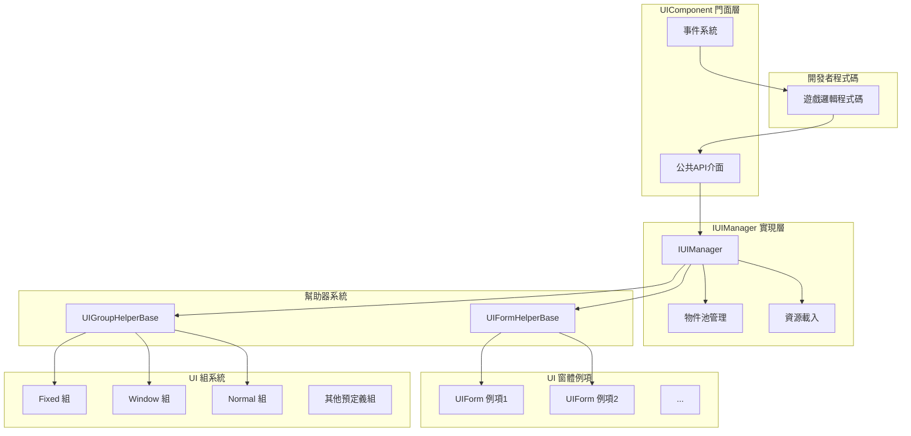
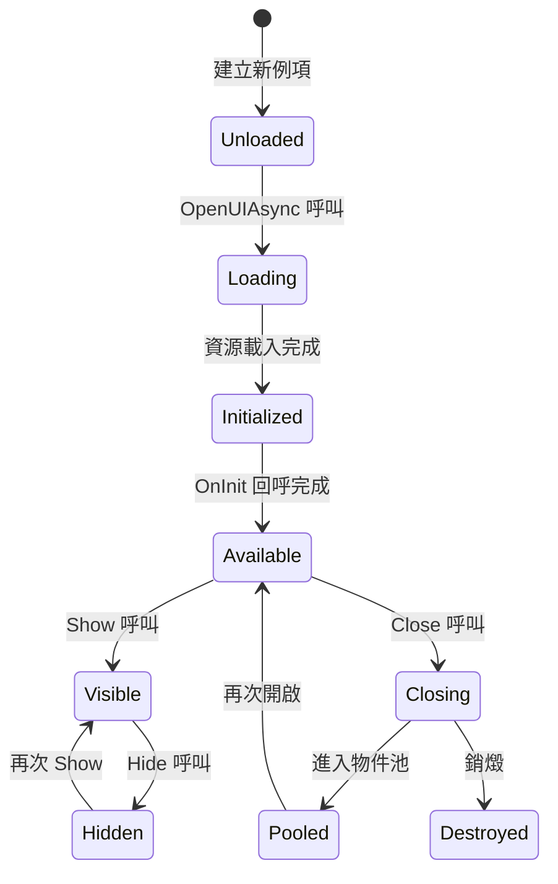
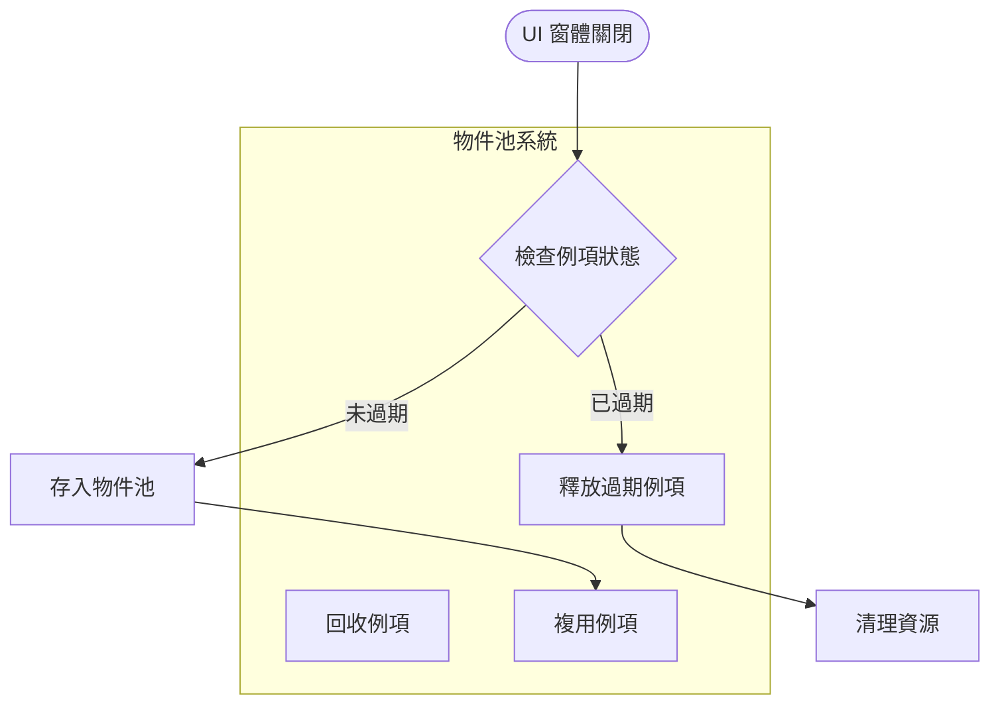
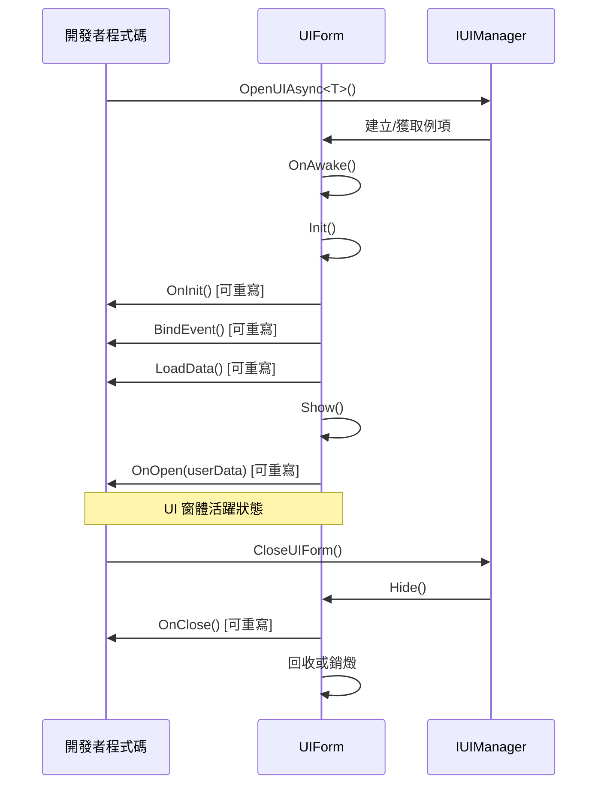

# UI 組件

UI 組件（UIComponent）是 GameFrameX 框架中負責管理和操作 UI 窗體的核心組件。它作為 UI 系統的門面（Facade），封裝了底層 `IUIManager` 的複雜實現，為開發者提供簡潔易用的 API 介面。

## 概述

UIComponent 是一個 Unity 組件（繼承自 GameFrameworkComponent），在整個遊戲生命週期中負責 UI 窗體的載入、顯示、隱藏、關閉以及回收等全部管理工作。它採用物件池模式來管理 UI 窗體例項，有效減少頻繁建立銷燬帶來的效能開銷。

UIComponent 支援多種 UI 渲染方案，包括 Unity 原生的 UGUI 以及第三方 UI 框架 FairyGUI。透過預定義的 18 個 UI 組（UIGroup），可以實現精確的層級控制和遮擋關係管理。

**核心功能：**
- 非同步載入和開啟 UI 窗體
- 多種方式關閉 UI 窗體（直接關閉、延遲關閉、組關閉）
- UI 窗體物件池管理
- UI 組層級控制
- 顯示/隱藏動畫支援
- 完整的事件系統

> UIComponent 是 UI 系統的核心入口，詳細的 API 方法說明請參閱 [UIComponent API 參考](./5-api-reference.ui-component)。

## 架構

UIComponent 採用門面模式（Facade Pattern）設計，將複雜的 UI 管理邏輯封裝在內部，僅暴露簡潔的 API 供開發者使用。



**架構說明：**

1. **門面層（UIComponent）**：提供統一的公共 API，包括開啟、關閉、獲取 UI 窗體，管理 UI 組等方法。同時負責事件的分發。

2. **實現層（IUIManager）**：處理具體的業務邏輯，包括 UI 窗體的載入、快取、顯示/隱藏狀態管理等。

3. **物件池管理**：使用 IObjectPoolManager 管理 UI 窗體例項的複用，支援自動回收和過期釋放。

4. **幫助器層**：包括 UIFormHelperBase（負責 UI 窗體例項的建立和銷燬）和 UIGroupHelperBase（負責 UI 組的建立和管理）。

5. **UI 窗體層**：實際的 UI 窗體例項，繼承自 UIForm 基類。

6. **UI 組層**：用於組織和管理具有相同層級屬性的 UI 窗體。

## 核心概念

### UI 窗體（UIForm）

UI 窗體是 UI 系統管理的最小單位。每個 UI 窗體都繼承自 `UIForm` 基類，實現了 `IUIForm` 介面。UI 窗體具有以下狀態：

- **Available（可用）**：窗體已完成初始化，可以被顯示
- **Visible（可見）**：窗體當前正在顯示
- **FromPool（來自池）**：窗體例項是否從物件池獲取



### UI 組系統

UI 組（UIGroup）用於組織具有相似顯示層級特性的 UI 窗體。每個 UI 組都有一個深度值（Depth），深度值越大，層級越高（越靠前顯示）。

**預定義的 18 個 UI 組：**

| UI 組名稱 | 深度值 | 用途說明 |
|----------|--------|----------|
| Hidden | 40 | 隱藏層，用於臨時存放 |
| Background | 35 | 背景層 |
| Scene | 30 | 場景層 |
| World | 27 | 世界層（如 3D 場景中的 UI） |
| Battle | 25 | 戰鬥層 |
| Hud | 22 | 頭頂資訊層 |
| Map | 20 | 地圖層 |
| Floor | 15 | 底層 |
| Normal | 10 | 常規層 |
| Fixed | 0 | 固定層 |
| Window | -10 | 視窗層 |
| Tip | -15 | 提示層 |
| Guide | -20 | 引導層 |
| BlackBoard | -22 | 黑板層 |
| Dialogue | -23 | 對話層 |
| Loading | -25 | 載入層 |
| Notify | -30 | 通知層 |
| System | -35 | 系統層（最高優先順序） |

> 更多關於 UI 組的詳細資訊，請參閱 [UI 組層級](./7-ui-group-hierarchy) 文件。

### 物件池管理

UIComponent 內建了強大的物件池管理系統，主要包含以下引數：

- **InstanceCapacity**：物件池容量，預設 16
- **InstanceExpireTime**：物件過期時間（秒），預設 60 秒
- **InstanceAutoReleaseInterval**：自動釋放間隔（秒），預設 60 秒
- **RecycleInterval**：回收間隔（秒），預設 60 秒
- **EnableAutoReleaseUIForm**：是否啟用自動釋放，預設開啟



## 開啟 UI 窗體

### 基本用法

使用 `OpenAsync<T>()` 方法可以非同步開啟一個 UI 窗體：

```csharp
// 開啟全屏 UI
var mainMenuForm = await UIComponent.Instance.OpenFullScreenAsync<MainMenuForm>();

// 開啟非全屏 UI
var settingsForm = await UIComponent.Instance.OpenAsync<SettingsForm>(false);

// 帶使用者資料開啟
var dialogData = new DialogData { Title = "確認", Message = "是否確認？" };
var confirmForm = await UIComponent.Instance.OpenAsync<ConfirmForm>(false, dialogData);
```

> 更多開啟 UI 的 API 方法，請參閱 [UIComponent API 參考 - Open 方法](./5-api-reference.ui-component#open-方法)。

### 使用 UI 組屬性

可以透過 `[OptionUIGroup]` 特性為 UI 窗體指定所屬的 UI 組：

```csharp
[OptionUIGroup(UIGroupNameConstants.Window)]
public class MyWindowForm : UIForm
{
    // 視窗內容
}
```

## 關閉 UI 窗體

### 關閉單個 UI

```csharp
// 透過例項關閉
var form = UIComponent.Instance.GetLoaded<SettingsForm>();
UIComponent.Instance.CloseUIForm(form);

// 透過型別關閉（關閉第一個匹配的）
UIComponent.Instance.CloseUIForm<SettingsForm>();

// 透過序列編號關閉
UIComponent.Instance.CloseUIForm(serialId);
```

### 關閉多個 UI

```csharp
// 關閉所有已載入的 UI
UIComponent.Instance.CloseAllLoadedUIForms();

// 關閉指定 UI 組的所有 UI
UIComponent.Instance.CloseUIGroup(UIGroupNameConstants.Window);

// 關閉所有正在載入的 UI
UIComponent.Instance.CloseAllLoadingUIForms();
```

## 獲取 UI 窗體

### 查詢已載入的 UI

```csharp
// 獲取單個 UI（按型別）
var form = UIComponent.Instance.GetLoaded<MainMenuForm>();

// 獲取所有符合型別的 UI
var forms = UIComponent.Instance.GetLoadedList<DialogForm>();

// 獲取已載入且正在顯示的 UI
var visibleForm = UIComponent.Instance.GetLoadedAndShowing<AlertForm>();

// 判斷指定 UI 是否正在顯示
bool isShowing = UIComponent.Instance.HasLoadedAndShowing("AlertForm");
```

### 獲取所有 UI

```csharp
// 獲取所有已載入的 UI
var allForms = UIComponent.Instance.GetAllLoadedUIForms();

// 獲取所有正在載入的 UI 的序列編號
var loadingIds = UIComponent.Instance.GetAllLoadingUIFormSerialIds();
```

## 管理 UI 組

### 新增自定義 UI 組

```csharp
// 新增新的 UI 組
bool success = UIComponent.Instance.AddUIGroup("CustomGroup", 5);
```

### 查詢 UI 組

```csharp
// 檢查 UI 組是否存在
bool exists = UIComponent.Instance.HasUIGroup("Window");

// 獲取 UI 組
var group = UIComponent.Instance.GetUIGroup("Window");

// 獲取所有 UI 組
var allGroups = UIComponent.Instance.GetAllUIGroups();

// 獲取 UI 組數量
int count = UIComponent.Instance.UIGroupCount;
```

## 配置選項

UIComponent 提供了豐富的配置選項，可以透過 Inspector 面板或程式碼進行設定：

| 配置項 | 型別 | 預設值 | 說明 |
|--------|------|--------|------|
| EnableAutoReleaseUIForm | bool | true | 是否啟用自動釋放 UI |
| EnableCloseUIFormCompleteEvent | bool | true | 是否在關閉 UI 時觸發完成事件 |
| IsEnableUIShowAnimation | bool | false | 是否啟用 UI 顯示動畫 |
| IsEnableUIHideAnimation | bool | false | 是否啟用 UI 隱藏動畫 |
| InstanceAutoReleaseInterval | float | 60f | UI 例項自動釋放間隔（秒） |
| InstanceCapacity | int | 16 | UI 例項物件池容量 |
| InstanceExpireTime | float | 60f | UI 例項過期時間（秒） |
| RecycleInterval | int | 60 | UI 回收間隔（秒） |
| UGUIRoot | Transform | null | UGUI 根節點 |
| FairyGUIRoot | Transform | null | FairyGUI 根節點 |

### 程式碼配置示例

```csharp
// 禁用自動釋放
UIComponent.Instance.EnableAutoReleaseUIForm = false;

// 設定物件池容量
UIComponent.Instance.InstanceCapacity = 32;

// 設定例項過期時間
UIComponent.Instance.InstanceExpireTime = 120f;

// 設定回收間隔
UIComponent.Instance.RecycleInterval = 30;
```

## UI 窗體生命週期

UI 窗體具有完整的生命週期，開發者可以透過重寫相應方法來響應狀態變化：



### 可重寫的方法

在自定義 UIForm 中，可以重寫以下方法來處理生命週期事件：

| 方法 | 呼叫時機 | 用途 |
|------|----------|------|
| `OnAwake()` | 例項建立後、初始化前 | 執行 Awake 邏輯 |
| `OnInit()` | UI 窗體首次初始化時 | 初始化 UI 組件 |
| `BindEvent()` | 初始化時 | 繫結事件監聽 |
| `LoadData()` | 初始化時 | 載入資料 |
| `OnOpen(object userData)` | UI 窗體開啟時 | 處理開啟邏輯 |
| `OnClose(bool isShutdown, object userData)` | UI 窗體關閉時 | 處理關閉邏輯 |
| `OnPause()` | UI 被遮擋時 | 處理暫停邏輯 |
| `OnResume()` | UI 恢復顯示時 | 處理恢復邏輯 |
| `OnUpdate(float elapseSeconds, float realElapseSeconds)` | 每幀更新 | 執行更新邏輯 |
| `UpdateLocalization()` | 語言變更時 | 更新本地化文字 |

## 事件系統

UIComponent 提供了完善的事件系統，用於監聽 UI 窗體的狀態變化：

### 可訂閱的事件

| 事件名稱 | 說明 | 事件引數 |
|----------|------|----------|
| `OpenUIFormSuccess` | UI 窗體開啟成功 | OpenUIFormSuccessEventArgs |
| `OpenUIFormFailure` | UI 窗體開啟失敗 | OpenUIFormFailureEventArgs |
| `CloseUIFormComplete` | UI 窗體關閉完成 | CloseUIFormCompleteEventArgs |

### 事件使用示例

```csharp
// 訂閱開啟成功事件
UIComponent.Instance.OpenUIFormSuccess += OnOpenSuccess;

private void OnOpenSuccess(object sender, OpenUIFormSuccessEventArgs e)
{
    Debug.Log($"UI 開啟成功: {e.UIFormAssetName}");
}

// 訂閱關閉完成事件
UIComponent.Instance.CloseUIFormComplete += OnCloseComplete;

private void OnCloseComplete(object sender, CloseUIFormCompleteEventArgs e)
{
    Debug.Log($"UI 關閉完成: {e.UIFormSerialId}");
}
```

> 事件系統的詳細說明請參閱 [事件系統](./6-event-system) 文件。

## 相關連結

- [UIComponent API 參考](./5-api-reference.ui-component) - 完整的 API 方法說明
- [UI 窗體](./4-core-concepts.ui-form) - UIForm 基類詳解
- [UI 組系統](./4-core-concepts.ui-group) - UI 組管理詳解
- [物件池管理](./4-core-concepts.object-pool) - 物件池機制詳解
- [UI 組層級](./7-ui-group-hierarchy) - UI 組層級詳細說明
- [UI 屬性](./8-configuration.attributes) - UI 相關特性說明
