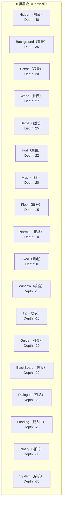

# UI 屬性

本文件介紹 GameFrameX UI 系統中用於配置 UI 窗體和組件的各種特性（Attribute）以及序列化屬性。

## 概述

GameFrameX UI 系統提供了豐富的屬性配置機制，允許開發者透過特性（Attribute）和序列化欄位來配置 UI 窗體的行為。主要包括以下幾個方面的配置：

1. **UI 配置屬性** - 定義 UI 資源的位置和載入方式
2. **UI 組屬性** - 將 UI 分配到不同的層級組
3. **動畫屬性** - 配置 UI 的顯示和隱藏動畫
4. **UIComponent 全域性屬性** - 控制 UI 系統的整體行為
5. **UIForm 窗體屬性** - 控制單個窗體的行為

## UI 配置特性 (Attributes)

### OptionUIConfigAttribute

用於標記 UI 配置的特性類，支援 FairyGUI 和 UGUI 兩種 UI 框架。透過指定包名或路徑，實現 UI 資源的自動定位和載入。

```csharp
[OptionUIConfigAttribute(packageName: "MainPackage", path: "UI/Prefabs/MainForm")]
public class MainForm : UIForm
{
    // ...
}
```

> Source: [OptionUIConfigAttribute.cs](https://github.com/GameFrameX/com.gameframex.unity.ui/blob/main/Runtime/Attribute/OptionUIConfigAttribute.cs#L42-L108)

**屬性說明：**

| 屬性 | 型別 | 說明 |
|------|------|------|
| `PackageName` | string | FairyGUI 使用的包名，用於定位 FairyGUI 的 UI 資源包 |
| `Path` | string | UGUI 使用的資源路徑，用於定位 UGUI 的 UI 預製體或資源 |
| `IsResource` | bool | 是否為資源路徑。若為 true，則 Path 為資源路徑；若為 false，則 Path 為 UI 預製體路徑 |

**建構函式：**

```csharp
// 方式1：指定包名和路徑
public OptionUIConfigAttribute(string packageName = null, string path = null)

// 方式2：指定是否為資源路徑
public OptionUIConfigAttribute(bool isResource = false)
```

---

### OptionUIGroupAttribute

用於為類指定 UI 選項分組的特性。只能應用於類，分組名稱不能為空。

```csharp
[OptionUIGroupAttribute("Dialog")]
public class DialogForm : UIForm
{
    // ...
}
```

> Source: [OptionUIGroupAttribute.cs](https://github.com/GameFrameX/com.gameframex.unity.ui/blob/main/Runtime/Attribute/OptionUIGroupAttribute.cs#L42-L73)

**屬性說明：**

| 屬性 | 型別 | 說明 |
|------|------|------|
| `GroupName` | string | 分組名稱，用於將 UI 分配到特定的 UI 組 |

---

### OptionUIShowAnimationAttribute

用於指定 UI 開啟時播放的動畫特性。可以應用於類，指定動畫名稱和是否啟用動畫。

```csharp
// 啟用名為 "FadeIn" 的顯示動畫
[OptionUIShowAnimationAttribute("FadeIn")]
public class MainForm : UIForm
{
    // ...
}

// 禁用顯示動畫
[OptionUIShowAnimationAttribute(false)]
public class TipForm : UIForm
{
    // ...
}
```

> Source: [OptionUIShowAnimationAttribute.cs](https://github.com/GameFrameX/com.gameframex.unity.ui/blob/main/Runtime/Attribute/OptionUIShowAnimationAttribute.cs#L42-L94)

**屬性說明：**

| 屬性 | 型別 | 說明 |
|------|------|------|
| `AnimationName` | string | 動畫名稱，指定要播放的動畫名稱 |
| `Enable` | bool | 是否啟用動畫，預設為 true |

**建構函式：**

```csharp
public OptionUIShowAnimationAttribute(string animationName, bool enable = true)
public OptionUIShowAnimationAttribute(bool enable = true)
```

---

### OptionUIHideAnimationAttribute

用於指定 UI 關閉時播放的動畫特性。可以應用於類，指定動畫名稱和是否啟用動畫。

```csharp
// 啟用名為 "FadeOut" 的隱藏動畫
[OptionUIHideAnimationAttribute("FadeOut")]
public class MainForm : UIForm
{
    // ...
}

// 禁用隱藏動畫
[OptionUIHideAnimationAttribute(false)]
public class TipForm : UIForm
{
    // ...
}
```

> Source: [OptionUIHideAnimationAttribute.cs](https://github.com/GameFrameX/com.gameframex.unity.ui/blob/main/Runtime/Attribute/OptionUIHideAnimationAttribute.cs#L42-L94)

**屬性說明：**

| 屬性 | 型別 | 說明 |
|------|------|------|
| `AnimationName` | string | 動畫名稱，指定要播放的動畫名稱 |
| `Enable` | bool | 是否啟用動畫，預設為 true |

---

## UIComponent 全域性屬性

UIComponent 是 UI 系統的核心組件，提供全域性的 UI 配置選項。這些屬性透過 Unity 的 SerializeField 特性在 Inspector 面板中可見可配置。

> Source: [UIComponent.cs](https://github.com/GameFrameX/com.gameframex.unity.ui/blob/main/Runtime/UIComponent.cs#L48-L226)

### 事件控制屬性

| 屬性 | 型別 | 預設值 | 說明 |
|------|------|--------|------|
| `EnableOpenUIFormSuccessEvent` | bool | true | 是否啟用開啟介面成功事件。啟用後，當介面開啟成功時會觸發相應事件 |
| `EnableOpenUIFormFailureEvent` | bool | true | 是否啟用開啟介面失敗事件。啟用後，當介面開啟失敗時會觸發相應事件 |
| `EnableCloseUIFormCompleteEvent` | bool | true | 是否啟用關閉介面完成事件。啟用後，當介面關閉完成時會觸發相應事件 |

### 物件池屬性

| 屬性 | 型別 | 預設值 | 說明 |
|------|------|--------|------|
| `EnableAutoReleaseUIForm` | bool | true | 是否啟用自動回收介面。禁用後，關閉介面時不會自動釋放資源 |
| `InstanceAutoReleaseInterval` | float | 60f | 介面例項物件池自動釋放可釋放物件的間隔秒數 |
| `InstanceCapacity` | int | 16 | 介面例項物件池的容量，池中最多可快取的介面例項數量 |
| `InstanceExpireTime` | float | 60f | 介面例項物件池物件過期秒數，介面關閉後在此時間內可被複用 |
| `RecycleInterval` | int | 60 | 介面回收間隔時間（秒） |

### 動畫屬性

| 屬性 | 型別 | 預設值 | 說明 |
|------|------|--------|------|
| `IsEnableUIShowAnimation` | bool | false | 是否啟用 UI 顯示動畫 |
| `IsEnableUIHideAnimation` | bool | false | 是否啟用 UI 隱藏動畫 |

### 根節點屬性

| 屬性 | 型別 | 說明 |
|------|------|------|
| `UGUIRoot` | Transform | UGUI 根節點 |
| `FairyGUIRoot` | Transform | FairyGUI 根節點 |

### 輔助器屬性

| 屬性 | 型別 | 說明 |
|------|------|------|
| `UIFormHelperTypeName` | string | UI 表單幫助器型別名 |
| `CustomUIFormHelper` | UIFormHelperBase | 自定義 UI 表單幫助器 |
| `UIGroupHelperTypeName` | string | UI 組幫助器型別名 |
| `CustomUIGroupHelper` | UIGroupHelperBase | 自定義 UI 組幫助器 |

### UI 組配置

| 屬性 | 型別 | 說明 |
|------|------|------|
| `UIGroups` | UIGroup[] | UI 組陣列，預設包含 18 個預定義組 |

---

## UIForm 窗體屬性

UIForm 是所有 UI 窗體的基類，包含窗體執行時的各種狀態屬性。

> Source: [UIForm.cs](https://github.com/GameFrameX/com.gameframex.unity.ui/blob/main/Runtime/UIForm.cs#L47-L856)

### 狀態屬性（執行時）

| 屬性 | 型別 | 說明 |
|------|------|------|
| `Available` | bool | 介面是否可用 |
| `Visible` | bool | 介面是否可見 |
| `SerialId` | int | 介面序列編號 |
| `Name` | string | 介面名稱 |
| `FullName` | string | 介面完整名稱（包含名稱空間） |
| `UIFormAssetName` | string | 介面資源名稱 |
| `AssetPath` | string | 介面資源路徑 |
| `IsAwake` | bool | 介面是否已喚醒 |
| `IsFromPool` | bool | 介面是否來自物件池 |
| `IsDisposed` | bool | 介面是否已被銷燬 |

### 行為控制屬性

| 屬性 | 型別 | 預設值 | 說明 |
|------|------|--------|------|
| `IsDisableRecycling` | bool | false | 是否禁用回收，禁用回收的介面不會被回收 |
| `IsDisableClosing` | bool | false | 是否禁用關閉，禁用關閉的介面不會被關閉 |
| `IsCenter` | bool | false | 是否開啟組件居中，組件生成後預設父組件居中 |
| `PauseCoveredUIForm` | bool | true | 是否暫停被覆蓋的介面 |
| `RecycleInterval` | int | - | 介面回收間隔，單位：秒 |

### 動畫屬性

| 屬性 | 型別 | 說明 |
|------|------|------|
| `EnableShowAnimation` | bool | 是否啟用顯示動畫 |
| `ShowAnimationName` | string | 顯示動畫名稱 |
| `EnableHideAnimation` | bool | 是否啟用隱藏動畫 |
| `HideAnimationName` | string | 隱藏動畫名稱 |

### 層級屬性

| 屬性 | 型別 | 說明 |
|------|------|------|
| `DepthInUIGroup` | int | 介面在介面組中的深度 |
| `UIGroup` | IUIGroup | 介面所屬的介面組 |

---

## UI 組層級常量

GameFrameX UI 系統預定義了 18 個 UI 組，每個組有對應的深度值（Depth）和名稱（Name）。



> Source: [UIGroupConstants.cs](https://github.com/GameFrameX/com.gameframex.unity.ui/blob/main/Runtime/UIGroupConstants.cs#L38-L202)

**UI 組深度說明：**
- 深度值越大，UI 越靠前顯示（遮擋關係）
- 預定義組的深度從 40 到 -35，覆蓋了遊戲中各種 UI 場景
- Depth 值越大表示越靠近螢幕外（最上層），負值表示越靠近螢幕內（最下層）

---

## 使用示例

### 完整配置示例

以下示例展示瞭如何在自定義 UI 窗體類上使用各種特性：

```csharp
using GameFrameX.UI.Runtime;

// UI 配置特性：指定 FairyGUI 包名和 UGUI 路徑
// UI 組特性：將此窗體分配到 Window 組
[OptionUIConfigAttribute(packageName: "GameUI", path = "UI/Forms/MainMenu")]
[OptionUIGroupAttribute("Window")]
// 顯示動畫特性：使用 "FadeIn" 動畫，啟用狀態
[OptionUIShowAnimationAttribute("FadeIn", true)]
// 隱藏動畫特性：使用 "FadeOut" 動畫，啟用狀態
[OptionUIHideAnimationAttribute("FadeOut", true)]
public class MainMenuForm : UIForm
{
    protected override void OnOpen(object userData)
    {
        base.OnOpen(userData);
        // 介面開啟邏輯
    }
    
    protected override void OnClose(bool isShutdown, object userData)
    {
        // 介面關閉邏輯
        base.OnClose(isShutdown, userData);
    }
}
```

### 透過程式碼動態設定屬性

除了使用特性外，也可以在執行時動態設定 UI 窗體的屬性：

```csharp
// 開啟 UI 時傳遞使用者資料，在 UIForm 的 OnOpen 中處理
GameEntry.UI.OpenUIForm<MainMenuForm>(userData: new MainMenuData 
{ 
    EnableShowAnimation = true,
    ShowAnimationName = "CustomFadeIn"
});

// 在 UIForm 中動態設定動畫
public class CustomForm : UIForm
{
    public override void OnOpen(object userData)
    {
        if (userData is MainMenuData data)
        {
            EnableShowAnimation = data.EnableShowAnimation;
            ShowAnimationName = data.ShowAnimationName;
        }
    }
}
```

---

## 相關連結

- [編輯器配置](./8-configuration.editor) - UI 系統在 Unity 編輯器中的配置方法
- [UI 組件](./4-core-concepts.ui-component) - UIComponent 組件的詳細說明
- [UI 窗體](./4-core-concepts.ui-form) - UIForm 窗體的詳細說明
- [UI 組系統](./4-core-concepts.ui-group) - UI 組系統的詳細說明
- [事件系統](./6-event-system) - UI 事件系統
