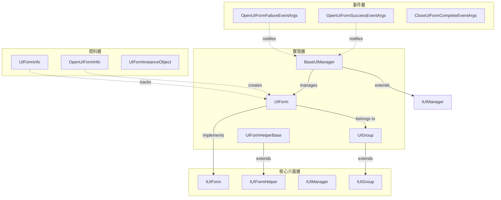
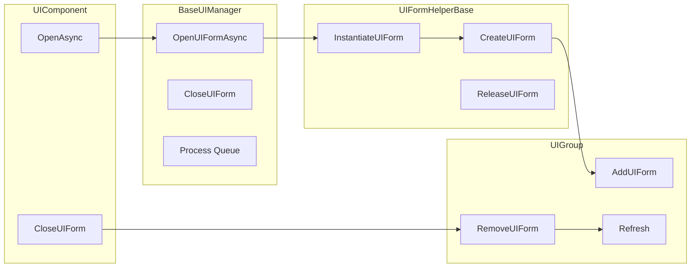
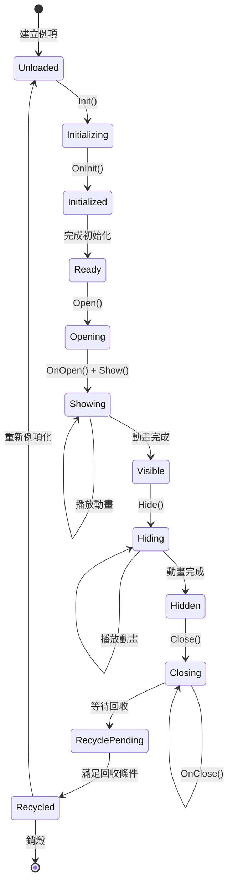
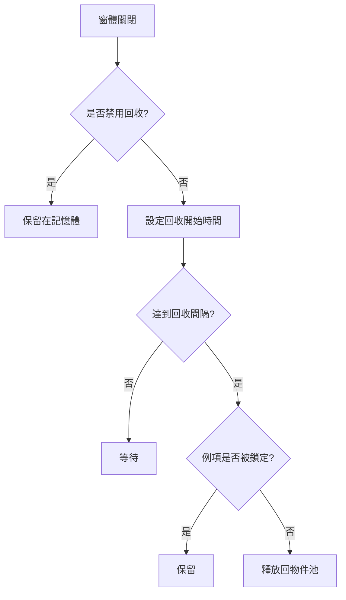

# UI 窗體

UI 窗體是 GameFrameX UI 系統的核心基本單元，代表遊戲或應用程式中的一個獨立 UI 介面（螢幕、視窗、面板）。每個 UI 窗體都是一個可管理的實體，具備完整的生命週期管理、顯示/隱藏動畫支援、物件池回收等功能。

## 概述

UI 窗體（UI Form）是 GameFrameX UI 框架中最基礎的介面管理單元。它繼承自 Unity 的 `MonoBehaviour`，同時實現 `IUIForm` 介面，提供了完整的介面生命週期管理能力。

**核心功能：**
- 非同步載入與例項化
- 顯示/隱藏動畫支援
- 物件池回收機制
- UI 組（UIGroup）管理
- 深度（Z-order）控制
- 事件訂閱機制

**設計意圖：** UI 窗體採用模板方法模式，讓開發者可以透過重寫基類方法來實現自定義邏輯，同時保持框架的可擴充套件性。物件池機制可以顯著提高 UI 介面頻繁開啟/關閉場景下的效能。

## 架構



**架構說明：**
- **核心介面層**：定義 UI 窗體的抽象契約，包括 `IUIForm`、`IUIFormHelper`、`IUIManager`、`IUIGroup`
- **實現層**：提供具體的功能實現，包括 `UIForm`、`UIFormHelperBase`、`BaseUIManager`、`UIGroup`
- **資料層**：用於儲存和管理 UI 窗體相關資料的資訊類
- **事件層**：基於事件的通知系統，用於解耦模組間的通訊

### UI 窗體與相關組件的關係



## 核心概念

### 窗體生命週期

UI 窗體具有完整的生命週期，瞭解各個階段對於正確使用框架至關重要：



**生命週期階段說明：**

| 階段 | 方法 | 說明 |
|------|------|------|
| 初始化 | `Init()` | 窗體例項化後首次呼叫，初始化基本屬性 |
| 喚醒 | `OnAwake()` | Unity Awake 回呼，初始化事件訂閱器 |
| 檢視初始化 | `InitView()` | 初始化 UI 檢視組件 |
| 開啟 | `OnOpen()` | 窗體被開啟時呼叫，可用於資料載入 |
| 顯示 | `Show()` | 顯示窗體並播放動畫 |
| 隱藏 | `Hide()` | 隱藏窗體並播放動畫 |
| 關閉 | `OnClose()` | 窗體被關閉時呼叫 |
| 回收 | `OnRecycle()` | 窗體進入回收池前呼叫 |
| 銷燬 | `Dispose()` | 窗體完全銷燬前呼叫 |

### 窗體狀態

UI 窗體具有多個狀態屬性，用於控制其行為：

| 狀態 | 屬性 | 說明 |
|------|------|------|
| 可用 | `Available` | 窗體是否已初始化並可用 |
| 可見 | `Visible` | 窗體是否正在顯示 |
| 禁用回收 | `IsDisableRecycling` | 禁用後窗體不會被回收 |
| 禁用關閉 | `IsDisableClosing` | 禁用後窗體無法被關閉 |
| 可回收 | `IsCanRecycle` | 當前是否可以回收 |

### 顯示/隱藏動畫

UI 窗體支援顯示和隱藏動畫：

```csharp
// 啟用顯示動畫
uiForm.EnableShowAnimation = true;
uiForm.ShowAnimationName = "FadeIn";

// 啟用隱藏動畫
uiForm.EnableHideAnimation = true;
uiForm.HideAnimationName = "FadeOut";
```

> Source: [UIForm.cs](https://github.com/GameFrameX/com.gameframex.unity.ui/blob/main/Runtime/UIForm.cs#L195-L240)

### 物件池回收機制

GameFrameX 實現了物件池機制來最佳化 UI 窗體的效能：



回收機制的關鍵配置：
- `RecycleInterval`: 回收間隔（秒），預設 60 秒
- `IsDisableRecycling`: 是否禁用回收
- `InstanceCapacity`: 物件池容量

> Source: [BaseUIManager.cs](https://github.com/GameFrameX/com.gameframex.unity.ui/blob/main/Runtime/BaseUIManager.cs#L64-L83)

## 使用示例

### 建立自定義 UI 窗體

繼承 `UIForm` 基類建立自定義 UI 窗體：

```csharp
using GameFrameX.UI.Runtime;
using UnityEngine;
using UnityEngine.UI;

public class MainMenuForm : UIForm
{
    [SerializeField] private Button _startButton;
    [SerializeField] private Button _settingsButton;
    [SerializeField] private Button _quitButton;

    protected override void InitView()
    {
        base.InitView();
        
        // 初始化檢視組件
        _startButton.onClick.AddListener(OnStartButtonClick);
        _settingsButton.onClick.AddListener(OnSettingsButtonClick);
        _quitButton.onClick.AddListener(OnQuitButtonClick);
    }

    public override void OnOpen(object userData)
    {
        base.OnOpen(userData);
        
        // 接收開啟時傳入的資料
        if (userData is MainMenuData data)
        {
            Debug.Log($"開啟主選單: {data.PlayerName}");
        }
    }

    public override void OnClose(bool isShutdown, object userData)
    {
        // 清理資源
        _startButton.onClick.RemoveAllListeners();
        base.OnClose(isShutdown, userData);
    }

    private void OnStartButtonClick()
    {
        Debug.Log("點選開始按鈕");
    }

    private void OnSettingsButtonClick()
    {
        Debug.Log("點選設定按鈕");
    }

    private void OnQuitButtonClick()
    {
        Debug.Log("點選退出按鈕");
        Application.Quit();
    }
}
```

> Source: [UIForm.cs](https://github.com/GameFrameX/com.gameframex.unity.ui/blob/main/Runtime/UIForm.cs#L47-L855)

### 開啟 UI 窗體

透過 UIComponent 開啟 UI 窗體：

```csharp
// 非同步開啟窗體
var mainMenu = await UIComponent.Instance.OpenAsync<MainMenuForm>();

// 傳遞使用者資料
var menuData = new MainMenuData { PlayerName = "Player1" };
var mainMenu = await UIComponent.Instance.OpenAsync<MainMenuForm>(menuData);

// 開啟全屏窗體
var fullScreenForm = await UIComponent.Instance.OpenFullScreenAsync<FullScreenForm>();

// 開啟時暫停被覆蓋的窗體
var pausedForm = await UIComponent.Instance.OpenUIFormAsync<DialogForm>(true, userData);
```

> Source: [UIComponent.Open.cs](https://github.com/GameFrameX/com.gameframex.unity.ui/blob/main/Runtime/UIComponent.Open.cs#L135-L191)

### 關閉 UI 窗體

```csharp
// 透過窗體例項關閉
UIComponent.Instance.CloseUIForm(mainMenuForm);

// 透過序列編號關閉
UIComponent.Instance.CloseUIForm(serialId: 1);

// 關閉時傳遞資料
UIComponent.Instance.CloseUIForm(mainMenuForm, closeData);

// 立即回收（跳過回收佇列）
UIComponent.Instance.CloseUIForm(mainMenuForm, isNowRecycle: true);

// 關閉指定型別的所有窗體
UIComponent.Instance.CloseUIForm<MainMenuForm>(userData: null);
```

> Source: [BaseUIManager.Close.cs](https://github.com/GameFrameX/com.gameframex.unity.ui/blob/main/Runtime/BaseUIManager.Close.cs#L161-L223)

### 窗體事件處理

```csharp
// 訂閱窗體開啟成功事件
UIComponent.Instance.OpenUIFormSuccess += OnOpenSuccess;

// 訂閱窗體開啟失敗事件
UIComponent.Instance.OpenUIFormFailure += OnOpenFailure;

// 訂閱窗體關閉完成事件
UIComponent.Instance.CloseUIFormComplete += OnCloseComplete;

private void OnOpenSuccess(object sender, OpenUIFormSuccessEventArgs e)
{
    Debug.Log($"窗體開啟成功: {e.UIForm.SerialId}, {e.UIForm.UIFormAssetName}");
}

private void OnOpenFailure(object sender, OpenUIFormFailureEventArgs e)
{
    Debug.LogError($"窗體開啟失敗: {e.UIFormAssetName}, 錯誤: {e.ErrorMessage}");
}

private void OnCloseComplete(object sender, CloseUIFormCompleteEventArgs e)
{
    Debug.Log($"窗體關閉完成: {e.UIFormSerialId}");
}
```

> Source: [BaseUIManager.Open.cs](https://github.com/GameFrameX/com.gameframex.unity.ui/blob/main/Runtime/BaseUIManager.Open.cs#L50-L68)

### 事件訂閱與取消訂閱

UIForm 提供了自動的事件訂閱管理機制：

```csharp
public class MyUIForm : UIForm
{
    // 在窗體啟用時訂閱事件
    protected override void OnEventSubscribe()
    {
        // 訂閱遊戲事件
        GameEntry.Event.Subscribe(PlayerDeadEventArgs.EventId, OnPlayerDead);
        GameEntry.Event.Subscribe(LevelCompleteEventArgs.EventId, OnLevelComplete);
    }

    // 在窗體禁用時取消訂閱
    protected override void OnEventUnSubscribe()
    {
        // 取消訂閱遊戲事件
        GameEntry.Event.Unsubscribe(PlayerDeadEventArgs.EventId, OnPlayerDead);
        GameEntry.Event.Unsubscribe(LevelCompleteEventArgs.EventId, OnLevelComplete);
    }

    private void OnPlayerDead(object sender, GameEventArgs e)
    {
        Debug.Log("玩家死亡");
    }

    private void OnLevelComplete(object sender, GameEventArgs e)
    {
        Debug.Log("關卡完成");
    }
}
```

> Source: [UIForm.cs](https://github.com/GameFrameX/com.gameframex.unity.ui/blob/main/Runtime/UIForm.cs#L507-L525)

### 窗體啟用（重新聚焦）

將窗體重新置於最前：

```csharp
// 啟用窗體（重新聚焦）
UIComponent.Instance.RefocusUIForm(uiForm);

// 啟用並傳遞資料
UIComponent.Instance.RefocusUIForm(uiForm, userData);
```

> Source: [BaseUIManager.Open.cs](https://github.com/GameFrameX/com.gameframex.unity.ui/blob/main/Runtime/BaseUIManager.Open.cs#L137-L156)

### 獲取已載入的窗體

```csharp
// 透過型別獲取
var form = UIComponent.Instance.GetLoaded<MainMenuForm>();

// 獲取所有已載入的指定型別窗體
var forms = UIComponent.Instance.GetLoadedList<DialogForm>();

// 獲取已載入且正在顯示的窗體
var showingForm = UIComponent.Instance.GetLoadedAndShowing<MainMenuForm>();

// 獲取所有已載入的窗體
var allForms = UIComponent.Instance.GetAllLoadedUIForms();
```

> Source: [UIComponent.Get.cs](https://github.com/GameFrameX/com.gameframex.unity.ui/blob/main/Runtime/UIComponent.Get.cs)

## API 參考

### IUIForm 介面

> See [IUIForm API 參考](./5-api-reference.iuiform) for full details

### UIForm 基類

> See [UIForm API 參考](./5-api-reference.ui-form) for full details

### IUIManager 介面

> See [IUIManager API 參考](./5-api-reference.iuimanager) for full details

## 配置選項

在 Unity 編輯器中，可以透過 Inspector 面板配置 UI 窗體的屬性：

| 屬性 | 型別 | 預設值 | 說明 |
|------|------|--------|------|
| IsDisableRecycling | bool | false | 是否禁用回收 |
| IsDisableClosing | bool | false | 是否禁用關閉 |
| IsCenter | bool | false | 是否居中顯示 |
| EnableShowAnimation | bool | false | 是否啟用顯示動畫 |
| ShowAnimationName | string | (空) | 顯示動畫名稱 |
| EnableHideAnimation | bool | false | 是否啟用隱藏動畫 |
| HideAnimationName | string | (空) | 隱藏動畫名稱 |

> Source: [UIFormInspector.cs](https://github.com/GameFrameX/com.gameframex.unity.ui/blob/main/Editor/UIFormInspector.cs#L61-L89)

## 相關連結

- [UI 組件](./4-core-concepts.ui-component) - UI 組件的完整概述
- [UI 組系統](./4-core-concepts.ui-group) - UI 組的組織和管理
- [物件池管理](./4-core-concepts.object-pool) - 物件池機制詳解
- [UI 組件 API](./5-api-reference.ui-component) - UIComponent 完整 API
- [IUIManager API](./5-api-reference.iuimanager) - 介面管理器 API
- [IUIGroup API](./5-api-reference.iuigroup) - 介面組 API
- [事件系統](./6-event-system) - 事件系統詳解
- [UI 組層級](./7-ui-group-hierarchy) - UI 組層級管理
