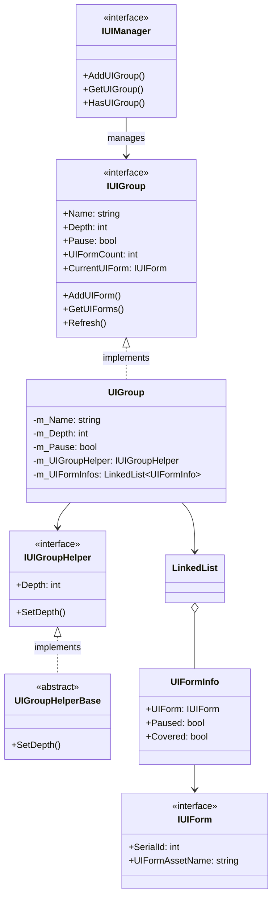
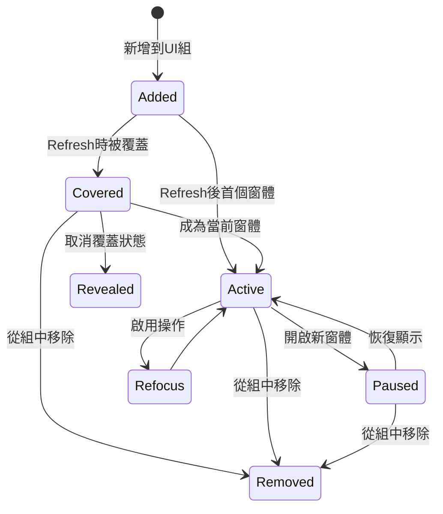
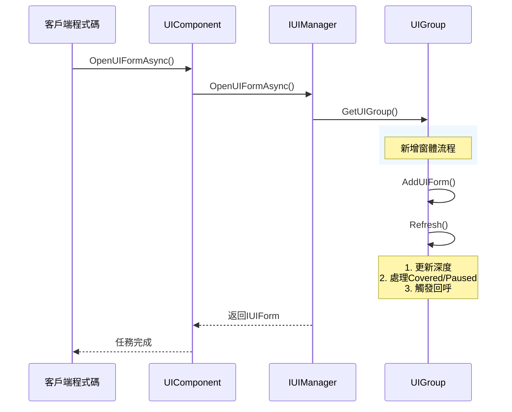
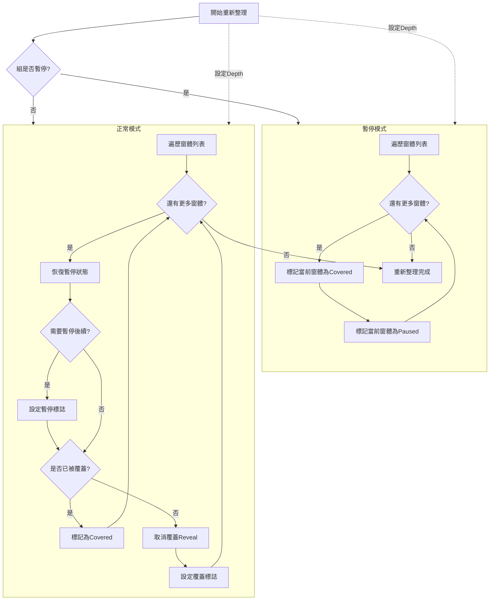

# UI 組系統

UI 組系統是 GameFrameX UI 框架的核心組成部分，用於管理和組織 UI 窗體的顯示層級關係。透過 UI 組系統，開發者可以輕鬆實現 UI 窗體的優先順序管理、覆蓋控制、暫停恢復等功能。

## 概述

UI 組系統（UI Group System）用於管理具有相同顯示優先順序的 UI 窗體集合。每個 UI 組具有以下核心特性：

- **深度管理**：每個組有唯一的深度值（Depth），深度越大顯示越靠前
- **暫停控制**：可以暫停整個組的 UI 窗體更新
- **覆蓋機制**：自動處理 UI 窗體之間的覆蓋關係
- **啟用管理**：支援將指定窗體置頂（啟用）

這種設計借鑑了遊戲引擎常見的層級管理方式，透過分組管理可以清晰地組織不同型別和優先順序的 UI 介面，如背景層、場景層、戰鬥 UI、彈出視窗、提示資訊等。

> UI 組系統與 UI 窗體系統緊密整合，IUIManager 負責管理所有 UI 組，而每個 UI 組負責管理其內的 UI 窗體。

## 架構設計



UI 組系統的架構採用分層設計：

- **IUIManager 層**：管理所有 UI 組，提供組的增刪改查介面
- **IUIGroup 層**：定義 UI 組的核心介面，包含組名稱、深度、暫停狀態等屬性
- **UIGroup 實現層**：使用 LinkedList 資料結構高效管理 UI 窗體集合
- **IUIGroupHelper 層**：處理 UI 組的視覺表現，如 Transform 深度設定

## 核心概念

### 深度（Depth）

深度是 UI 組的核心屬性，決定了組的顯示優先順序。深度值越大，UI 組顯示越靠前。系統預定義了一系列標準組的深度值，開發者也可以自定義新的組和深度。

深度值的設計遵循以下原則：
- 背景類 UI 使用較高深度（40-30）
- 場景和戰鬥 UI 使用中等深度（30-20）
- 常規和固定 UI 使用基礎深度（10-0）
- 彈出視窗和提示類使用負深度（-10 以下）

### 暫停（Pause）

當 UI 組被設定為暫停狀態時，組內所有 UI 窗體的 `OnUpdate` 方法將不再被呼叫，但窗體仍然可見。這是一個實用的功能，例如在顯示載入介面時可以暫停其他 UI 的更新，節省效能資源。

### 覆蓋（Covered）

當開啟新窗體時，舊窗體會自動被標記為"覆蓋"狀態。系統透過 `Refresh()` 方法自動管理這個狀態，確保使用者始終看到最新開啟的窗體。覆蓋狀態會觸發 UI 窗體的 `OnCover` 回呼，開發者可以在此處理相關的視覺效果。

### 啟用（Refocus）

啟用操作將指定的 UI 窗體移動到組的最前端，使其成為當前窗體。這在需要將某個已開啟的窗體置頂時非常有用，例如從後臺恢復一個設定面板。

## 預定義 UI 組

框架提供了一系列預定義的 UI 組常量，開發者可以直接使用：

```csharp
// 預定義 UI 組常量
UIGroupConstants.Hidden       // 隱藏層 (深度: 40)
UIGroupConstants.Background   // 背景層 (深度: 35)
UIGroupConstants.Scene        // 場景層 (深度: 30)
UIGroupConstants.World        // 世界層 (深度: 27)
UIGroupConstants.Battle       // 戰鬥層 (深度: 25)
UIGroupConstants.Hud          // HUD層 (深度: 22)
UIGroupConstants.Map          // 地圖層 (深度: 20)
UIGroupConstants.Floor        // 底板層 (深度: 15)
UIGroupConstants.Normal       // 正常層 (深度: 10)
UIGroupConstants.Fixed        // 固定層 (深度: 0)
UIGroupConstants.Window       // 視窗層 (深度: -10)
UIGroupConstants.Tip          // 提示層 (深度: -15)
UIGroupConstants.Guide        // 引導層 (深度: -20)
UIGroupConstants.BlackBoard   // 黑板層 (深度: -22)
UIGroupConstants.Dialogue     // 對話層 (深度: -23)
UIGroupConstants.Loading      // 載入層 (深度: -25)
UIGroupConstants.Notify       // 通知層 (深度: -30)
UIGroupConstants.System       // 系統層 (深度: -35)
```

> Source: [UIGroupConstants.cs](https://github.com/GameFrameX/com.gameframex.unity.ui/blob/main/Runtime/UIGroupConstants.cs#L38-L202)

```csharp
// 預定義 UI 組名稱常量
UIGroupNameConstants.Hidden       // "Hidden"
UIGroupNameConstants.Background  // "Background"
UIGroupNameConstants.Scene        // "Scene"
// ... 更多常量
```

> Source: [UIGroupNameConstants.cs](https://github.com/GameFrameX/com.gameframex.unity.ui/blob/main/Runtime/UIGroupNameConstants.cs#L38-L202)

## 窗體狀態流轉

UI 窗體在組內會經歷不同的狀態轉換，理解這些狀態對於正確使用 UI 組系統非常重要：



### 狀態說明

| 狀態 | 描述 | 觸發回呼 |
|------|------|----------|
| **Active** | 活動狀態，當前顯示的窗體 | OnResume, OnRefocus |
| **Covered** | 被其他窗體覆蓋 | OnCover |
| **Paused** | 暫停狀態，不更新但可見 | OnPause |
| **Removed** | 已從組中移除 | OnClose |

## 核心流程

### 開啟 UI 窗體並新增到組



### UI 組重新整理流程

重新整理是 UI 組的核心理論，它維護組內所有窗體的正確狀態：



## 使用示例

### 建立自定義 UI 組

使用 UIComponent 建立自定義 UI 組：

```csharp
public class GameEntry : MonoBehaviour
{
    public UIComponent UIComp;
    
    void Start()
    {
        // 建立自定義 UI 組，深度為 5
        UIComp.AddUIGroup("CustomGroup", 5);
        
        // 或者使用預定義組
        UIComp.AddUIGroup(UIGroupNameConstants.Window, -10);
    }
}
```

> Source: [UIComponent.IUIGroup.cs](https://github.com/GameFrameX/com.gameframex.unity.ui/blob/main/Runtime/UIComponent.IUIGroup.cs#L100-L147)

### 訪問 UI 組

透過 UIComponent 訪問和管理 UI 組：

```csharp
public class UIManagerExample : MonoBehaviour
{
    public UIComponent UIComp;
    
    public void ManageGroups()
    {
        // 檢查組是否存在
        if (UIComp.HasUIGroup("Window"))
        {
            // 獲取組
            IUIGroup group = UIComp.GetUIGroup("Window");
            
            // 獲取當前顯示的窗體
            IUIForm currentForm = group.CurrentUIForm;
            
            // 獲取組內窗體數量
            int count = group.UIFormCount;
            
            // 獲取所有窗體
            IUIForm[] allForms = group.GetAllUIForms();
            
            // 設定組深度
            group.Depth = 10;
            
            // 暫停/恢復組
            group.Pause = false;
            
            // 啟用指定窗體
            group.RefocusUIForm(someUIForm, null);
        }
    }
}
```

### 使用預定義組常量開啟窗體

```csharp
public class UIFormOpener : MonoBehaviour
{
    public UIComponent UIComp;
    
    public async void OpenDialog()
    {
        // 開啟對話方塊到對話層
        IUIForm dialog = await UIComp.OpenUIFormAsync<DialogForm>(
            "Assets/Prefabs/UI/Dialog.prefab",
            UIGroupNameConstants.Dialogue,
            true,  // 暫停被覆蓋的窗體
            null   // 使用者資料
        );
    }
    
    public async void OpenTip()
    {
        // 開啟提示到提示層（不暫停其他窗體）
        IUIForm tip = await UIComp.OpenUIFormAsync<TipForm>(
            "Assets/Prefs/UI/Tip.prefab",
            UIGroupNameConstants.Tip,
            false,
            "這是一個提示"
        );
    }
}
```

### 關閉整個 UI 組

關閉指定組內的所有 UI 窗體：

```csharp
public class UIGroupCloser : MonoBehaviour
{
    public UIComponent UIComp;
    
    public void CloseAllDialogs()
    {
        // 關閉對話組的所有窗體
        UIComp.CloseUIGroup(UIGroupNameConstants.Dialogue, null);
    }
    
    public void CloseAllWindows()
    {
        // 關閉視窗組
        if (UIComp.HasUIGroup(UIGroupNameConstants.Window))
        {
            UIComp.GetUIGroup(UIGroupNameConstants.Window);
            UIComp.CloseUIGroup(UIGroupNameConstants.Window, "user_close_all");
        }
    }
}
```

> Source: [BaseUIManager.UIGroup.cs](https://github.com/GameFrameX/com.gameframex.unity.ui/blob/main/Runtime/BaseUIManager.UIGroup.cs#L150-L176)

## IUIGroup 介面參考

完整的方法簽名和說明：

### 屬性

| 屬性 | 型別 | 描述 |
|------|------|------|
| Name | string | 獲取 UI 組名稱 |
| Depth | int | 獲取或設定 UI 組深度 |
| Pause | bool | 獲取或設定 UI 組是否暫停 |
| UIFormCount | int | 獲取 UI 組中窗體數量 |
| CurrentUIForm | IUIForm | 獲取當前顯示的窗體 |
| Helper | IUIGroupHelper | 獲取 UI 組輔助器 |

### 方法

#### `HasUIForm(int serialId): bool`

檢查組中是否存在指定序列號的窗體。

**引數：**
- `serialId` (int): UI 窗體的序列編號

**返回：** 是否存在

---

#### `HasUIForm(string uiFormAssetName): bool`

檢查組中是否存在指定資源名稱的窗體。

**引數：**
- `uiFormAssetName` (string): UI 窗體資源名稱

**返回：** 是否存在

---

#### `GetUIForm(int serialId): IUIForm`

根據序列號獲取窗體。

**引數：**
- `serialId` (int): UI 窗體的序列編號

**返回：** UI 窗體例項，不存在則返回 null

---

#### `GetUIForms(string uiFormAssetName): IUIForm[]`

根據資源名稱獲取所有匹配的窗體。

**引數：**
- `uiFormAssetName` (string): UI 窗體資源名稱

**返回：** UI 窗體陣列

---

#### `GetAllUIForms(): IUIForm[]`

獲取組內所有窗體。

**返回：** 所有 UI 窗體陣列

---

#### `AddUIForm(IUIForm uiForm): void`

新增窗體到組。

**引數：**
- `uiForm` (IUIForm): 要新增的 UI 窗體

---

#### `Refresh(): void`

重新整理 UI 組狀態，更新所有窗體的覆蓋和暫停狀態。

---

## IUIManager 中的 UI 組方法

IUIManager 提供了完整的 UI 組管理介面：

| 方法 | 描述 |
|------|------|
| `HasUIGroup(string)` | 檢查組是否存在 |
| `GetUIGroup(string)` | 獲取指定組 |
| `GetAllUIGroups()` | 獲取所有組 |
| `AddUIGroup(string, IUIGroupHelper)` | 新增新組 |
| `AddUIGroup(string, int, IUIGroupHelper)` | 新增指定深度的組 |
| `CloseUIGroup(string, object)` | 關閉組內所有窗體 |

> 完整的 IUIManager 介面定義請參考 [API 參考文件](./5-api-reference.iuimanager)

## 相關連結

- [UI 組件](./4-core-concepts.ui-component) - UI 組件基礎
- [UI 窗體](./4-core-concepts.ui-form) - UI 窗體系統
- [API 參考 - IUIGroup](./5-api-reference.iuigroup) - IUIGroup 完整介面文件
- [API 參考 - IUIManager](./5-api-reference.iuimanager) - IUIManager 完整介面文件
- [UI 組層級](./7-ui-group-hierarchy) - UI 組層級詳細說明
