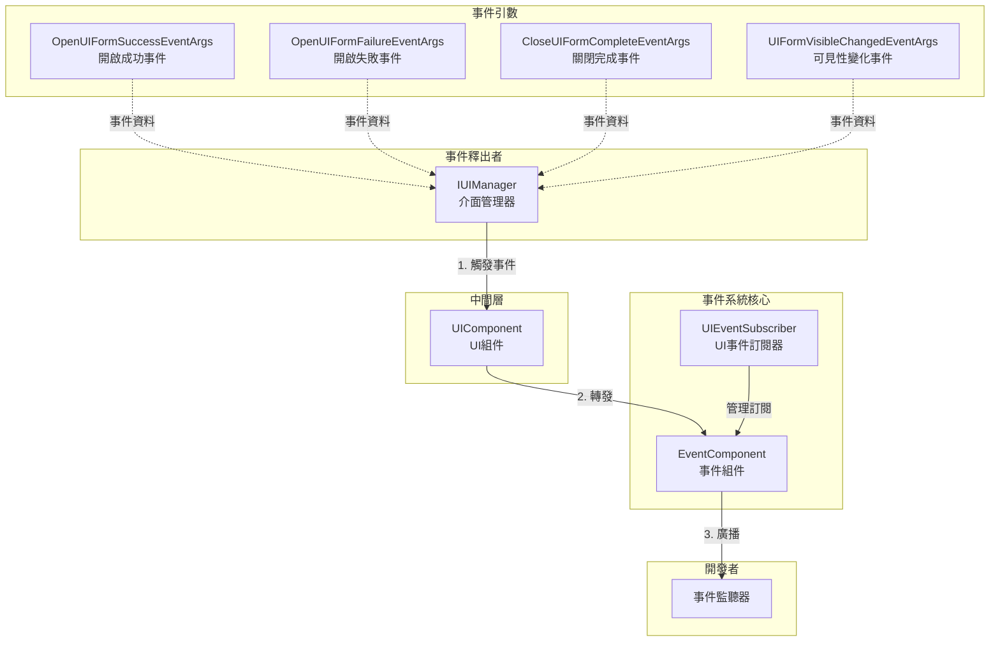
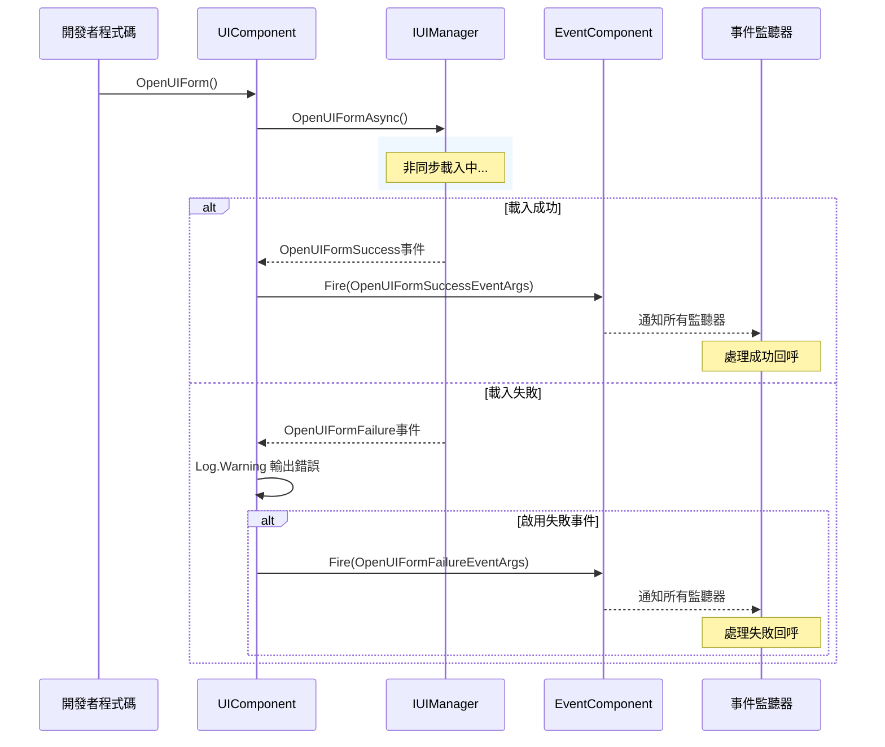
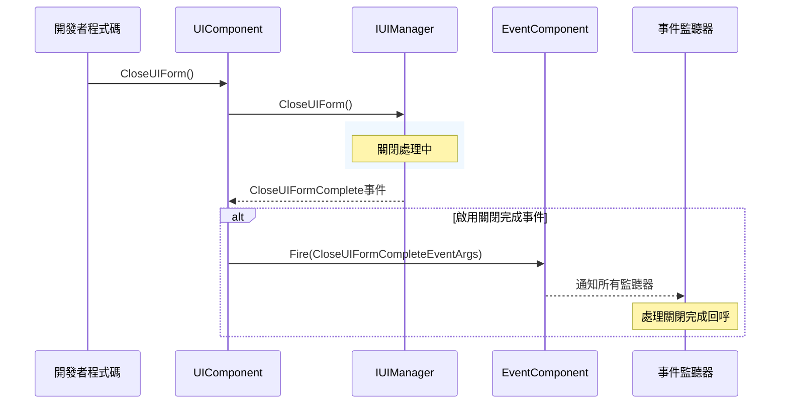

# 事件系統

GameFrameX.UI 模組提供了完善的事件系統，用於監聽 UI 介面的各種狀態變化。本文件詳細介紹 UI 模組的事件機制、事件型別以及如何使用這些事件。

## 概述

UI 模組的事件系統基於觀察者模式設計，允許開發者訂閱 UI 介面的關鍵狀態變化。主要包含以下能力：

- **介面開啟事件**：監聽介面開啟成功或失敗
- **介面關閉事件**：監聽介面關閉完成
- **介面可見性變化**：監聽介面顯示/隱藏狀態變化
- **統一事件訂閱**：透過 UIEventSubscriber 統一管理事件訂閱

事件系統與 GameFrameX 的核心事件組件（EventComponent）整合，支援全域性事件廣播。

> 詳細的事件組件 API 請參考 [EventComponent](https://github.com/GameFrameX/com.gameframex.unity.event/blob/main/Runtime/EventComponent.cs) 文件。

## 架構



**架構說明：**

1. **IUIManager** 是 UI 管理器的核心介面，負責 UI 介面的載入、顯示、隱藏等操作，並在操作完成後觸發相應事件
2. **UIComponent** 是 Unity 層面的 UI 組件，訂閱 IUIManager 的事件並可選擇性地轉發給全域性的 EventComponent
3. **EventComponent** 是 GameFrameX 的核心事件組件，負責全域性事件的註冊和分發
4. **UIEventSubscriber** 是一個工具類，幫助開發者更方便地管理 UI 事件訂閱，支援按所有者（Owner）批次取消訂閱
5. **EventArgs** 是各種事件引數類，封裝了事件相關的業務資料

## 核心事件型別

UI 模組定義了以下核心事件型別，所有事件引數類都繼承自 `GameEventArgs`：

### 1. OpenUIFormSuccessEventArgs - 介面開啟成功事件

當 UI 介面成功開啟時觸發。

```csharp
> Source: [Runtime/EventArgs/OpenUIFormSuccessEventArgs.cs](https://github.com/GameFrameX/com.gameframex.unity.ui/blob/main/Runtime/EventArgs/OpenUIFormSuccessEventArgs.cs#L42-L143)

public sealed class OpenUIFormSuccessEventArgs : GameEventArgs
{
    // 事件ID
    public static readonly string EventId = typeof(OpenUIFormSuccessEventArgs).FullName;
    
    // 獲取開啟成功的介面
    public UIForm UIForm { get; private set; }
    
    // 獲取載入持續時間（秒）
    public float Duration { get; private set; }
    
    // 獲取使用者自定義資料
    public object UserData { get; private set; }
    
    // 建立事件例項
    public static OpenUIFormSuccessEventArgs Create(IUIForm uiForm, float duration, object userData);
}
```

### 2. OpenUIFormFailureEventArgs - 介面開啟失敗事件

當 UI 介面開啟失敗時觸發。

```csharp
> Source: [Runtime/EventArgs/OpenUIFormFailureEventArgs.cs](https://github.com/GameFrameX/com.gameframex.unity.ui/blob/main/Runtime/EventArgs/OpenUIFormFailureEventArgs.cs#L42-L172)

public sealed class OpenUIFormFailureEventArgs : GameEventArgs
{
    // 事件ID
    public static readonly string EventId = typeof(OpenUIFormFailureEventArgs).FullName;
    
    // 獲取介面序列編號
    public int SerialId { get; private set; }
    
    // 獲取介面資源名稱
    public string UIFormAssetName { get; private set; }
    
    // 獲取是否暫停被覆蓋的介面
    public bool PauseCoveredUIForm { get; private set; }
    
    // 獲取錯誤資訊
    public string ErrorMessage { get; private set; }
    
    // 獲取使用者自定義資料
    public object UserData { get; private set; }
    
    // 建立事件例項
    public static OpenUIFormFailureEventArgs Create(int serialId, string uiFormAssetName, bool pauseCoveredUIForm, string errorMessage, object userData);
}
```

### 3. CloseUIFormCompleteEventArgs - 介面關閉完成事件

當 UI 介面關閉完成時觸發。

```csharp
> Source: [Runtime/EventArgs/CloseUIFormCompleteEventArgs.cs](https://github.com/GameFrameX/com.gameframex.unity.ui/blob/main/Runtime/EventArgs/CloseUIFormCompleteEventArgs.cs#L43-L158)

public sealed class CloseUIFormCompleteEventArgs : GameEventArgs
{
    // 事件ID
    public static readonly string EventId = typeof(CloseUIFormCompleteEventArgs).FullName;
    
    // 獲取介面序列編號
    public int SerialId { get; private set; }
    
    // 獲取介面資源名稱
    public string UIFormAssetName { get; private set; }
    
    // 獲取介面所屬的介面組
    public IUIGroup UIGroup { get; private set; }
    
    // 獲取使用者自定義資料
    public object UserData { get; private set; }
    
    // 建立事件例項
    public static CloseUIFormCompleteEventArgs Create(int serialId, string uiFormAssetName, IUIGroup uiGroup, object userData);
}
```

### 4. UIFormVisibleChangedEventArgs - 介面可見性變化事件

當 UI 介面的可見性狀態發生變化時觸發。

```csharp
> Source: [Runtime/EventArgs/UIFormVisibleChangedEventArgs.cs](https://github.com/GameFrameX/com.gameframex.unity.ui/blob/main/Runtime/EventArgs/UIFormVisibleChangedEventArgs.cs#L42-L143)

public sealed class UIFormVisibleChangedEventArgs : GameEventArgs
{
    // 事件ID
    public static readonly string EventId = typeof(UIFormVisibleChangedEventArgs).FullName;
    
    // 獲取啟用狀態變化的介面
    public IUIForm UIForm { get; private set; }
    
    // 獲取介面是否可見
    public bool Visible { get; private set; }
    
    // 獲取使用者自定義資料
    public object UserData { get; private set; }
    
    // 建立事件例項
    public static UIFormVisibleChangedEventArgs Create(IUIForm uiForm, bool visible, object userData = null);
}
```

## IUIManager 事件定義

IUIManager 介面定義了以下事件，UIComponent 會訂閱這些事件：

```csharp
> Source: [Runtime/UI/IUIManager.cs](https://github.com/GameFrameX/com.gameframex.unity.ui/blob/main/Runtime/UI/IUIManager.cs#L109-L142)

public interface IUIManager
{
    /// <summary>
    /// 開啟介面成功事件
    /// </summary>
    event EventHandler<OpenUIFormSuccessEventArgs> OpenUIFormSuccess;

    /// <summary>
    /// 開啟介面失敗事件
    /// </summary>
    event EventHandler<OpenUIFormFailureEventArgs> OpenUIFormFailure;

    /// <summary>
    /// 關閉介面完成事件
    /// </summary>
    event EventHandler<CloseUIFormCompleteEventArgs> CloseUIFormComplete;
}
```

## 事件訂閱方式

### 方式一：透過 UIComponent 訂閱

UIComponent 在初始化時會訂閱 IUIManager 的事件，並透過配置決定是否轉發給全域性 EventComponent：

```csharp
> Source: [Runtime/UIComponent.cs](https://github.com/GameFrameX/com.gameframex.unity.ui/blob/main/Runtime/UIComponent.cs#L430-L460)

private void OnAwake(object sender)
{
    m_UIManager = GameFrameworkEntry.GetModule<IUIManager>();
    
    if (m_EnableOpenUIFormSuccessEvent)
    {
        m_UIManager.OpenUIFormSuccess += OnOpenUIFormSuccess;
    }
    
    m_UIManager.OpenUIFormFailure += OnOpenUIFormFailure;
    
    if (m_EnableCloseUIFormCompleteEvent)
    {
        m_UIManager.CloseUIFormComplete += OnCloseUIFormComplete;
    }
}

private void OnOpenUIFormSuccess(object sender, OpenUIFormSuccessEventArgs e)
{
    m_EventComponent.Fire(this, e);
}

private void OnOpenUIFormFailure(object sender, OpenUIFormFailureEventArgs e)
{
    Log.Warning("Open UI form failure, asset name '{0}', pause covered UI form '{1}', error message '{2}'.", 
        e.UIFormAssetName, e.PauseCoveredUIForm, e.ErrorMessage);
    if (m_EnableOpenUIFormFailureEvent)
    {
        m_EventComponent.Fire(this, e);
    }
}

private void OnCloseUIFormComplete(object sender, CloseUIFormCompleteEventArgs e)
{
    m_EventComponent.Fire(this, e);
}
```

### 方式二：透過 UIEventSubscriber 訂閱

UIEventSubscriber 是一個便捷的事件訂閱管理類，支援按所有者（Owner）批次管理訂閱：

```csharp
> Source: [Runtime/UIEventSubscriber.cs](https://github.com/GameFrameX/com.gameframex.unity.ui/blob/main/Runtime/UIEventSubscriber.cs#L44-L218)

public sealed class UIEventSubscriber : IReference
{
    // 獲取或設定持有者
    public object Owner { get; private set; }
    
    // 檢查並訂閱事件
    public void CheckSubscribe(string id, EventHandler<GameEventArgs> handler);
    
    // 取消訂閱事件
    public void UnSubscribe(string id, EventHandler<GameEventArgs> handler);
    
    // 觸發事件
    public void Fire(string id, GameEventArgs e);
    
    // 取消所有訂閱
    public void UnSubscribeAll(List<string> ignoreList = null);
    
    // 建立事件訂閱器
    public static UIEventSubscriber Create(object owner);
    
    // 清理事件訂閱器
    public void Clear();
}
```

## 使用示例

### 示例一：監聽介面開啟成功事件

```csharp
using GameFrameX.UI.Runtime;
using GameFrameX.Event.Runtime;
using GameFrameX.Runtime;

public class UIMainMenuForm : MonoBehaviour
{
    private void Start()
    {
        // 訂閱開啟成功事件
        var eventComponent = GameEntry.GetComponent<EventComponent>();
        eventComponent.Subscribe(OpenUIFormSuccessEventArgs.EventId, OnOpenUIFormSuccess);
    }
    
    private void OnOpenUIFormSuccess(object sender, GameEventArgs e)
    {
        var args = (OpenUIFormSuccessEventArgs)e;
        Debug.Log($"介面開啟成功: {args.UIForm.Name}, 載入耗時: {args.Duration}秒");
    }
    
    private void OnDestroy()
    {
        // 取消訂閱
        var eventComponent = GameEntry.GetComponent<EventComponent>();
        eventComponent.Unsubscribe(OpenUIFormSuccessEventArgs.EventId, OnOpenUIFormSuccess);
    }
}
```

### 示例二：監聽介面開啟失敗事件

```csharp
using GameFrameX.UI.Runtime;
using GameFrameX.Event.Runtime;
using GameFrameX.Runtime;

public class UILoadFailedHandler : MonoBehaviour
{
    private void Start()
    {
        var eventComponent = GameEntry.GetComponent<EventComponent>();
        eventComponent.Subscribe(OpenUIFormFailureEventArgs.EventId, OnOpenUIFormFailure);
    }
    
    private void OnOpenUIFormFailure(object sender, GameEventArgs e)
    {
        var args = (OpenUIFormFailureEventArgs)e;
        Debug.LogError($"介面開啟失敗: {args.UIFormAssetName}, 錯誤資訊: {args.ErrorMessage}");
    }
    
    private void OnDestroy()
    {
        var eventComponent = GameEntry.GetComponent<EventComponent>();
        eventComponent.Unsubscribe(OpenUIFormFailureEventArgs.EventId, OnOpenUIFormFailure);
    }
}
```

### 示例三：使用 UIEventSubscriber 管理訂閱

```csharp
using GameFrameX.UI.Runtime;
using GameFrameX.Event.Runtime;
using GameFrameX.Runtime;
using GameFrameX.ObjectPool;

public class UIGamePanel : MonoBehaviour
{
    private UIEventSubscriber _eventSubscriber;
    
    private void Awake()
    {
        // 建立事件訂閱器，傳入 this 作為所有者
        _eventSubscriber = UIEventSubscriber.Create(this);
        
        // 訂閱多個事件
        _eventSubscriber.CheckSubscribe(OpenUIFormSuccessEventArgs.EventId, OnOpenUIFormSuccess);
        _eventSubscriber.CheckSubscribe(CloseUIFormCompleteEventArgs.EventId, OnCloseUIFormComplete);
    }
    
    private void OnOpenUIFormSuccess(object sender, GameEventArgs e)
    {
        var args = (OpenUIFormSuccessEventArgs)e;
        Debug.Log($"介面已開啟: {args.UIForm.Name}");
    }
    
    private void OnCloseUIFormComplete(object sender, GameEventArgs e)
    {
        var args = (CloseUIFormCompleteEventArgs)e;
        Debug.Log($"介面已關閉: {args.UIFormAssetName}");
    }
    
    private void OnDestroy()
    {
        // 批次取消所有訂閱
        if (_eventSubscriber != null)
        {
            _eventSubscriber.UnSubscribeAll();
            ReferencePool.Release(_eventSubscriber);
        }
    }
}
```

### 示例四：使用 UIEventSubscriber 取消特定事件訂閱

```csharp
using GameFrameX.UI.Runtime;
using GameFrameX.Event.Runtime;
using GameFrameX.Runtime;
using GameFrameX.ObjectPool;
using System.Collections.Generic;

public class UIPermanentPanel : MonoBehaviour
{
    private UIEventSubscriber _eventSubscriber;
    private List<string> _ignoredEvents = new List<string> { CloseUIFormCompleteEventArgs.EventId };
    
    private void Awake()
    {
        _eventSubscriber = UIEventSubscriber.Create(this);
        _eventSubscriber.CheckSubscribe(OpenUIFormSuccessEventArgs.EventId, OnOpenUIFormSuccess);
        _eventSubscriber.CheckSubscribe(OpenUIFormFailureEventArgs.EventId, OnOpenUIFormFailure);
        _eventSubscriber.CheckSubscribe(CloseUIFormCompleteEventArgs.EventId, OnCloseUIFormComplete);
    }
    
    private void OnOpenUIFormSuccess(object sender, GameEventArgs e) { /* ... */ }
    private void OnOpenUIFormFailure(object sender, GameEventArgs e) { /* ... */ }
    private void OnCloseUIFormComplete(object sender, GameEventArgs e) { /* ... */ }
    
    private void OnDestroy()
    {
        // 取消除 CloseUIFormComplete 之外的所有訂閱
        _eventSubscriber.UnSubscribeAll(_ignoredEvents);
        ReferencePool.Release(_eventSubscriber);
    }
}
```

## 事件流程

### 介面開啟事件流程



### 介面關閉事件流程



## 事件配置

UIComponent 提供了以下序列化欄位用於控制事件行為：

```csharp
> Source: [Runtime/UIComponent.cs](https://github.com/GameFrameX/com.gameframex.unity.ui/blob/main/Runtime/UIComponent.cs#L62-L86)

[SerializeField] private bool m_EnableOpenUIFormSuccessEvent = true;    // 啟用開啟成功事件
[SerializeField] private bool m_EnableOpenUIFormFailureEvent = true;     // 啟用開啟失敗事件
[SerializeField] private bool m_EnableCloseUIFormCompleteEvent = true;   // 啟用關閉完成事件

[SerializeField] private bool m_IsEnableUIShowAnimation = false;          // 啟用顯示動畫
[SerializeField] private bool m_IsEnableUIHideAnimation = false;        // 啟用隱藏動畫
```

| 配置項 | 型別 | 預設值 | 說明 |
|--------|------|--------|------|
| m_EnableOpenUIFormSuccessEvent | bool | true | 是否觸發開啟成功事件 |
| m_EnableOpenUIFormFailureEvent | bool | true | 是否觸發開啟失敗事件 |
| m_EnableCloseUIFormCompleteEvent | bool | true | 是否觸發關閉完成事件 |
| m_IsEnableUIShowAnimation | bool | false | 是否啟用介面顯示動畫 |
| m_IsEnableUIHideAnimation | bool | false | 是否啟用介面隱藏動畫 |

## 注意事項

1. **事件訂閱記憶體管理**：在 MonoBehaviour 的 `OnDestroy` 方法中務必取消事件訂閱，避免記憶體洩漏和空引用異常
2. **事件引數複用**：所有 EventArgs 類都使用 ReferencePool 進行物件池管理，建立後使用完畢會自動回收，無需手動釋放
3. **事件順序**：事件觸發順序為：OpenUIFormFailure/OpenUIFormSuccess → 其他業務邏輯，開發者應根據需要選擇合適的訂閱點
4. **跨場景事件**：透過 EventComponent 訂閱的事件是全域性的，即使介面關閉後也需要手動取消訂閱

## 相關連結

- [UI 組件](./4-core-concepts.ui-component) - UI 組件的核心功能
- [UI 窗體](./4-core-concepts.ui-form) - UI 窗體的基本概念
- [UI 組系統](./4-core-concepts.ui-group) - UI 組管理
- [IUIManager 介面](./5-api-reference.iuimanager) - 完整的 IUIManager API 參考
- [GameFrameX Event 模組](https://github.com/GameFrameX/com.gameframex.unity.event) - 核心事件組件
