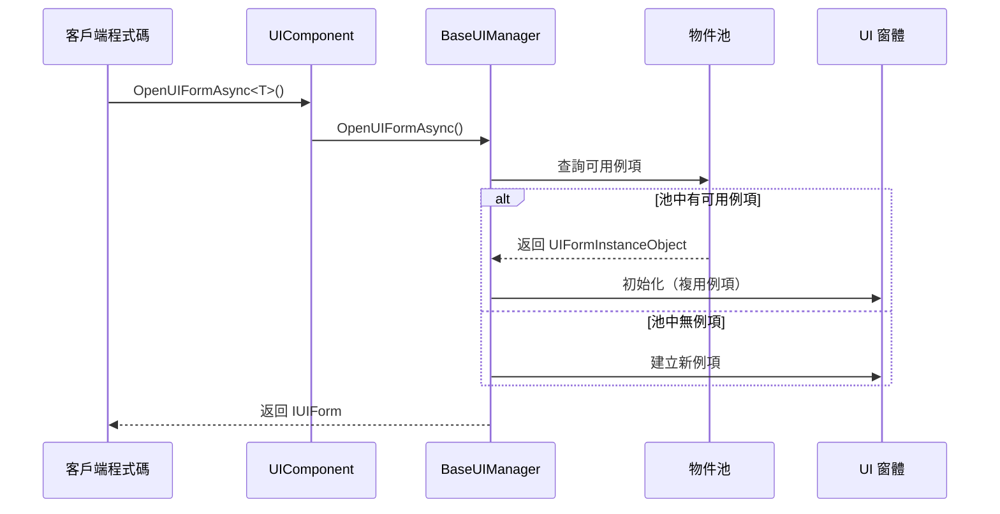
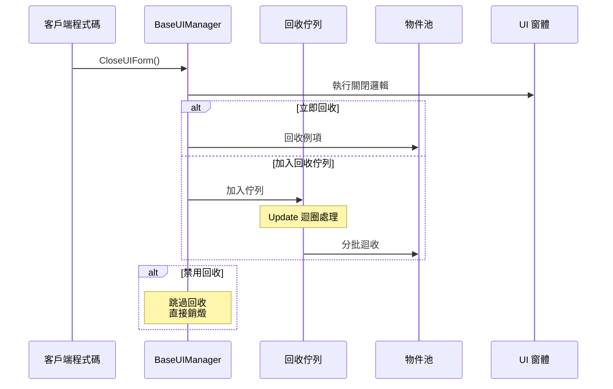
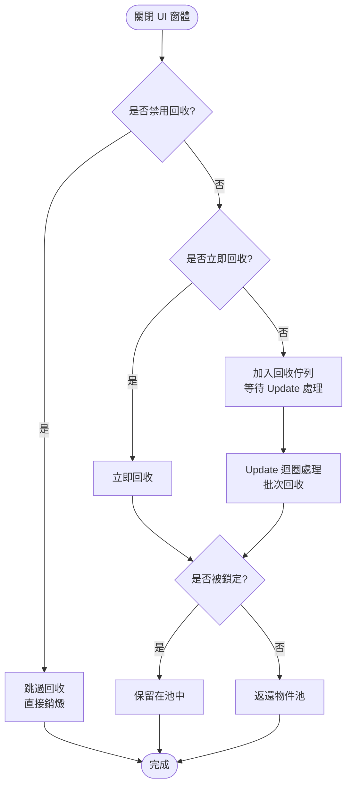

# 物件池管理

物件池管理是 GameFrameX UI 系統中用於最佳化 UI 窗體例項建立和銷燬的核心機制。透過物件池，系統可以重複使用已關閉的 UI 窗體例項，避免頻繁的例項化帶來的效能開銷。

## 概述

在遊戲或應用中，UI 窗體的開啟和關閉是非常頻繁的操作。傳統的做法是每次開啟時建立新例項，關閉時銷燬例項，這種方式會導致：

- **記憶體碎片化**：頻繁的物件建立和銷燬會導致記憶體碎片
- **GC 壓力**：大量臨時物件會增加垃圾回收的頻率
- **載入延遲**：例項化 UI 預製體需要時間，影響使用者體驗

物件池透過以下方式解決這些問題：

- **例項複用**：關閉的 UI 窗體不會被銷燬，而是回收並存入池中
- **按需分配**：從池中獲取例項時，如果池中有可用例項則直接複用，沒有才建立新例項
- **自動管理**：物件池支援自動釋放過期例項和容量管理

### 核心概念

| 概念 | 說明 |
|------|------|
| **物件池 (Object Pool)** | 儲存可複用 UI 窗體例項的容器 |
| **回收 (Recycle)** | 將關閉的 UI 窗體例項返還給物件池 |
| **釋放 (Release)** | 從池中徹底移除過期或多餘的例項 |
| **鎖定 (Locked)** | 被鎖定的例項不會被池自動釋放 |
| **優先順序 (Priority)** | 用於確定在容量不足時優先保留哪些例項 |

## 架構

```mermaid
flowchart TD
    subgraph UIComponent["UIComponent"]
        A1[UIComponent] --> A2[IUIManager]
    end

    subgraph BaseUIManager["BaseUIManager"]
        B1[IObjectPoolManager] --> B2[IObjectPool&lt;UIFormInstanceObject&gt;]
        B2 --> B3[UIFormInstanceObject Pool<br/>"UI Instance Pool"]
    end

    subgraph PoolObjects["池物件"]
        C1[UIFormInstanceObject 1]
        C2[UIFormInstanceObject 2]
        C3[UIFormInstanceObject N]
    end

    subgraph UIForms["UI 窗體"]
        D1[UI 窗體例項 1]
        D2[UI 窗體例項 2]
        D3[UI 窗體例項 N]
    end

    A2 --> B1
    B2 --- C1
    B2 --- C2
    B2 --- C3
    C1 --- D1
    C2 --- D2
    C3 --- D3
```

### 組件說明

| 組件 | 職責 |
|------|------|
| **UIComponent** | UI 組件入口，負責初始化物件池管理器配置 |
| **BaseUIManager** | UI 管理器核心，管理物件池的建立和操作 |
| **IObjectPoolManager** | 外部物件池管理器介面（來自 GameFrameX.ObjectPool 包） |
| **IObjectPool\<UIFormInstanceObject\>** | UI 窗體例項專用物件池 |
| **UIFormInstanceObject** | 封裝 UI 窗體例項的包裝類，包含資源控制代碼等資訊 |

### 物件池型別

系統使用 `CreateMultiSpawnObjectPool` 方法建立多生成物件池，這意味著：

- 同一型別的 UI 窗體可以同時存在多個例項
- 每個例項獨立管理自己的生命週期
- 支援設定例項級別的鎖定和優先順序

> Source: [BaseUIManager.cs#L268](https://github.com/GameFrameX/com.gameframex.unity.ui/blob/main/Runtime/BaseUIManager.cs#L268)

## 核心流程

### UI 窗體開啟流程



### UI 窗體回收流程



### 回收決策流程



## 配置選項

在 UIComponent 中可以配置物件池的各項引數，這些設定會在 `Start()` 方法中應用到 UI 管理器。

| 配置項 | 型別 | 預設值 | 說明 |
|--------|------|--------|------|
| `InstanceAutoReleaseInterval` | float | 60f | 物件池自動釋放可釋放物件的間隔秒數 |
| `InstanceCapacity` | int | 16 | 物件池的容量，表示最多快取多少個例項 |
| `InstanceExpireTime` | float | 60f | 物件過期時間（秒），超過此時間的未使用例項會被釋放 |
| `RecycleInterval` | int | 60 | 回收間隔秒數，控制從回收佇列處理的速度 |
| `EnableAutoReleaseUIForm` | bool | true | 是否啟用 UI 自動釋放 |

> Source: [UIComponent.cs#L113-L141](https://github.com/GameFrameX/com.gameframex.unity.ui/blob/main/Runtime/UIComponent.cs#L113-L141)

### 透過 IUIManager 介面配置

```csharp
// 獲取 UI 組件
var uiComponent = GameEntry.GetComponent<UIComponent>();

// 配置物件池引數
uiComponent.InstanceAutoReleaseInterval = 30f;  // 30秒自動釋放
uiComponent.InstanceCapacity = 32;               // 容量改為 32
uiComponent.InstanceExpireTime = 30f;             // 30秒過期
uiComponent.RecycleInterval = 30;                // 30秒回收間隔
```

### 執行時動態配置

```csharp
// 獲取 UI 管理器
IUIForm uiForm = await uiComponent.OpenUIFormAsync<MainForm>("UI/MainForm");

// 設定例項鎖定（防止被釋放）
uiComponent.SetUIFormInstanceLocked(uiForm.Handle, true);

// 設定例項優先順序（數值越高越優先保留）
uiComponent.SetUIFormInstancePriority(uiForm.Handle, 100);
```

> Source: [BaseUIManager.Open.cs#L164-L182](https://github.com/GameFrameX/com.gameframex.unity.ui/blob/main/Runtime/BaseUIManager.Open.cs#L164-L182)

## UI 窗體回收控制

每個 UI 窗體都可以獨立控制是否允許回收。

### UIForm 屬性

| 屬性 | 型別 | 說明 |
|------|------|------|
| `IsDisableRecycling` | bool | 是否禁用回收。禁用的 UI 窗體關閉後會被直接銷燬，不會存入物件池 |
| `IsDisableClosing` | bool | 是否禁用關閉。禁用的 UI 窗體無法被關閉 |
| `IsCanRecycle` | bool | 是否可以回收（只讀），由其他屬性綜合計算得出 |
| `ReleaseStartTime` | DateTime | 回收開始時間，用於判斷是否已達到回收條件 |
| `RecycleInterval` | int | 該 UI 窗體的回收間隔（秒） |

> Source: [IUIForm.cs#L84-L114](https://github.com/GameFrameX/com.gameframex.unity.ui/blob/main/Runtime/UI/IUIForm.cs#L84-L114)

### 使用示例

在 UI 窗體指令碼中控制回收行為：

```csharp
public class MyUIForm : UIForm
{
    protected override void OnInit()
    {
        // 禁用此窗體的回收功能
        // 關閉後會被直接銷燬，不會存入物件池
        IsDisableRecycling = true;
        
        // 或者禁用關閉功能
        // IsDisableClosing = true;
    }
    
    protected override void OnRecycle()
    {
        // 當窗體被回收時執行的邏輯
        // 可以在這裡儲存狀態或清理資源
        base.OnRecycle();
    }
}
```

> Source: [UIForm.cs#L56](https://github.com/GameFrameX/com.gameframex.unity.ui/blob/main/Runtime/UIForm.cs#L56)
> Source: [UIForm.cs#L625-L629](https://github.com/GameFrameX/com.gameframex.unity.ui/blob/main/Runtime/UIForm.cs#L625-L629)

## UIFormInstanceObject

`UIFormInstanceObject` 是儲存在物件池中的包裝物件，封裝了 UI 窗體例項及其相關資源。

```csharp
public sealed class UIFormInstanceObject : ObjectBase
{
    private object m_UIFormAsset = null;           // UI 資源物件
    private string m_UIFormAssetPath = null;        // UI 資源路徑
    private string m_UIFormAssetName = null;        // UI 資源名稱
    private IUIFormHelper m_UIFormHelper = null;    // UI 輔助器
    private object m_AssetHandle = null;           // 資源控制代碼
    
    protected override void Release(bool isShutdown)
    {
        // 釋放時呼叫輔助器回收 UI 資源
        m_UIFormHelper.ReleaseUIForm(m_UIFormAsset, Target, m_AssetHandle, 
            m_UIFormAssetPath, m_UIFormAssetName);
    }
}
```

> Source: [BaseUIManager.UIFormInstanceObject.cs#L41-L104](https://github.com/GameFrameX/com.gameframex.unity.ui/blob/main/Runtime/BaseUIManager.UIFormInstanceObject.cs#L41-L104)

## 最佳實踐

### 1. 合理設定容量

根據同時顯示的 UI 窗體數量設定容量：

```csharp
// 如果同時最多顯示 10 個不同型別的 UI 窗體
uiComponent.InstanceCapacity = 20; // 留一些餘量
```

### 2. 調整自動釋放間隔

根據 UI 使用頻率調整：

```csharp
// 頻繁切換的 UI：較短的間隔
uiComponent.InstanceAutoReleaseInterval = 30f;
uiComponent.InstanceExpireTime = 30f;

// 較少切換的 UI：較長的間隔
uiComponent.InstanceAutoReleaseInterval = 300f;
uiComponent.InstanceExpireTime = 300f;
```

### 3. 鎖定重要例項

對於需要常駐記憶體的 UI 窗體，鎖定它們：

```csharp
// 開啟設定介面並鎖定
var settingsForm = await uiComponent.OpenUIFormAsync<SettingsForm>("UI/Settings");
uiComponent.SetUIFormInstanceLocked(settingsForm.Handle, true);
```

### 4. 禁用頻繁銷燬的 UI 回收

對於某些頻繁開啟關閉但不需要複用的 UI，可以禁用回收：

```csharp
public class PopupTipForm : UIForm
{
    protected override void OnInit()
    {
        // 彈窗類 UI 每次都是新內容，禁用回收
        IsDisableRecycling = true;
    }
}
```

## 相關連結

- [UI 組件](./4-core-concepts.ui-component)
- [UI 窗體](./4-core-concepts.ui-form)
- [UI 組系統](./4-core-concepts.ui-group)
- [IUIManager API 參考](./5-api-reference.iuimanager)
- [UIForm API 參考](./5-api-reference.ui-form)
- [事件系統](./6-event-system)
