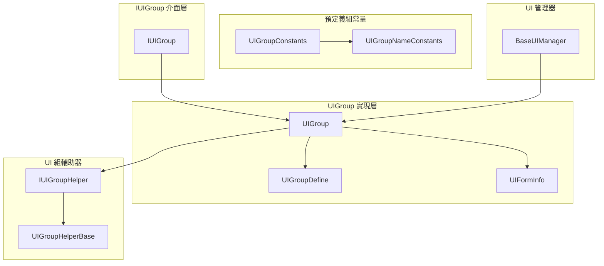
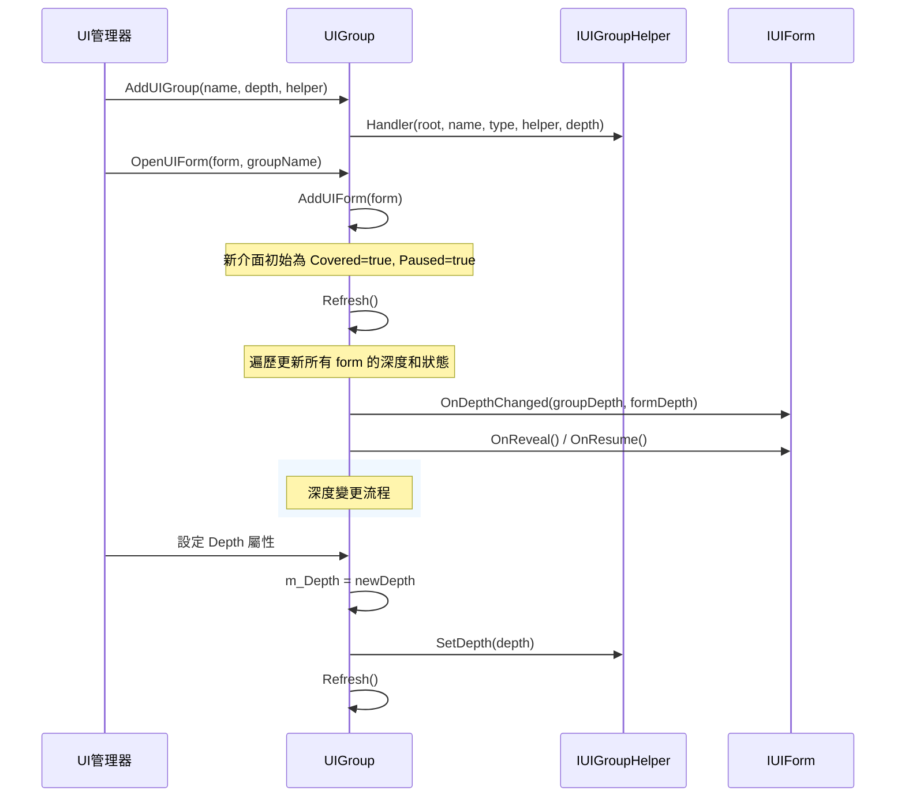
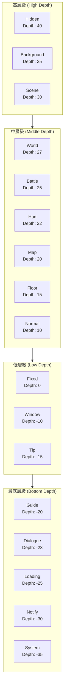

# UI 組層級

UI 組層級（UI Group Hierarchy）是 GameFrameX UI 系統中用於管理不同 UI 介面顯示層次關係的核心機制。透過深度（Depth）值的配置，系統能夠精確控制各個 UI 組以及組內介面的前後遮擋關係，確保 UI 介面按照預期的層級順序進行渲染和互動。

## 概述

在複雜的遊戲或應用程式中，UI 介面通常需要分層管理。例如，背景介面應該位於最底層，而彈出的提示框或系統公告應該顯示在最頂層。GameFrameX UI 系統透過引入「組」的概念，結合深度（Depth）屬性，實現了對 UI 介面層級的精細控制。

UI 組層級系統包含兩個層次的深度控制：

- **組級別深度（Group Depth）**：控制不同 UI 組之間的顯示順序，深度值越大的組越靠前顯示
- **組內深度（Form Depth in Group）**：控制同一組內各個介面之間的顯示順序

這種雙層設計既保證了不同型別 UI 的整體層級關係，又允許在同型別 UI 中靈活調整具體介面的顯示順序。

### 核心設計理念

1. **深度值分層**：使用整數深度值表示層級，支援負數深度，允許更靈活的空間分配
2. **預定義組型別**：提供常用的 UI 組型別，涵蓋從背景到系統彈窗的完整層級體系
3. **動態調整**：支援在執行時動態修改組深度，實時更新所有關聯介面的顯示層級
4. **自動重新整理**：深度變更後自動觸發重新整理機制，確保所有介面正確響應

## 架構設計

### 核心組件關係



### 層級資料流



### 深度值層級示意圖



## 預定義 UI 組

GameFrameX UI 系統提供了 18 個預定義的 UI 組型別，涵蓋了遊戲開發中常見的 UI 場景。這些預定義組按照深度值從高到低排列：

| 組名稱 | 深度值 | 用途說明 |
|--------|--------|----------|
| Hidden | 40 | 隱藏介面，用於臨時儲存不顯示的介面 |
| Background | 35 | 背景介面，如遊戲主介面背景、場景背景等 |
| Scene | 30 | 場景介面，與遊戲場景相關的 UI |
| World | 27 | 世界介面，世界空間內的 UI 元素 |
| Battle | 25 | 戰鬥介面，戰鬥相關的 HUD 和資訊顯示 |
| Hud | 22 | 頭頂顯示，角色頭頂的血條、名稱等資訊 |
| Map | 20 | 地圖介面，小地圖、大地圖等 |
| Floor | 15 | 底板介面，位於底層的裝飾性 UI |
| Normal | 10 | 普通介面，常規的遊戲內 UI |
| Fixed | 0 | 固定介面，固定在螢幕上的 UI |
| Window | -10 | 視窗介面，彈出視窗、對話方塊等 |
| Tip | -15 | 提示介面，輕量級提示資訊 |
| Guide | -20 | 引導介面，新手引導相關 UI |
| BlackBoard | -22 | 黑板介面，教學、說明類 UI |
| Dialogue | -23 | 對話介面，對話樹、NPC 對話等 |
| Loading | -25 | 載入介面，載入畫面 |
| Notify | -30 | 通知介面，系統通知、公告 |
| System | -35 | 系統介面，最高優先順序的系統級彈窗 |

> Source: [UIGroupConstants.cs](https://github.com/GameFrameX/com.gameframex.unity.ui/blob/main/Runtime/UIGroupConstants.cs#L41-L201)

### 使用預定義組

```csharp
// 使用預定義組常量建立 UI 組
var uiGroupHelper = new DefaultUIGroupHelper();
uiManager.AddUIGroup(UIGroupConstants.Normal.Name, UIGroupConstants.Normal.Depth, uiGroupHelper);

// 或者使用組名稱常量
uiManager.AddUIGroup(UIGroupNameConstants.Normal, 10, uiGroupHelper);
```

> Source: [BaseUIManager.UIGroup.cs](https://github.com/GameFrameX/com.gameframex.unity.ui/blob/main/Runtime/BaseUIManager.UIGroup.cs#L136-L148)

## 核心機制

### 組深度管理

每個 UI 組都維護一個整數型別的 `Depth` 屬性，表示該組在整體 UI 層級中的位置。當深度值發生改變時，系統會自動完成以下操作：

1. 呼叫 `IUIGroupHelper.SetDepth()` 方法通知輔助器更新渲染層級
2. 呼叫 `Refresh()` 方法重新整理組內所有介面的深度資訊
3. 觸發各介面 `OnDepthChanged` 回呼，通知介面深度已變更

```csharp
// UIGroup.cs 中的 Depth 屬性實現
public int Depth
{
    get { return m_Depth; }
    set
    {
        if (m_Depth == value)
        {
            return;
        }

        m_Depth = value;
        m_UIGroupHelper.SetDepth(m_Depth);  // 通知輔助器
        Refresh();  // 重新整理組內介面
    }
}
```

> Source: [UIGroup.cs](https://github.com/GameFrameX/com.gameframex.unity.ui/blob/main/Runtime/UI/UIGroup.cs#L106-L120)

### 組內介面深度

在同一 UI 組內，新開啟的介面預設新增到列表頭部（`AddFirst`），這意味著最後開啟的介面會顯示在最前面。每個介面在組內的深度由其在連結串列中的位置決定，連結串列頭部的深度值最大，依次遞減。

```csharp
// 新增新介面到組
public void AddUIForm(IUIForm uiForm)
{
    m_UIFormInfos.AddFirst(UIFormInfo.Create(uiForm));
}
```

> Source: [UIGroup.cs](https://github.com/GameFrameX/com.gameframex.unity.ui/blob/main/Runtime/UI/UIGroup.cs#L439-L442)

### 重新整理機制

`Refresh()` 方法是 UI 組層級管理的核心，它負責：

1. **更新介面深度**：遍歷組內所有介面，計算並更新每個介面的 `DepthInUIGroup`
2. **處理覆蓋狀態**：根據介面的顯示順序，設定 `Covered` 狀態並觸發相應回呼
3. **處理暫停狀態**：根據組的 `Pause` 屬性和介面的 `PauseCoveredUIForm` 屬性，管理介面的暫停狀態

```csharp
public void Refresh()
{
    LinkedListNode<UIFormInfo> current = m_UIFormInfos.First;
    bool pause = m_Pause;
    bool cover = false;
    int depth = UIFormCount;

    while (current != null)
    {
        // 更新深度
        info.UIForm.OnDepthChanged(Depth, depth--);

        // 處理覆蓋和暫停邏輯
        // ...
    }
}
```

> Source: [UIGroup.cs](https://github.com/GameFrameX/com.gameframex.unity.ui/blob/main/Runtime/UI/UIGroup.cs#L520-L577)

### 介面狀態變化

UI 組內的介面有以下幾種狀態：

| 狀態 | 說明 | 觸發回呼 |
|------|------|----------|
| Active | 活動狀態，完全可見且可互動 | - |
| Covered | 被覆蓋狀態，被其他介面遮擋 | `OnCover()` / `OnReveal()` |
| Paused | 暫停狀態，不再接收輸入 | `OnPause()` / `OnResume()` |

當新介面開啟時，原來的頂層介面會被遮擋（Covered）並可能暫停（Paused，取決於 `PauseCoveredUIForm` 屬性）。

## 使用示例

### 建立自定義深度的 UI 組

```csharp
// 建立自定義深度的 UI 組
public class GameUIInitializer
{
    private IUIManager uiManager;

    public void Initialize()
    {
        // 建立高優先順序組（顯示在最前面）
        var dialogHelper = new DialogUIGroupHelper();
        uiManager.AddUIGroup("Dialog", 100, dialogHelper);

        // 建立普通組
        var normalHelper = new NormalUIGroupHelper();
        uiManager.AddUIGroup("Normal", 50, normalHelper);

        // 建立背景組
        var bgHelper = new BackgroundUIGroupHelper();
        uiManager.AddUIGroup("Background", 10, bgHelper);
    }
}
```

> Source: [BaseUIManager.UIGroup.cs](https://github.com/GameFrameX/com.gameframex.unity.ui/blob/main/Runtime/BaseUIManager.UIGroup.cs#L136-L148)

### 動態調整組深度

```csharp
// 執行時調整 UI 組深度
public class UIGroupDepthChanger
{
    private IUIManager uiManager;

    public void PromoteGroup(string groupName)
    {
        var group = uiManager.GetUIGroup(groupName);
        if (group != null)
        {
            // 將組深度提高，使其顯示在更前面
            group.Depth += 10;
        }
    }

    public void DemoteGroup(string groupName)
    {
        var group = uiManager.GetUIGroup(groupName);
        if (group != null)
        {
            // 將組深度降低，使其顯示在更後面
            group.Depth -= 10;
        }
    }
}
```

### 實現自定義 UI 組輔助器

```csharp
// 自定義 UI 組輔助器
public class CustomUIGroupHelper : UIGroupHelperBase
{
    private Canvas m_Canvas;
    private int m_Depth;

    public override int Depth
    {
        get => m_Depth;
        protected set => m_Depth = value;
    }

    public override void SetDepth(int depth)
    {
        m_Depth = depth;
        if (m_Canvas != null)
        {
            // 根據組深度設定 Canvas 渲染順序
            m_Canvas.sortingOrder = depth;
        }
    }

    public override IUIGroupHelper Handler(Transform root, string groupName, 
        string uiGroupHelperTypeName, IUIGroupHelper customUIGroupHelper, int depth = 0)
    {
        base.Handler(root, groupName, uiGroupHelperTypeName, customUIGroupHelper, depth);
        
        m_Canvas = root.GetComponent<Canvas>();
        if (m_Canvas == null)
        {
            m_Canvas = root.gameObject.AddComponent<Canvas>();
        }
        m_Canvas.renderMode = RenderMode.ScreenSpaceCamera;
        m_Canvas.sortingOrder = depth;
        
        return this;
    }
}
```

> Source: [UIGroupHelperBase.cs](https://github.com/GameFrameX/com.gameframex.unity.ui/blob/main/Runtime/UIGroupHelperBase.cs#L41-L77)

## 最佳實踐

### 1. 合理規劃深度區間

建議按照預定義組的深度分佈來規劃自定義組的深度：

- **高優先順序區域（30+）**：用於場景背景、全屏 UI
- **中優先順序區域（10-25）**：用於遊戲 HUD、資訊面板
- **普通區域（-5 to 10）**：用於普通彈出視窗
- **低優先順序區域（-30 to -10）**：用於提示、引導類 UI

### 2. 避免深度衝突

雖然系統允許任意整數深度值，但建議使用一定間隔的深度值（如間隔 10），為未來的功能擴充套件預留空間。

### 3. 利用 PauseCoveredUIForm 屬性

對於需要保持更新的 UI（如倒計時、實時資料），應該設定 `PauseCoveredUIForm = false`，確保即使被遮擋也能繼續更新：

```csharp
// 在開啟介面時設定
uiManager.OpenUIForm<MyForm>("MyForm", "Dialog", userData: null, pauseCoveredUIForm: false);
```

### 4. 正確使用預定義組

儘量使用 `UIGroupConstants` 中定義的預定義組，這樣可以與其他模組保持一致的層級約定，減少自定義組的數量。

## API 參考

### IUIGroup 介面

```csharp
public interface IUIGroup
{
    // 獲取介面組名稱
    string Name { get; }

    // 獲取或設定介面組深度
    int Depth { get; set; }

    // 獲取或設定介面組是否暫停
    bool Pause { get; set; }

    // 獲取介面組中介面數量
    int UIFormCount { get; }

    // 獲取當前介面（組內最前面的介面）
    IUIForm CurrentUIForm { get; }

    // 獲取介面組輔助器
    IUIGroupHelper Helper { get; }

    // 檢查介面是否存在
    bool HasUIForm(int serialId);
    bool HasUIForm(string uiFormAssetName);

    // 獲取介面
    IUIForm GetUIForm(int serialId);
    IUIForm GetUIForm(string uiFormAssetName);
    IUIForm[] GetUIForms(string uiFormAssetName);
    IUIForm[] GetAllUIForms();

    // 重新整理介面組
    void Refresh();
}
```

> Source: [IUIGroup.cs](https://github.com/GameFrameX/com.gameframex.unity.ui/blob/main/Runtime/UI/IUIGroup.cs#L42-L197)

### IUIGroupHelper 介面

```csharp
public interface IUIGroupHelper
{
    // 獲取或設定介面組深度
    int Depth { get; }

    // 設定介面組深度
    void SetDepth(int depth);

    // 建立介面組
    IUIGroupHelper Handler(Transform root, string groupName, 
        string uiGroupHelperTypeName, IUIGroupHelper customUIGroupHelper, int depth = 0);
}
```

> Source: [IUIGroupHelper.cs](https://github.com/GameFrameX/com.gameframex.unity.ui/blob/main/Runtime/UI/IUIGroupHelper.cs#L40-L72)

### UIGroupDefine 類

```csharp
public sealed class UIGroupDefine
{
    // 介面組深度
    public readonly int Depth;

    // 介面組名稱
    public readonly string Name;

    public UIGroupDefine(int depth, string name);
}
```

> Source: [UIGroupDefine.cs](https://github.com/GameFrameX/com.gameframex.unity.ui/blob/main/Runtime/UIGroupDefine.cs#L39-L75)

## 相關連結

- [UI 組件](./4-core-concepts.ui-component) - UI 組件基礎概念
- [UI 窗體](./4-core-concepts.ui-form) - UI 窗體詳細說明
- [UI 組系統](./4-core-concepts.ui-group) - UI 組系統核心概念
- [IUIManager API](./5-api-reference.iuimanager) - UI 管理器介面文件
- [IUIGroup API](./5-api-reference.iuigroup) - UI 組介面文件
- [事件系統](./6-event-system) - UI 事件系統
