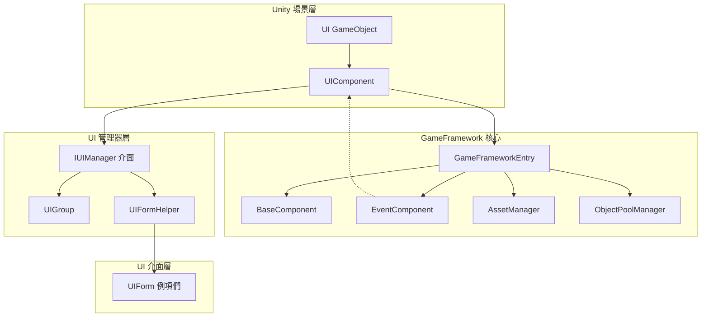
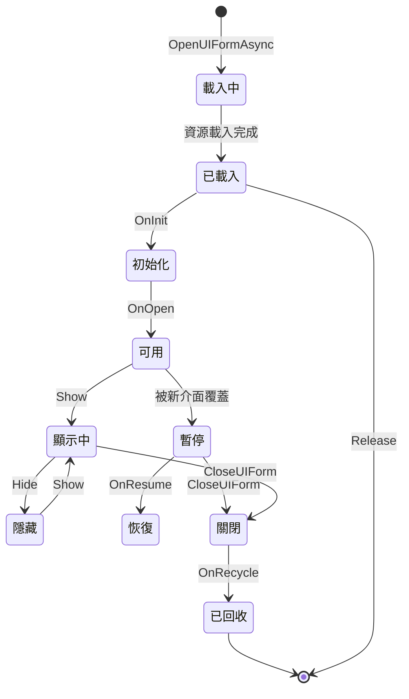

# UIComponent

UIComponent 是 GameFrameX 框架中的核心UI組件，繼承自 GameFrameworkComponent，用於管理遊戲中的所有UI介面。它作為IUIManager介面的門面類，提供了簡潔的API來執行UI的開啟、關閉、獲取等操作，同時支援UGUI和FairyGUI兩種UI系統。

## 概述

UIComponent 是 Unity 遊戲場景中的核心組件，負責整個UI系統的管理和排程。作為遊戲框架的核心組件之一，它封裝了底層的IUIManager實現，提供了更加易用的API介面。

**主要功能：**
- UI介面的非同步開啟與關閉
- UI介面的查詢與獲取
- UI組（UIGroup）的管理
- UI物件池配置
- UI事件系統
- UI顯示/隱藏動畫控制

## 架構

UIComponent 在整體架構中扮演著門面（Facade）角色，封裝了底層的IUIManager實現。



## 屬性

### 根節點屬性

| 屬性 | 型別 | 描述 |
|------|------|------|
| `UGUIRoot` | Transform | 獲取UGUI根節點變換組件 |
| `FairyGUIRoot` | Transform | 獲取FairyGUI根節點變換組件 |

### 自動回收配置

| 屬性 | 型別 | 預設值 | 描述 |
|------|------|--------|------|
| `EnableAutoReleaseUIForm` | bool | true | 是否啟用自動回收介面 |
| `InstanceAutoReleaseInterval` | float | 60f | 介面例項物件池自動釋放可釋放物件的間隔秒數 |
| `InstanceCapacity` | int | 16 | 介面例項物件池的容量 |
| `InstanceExpireTime` | float | 60f | 介面例項物件池物件過期秒數 |
| `RecycleInterval` | int | 60 | 介面回收間隔秒數 |

### 動畫配置

| 屬性 | 型別 | 預設值 | 描述 |
|------|------|--------|------|
| `IsEnableUIShowAnimation` | bool | false | 是否啟用UI顯示動畫 |
| `IsEnableUIHideAnimation` | bool | false | 是否啟用UI隱藏動畫 |

### UI組數量

| 屬性 | 型別 | 描述 |
|------|------|------|
| `UIGroupCount` | int | 獲取介面組數量 |

## API 參考

### 開啟介面

#### `OpenAsync<T>(object userData = null, bool isFullScreen = false): Task<T>`

非同步開啟介面，基於泛型型別自動解析UI資源路徑。

**所屬檔案：** [Runtime/UIComponent.Open.cs](https://github.com/GameFrameX/com.gameframex.unity.ui/blob/main/Runtime/UIComponent.Open.cs#L167-L191)

```csharp
// 使用示例
var mainMenuForm = await this.OpenAsync<MainMenuUIForm>();
var settingsForm = await this.OpenAsync<SettingsUIForm>(userData, true);
```

**泛型引數：**
- `T`: UI的具體型別，必須實現 IUIForm 介面

**引數：**
- `userData` (object): 傳遞給UI的使用者資料
- `isFullScreen` (bool): 是否全屏顯示

**返回：** `Task<T>` - 開啟的UI介面例項

---

#### `OpenAsync<T>(string uiFormAssetPath, bool pauseCoveredUIForm, object userData = null, bool isFullScreen = false): Task<T>`

非同步開啟介面，指定資源路徑和是否暫停被覆蓋的介面。

**所屬檔案：** [Runtime/UIComponent.Open.cs](https://github.com/GameFrameX/com.gameframex.unity.ui/blob/main/Runtime/UIComponent.Open.cs#L152-L155)

```csharp
// 使用示例
var form = await this.OpenAsync<MainMenuUIForm>("Assets/UI/MainMenu.prefab", true);
```

**引數：**
- `uiFormAssetPath` (string): UI資源路徑
- `pauseCoveredUIForm` (bool): 是否暫停被覆蓋的介面
- `userData` (object): 傳遞給UI的使用者資料
- `isFullScreen` (bool): 是否全屏顯示

---

#### `OpenFullScreenAsync<T>(object userData = null): Task<T>`

非同步開啟全屏UI。

**所屬檔案：** [Runtime/UIComponent.Open.cs](https://github.com/GameFrameX/com.gameframex.unity.ui/blob/main/Runtime/UIComponent.Open.cs#L63-L68)

```csharp
var dialog = await this.OpenFullScreenAsync<DialogUIForm>(userData);
```

---

#### `OpenUIAsync(string uiFormAssetPath, Type uiFormType, bool pauseCoveredUIForm, object userData = null, bool isFullScreen = false): Task<IUIForm>`

使用Type型別非同步開啟UI。

**所屬檔案：** [Runtime/UIComponent.Open.cs](https://github.com/GameFrameX/com.gameframex.unity.ui/blob/main/Runtime/UIComponent.Open.cs#L83-L86)

---

### 關閉介面

#### `CloseUIForm(int serialId, bool isNowRecycle = false): void`

根據序列編號關閉介面。

**所屬檔案：** [Runtime/UIComponent.Close.cs](https://github.com/GameFrameX/com.gameframex.unity.ui/blob/main/Runtime/UIComponent.Close.cs#L43-L46)

```csharp
// 使用示例
this.CloseUIForm(serialId);
this.CloseUIForm(serialId, true); // 立即回收
```

**引數：**
- `serialId` (int): 要關閉介面的序列編號
- `isNowRecycle` (bool): 是否立即回收介面，預設false

---

#### `CloseUIForm(IUIForm uiForm, bool isNowRecycle = false): void`

根據UI例項關閉介面。

**所屬檔案：** [Runtime/UIComponent.Close.cs](https://github.com/GameFrameX/com.gameframex.unity.ui/blob/main/Runtime/UIComponent.Close.cs#L72-L75)

---

#### `CloseUIForm<T>(object userData = null, bool isNowRecycle = false): void where T : IUIForm`

根據型別關閉介面。

**所屬檔案：** [Runtime/UIComponent.Close.cs](https://github.com/GameFrameX/com.gameframex.unity.ui/blob/main/Runtime/UIComponent.Close.cs#L89-L92)

---

#### `CloseAllLoadedUIForms(bool isNowRecycle = false): void`

關閉所有已載入的介面。

**所屬檔案：** [Runtime/UIComponent.Close.cs](https://github.com/GameFrameX/com.gameframex.unity.ui/blob/main/Runtime/UIComponent.Close.cs#L131-L134)

---

#### `CloseAllLoadingUIForms(): void`

關閉所有正在載入的介面。

**所屬檔案：** [Runtime/UIComponent.Close.cs](https://github.com/GameFrameX/com.gameframex.unity.ui/blob/main/Runtime/UIComponent.Close.cs#L171-L174)

---

#### `ReleaseAllLoadedUIForms(bool isNowRecycle = false, object userData = null): void`

釋放所有已載入的介面。

**所屬檔案：** [Runtime/UIComponent.Close.cs](https://github.com/GameFrameX/com.gameframex.unity.ui/blob/main/Runtime/UIComponent.Close.cs#L145-L148)

---

#### `CloseUIGroup(string uiGroupName, object userData = null): void`

關閉指定UI組的所有介面。

**所屬檔案：** [Runtime/UIComponent.Close.cs](https://github.com/GameFrameX/com.gameframex.unity.ui/blob/main/Runtime/UIComponent.Close.cs#L118-L121)

---

### 獲取介面

#### `GetUIForm(int serialId): IUIForm`

根據序列編號獲取介面。

**所屬檔案：** [Runtime/UIComponent.Get.cs](https://github.com/GameFrameX/com.gameframex.unity.ui/blob/main/Runtime/UIComponent.Get.cs#L47-L50)

```csharp
var form = this.GetUIForm(serialId);
```

---

#### `GetUIForm(string uiFormAssetName): IUIForm`

根據資源名稱獲取介面。

**所屬檔案：** [Runtime/UIComponent.Get.cs](https://github.com/GameFrameX/com.gameframex.unity.ui/blob/main/Runtime/UIComponent.Get.cs#L61-L64)

---

#### `GetUIForms(string uiFormAssetName): IUIForm[]`

獲取所有指定資源名稱的介面陣列。

**所屬檔案：** [Runtime/UIComponent.Get.cs](https://github.com/GameFrameX/com.gameframex.unity.ui/blob/main/Runtime/UIComponent.Get.cs#L75-L85)

---

#### `GetLoaded<T>(): T where T : class, IUIForm`

根據型別獲取已載入的介面，返回第一個匹配的例項。

**所屬檔案：** [Runtime/UIComponent.Get.cs](https://github.com/GameFrameX/com.gameframex.unity.ui/blob/main/Runtime/UIComponent.Get.cs#L238-L251)

```csharp
var mainMenu = this.GetLoaded<MainMenuUIForm>();
```

---

#### `GetLoadedList<T>(): List<T> where T : class, IUIForm`

獲取指定型別的所有已載入介面列表。

**所屬檔案：** [Runtime/UIComponent.Get.cs](https://github.com/GameFrameX/com.gameframex.unity.ui/blob/main/Runtime/UIComponent.Get.cs#L120-L134)

---

#### `GetLoadedAndShowing<T>(): T where T : class, IUIForm`

獲取已載入且正在顯示的UI。

**所屬檔案：** [Runtime/UIComponent.Get.cs](https://github.com/GameFrameX/com.gameframex.unity.ui/blob/main/Runtime/UIComponent.Get.cs#L168-L181)

---

#### `GetAllLoadedUIForms(): IUIForm[]`

獲取所有已載入的介面。

**所屬檔案：** [Runtime/UIComponent.Get.cs](https://github.com/GameFrameX/com.gameframex.unity.ui/blob/main/Runtime/UIComponent.Get.cs#L261-L271)

---

#### `GetAllLoadingUIFormSerialIds(): int[]`

獲取所有正在載入介面的序列編號。

**所屬檔案：** [Runtime/UIComponent.Get.cs](https://github.com/GameFrameX/com.gameframex.unity.ui/blob/main/Runtime/UIComponent.Get.cs#L305-L308)

---

### 查詢狀態

#### `HasUIForm(int serialId): bool`

檢查是否存在指定序列編號的介面。

**所屬檔案：** [Runtime/UIComponent.cs](https://github.com/GameFrameX/com.gameframex.unity.ui/blob/main/Runtime/UIComponent.cs#L542-L545)

---

#### `HasUIForm(string uiFormAssetName): bool`

檢查是否存在指定資源名稱的介面。

**所屬檔案：** [Runtime/UIComponent.cs](https://github.com/GameFrameX/com.gameframex.unity.ui/blob/main/Runtime/UIComponent.cs#L556-L559)

---

#### `IsLoadingUIForm(int serialId): bool`

檢查介面是否正在載入（按序列編號）。

**所屬檔案：** [Runtime/UIComponent.cs](https://github.com/GameFrameX/com.gameframex.unity.ui/blob/main/Runtime/UIComponent.cs#L570-L573)

---

#### `IsLoadingUIForm(string uiFormAssetName): bool`

檢查介面是否正在載入（按資源名稱）。

**所屬檔案：** [Runtime/UIComponent.cs](https://github.com/GameFrameX/com.gameframex.unity.ui/blob/main/Runtime/UIComponent.cs#L584-L587)

---

#### `IsValidUIForm(IUIForm uiForm): bool`

檢查介面是否合法。

**所屬檔案：** [Runtime/UIComponent.cs](https://github.com/GameFrameX/com.gameframex.unity.ui/blob/main/Runtime/UIComponent.cs#L598-L601)

---

#### `HasLoadedAndShowing(string uiFormAssetName): bool`

檢查是否存在已載入且正在顯示的UI。

**所屬檔案：** [Runtime/UIComponent.Get.cs](https://github.com/GameFrameX/com.gameframex.unity.ui/blob/main/Runtime/UIComponent.Get.cs#L192-L204)

---

### UI組管理

#### `HasUIGroup(string uiGroupName): bool`

檢查是否存在指定的UI組。

**所屬檔案：** [Runtime/UIComponent.IUIGroup.cs](https://github.com/GameFrameX/com.gameframex.unity.ui/blob/main/Runtime/UIComponent.IUIGroup.cs#L46-L49)

---

#### `GetUIGroup(string uiGroupName): IUIGroup`

獲取指定名稱的UI組。

**所屬檔案：** [Runtime/UIComponent.IUIGroup.cs](https://github.com/GameFrameX/com.gameframex.unity.ui/blob/main/Runtime/UIComponent.IUIGroup.cs#L60-L63)

---

#### `GetAllUIGroups(): IUIGroup[]`

獲取所有UI組。

**所屬檔案：** [Runtime/UIComponent.IUIGroup.cs](https://github.com/GameFrameX/com.gameframex.unity.ui/blob/main/Runtime/UIComponent.IUIGroup.cs#L73-L76)

---

#### `AddUIGroup(string uiGroupName): bool`

新增UI組（預設深度為0）。

**所屬檔案：** [Runtime/UIComponent.IUIGroup.cs](https://github.com/GameFrameX/com.gameframex.unity.ui/blob/main/Runtime/UIComponent.IUIGroup.cs#L100-L103)

---

#### `AddUIGroup(string uiGroupName, int depth): bool`

新增指定深度的UI組。

**所屬檔案：** [Runtime/UIComponent.IUIGroup.cs](https://github.com/GameFrameX/com.gameframex.unity.ui/blob/main/Runtime/UIComponent.IUIGroup.cs#L115-L147)

---

### 介面啟用

#### `RefocusUIForm(UIForm uiForm): void`

啟用指定介面。

**所屬檔案：** [Runtime/UIComponent.cs](https://github.com/GameFrameX/com.gameframex.unity.ui/blob/main/Runtime/UIComponent.cs#L612-L615)

```csharp
this.RefocusUIForm(mainMenuForm);
```

---

#### `RefocusUIForm(UIForm uiForm, object userData): void`

啟用指定介面並傳遞使用者資料。

**所屬檔案：** [Runtime/UIComponent.cs](https://github.com/GameFrameX/com.gameframex.unity.ui/blob/main/Runtime/UIComponent.cs#L626-L629)

---

### 例項鎖定

#### `SetUIFormInstanceLocked(UIForm uiForm, bool locked): void`

設定介面例項是否被鎖定。

**所屬檔案：** [Runtime/UIComponent.cs](https://github.com/GameFrameX/com.gameframex.unity.ui/blob/main/Runtime/UIComponent.cs#L640-L649)

---

### 動畫處理

#### `SetShowUIFormHandler(IUIFormShowHandler uiFormShowHandler): void`

設定UI顯示動畫處理介面。

**所屬檔案：** [Runtime/UIComponent.cs](https://github.com/GameFrameX/com.gameframex.unity.ui/blob/main/Runtime/UIComponent.cs#L668-L671)

---

#### `SetHideUIFormHandler(IUIFormHideHandler uiFormHideHandler): void`

設定UI隱藏動畫處理介面。

**所屬檔案：** [Runtime/UIComponent.cs](https://github.com/GameFrameX/com.gameframex.unity.ui/blob/main/Runtime/UIComponent.cs#L673-L677)

---

## UI 介面生命週期

UI介面在系統中具有完整的生命週期，以下是各狀態之間的轉換關係：



### 生命週期回呼

| 回呼方法 | 呼叫時機 | 說明 |
|---------|---------|------|
| `OnAwake()` | Unity Awake時 | 介面喚醒，可用於初始化事件訂閱 |
| `OnInit()` | 介面首次初始化 | 只呼叫一次，可用於初始化檢視 |
| `OnOpen(object userData)` | 介面開啟時 | 每次開啟時呼叫，可接收userData |
| `BindEvent()` | 事件繫結時 | 繫結介面所需的事件 |
| `LoadData()` | 載入資料時 | 載入介面所需的資料 |
| `OnUpdate()` | 每幀更新 | 介面輪詢 |
| `OnClose(bool isShutdown, object userData)` | 介面關閉時 | 關閉時清理資源 |
| `OnRecycle()` | 介面回收時 | 回收前重置狀態 |
| `UpdateLocalization()` | 語言變更時 | 更新本地化文字 |

## 配置選項

| 配置項 | 型別 | 預設值 | 描述 |
|--------|------|--------|------|
| `EnableOpenUIFormSuccessEvent` | bool | true | 是否啟用開啟介面成功事件 |
| `EnableOpenUIFormFailureEvent` | bool | true | 是否啟用開啟介面失敗事件 |
| `EnableCloseUIFormCompleteEvent` | bool | true | 是否啟用關閉介面完成事件 |
| `EnableAutoReleaseUIForm` | bool | true | 是否啟用自動回收介面 |
| `IsEnableUIShowAnimation` | bool | false | 是否啟用UI顯示動畫 |
| `IsEnableUIHideAnimation` | bool | false | 是否啟用UI隱藏動畫 |
| `InstanceAutoReleaseInterval` | float | 60f | 自動釋放間隔（秒） |
| `InstanceCapacity` | int | 16 | 物件池容量 |
| `InstanceExpireTime` | float | 60f | 物件過期時間（秒） |
| `RecycleInterval` | int | 60 | 回收間隔（秒） |
| `m_UIFormHelperTypeName` | string | FairyGUIFormHelper | UI表單幫助器型別名 |
| `m_UIGroupHelperTypeName` | string | FairyGUIUIGroupHelper | UI組幫助器型別名 |

## 相關連結

- [UIForm](./5-api-reference.ui-form) - UI介面基類
- [IUIManager](./5-api-reference.iuimanager) - UI管理器介面
- [IUIGroup](./5-api-reference.iuigroup) - UI組介面
- [核心概念 - UI組件](./4-core-concepts.ui-component) - UI組件核心概念
- [核心概念 - UI窗體](./4-core-concepts.ui-form) - UI窗體核心概念
- [核心概念 - UI組系統](./4-core-concepts.ui-group) - UI組系統核心概念
- [事件系統](./6-event-system) - UI事件系統
