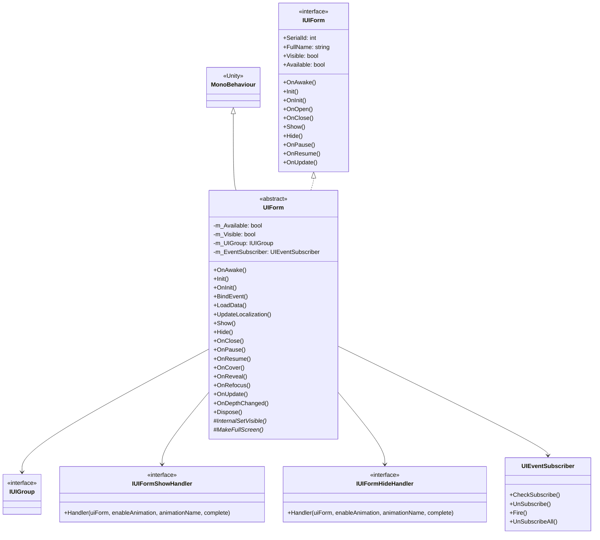
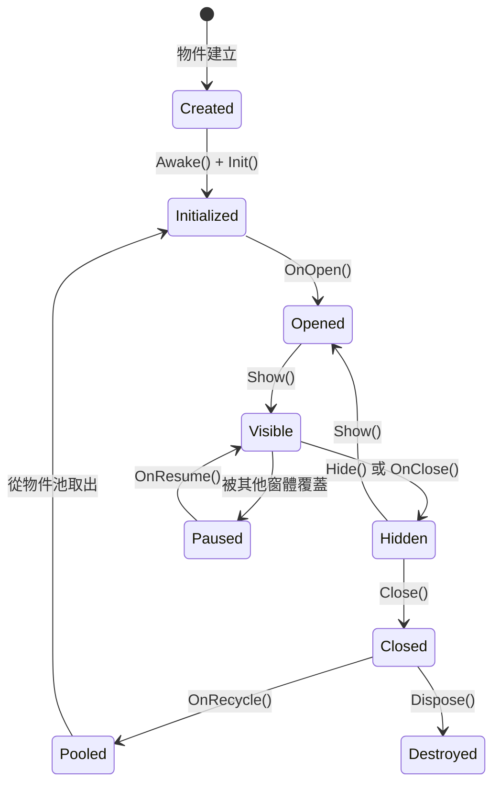

# UIForm

UIForm 是 GameFrameX 框架中所有 UI 窗體的基類，提供了窗體的生命週期管理、可見性控制、事件訂閱和 UI 組整合等功能。

## 概述

UIForm 是 UI 系統的核心類，繼承自 Unity 的 `MonoBehaviour` 並實現了 `IUIForm` 介面。它為 UI 窗體提供了完整的生命週期管理，包括初始化、顯示、隱藏、關閉、暫停、恢復等狀態轉換。

**主要特性：**
- 完整的生命週期回呼機制
- 內建事件訂閱系統
- 顯示/隱藏動畫支援
- 物件池回收機制
- UI 組深度管理
- 本地化語言自動更新

## 類關係圖



## 生命週期流程



## 核心屬性

| 屬性 | 型別 | 描述 |
|------|------|------|
| SerialId | int | 窗體的唯一序列編號 |
| FullName | string | 窗體的完整類名 |
| Name | string | 窗體名稱（對應 GameObject 名稱） |
| Available | bool | 窗體是否可用 |
| Visible | bool | 窗體是否可見 |
| UIGroup | IUIGroup | 所屬的 UI 組 |
| DepthInUIGroup | int | 在 UI 組中的深度 |
| PauseCoveredUIForm | bool | 是否暫停被覆蓋的窗體 |
| IsAwake | bool | 是否已執行過 Awake |
| IsDisableRecycling | bool | 是否禁用回收 |
| IsDisableClosing | bool | 是否禁用關閉 |
| IsCanRecycle | bool | 是否可以被回收 |
| EnableShowAnimation | bool | 是否啟用顯示動畫 |
| EnableHideAnimation | bool | 是否啟用隱藏動畫 |
| UserData | object | 使用者自定義資料 |

## 核心方法

### 初始化流程

#### `OnAwake()` - 喚醒回呼

Unity 生命週期方法，在物件建立時呼叫。用於初始化事件訂閱器並訂閱本地化語言變更事件。

```csharp
public override void OnAwake()
{
    IsAwake = true;
}
```
> Source: [UIForm.cs](https://github.com/GameFrameX/com.gameframex.unity.ui/blob/main/Runtime/UIForm.cs#L433-L436)

#### `Init(...)` - 初始化方法

初始化 UI 窗體，由 UI 管理器呼叫。

**引數：**
- `serialId` (int): 窗體序列編號
- `uiFormAssetPath` (string): 窗體資源路徑
- `uiFormAssetName` (string): 窗體資源名稱
- `uiGroup` (IUIGroup): 所屬的 UI 組
- `onInitAction` (Action~IUIForm~): 初始化前執行的委託
- `pauseCoveredUIForm` (bool): 是否暫停被覆蓋的窗體
- `isNewInstance` (bool): 是否是新例項
- `userData` (object): 使用者自定義資料
- `recycleInterval` (int): 回收間隔（秒）
- `isFullScreen` (bool): 是否全屏

```csharp
public void Init(int serialId, string uiFormAssetPath, string uiFormAssetName, IUIGroup uiGroup, 
    Action<IUIForm> onInitAction, bool pauseCoveredUIForm, bool isNewInstance, 
    object userData, int recycleInterval, bool isFullScreen = false)
```
> Source: [UIForm.cs](https://github.com/GameFrameX/com.gameframex.unity.ui/blob/main/Runtime/UIForm.cs#L555-L599)

#### `OnInit()` - 初始化完成回呼

初始化完成後的回呼，繼承類可重寫此方法進行初始化邏輯。

```csharp
public virtual void OnInit()
{
}
```
> Source: [UIForm.cs](https://github.com/GameFrameX/com.gameframex.unity.ui/blob/main/Runtime/UIForm.cs#L608-L610)

### 顯示與隱藏

#### `OnOpen(object userData)` - 開啟回呼

窗體開啟時呼叫。

```csharp
public virtual void OnOpen(object userData)
{
    m_Available = true;
    Visible = true;
    m_UserData = userData;
}
```
> Source: [UIForm.cs](https://github.com/GameFrameX/com.gameframex.unity.ui/blob/main/Runtime/UIForm.cs#L639-L644)

#### `Show(IUIFormShowHandler handler, Action complete)` - 顯示方法

顯示窗體，由系統呼叫顯示動畫。

**引數：**
- `handler` (IUIFormShowHandler): 顯示處理介面
- `complete` (Action): 完成回呼

```csharp
public abstract void Show(IUIFormShowHandler handler, Action complete);
```
> Source: [UIForm.cs](https://github.com/GameFrameX/com.gameframex.unity.ui/blob/main/Runtime/UIForm.cs#L689)

#### `Hide(IUIFormHideHandler handler, Action complete)` - 隱藏方法

隱藏窗體，由系統呼叫隱藏動畫。

**引數：**
- `handler` (IUIFormHideHandler): 隱藏處理介面
- `complete` (Action): 完成回呼

```csharp
public abstract void Hide(IUIFormHideHandler handler, Action complete);
```
> Source: [UIForm.cs](https://github.com/GameFrameX/com.gameframex.unity.ui/blob/main/Runtime/UIForm.cs#L724)

#### `OnClose(bool isShutdown, object userData)` - 關閉回呼

窗體關閉時呼叫。

**引數：**
- `isShutdown` (bool): 是否是關閉 UI 管理器時觸發
- `userData` (object): 使用者自定義資料

```csharp
public virtual void OnClose(bool isShutdown, object userData)
{
    gameObject?.SetLayerRecursively(m_OriginalLayer);
    m_Available = false;
    Visible = false;
    if (m_IsDisableRecycling)
    {
        return;
    }
    ReleaseStartTime = DateTime.Now;
}
```
> Source: [UIForm.cs](https://github.com/GameFrameX/com.gameframex.unity.ui/blob/main/Runtime/UIForm.cs#L700-L712)

### 暫停與恢復

#### `OnPause()` - 暫停回呼

窗體被其他窗體覆蓋時呼叫。

```csharp
public virtual void OnPause()
{
    m_Available = false;
    Visible = false;
}
```
> Source: [UIForm.cs](https://github.com/GameFrameX/com.gameframex.unity.ui/blob/main/Runtime/UIForm.cs#L733-L737)

#### `OnResume()` - 恢復回呼

窗體從暫停狀態恢復時呼叫。

```csharp
public virtual void OnResume()
{
    m_Available = true;
    Visible = true;
}
```
> Source: [UIForm.cs](https://github.com/GameFrameX/com.gameframex.unity.ui/blob/main/Runtime/UIForm.cs#L746-L750)

### 遮擋處理

#### `OnCover()` - 被遮擋回呼

窗體被其他窗體遮擋時呼叫。

```csharp
public virtual void OnCover()
{
}
```
> Source: [UIForm.cs](https://github.com/GameFrameX/com.gameframex.unity.ui/blob/main/Runtime/UIForm.cs#L759-L761)

#### `OnReveal()` - 取消遮擋回呼

窗體從被遮擋狀態恢復時呼叫。

```csharp
public virtual void OnReveal()
{
}
```
> Source: [UIForm.cs](https://github.com/GameFrameX/com.gameframex.unity.ui/blob/main/Runtime/UIForm.cs#L770-L772)

### 其他回呼

#### `OnRefocus(object userData)` - 啟用回呼

窗體被啟用時呼叫，用於將窗體重新置頂。

```csharp
public virtual void OnRefocus(object userData)
{
}
```
> Source: [UIForm.cs](https://github.com/GameFrameX/com.gameframex.unity.ui/blob/main/Runtime/UIForm.cs#L782-L784)

#### `OnUpdate(float elapseSeconds, float realElapseSeconds)` - 輪詢回呼

每幀呼叫的輪詢方法。

**引數：**
- `elapseSeconds` (float): 邏輯流逝時間（秒）
- `realElapseSeconds` (float): 真實流逝時間（秒）

```csharp
public virtual void OnUpdate(float elapseSeconds, float realElapseSeconds)
{
}
```
> Source: [UIForm.cs](https://github.com/GameFrameX/com.gameframex.unity.ui/blob/main/Runtime/UIForm.cs#L795-L797)

#### `OnDepthChanged(int uiGroupDepth, int depthInUIGroup)` - 深度變更回呼

窗體深度改變時呼叫。

**引數：**
- `uiGroupDepth` (int): UI 組深度
- `depthInUIGroup` (int): 窗體在 UI 組中的深度

```csharp
public void OnDepthChanged(int uiGroupDepth, int depthInUIGroup)
{
    m_DepthInUIGroup = depthInUIGroup;
}
```
> Source: [UIForm.cs](https://github.com/GameFrameX/com.gameframex.unity.ui/blob/main/Runtime/UIForm.cs#L808-L811)

### 事件系統

#### `OnEventSubscribe()` - 事件訂閱回呼

在 `OnEnable` 時呼叫，用於訂閱事件。繼承類可重寫此方法註冊所需事件。

```csharp
protected virtual void OnEventSubscribe()
{
}
```
> Source: [UIForm.cs](https://github.com/GameFrameX/com.gameframex.unity.ui/blob/main/Runtime/UIForm.cs#L508-L510)

#### `OnEventUnSubscribe()` - 事件取消訂閱回呼

在 `OnDisable` 時呼叫，用於取消事件訂閱。

```csharp
protected virtual void OnEventUnSubscribe()
{
}
```
> Source: [UIForm.cs](https://github.com/GameFrameX/com.gameframex.unity.ui/blob/main/Runtime/UIForm.cs#L523-L525)

### 回收與銷燬

#### `OnRecycle()` - 回收回呼

窗體被回收時呼叫，重置窗體狀態。

```csharp
public virtual void OnRecycle()
{
    m_DepthInUIGroup = 0;
    m_PauseCoveredUIForm = true;
}
```
> Source: [UIForm.cs](https://github.com/GameFrameX/com.gameframex.unity.ui/blob/main/Runtime/UIForm.cs#L625-L629)

#### `Dispose()` - 銷燬方法

銷燬窗體，釋放所有資源。

```csharp
public virtual void Dispose()
{
    if (IsDisposed)
    {
        return;
    }
    if (m_EventSubscriber != null)
    {
        m_EventSubscriber.UnSubscribeAll();
        ReferencePool.Release(m_EventSubscriber);
    }
    m_EventSubscriber = null;
    IsDisposed = true;
}
```
> Source: [UIForm.cs](https://github.com/GameFrameX/com.gameframex.unity.ui/blob/main/Runtime/UIForm.cs#L820-L835)

### 子類需實現的方法

#### `InternalSetVisible(bool visible)` - 設定可見性

子類必須實現此方法以處理實際的可見性設定。

```csharp
protected abstract void InternalSetVisible(bool visible);
```
> Source: [UIForm.cs](https://github.com/GameFrameX/com.gameframex.unity.ui/blob/main/Runtime/UIForm.cs#L845)

#### `MakeFullScreen()` - 設定全屏

子類必須實現此方法以處理全屏設定。

```csharp
protected internal abstract void MakeFullScreen();
```
> Source: [UIForm.cs](https://github.com/GameFrameX/com.gameframex.unity.ui/blob/main/Runtime/UIForm.cs#L854)

## 使用示例

### 建立自定義 UIForm

```csharp
using GameFrameX.UI.Runtime;
using UnityEngine;

public class MainMenuForm : UIForm
{
    [SerializeField] private Text titleText;
    [SerializeField] private Button startButton;
    [SerializeField] private Button settingsButton;

    protected override void InternalSetVisible(bool visible)
    {
        gameObject.SetActive(visible);
    }

    protected internal override void MakeFullScreen()
    {
        // 實現全屏邏輯
    }

    public override void OnInit()
    {
        base.OnInit();
        Debug.Log("MainMenuForm 初始化完成");
    }

    public override void BindEvent()
    {
        startButton.onClick.AddListener(OnStartButtonClick);
        settingsButton.onClick.AddListener(OnSettingsButtonClick);
    }

    public override void LoadData()
    {
        // 載入資料
        titleText.text = GetLocalizedString("MainMenu_Title");
    }

    private void OnStartButtonClick()
    {
        // 處理開始按鈕點選
    }

    private void OnSettingsButtonClick()
    {
        // 處理設定按鈕點選
    }

    public override void UpdateLocalization()
    {
        base.UpdateLocalization();
        titleText.text = GetLocalizedString("MainMenu_Title");
    }
}
```
> Source: [UIForm.cs](https://github.com/GameFrameX/com.gameframex.unity.ui/blob/main/Runtime/UIForm.cs#L37-L855)

### 事件訂閱示例

```csharp
public override void OnEventSubscribe()
{
    // 訂閱遊戲事件
    EventSubscriber.CheckSubscribe(PlayerHealthChangedEventArgs.EventId, OnPlayerHealthChanged);
}

private void OnPlayerHealthChanged(object sender, GameEventArgs e)
{
    var args = (PlayerHealthChangedEventArgs)e;
    UpdateHealthBar(args.CurrentHealth, args.MaxHealth);
}

protected override void OnEventUnSubscribe()
{
    // 取消訂閱
    EventSubscriber.UnSubscribe(PlayerHealthChangedEventArgs.EventId, OnPlayerHealthChanged);
}
```
> Source: [UIForm.cs](https://github.com/GameFrameX/com.gameframex.unity.ui/blob/main/Runtime/UIForm.cs#L507-L525)

## 抽象方法說明

以下方法需要在子類中實現：

| 方法 | 描述 |
|------|------|
| `Show(IUIFormShowHandler, Action)` | 顯示窗體並執行動畫 |
| `Hide(IUIFormHideHandler, Action)` | 隱藏窗體並執行動畫 |
| `InternalSetVisible(bool)` | 設定窗體實際可見性 |
| `MakeFullScreen()` | 設定窗體為全屏模式 |

## IUIForm 介面

`UIForm` 實現了 `IUIForm` 介面，該介面定義了所有 UI 窗體必須具備的屬性和方法。介面定義包含：

- 屬性：`SerialId`、`FullName`、`Visible`、`Available`、`UIGroup`、`DepthInUIGroup` 等
- 方法：`Init()`、`OnInit()`、`OnOpen()`、`OnClose()`、`Show()`、`Hide()`、`OnPause()`、`OnResume()`、`OnUpdate()` 等

> 詳細介面定義請參考 [IUIForm.cs](https://github.com/GameFrameX/com.gameframex.unity.ui/blob/main/Runtime/UI/IUIForm.cs)

## 相關連結

- [UIComponent](./5-api-reference.ui-component) - UI 組件參考
- [IUIManager](./5-api-reference.iuimanager) - UI 管理器介面
- [IUIGroup](./5-api-reference.iuigroup) - UI 組介面
- [UI 窗體核心概念](./4-core-concepts.ui-form) - UI 窗體核心概念
- [UI 組系統](./4-core-concepts.ui-group) - UI 組系統
- [事件系統](./6-event-system) - 事件系統
