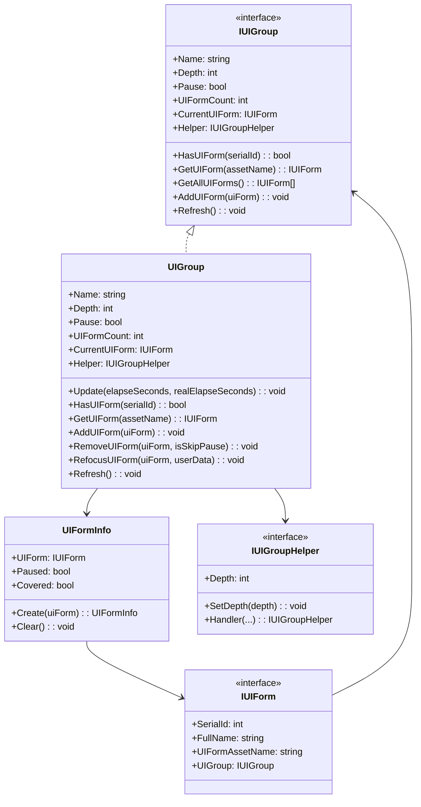
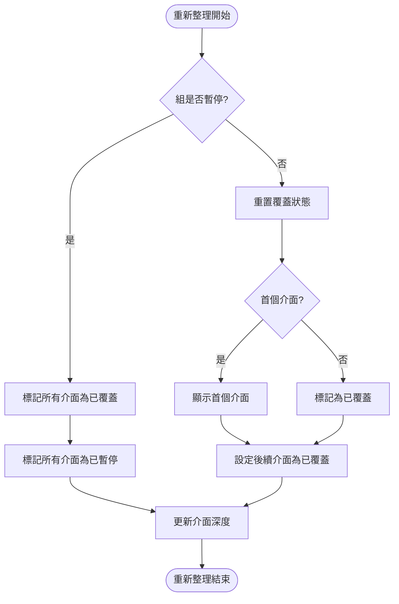
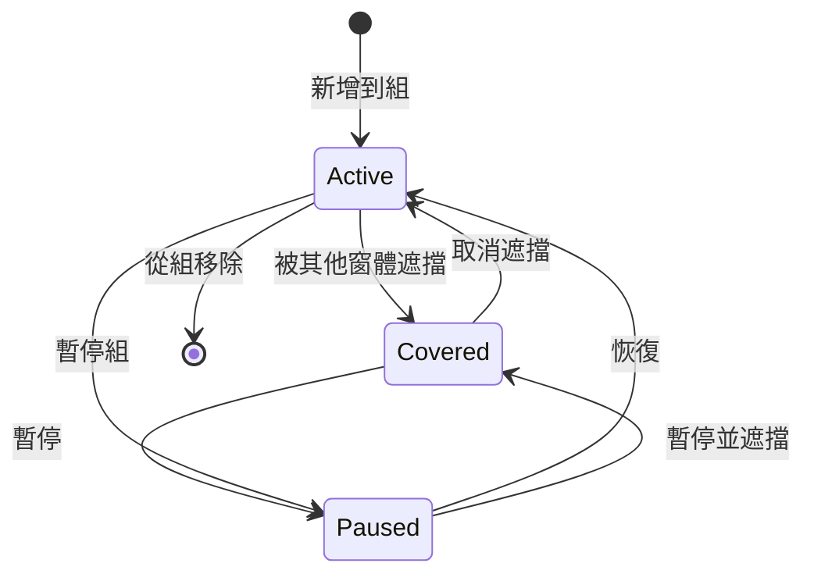

# IUIGroup

介面組介面，定義了 UI 組管理的基本操作。

## 概述

`IUIGroup` 是 GameFrameX UI 系統中的核心介面之一，用於管理一組相關的 UI 窗體。它提供了對 UI 窗體的查詢、新增、移除、重新整理等操作，同時支援深度管理和暫停/恢復功能。

**設計意圖**：UI 組系統允許開發者將 UI 窗體邏輯分組，每組可以獨立控制深度、暫停狀態和顯示順序。例如，可以將"主選單 UI"、"遊戲內 UI"、"彈窗 UI"分別放入不同的組，便於管理和控制。

## 架構



**架構說明**：
- `IUIGroup` 定義了 UI 組的抽象介面
- `UIGroup` 是介面的具體實現，內部使用 `GameFrameworkLinkedList<UIFormInfo>` 維護 UI 窗體列表
- `UIFormInfo` 儲存每個 UI 窗體的狀態資訊（暫停/覆蓋狀態）
- `IUIGroupHelper` 處理平臺特定的 UI 組渲染邏輯

## 核心流程

### UI 組重新整理流程

當 UI 組屬性（深度、暫停狀態）發生變化時，會觸發重新整理流程，更新組內所有 UI 窗體的狀態。



**重新整理邏輯說明**：
1. 如果組處於暫停狀態，所有 UI 窗體都會被標記為"已覆蓋"和"已暫停"
2. 如果組未暫停，首個 UI 窗體會被顯示（取消覆蓋狀態），後續窗體被標記為已覆蓋
3. 在重新整理過程中更新每個 UI 窗體的深度資訊

### UI 窗體生命週期狀態



## 屬性詳解

### Name

```csharp
string Name { get; }
```

獲取 UI 組名稱。該名稱在 UI 管理器中唯一標識該組。

### Depth

```csharp
int Depth { get; set; }
```

獲取或設定 UI 組深度。深度值決定 UI 組的渲染順序，深度值大的組會渲染在深度值小的組之上。

### Pause

```csharp
bool Pause { get; set; }
```

獲取或設定 UI 組是否暫停。當暫停為 `true` 時，組內所有 UI 窗體都會被暫停，不會響應使用者互動。

### UIFormCount

```csharp
int UIFormCount { get; }
```

獲取 UI 組中 UI 窗體的數量。

### CurrentUIForm

```csharp
IUIForm CurrentUIForm { get; }
```

獲取當前最上層（最後新增）的 UI 窗體。

### Helper

```csharp
IUIGroupHelper Helper { get; }
```

獲取 UI 組輔助器，用於處理平臺特定的 UI 組操作。

## 方法詳解

### HasUIForm

```csharp
bool HasUIForm(int serialId);
bool HasUIForm(string uiFormAssetName);
```

檢查 UI 組中是否存在指定的 UI 窗體。

**引數**：
- `serialId` (int): UI 窗體的序列編號
- `uiFormAssetName` (string): UI 窗體的資源名稱

**返回值**：是否存在指定的 UI 窗體

### GetUIForm

```csharp
IUIForm GetUIForm(int serialId);
IUIForm GetUIForm(string uiFormAssetName);
```

從 UI 組中獲取 UI 窗體。

**引數**：
- `serialId` (int): UI 窗體的序列編號
- `uiFormAssetName` (string): UI 窗體的資源名稱

**返回值**：要獲取的 UI 窗體，如果不存在則返回 null

### GetUIForms

```csharp
IUIForm[] GetUIForms(string uiFormAssetName);
void GetUIForms(string uiFormAssetName, List<IUIForm> results);
```

從 UI 組中獲取所有指定資源名稱的 UI 窗體（可能有多個例項）。

**引數**：
- `uiFormAssetName` (string): UI 窗體的資源名稱
- `results` (List<IUIForm>): 用於儲存結果的列表

### GetAllUIForms

```csharp
IUIForm[] GetAllUIForms();
void GetAllUIForms(List<IUIForm> results);
```

獲取 UI 組中的所有 UI 窗體。

**引數**：
- `results` (List<IUIForm>): 用於儲存結果的列表

### AddUIForm

```csharp
void AddUIForm(IUIForm uiForm);
```

往 UI 組增加 UI 窗體。新新增的窗體會成為當前窗體（最上層）。

**引數**：
- `uiForm` (IUIForm): 要增加的 UI 窗體

### InternalHasInstanceUIForm

```csharp
bool InternalHasInstanceUIForm(string uiFormAssetName, IUIForm uiForm);
```

檢查 UI 組中是否存在指定的 UI 窗體例項（內部使用）。

**引數**：
- `uiFormAssetName` (string): UI 窗體的資源名稱
- `uiForm` (IUIForm): 要檢查的 UI 窗體例項

**返回值**：是否存在指定的 UI 窗體例項

### Refresh

```csharp
void Refresh();
```

重新整理 UI 組。當組的深度或暫停狀態發生變化時呼叫此方法更新組內所有 UI 窗體的狀態。

## 使用示例

### 獲取 UI 組並查詢窗體

```csharp
// 透過 UI 管理器獲取 UI 組
var uiGroup = uiManager.GetUIGroup("MainMenuGroup");

// 檢查組中是否存在指定窗體
bool exists = uiGroup.HasUIForm("TestForm");

// 獲取當前窗體
var currentForm = uiGroup.CurrentUIForm;

// 獲取所有窗體
var allForms = uiGroup.GetAllUIForms();
```
> Source: [IUIGroup.cs](https://github.com/GameFrameX/com.gameframex.unity.ui/blob/main/Runtime/UI/IUIGroup.cs#L42-L197)

### 修改 UI 組狀態

```csharp
var uiGroup = uiManager.GetUIGroup("DialogGroup");

// 設定組深度
uiGroup.Depth = 10;

// 暫停組（所有窗體將暫停）
uiGroup.Pause = true;

// 重新整理組狀態
uiGroup.Refresh();
```
> Source: [UIGroup.cs](https://github.com/GameFrameX/com.gameframex.unity.ui/blob/main/Runtime/UI/UIGroup.cs#L106-L142)

### 管理 UI 窗體

```csharp
var uiGroup = uiManager.GetUIGroup("DefaultGroup");

// 新增窗體到組
uiGroup.AddUIForm(uiForm);

// 重新整理組
uiGroup.Refresh();

// 獲取窗體
var form = uiGroup.GetUIForm("MyForm");
```
> Source: [UIGroup.cs](https://github.com/GameFrameX/com.gameframex.unity.ui/blob/main/Runtime/UI/UIGroup.cs#L439-L442)

## 相關連結

- [UIForm](./5-api-reference.ui-form) - UI 窗體介面
- [IUIManager](./5-api-reference.iuimanager) - UI 管理器介面
- [UI 組系統](../4-core-concepts.ui-group) - UI 組系統核心概念
- [UI 組層級](../7-ui-group-hierarchy) - UI 組層級配置
