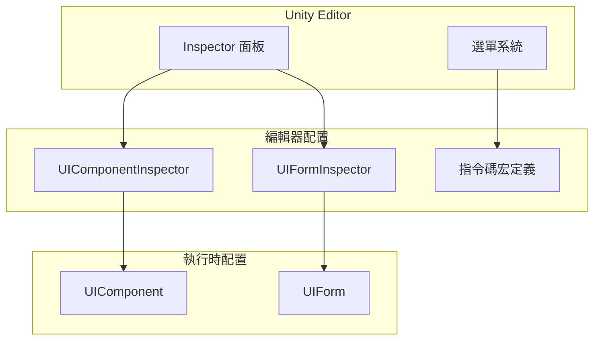
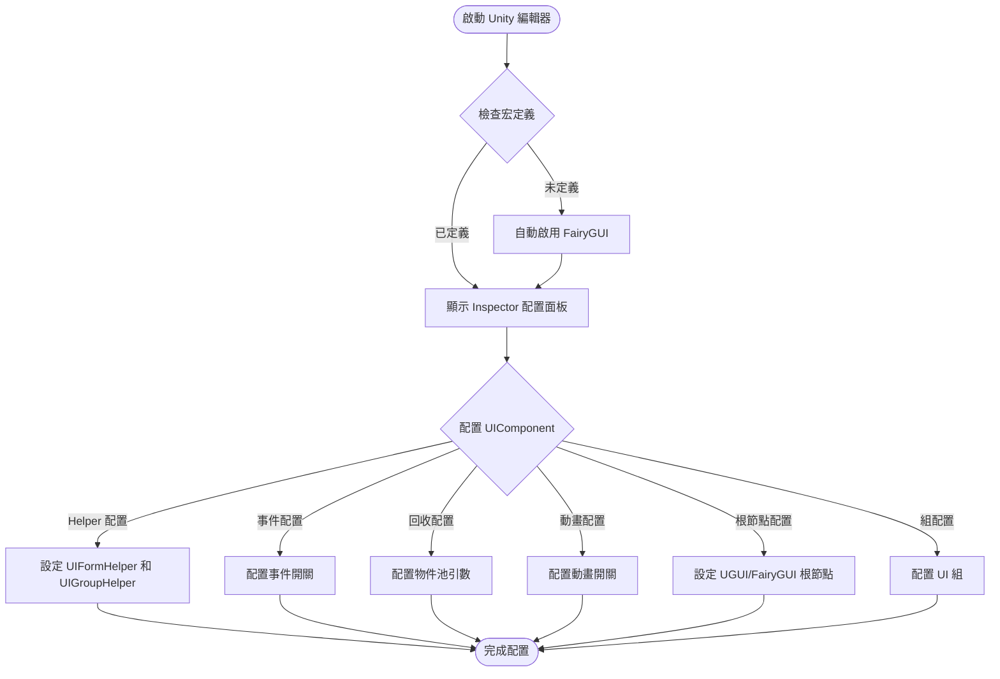

# 編輯器配置

GameFrameX UI 系統提供了一套完整的 Unity 編輯器配置功能，允許開發者透過 Inspector 面板和選單選項靈活配置 UI 系統的各項引數。

## 概述

編輯器配置是 GameFrameX UI 系統的重要組成部分，它提供了兩種主要的配置方式：

1. **Inspector 面板配置**：透過 Unity 編輯器的 Inspector 面板直接配置 UI 組件和窗體
2. **指令碼宏定義切換**：透過選單切換不同的 UI 引擎（UGUI 或 FairyGUI）

這種設計使得 UI 系統的配置變得直觀和便捷，無需編寫程式碼即可完成大部分配置工作。

## UI 組件配置

UIComponent 是 UI 系統的核心組件，其配置透過 `UIComponentInspector` 在 Inspector 面板中呈現。

### 配置介面概覽

```csharp
[CustomEditor(typeof(UIComponent))]
internal sealed class UIComponentInspector : ComponentTypeComponentInspector
```
> Source: [UIComponentInspector.cs](https://github.com/GameFrameX/com.gameframex.unity.ui/blob/main/Editor/UIComponentInspector.cs#L38-L40)

### Helper 配置

在 Inspector 面板中可以配置以下 Helper 類：

| 配置項 | 型別 | 說明 |
|--------|------|------|
| UIForm Helper | UIFormHelperBase | UI 窗體載入輔助器 |
| UIGroup Helper | UIGroupHelperBase | UI 組輔助器 |

```csharp
private HelperInfo<UIFormHelperBase> m_UIFormHelperInfo = new HelperInfo<UIFormHelperBase>("UIForm");
private HelperInfo<UIGroupHelperBase> m_UIGroupHelperInfo = new HelperInfo<UIGroupHelperBase>("UIGroup");
```
> Source: [UIComponentInspector.cs](https://github.com/GameFrameX/com.gameframex.unity.ui/blob/main/Editor/UIComponentInspector.cs#L62-L63)

**重要提示**：UIForm Helper 和 UIGroup Helper 的名稱空間字首必須保持一致，否則會導致初始化失敗。

## 事件系統配置

UIComponent 提供多種事件開關，用於控制是否訂閱特定的 UI 事件：

| 事件配置 | 預設值 | 說明 |
|----------|--------|------|
| EnableOpenUIFormSuccessEvent | true | 啟用開啟介面成功事件 |
| EnableOpenUIFormFailureEvent | true | 啟用開啟介面失敗事件 |
| EnableCloseUIFormCompleteEvent | true | 啟用關閉介面完成事件 |

```csharp
[SerializeField] private bool m_EnableOpenUIFormSuccessEvent = true;
[SerializeField] private bool m_EnableOpenUIFormFailureEvent = true;
[SerializeField] private bool m_EnableCloseUIFormCompleteEvent = true;
```
> Source: [UIComponent.cs](https://github.com/GameFrameX/com.gameframex.unity.ui/blob/main/Runtime/UIComponent.cs#L62-L86)

### 配置說明

- **啟用開啟介面成功事件**：啟用後，當介面開啟成功時會觸發相應事件
- **啟用開啟介面失敗事件**：啟用後，當介面開啟失敗時會觸發相應事件
- **啟用關閉介面完成事件**：啟用後，當介面關閉完成時會觸發相應事件

## 自動回收配置

UIComponent 提供了完善的物件池和自動回收機制配置：

### 回收設定

| 配置項 | 型別 | 預設值 | 說明 |
|--------|------|--------|------|
| EnableAutoReleaseUIForm | bool | true | 是否啟用自動回收介面 |
| RecycleInterval | int | 60 | 介面回收間隔（秒），範圍 10-600 |
| InstanceAutoReleaseInterval | float | 60f | 例項自動釋放間隔（秒） |
| InstanceCapacity | int | 16 | 例項物件池容量 |
| InstanceExpireTime | float | 60f | 例項過期時間（秒） |

```csharp
[SerializeField] private bool m_EnableAutoReleaseUIForm = true;
[SerializeField] private float m_InstanceAutoReleaseInterval = 60f;
[SerializeField] private int m_InstanceCapacity = 16;
[SerializeField] private float m_InstanceExpireTime = 60f;
[SerializeField] private int m_RecycleInterval = 60;
```
> Source: [UIComponent.cs](https://github.com/GameFrameX/com.gameframex.unity.ui/blob/main/Runtime/UIComponent.cs#L77-L141)

### 配置說明

- **EnableAutoReleaseUIForm**：禁用後，關閉介面時不會自動釋放資源，適用於需要快取複用的場景
- **RecycleInterval**：設定物件池自動回收可回收物件的時間間隔，範圍 10-600 秒
- **InstanceAutoReleaseInterval**：介面例項物件池自動釋放可釋放物件的間隔秒數
- **InstanceCapacity**：介面例項物件池的容量，池中最多可快取的介面例項數量
- **InstanceExpireTime**：介面例項物件池物件過期秒數，介面關閉後在此時間內可被複用

## 動畫配置

UIComponent 支援介面開啟和關閉時的動畫效果：

| 配置項 | 型別 | 預設值 | 說明 |
|--------|------|--------|------|
| IsEnableUIShowAnimation | bool | false | 是否啟用介面顯示動畫 |
| IsEnableUIHideAnimation | bool | false | 是否啟用介面隱藏動畫 |

```csharp
[SerializeField] private bool m_IsEnableUIShowAnimation = false;
[SerializeField] private bool m_IsEnableUIHideAnimation = false;
```
> Source: [UIComponent.cs](https://github.com/GameFrameX/com.gameframex.unity.ui/blob/main/Runtime/UIComponent.cs#L95-L104)

## UI 根節點配置

根據不同的 UI 引擎，需要配置相應的根節點：

### UGUI 根節點

```csharp
[SerializeField] private Transform m_InstanceUGUIRoot = null;
```
> Source: [UIComponent.cs](https://github.com/GameFrameX/com.gameframex.unity.ui/blob/main/Runtime/UIComponent.cs#L152)

### FairyGUI 根節點

```csharp
[SerializeField] private Transform m_InstanceFairyGUIRoot = null;
```
> Source: [UIComponent.cs](https://github.com/GameFrameX/com.gameframex.unity.ui/blob/main/Runtime/UIComponent.cs#L161)

## UI 組配置

UIComponent 支援配置多個 UI 組（UIGroup），每個組可以設定獨立的名稱和深度：

```csharp
[SerializeField] private UIGroup[] m_UIGroups = new UIGroup[]
{
    new UIGroup(UIGroupConstants.Hidden.Depth, UIGroupConstants.Hidden.Name),
};
```
> Source: [UIComponent.cs](https://github.com/GameFrameX/com.gameframex.unity.ui/blob/main/Runtime/UIComponent.cs#L206-L208)

**重要提示**：
- 必須要設定至少一個 UIGroup
- 強烈推薦不要將多個 UIGroup 設定為相同的 Depth（深度）

## UI 窗體配置

UIForm 是 UI 系統中的窗體基類，其配置透過 `UIFormInspector` 在 Inspector 面板中呈現：

### 窗體基本屬性

| 屬性 | 型別 | 說明 |
|------|------|------|
| FullName | string | 窗體完整名稱 |
| SerialId | int | 窗體序列 ID |
| Available | bool | 窗體是否可用 |
| Visible | bool | 窗體是否可見 |
| IsInit | bool | 窗體是否已初始化 |
| IsDisableRecycling | bool | 是否禁用回收 |
| IsDisableClosing | bool | 是否禁用關閉 |
| DepthInUIGroup | int | 在 UI 組中的深度 |
| PauseCoveredUIForm | bool | 被覆蓋時是否暫停 |

```csharp
[CustomEditor(typeof(UIForm), true)]
internal sealed class UIFormInspector : GameFrameworkInspector
```
> Source: [UIFormInspector.cs](https://github.com/GameFrameX/com.gameframex.unity.ui/blob/main/Editor/UIFormInspector.cs#L41-L42)

### 窗體動畫屬性

| 屬性 | 型別 | 說明 |
|------|------|------|
| EnableShowAnimation | bool | 是否啟用顯示動畫 |
| ShowAnimationName | string | 顯示動畫名稱 |
| EnableHideAnimation | bool | 是否啟用隱藏動畫 |
| HideAnimationName | string | 隱藏動畫名稱 |

## 指令碼宏定義配置

GameFrameX UI 系統支援兩種 UI 引擎：UGUI 和 FairyGUI。透過指令碼宏定義可以切換不同的引擎。

### 宏定義符號

| 宏定義 | 說明 |
|--------|------|
| ENABLE_UI_UGUI | 啟用 UGUI 適配 |
| ENABLE_UI_FAIRYGUI | 啟用 FairyGUI 適配 |

```csharp
public const string UGUIScriptingDefineSymbol = "ENABLE_UI_UGUI";
public const string FairyGUIScriptingDefineSymbol = "ENABLE_UI_FAIRYGUI";
```
> Source: [UISystemScriptingDefineSymbols.cs](https://github.com/GameFrameX/com.gameframex.unity.ui/blob/main/Editor/UISystemScriptingDefineSymbols.cs#L42-L43)

### 切換 UI 引擎

在 Unity 編輯器中，可以透過選單切換 UI 引擎：

1. 開啟選單：**GameFrameX → Scripting Define Symbols**
2. 選擇所需的 UI 系統：
   - **Enable UGUI(開啟UGUI適配)** - 切換到 UGUI
   - **Enable FairyGUI(開啟FairyGUI適配)** - 切換到 FairyGUI

```csharp
[MenuItem("GameFrameX/Scripting Define Symbols/Enable UGUI(開啟UGUI適配)", false, 1000)]
public static void EnableUGUISystem()
{
    ScriptingDefineSymbols.RemoveScriptingDefineSymbol(FairyGUIScriptingDefineSymbol);
    ScriptingDefineSymbols.AddScriptingDefineSymbol(UGUIScriptingDefineSymbol);
}

[MenuItem("GameFrameX/Scripting Define Symbols/Enable FairyGUI(開啟FairyGUI適配)", false, 1001)]
public static void EnableFairyGUISystem()
{
    ScriptingDefineSymbols.RemoveScriptingDefineSymbol(UGUIScriptingDefineSymbol);
    ScriptingDefineSymbols.AddScriptingDefineSymbol(FairyGUIScriptingDefineSymbol);
}
```
> Source: [UISystemScriptingDefineSymbols.cs](https://github.com/GameFrameX/com.gameframex.unity.ui/blob/main/Editor/UISystemScriptingDefineSymbols.cs#L48-L63)

### 自動檢測

系統提供了自動檢測機制，在編輯器載入時會檢查是否已定義 UI 系統的宏定義符號：

```csharp
[InitializeOnLoadMethod]
static void Run()
{
    var hasUGUIScriptingDefineSymbol = ScriptingDefineSymbols.HasScriptingDefineSymbol(...);
    var hasFairyGUIScriptingDefineSymbol = ScriptingDefineSymbols.HasScriptingDefineSymbol(...);
    
    if (!(hasFairyGUIScriptingDefineSymbol || hasUGUIScriptingDefineSymbol))
    {
        EditorUtility.DisplayDialog("沒有檢測到UI系統的宏定義存在", "將自動啟用FairyGUI的UI系統", "我知道了");
        UISystemScriptingDefineSymbols.EnableFairyGUISystem();
    }
}
```
> Source: [UISystemScriptingDefineCheckHandler.cs](https://github.com/GameFrameX/com.gameframex.unity.ui/blob/main/Editor/UISystemScriptingDefineCheckHandler.cs#L15-L47)

如果沒有檢測到任何 UI 系統的宏定義，系統會自動啟用 FairyGUI 作為預設引擎。

## UI 配置特性

`OptionUIConfigAttribute` 特性類用於標記 UI 配置，支援 FairyGUI 和 UGUI 兩種框架：

```csharp
[AttributeUsage(AttributeTargets.Class)]
public sealed class OptionUIConfigAttribute : Attribute
{
    public string PackageName { get; private set; }  // FairyGUI 包名
    public string Path { get; private set; }         // UGUI 資源路徑
    public bool IsResource { get; private set; }    // 是否為資源路徑
}
```
> Source: [OptionUIConfigAttribute.cs](https://github.com/GameFrameX/com.gameframex.unity.ui/blob/main/Runtime/Attribute/OptionUIConfigAttribute.cs#L44-L74)

### 使用示例

```csharp
// FairyGUI 配置
[OptionUIConfigAttribute("MyFairyGUIPackage")]
public class MyUIForm : UIForm { }

// UGUI 預製體路徑配置
[OptionUIConfigAttribute("Assets/Prefabs/UI/")]
public class MyUIForm : UIForm { }

// UGUI 資源路徑配置
[OptionUIConfigAttribute(true)]  // isResource = true
public class MyUIForm : UIForm { }
```

## 架構圖



## 配置流程圖



## 常見配置問題

### 1. Helper 名稱空間不一致

**問題**：初始化失敗，提示 Helper 設定錯誤

**解決方案**：確保 UIForm Helper 和 UIGroup Helper 的名稱空間字首一致

### 2. UI 組深度重複

**問題**：多個 UI 組設定了相同的深度值

**解決方案**：在 Inspector 面板中為每個 UI 組設定不同的 Depth 值

### 3. 未設定根節點

**問題**：執行時提示根節點設定錯誤

**解決方案**：在 Inspector 面板中正確設定 UGUI Root 或 FairyGUI Root

## 相關連結

- [UI 組件](./4-core-concepts.ui-component)
- [UI 窗體](./4-core-concepts.ui-form)
- [UI 組系統](./4-core-concepts.ui-group)
- [物件池管理](./4-core-concepts.object-pool)
- [UI 屬性](./8-configuration.attributes)
- [平臺支援](./9-platforms)
