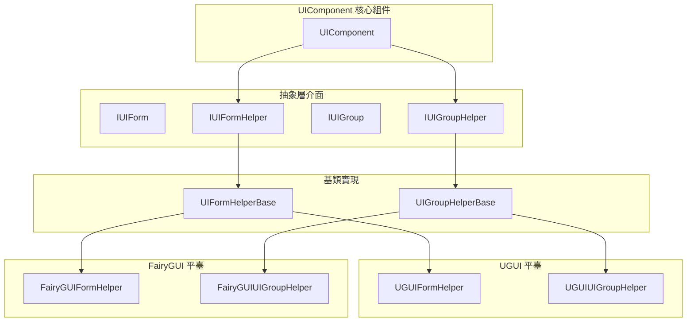
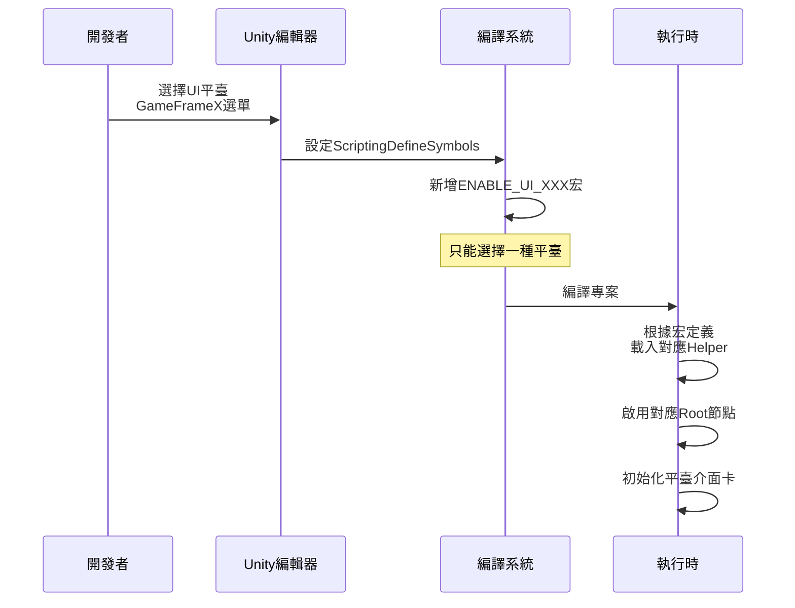

# 平臺支援

GameFrameX UI 系統支援多種 UI 渲染平臺，透過統一的介面抽象，使開發者能夠在不同的 UI 系統之間靈活切換，同時保持業務程式碼的一致性。

## 概述

GameFrameX UI 框架採用平臺無關的設計理念，透過抽象層（Helper 介面）隔離不同 UI 系統的實現差異。目前支援兩大主流 UI 平臺：

| UI 平臺 | 宏定義符號 | 說明 |
|---------|------------|------|
| **UGUI** | `ENABLE_UI_UGUI` | Unity 官方內建的 UI 系統 |
| **FairyGUI** | `ENABLE_UI_FAIRYGUI` | 專業的第三方 UI 解決方案 |

這種設計使得業務邏輯程式碼無需修改，僅透過切換宏定義即可在不同 UI 系統之間遷移，有效降低了平臺切換成本。

## 架構設計



### 核心組件說明

| 組件 | 職責 |
|------|------|
| **UIComponent** | UI 核心管理器，負責協調各 Helper 工作 |
| **IUIFormHelper** | UI 窗體輔助器介面，定義窗體的建立、例項化和釋放 |
| **IUIGroupHelper** | UI 組輔助器介面，定義組的管理和深度控制 |
| **UIFormHelperBase** | 窗體輔助器抽象基類，提供平臺無關的統一實現 |
| **UIGroupHelperBase** | 組輔助器抽象基類，提供平臺無關的統一實現 |

## 平臺切換配置

### 透過指令碼宏定義切換

在 Unity 編輯器中，透過選單配置 UI 平臺：

```
GameFrameX → Scripting Define Symbols → Enable UGUI(開啟UGUI適配)
GameFrameX → Scripting Define Symbols → Enable FairyGUI(開啟FairyGUI適配)
```

> Source: [UISystemScriptingDefineSymbols.cs](https://github.com/GameFrameX/com.gameframex.unity.ui/blob/main/Editor/UISystemScriptingDefineSymbols.cs#L42-L63)

宏定義符號說明：

| 宏定義 | 作用 |
|--------|------|
| `ENABLE_UI_UGUI` | 啟用 UGUI 平臺支援 |
| `ENABLE_UI_FAIRYGUI` | 啟用 FairyGUI 平臺支援 |

切換原理：
```csharp
public static void EnableUGUISystem()
{
    ScriptingDefineSymbols.RemoveScriptingDefineSymbol(FairyGUIScriptingDefineSymbol);
    ScriptingDefineSymbols.AddScriptingDefineSymbol(UGUIScriptingDefineSymbol);
}

public static void EnableFairyGUISystem()
{
    ScriptingDefineSymbols.RemoveScriptingDefineSymbol(UGUIScriptingDefineSymbol);
    ScriptingDefineSymbols.AddScriptingDefineSymbol(FairyGUIScriptingDefineSymbol);
}
```
> Source: [UISystemScriptingDefineSymbols.cs](https://github.com/GameFrameX/com.gameframex.unity.ui/blob/main/Editor/UISystemScriptingDefineSymbols.cs#L49-L63)

### 執行時平臺適配

UIComponent 在執行時透過條件編譯自動適配對應平臺：

```csharp
protected override void Awake()
{
    // ...
    var namespaceName = ImplementationComponentType.Namespace;

#if ENABLE_UI_FAIRYGUI
    if (!namespaceName.StartsWithFast("GameFrameX.UI.FairyGUI.Runtime"))
    {
        Debug.LogError("UI組件的 ComponentType 設定錯誤。請設定和 UI 系統一致的組件.");
        return;
    }

    if (m_InstanceFairyGUIRoot == null)
    {
        Debug.LogError("UI組件的 FAIRY GUI Root 設定錯誤。請設定");
        return;
    }

    m_InstanceFairyGUIRoot.gameObject.SetActive(true);
    if (m_InstanceUGUIRoot != null)
    {
        m_InstanceUGUIRoot.gameObject.SetActive(false);
    }

#elif ENABLE_UI_UGUI
    if (!namespaceName.StartsWithFast("GameFrameX.UI.UGUI.Runtime"))
    {
        Debug.LogError("UI組件的 ComponentType 設定錯誤。請設定和 UI 系統一致的組件.");
        return;
    }

    if (m_InstanceUGUIRoot == null)
    {
        Debug.LogError("UI組件的 UGUI Root 設定錯誤。請設定");
        return;
    }

    m_InstanceUGUIRoot.gameObject.SetActive(true);
#endif
}
```
> Source: [UIComponent.cs](https://github.com/GameFrameX/com.gameframex.unity.ui/blob/main/Runtime/UIComponent.cs#L370-L416)

## 根節點配置

每個 UI 平臺都需要配置獨立的根節點（Root Transform），用於掛載該平臺建立的 UI 介面。

| 屬性 | 型別 | 說明 |
|------|------|------|
| `UGUIRoot` | `Transform` | UGUI 介面的根節點 |
| `FairyGUIRoot` | `Transform` | FairyGUI 介面的根節點 |

```csharp
/// 獲取 UGUI 根節點變換組件。
public Transform UGUIRoot
{
    get { return m_InstanceUGUIRoot; }
}

/// 獲取 FairyGUI 根節點變換組件。
public Transform FairyGUIRoot
{
    get { return m_InstanceFairyGUIRoot; }
}
```
> Source: [UIComponent.cs](https://github.com/GameFrameX/com.gameframex.unity.ui/blob/main/Runtime/UIComponent.cs#L235-L249)

### 配置示例

在 Unity 編輯器中配置根節點：

1. 建立空 GameObject 命名為 `UGUIRoot`，設定 Layer 為 `UI`
2. 建立空 GameObject 命名為 `FairyGUIRoot`
3. 在 UIComponent 組件中分別將這兩個 GameObject 賦值給對應屬性

```csharp
[SerializeField] private Transform m_InstanceUGUIRoot = null;
[SerializeField] private Transform m_InstanceFairyGUIRoot = null;
```
> Source: [UIComponent.cs](https://github.com/GameFrameX/com.gameframex.unity.ui/blob/main/Runtime/UIComponent.cs#L151-L161)

## Helper 配置

UI 系統透過 Helper（輔助器）來實現平臺特定的功能：

### UIFormHelper 配置

負責 UI 窗體的例項化、建立和釋放：

| 平臺 | 預設型別名稱 |
|------|--------------|
| FairyGUI | `GameFrameX.UI.FairyGUI.Runtime.FairyGUIFormHelper` |
| UGUI | `GameFrameX.UI.UGUI.Runtime.UGUIFormHelper` |

```csharp
[SerializeField] private string m_UIFormHelperTypeName = "GameFrameX.UI.FairyGUI.Runtime.FairyGUIFormHelper";
[SerializeField] private UIFormHelperBase m_CustomUIFormHelper = null;
```
> Source: [UIComponent.cs](https://github.com/GameFrameX/com.gameframex.unity.ui/blob/main/Runtime/UIComponent.cs#L169-L179)

### UIGroupHelper 配置

負責 UI 組的管理和深度控制：

| 平臺 | 預設型別名稱 |
|------|--------------|
| FairyGUI | `GameFrameX.UI.FairyGUI.Runtime.FairyGUIUIGroupHelper` |
| UGUI | `GameFrameX.UI.UGUI.Runtime.UGUIUIGroupHelper` |

```csharp
[SerializeField] private string m_UIGroupHelperTypeName = "GameFrameX.UI.FairyGUI.Runtime.FairyGUIUIGroupHelper";
[SerializeField] private UIGroupHelperBase m_CustomUIGroupHelper = null;
```
> Source: [UIComponent.cs](https://github.com/GameFrameX/com.gameframex.unity.ui/blob/main/Runtime/UIComponent.cs#L187-L197)

## 抽象基類設計

### UIFormHelperBase

```csharp
public abstract class UIFormHelperBase : MonoBehaviour, IUIFormHelper
{
    /// 例項化介面
    public abstract object InstantiateUIForm(object uiFormAsset);

    /// 建立介面
    public abstract IUIForm CreateUIForm(object uiFormInstance, Type uiFormType, object userData);

    /// 釋放介面
    public abstract void ReleaseUIForm(object uiFormAsset, object uiFormInstance, object assetHandle, string uiFormAssetPath, string uiFormAssetName);
}
```
> Source: [UIFormHelperBase.cs](https://github.com/GameFrameX/com.gameframex.unity.ui/blob/main/Runtime/UIFormHelperBase.cs#L42-L81)

### UIGroupHelperBase

```csharp
public abstract class UIGroupHelperBase : MonoBehaviour, IUIGroupHelper
{
    /// 獲取介面組深度
    public abstract int Depth { get; protected set; }

    /// 設定介面組深度
    public abstract void SetDepth(int depth);

    /// 建立介面組
    public abstract IUIGroupHelper Handler(Transform root, string groupName, string uiGroupHelperTypeName, IUIGroupHelper customUIGroupHelper, int depth = 0);
}
```
> Source: [UIGroupHelperBase.cs](https://github.com/GameFrameX/com.gameframex.unity.ui/blob/main/Runtime/UIGroupHelperBase.cs#L41-L77)

## 平臺切換流程



## 自定義 Helper 開發

如需實現自定義 UI 平臺，可按以下步驟擴充套件：

### 1. 建立自定義 Helper 類

```csharp
namespace GameFrameX.UI.Custom.Runtime
{
    public class CustomUIFormHelper : UIFormHelperBase
    {
        public override object InstantiateUIForm(object uiFormAsset)
        {
            // 實現例項化邏輯
        }

        public override IUIForm CreateUIForm(object uiFormInstance, Type uiFormType, object userData)
        {
            // 實現建立邏輯
        }

        public override void ReleaseUIForm(object uiFormAsset, object uiFormInstance, object assetHandle, string uiFormAssetPath, string uiFormAssetName)
        {
            // 實現釋放邏輯
        }
    }
}
```

### 2. 配置自定義 Helper

在 UIComponent 組件中設定自定義 Helper：

- 設定 `Custom UIForm Helper` 屬性
- 確保名稱空間與 ComponentType 一致

### 3. 新增宏定義

在 `Project Settings → Player → Other Settings → Scripting Define Symbols` 中新增自定義平臺的宏定義（如 `ENABLE_UI_CUSTOM`），並在程式碼中使用條件編譯。

## 常見問題

### Q1: 切換平臺後報錯"ComponentType 設定錯誤"

**原因**: ComponentType 的名稱空間與當前啟用的宏定義不匹配。

**解決方案**: 
- 使用 UGUI 時，確保 ComponentType 繼承自 `GameFrameX.UI.UGUI.Runtime`
- 使用 FairyGUI 時，確保 ComponentType 繼承自 `GameFrameX.UI.FairyGUI.Runtime`

### Q2: UI 介面顯示但點選無響應

**原因**: 未正確設定對應平臺的 Root 節點。

**解決方案**: 
- 檢查 UGUI Root 或 FairyGUI Root 是否正確賦值
- 確保根節點的 Layer 設定正確（UGUI 通常使用 "UI" 層）

### Q3: 如何同時支援 UGUI 和 FairyGUI？

**當前設計不支援同時啟用兩個平臺**。如需雙平臺支援，建議：
- 打包不同版本的客戶端
- 或在執行時動態切換（需自行擴充套件框架）

## 相關連結

- [UI 組件](./4-core-concepts.ui-component) - UI 組件核心概念
- [UI 窗體](./4-core-concepts.ui-form) - UI 窗體開發指南
- [UI 組系統](./4-core-concepts.ui-group) - UI 組層級管理
- [API 參考 - UIComponent](./5-api-reference.ui-component) - UIComponent 完整 API
- [API 參考 - IUIManager](./5-api-reference.iuimanager) - UI 管理器介面
