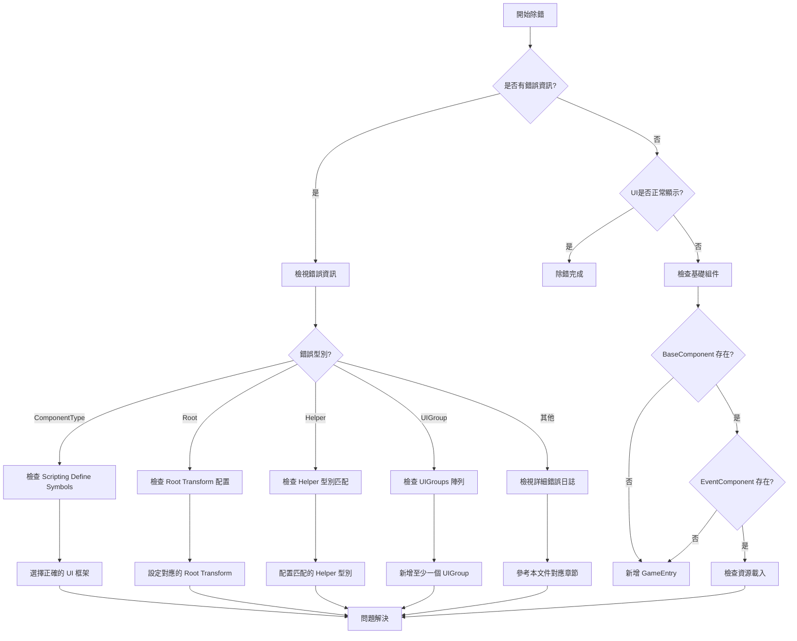

# 常見問題

本文件列出了使用 GameFrameX UI 框架時常見的錯誤場景、原因分析以及解決方案。

## 概述

GameFrameX UI 框架是一個支援 UGUI 和 FairyGUI 兩種 UI 解決方案的模組化系統。由於存在多種配置選項和平臺特定的設定，開發者在整合過程中可能會遇到各種配置錯誤。本文件旨在幫助開發者快速定位和解決常見問題。

## 常見問題列表

### 1. UI 組件型別不匹配

**錯誤資訊：**
```
UI組件的 ComponentType 設定錯誤。請設定和 UI 系統一致的組件.
```

**原因分析：**
此錯誤發生在 `UIComponent` 的 `ComponentType` 設定與專案中的 Scripting Define Symbols 不一致時。例如，專案中啟用了 `ENABLE_UI_FAIRYGUI`，但 `ComponentType` 卻設定為 UGUI 實現類。

**解決方案：**
1. 確認專案使用的 UI 框架（UGUI 或 FairyGUI）
2. 開啟選單 `GameFrameX → Scripting Define Symbols`
3. 選擇對應的 UI 框架：
   - 選擇 `Enable UGUI(開啟UGUI適配)` 使用 UGUI
   - 選擇 `Enable FairyGUI(開啟FairyGUI適配)` 使用 FairyGUI
4. 確保 `UIComponent` 的 `ComponentType` 與啟用的框架一致

> Source: [Runtime/UIComponent.cs](https://github.com/GameFrameX/com.gameframex.unity.ui/blob/main/Runtime/UIComponent.cs#L378-L400)

---

### 2. Root 變換未設定

**錯誤資訊：**
```
UI組件的 FAIRY GUI Root 設定錯誤。請設定
UI組件的 UGUI Root 設定錯誤。請設定
```

**原因分析：**
`UIComponent` 需要指定 UI 根節點的 Transform。當使用 FairyGUI 時需要設定 `FairyGUI Root`，使用 UGUI 時需要設定 `UGUI Root`。

**解決方案：**
1. 在場景中建立一個空的 GameObject 作為 UI 根節點
2. 在 `UIComponent` 組件的 Inspector 面板中：
   - 使用 FairyGUI 時：設定 `FairyGUI Root` 為 FairyGUI 的容器 Transform
   - 使用 UGUI 時：設定 `UGUI Root` 為 Canvas 或 UI 容器 Transform

```csharp
// 示例：執行時動態設定 Root（不推薦，僅用於除錯）
var uiComponent = gameObject.GetComponent<UIComponent>();
// 需在編輯器中正確配置 Root
```

> Source: [Runtime/UIComponent.cs](https://github.com/GameFrameX/com.gameframex.unity.ui/blob/main/Runtime/UIComponent.cs#L385-L389)

---

### 3. UI Form Helper 型別不匹配

**錯誤資訊：**
```
UI組件的 UI Form Helper 設定錯誤。請設定和 ComponentType 型別 一致.
```

**原因分析：**
`UI Form Helper` 的型別必須與 `ComponentType` 匹配。如果使用了 FairyGUI 但設定了 UGUI 的 Helper，會導致此錯誤。

**解決方案：**
1. 在 `UIComponent` 的 Inspector 面板中
2. 找到 `UI Form Helper Type Name` 欄位
3. 根據使用的 UI 框架選擇正確的型別：
   - FairyGUI：`GameFrameX.UI.FairyGUI.Runtime.FairyGUIFormHelper`
   - UGUI：`GameFrameX.UI.UGUI.Runtime.UGUIFormHelper`

> Source: [Runtime/UIComponent.cs](https://github.com/GameFrameX/com.gameframex.unity.ui/blob/main/Runtime/UIComponent.cs#L417-L421)

---

### 4. UI Group Helper 型別不匹配

**錯誤資訊：**
```
UI組件的 UI Group Helper 設定錯誤。請設定和 ComponentType 型別 一致.
```

**原因分析：**
與 UI Form Helper 類似，`UI Group Helper` 也必須與 `ComponentType` 匹配。

**解決方案：**
1. 在 `UIComponent` 的 Inspector 面板中
2. 找到 `UI Group Helper Type Name` 欄位
3. 根據使用的 UI 框架選擇正確的型別：
   - FairyGUI：`GameFrameX.UI.FairyGUI.Runtime.FairyGUIUIGroupHelper`
   - UGUI：`GameFrameX.UI.UGUI.Runtime.UGUIUIGroupHelper`

> Source: [Runtime/UIComponent.cs](https://github.com/GameFrameX/com.gameframex.unity.ui/blob/main/Runtime/UIComponent.cs#L423-L427)

---

### 5. UI Group 未配置

**錯誤資訊：**
```
必須要設定至少一個UIGroup
```

**原因分析：**
`UIComponent` 至少需要配置一個 UI Group，否則無法正確管理 UI 窗體的層級和顯示。

**解決方案：**
1. 在 `UIComponent` 的 Inspector 面板中
2. 找到 `UIGroups` 陣列
3. 點選 `+` 新增至少一個 UI Group
4. 為每個 Group 設定：
   - `GroupName`：分組名稱（不能為空）
   - `Depth`：顯示優先順序（建議不同分組設定不同的 Depth）

> Source: [Editor/UIComponentInspector.cs](https://github.com/GameFrameX/com.gameframex.unity.ui/blob/main/Editor/UIComponentInspector.cs#L169-L172)

---

### 6. Scripting Define Symbol 未設定

**錯誤現象：**
UI 系統完全不工作，控制檯無錯誤資訊或顯示上述配置錯誤。

**原因分析：**
專案中既沒有啟用 `ENABLE_UI_UGUI` 也沒有啟用 `ENABLE_UI_FAIRYGUI`，導致 UI 系統的條件編譯程式碼無法正確編譯。

**解決方案：**
1. 開啟 Unity 選單 `GameFrameX → Scripting Define Symbols`
2. 選擇一種 UI 框架：
   - `Enable UGUI(開啟UGUI適配)` - 啟用 UGUI 支援
   - `Enable FairyGUI(開啟FairyGUI適配)` - 啟用 FairyGUI 支援
3. 重新編譯專案

> Source: [Editor/UISystemScriptingDefineSymbols.cs](https://github.com/GameFrameX/com.gameframex.unity.ui/blob/main/Editor/UISystemScriptingDefineSymbols.cs#L42-L63)

---

### 7. 基礎組件缺失

**錯誤資訊：**
```
Base component is invalid.
Event component is invalid.
```

**原因分析：**
`UIComponent` 依賴 `BaseComponent` 和 `EventComponent`，如果這些組件不存在於場景中，UI 系統將無法正常工作。

**解決方案：**
1. 確保場景中存在 `GameEntry` 物件
2. 確保 `GameEntry` 上掛載了以下組件：
   - `BaseComponent`（GameFrameX 核心組件）
   - `EventComponent`（事件系統組件）

```csharp
// 檢查組件是否存在的示例程式碼
var baseComponent = GameEntry.GetComponent<BaseComponent>();
if (baseComponent == null)
{
    Debug.LogError("BaseComponent 未找到，請確保場景中存在 GameEntry");
}

var eventComponent = GameEntry.GetComponent<EventComponent>();
if (eventComponent == null)
{
    Debug.LogError("EventComponent 未找到，請確保場景中存在 GameEntry");
}
```

> Source: [Runtime/UIComponent.cs](https://github.com/GameFrameX/com.gameframex.unity.ui/blob/main/Runtime/UIComponent.cs#L462-L474)

---

### 8. UI Form 開啟失敗

**錯誤資訊：**
```
Open UI form failure, asset name '{0}', pause covered UI form '{1}', error message '{2}'.
Can not find UI form '{0}'.
```

**原因分析：**
1. UI Form 資源路徑不正確
2. UI Form 資源未在對應路徑下
3. UI Form Helper 配置錯誤

**解決方案：**
1. 檢查 UI Form 的資源路徑是否正確
2. 確認 `OptionUIConfigAttribute` 配置正確：
   - FairyGUI：設定正確的 `PackageName`
   - UGUI：設定正確的資源 `Path`
3. 檢查資源是否已新增到資源管理系統

```csharp
// 正確的 UI Form 配置示例
[OptionUIConfigAttribute(packageName = "MyFairyGUIPackage")]
public class MyUIForm : UIForm
{
    // ...
}

// 或 UGUI 版本
[OptionUIConfigAttribute(path = "UI/Prefabs/MyForm")]
public class MyUIForm : UIForm
{
    // ...
}
```

> Source: [Runtime/BaseUIManager.Open.cs](https://github.com/GameFrameX/com.gameframex.unity.ui/blob/main/Runtime/BaseUIManager.Open.cs)

---

### 9. OptionUIConfigAttribute 配置錯誤

**錯誤資訊：**
```
PackageName or Path is null
```

**原因分析：**
`OptionUIConfigAttribute` 要求至少提供 `packageName`（FairyGUI）或 `path`（UGUI）之一，不能兩者都為空。

**解決方案：**
確保 UI Form 類上的特性配置正確：

```csharp
// 錯誤示例 - 會丟擲異常
[OptionUIConfigAttribute()]  // 錯誤：兩者都為空
public class BadUIForm : UIForm { }

// 正確示例 - FairyGUI
[OptionUIConfigAttribute(packageName = "MainPackage")]
public class FairyGUIForm : UIForm { }

// 正確示例 - UGUI
[OptionUIConfigAttribute(path = "UI/Forms/MainForm")]
public class UGUIForm : UIForm { }
```

> Source: [Runtime/Attribute/OptionUIConfigAttribute.cs](https://github.com/GameFrameX/com.gameframex.unity.ui/blob/main/Runtime/Attribute/OptionUIConfigAttribute.cs#L86-L93)

---

### 10. UI Group 不存在

**錯誤資訊：**
```
UI group '{0}' is not exist.
```

**原因分析：**
嘗試開啟或操作一個不存在的 UI Group。

**解決方案：**
1. 在 `UIComponent` 中預先配置所需的 UI Group
2. 開啟 UI Form 時使用已存在的 Group 名稱

```csharp
// 正確使用已存在的 UI Group
UIManager.Instance.OpenUIForm<MyForm>("MainGroup", userData: null);
```

> Source: [Runtime/BaseUIManager.UIGroup.cs](https://github.com/GameFrameX/com.gameframex.unity.ui/blob/main/Runtime/BaseUIManager.UIGroup.cs#L159-L162)

---

## 除錯技巧

### 啟用詳細日誌

可以透過配置獲取更詳細的執行時資訊：

```csharp
// 在啟動時設定更詳細的日誌級別
Log.SetLogHelper(new UnityLogHelper());
Log.AddDebuger();
```

### 檢查 UI 組件狀態

```csharp
// 獲取 UIComponent 並檢查狀態
var uiComponent = GameEntry.GetComponent<UIComponent>();
if (uiComponent == null)
{
    Debug.LogError("UIComponent 未找到");
    return;
}

// 檢查 UI Group 數量
Debug.Log($"UI Group Count: {uiComponent.UIGroupCount}");
```

### 事件訂閱問題排查

如果 UI 事件沒有觸發，檢查是否正確訂閱：

```csharp
// 確保在正確的時機訂閱事件
void OnOpenUIFormSuccess(object sender, OpenUIFormSuccessEventArgs e)
{
    Debug.Log($"UI Form 開啟成功: {e.UIFormAssetName}");
}

// 訂閱事件
UIManager.Instance.OpenUIFormSuccess += OnOpenUIFormSuccess;
```

---

## 常見錯誤流程圖



---

## 相關連結

- [UI 組件](./4-core-concepts.ui-component) - UIComponent 核心概念
- [UI 窗體](./4-core-concepts.ui-form) - UIForm 窗體概念
- [UI 組系統](./4-core-concepts.ui-group) - UI Group 層級管理
- [編輯器配置](./8-configuration.editor) - 編輯器配置選項
- [UI 屬性](./8-configuration.attributes) - UI 屬性配置
- [平臺支援](./9-platforms) - 平臺相關配置
