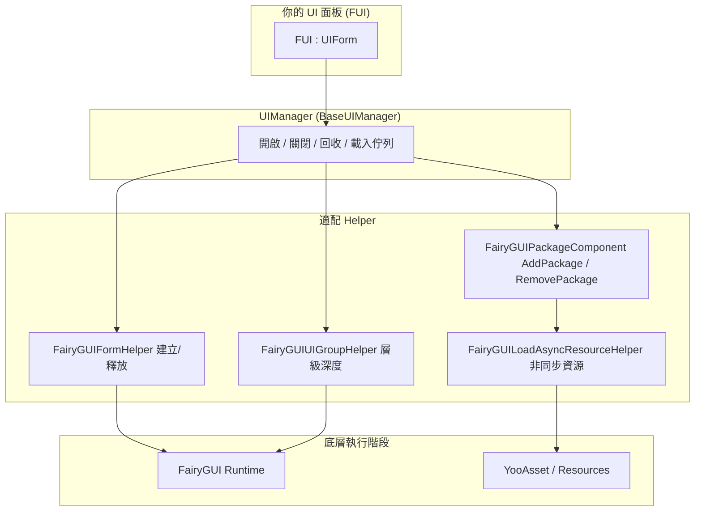

# 概述:GameFrameX UI FairyGUI 是什麼

GameFrameX UI FairyGUI 是一個 Unity UI 適配層，它把 [FairyGUI](https://www.fairygui.com/) 框架封裝進 GameFrameX 模組化遊戲框架，為你提供統一的 UI 生命週期管理(開啟、關閉、回收、動畫)以及基於 YooAsset 的非同步資源載入。你只需讓面板類別繼承 `FUI` 基類，就能用同一套 API 管理 FairyGUI 介面，並獲得物件池重複使用、單例去重、載入排隊等開箱即用的能力。

## 快速開始

### 第 1 步：安裝套件

編輯 Unity 專案的 `Packages/manifest.json`,新增 `scopedRegistries` 與相依套件(目前版本為 3.4.3):

```json
{
  "scopedRegistries": [
    {
      "name": "GameFrameX",
      "url": "https://gameframex.upm.alianblank.uk",
      "scopes": [
        "com.gameframex"
      ]
    }
  ],
  "dependencies": {
    "com.gameframex.unity.ui.fairygui": "3.4.3"
  }
}
```

`scopes` 決定哪些套件會從這個 registry 解析：只有名稱以 `com.gameframex` 開頭的套件才會從它取得。

也可以改用以下任一方式安裝：

- 在 `manifest.json` 的 `dependencies` 中直接寫 Git 位址:`"com.gameframex.unity.ui.fairygui": "https://github.com/gameframex/com.gameframex.unity.ui.fairygui.git"`
- 在 Unity **Package Manager** 中選擇 **Add package from git URL**,填入 `https://github.com/gameframex/com.gameframex.unity.ui.fairygui.git`
- 把儲存庫複製到 Unity 專案的 `Packages` 目錄下，自動載入

Source: [README.md](https://github.com/GameFrameX/com.gameframex.unity.ui.fairygui/blob/main/README.md#L67-L100)

### 第 2 步：撰寫你的 UI 面板

所有 FairyGUI 面板繼承 `FUI` 基類。透過 C# 特性(Attribute)即可設定顯示/隱藏動畫，無需撰寫額外程式碼：

```csharp
[OptionUIShowAnimation(typeof(FadeInAnimation))]
[OptionUIHideAnimation(typeof(FadeOutAnimation))]
public class AnimatedPanel : FUI { }
```

Source: [README.md](https://github.com/GameFrameX/com.gameframex.unity.ui.fairygui/blob/main/README.md#L101-L111)

`FUI` 繼承自 `UIForm`,並把 FairyGUI 的 `GObject` 公開為屬性。框架在顯示介面時會把 `GObject`、動畫開關與動畫名稱交給顯示處理器：

```csharp
[UnityEngine.Scripting.Preserve]
public class FUI : UIForm
{
    [UnityEngine.Scripting.Preserve]
    public GObject GObject { get; private set; }

    [UnityEngine.Scripting.Preserve]
    public override void Show(IUIFormShowHandler handler, Action complete)
    {
        if (handler != null)
        {
            handler.Handler(GObject, EnableShowAnimation, ShowAnimationName, complete);
        }
        // ...
    }
}
```

Source: [Runtime/FUI.cs](https://github.com/GameFrameX/com.gameframex.unity.ui.fairygui/blob/main/Runtime/FUI.cs#L42-L80)

(註：上文屬性上的 `UnityEngine.Scripture.Preserve` 為節選所示；原始碼中的真實寫法是 `UnityEngine.Scripting.Preserve`,用於防止 IL2CPP 裁剪。)

### 第 3 步：初始化並使用 UIManager

`UIManager` 是核心管理器，內部從 `GameEntry` 取得 `FairyGUIPackageComponent` 來管理 FairyGUI 套件的載入與卸載：

```csharp
[UnityEngine.Scripting.Preserve]
internal sealed partial class UIManager : BaseUIManager
{
    [UnityEngine.Scripting.Preserve]
    private FairyGUIPackageComponent FairyGuiPackage { get; set; }

    [UnityEngine.Scripting.Preserve]
    public override void SetResourceManager(IAssetManager assetManager)
    {
        base.SetResourceManager(assetManager);
        FairyGuiPackage = GameEntry.GetComponent<FairyGUIPackageComponent>();
        GameFrameworkGuard.NotNull(FairyGuiPackage, nameof(FairyGuiPackage));
    }
}
```

Source: [Runtime/UIManager.cs](https://github.com/GameFrameX/com.gameframex.unity.ui.fairygui/blob/main/Runtime/UIManager.cs#L42-L92)

初始化時若場景中缺少 `FairyGUIPackageComponent`,`GameFrameworkGuard.NotNull` 會直接拋出例外——確保先掛好該元件再呼叫 `SetResourceManager`。

### 第 4 步(可選)：依路徑尋找 GObject

```csharp
// 取得某個 GObject 的層級路徑
string path = gObject.GetUIPath();

// 透過路徑反查 GObject
GObject obj = FairyGUIPathFinderHelper.GetUIFromPath("GRoot/Group/MyButton");
```

Source: [README.md](https://github.com/GameFrameX/com.gameframex.unity.ui.fairygui/blob/main/README.md#L113-L120)

## 運作原理速覽

整個套件按層次協作:`UIManager` 統一調度開啟/關閉/回收與載入排隊，具體工作分派給各個 Helper,底層依賴 FairyGUI 執行階段與 YooAsset 資源系統：



各元件職責一覽：

| 元件 | 類型 | 說明 |
|------|------|------|
| `UIManager` | `internal sealed partial class`,繼承 `BaseUIManager` | 中央 UI 管理器，負責介面開啟、關閉與回收生命週期，拆分在 `UIManager.cs` / `UIManager.Open.cs` / `UIManager.Close.cs` 多個部分檔案中 |
| `FUI` | `public class`,繼承 `UIForm` | 所有 FairyGUI 面板的基類，公開 `GObject` 與可見性回呼，面板從這裡繼承 |
| `FairyGUIPackageComponent` | MonoBehaviour | 管理 FairyGUI 套件的載入與卸載 |
| `FairyGUIFormHelper` | Helper | 負責介面實例化、建立與釋放 |
| `FairyGUIUIGroupHelper` | Helper | 管理 UI 群組深度與層級 |
| `FairyGUILoadAsyncResourceHelper` | Helper | 把 FairyGUI 的資源請求橋接到 YooAsset 非同步載入 |
| `FairyGUIPathFinderHelper` | Helper | 基於路徑的 GObject 尋找工具 |
| `BindablePropertyExtension` | 擴充 | MVVM 繫結支援，自動清理 `BindableProperty` 事件 |

Source: [Runtime/UIManager.cs](https://github.com/GameFrameX/com.gameframex.unity.ui.fairygui/blob/main/Runtime/UIManager.cs#L34-L92) · [Runtime/FUI.cs](https://github.com/GameFrameX/com.gameframex.unity.ui.fairygui/blob/main/Runtime/FUI.cs#L34-L53) · [README.md](https://github.com/GameFrameX/com.gameframex.unity.ui.fairygui/blob/main/README.md#L40-L65)

核心能力一覽：

- **完整 UI 生命週期** — 統一 API 開啟、關閉、回收與動畫
- **非同步資源載入** — 基於 YooAsset 的 FairyGUI 套件與資源非同步載入
- **物件池重複使用** — UI 介面實例入池重複使用，減少 GC 分配
- **單例去重** — 自動防止重複建立同一介面
- **載入排隊** — 合併針對同一介面的併發開啟請求
- **特性驅動設定** — 用 C# 特性控制 UI 群組、顯示/隱藏動畫
- **MVVM 繫結支援** — `BindablePropertyExtension` 自動清理繫結事件
- **雙資源通道** — 同時支援 `Resources.Load` 與 YooAsset AssetBundle
- **IL2CPP 安全** — `Preserve` 特性防止程式碼被裁剪

## 接下來

- 完整安裝方式與更多用法範例:[README.md](https://github.com/GameFrameX/com.gameframex.unity.ui.fairygui/blob/main/README.md)
- 官方文件(含各模組詳細說明):https://gameframex.doc.alianblank.com
- 版本歷史：儲存庫根目錄的 `CHANGELOG.md`
- 交流群:QQ 467608841 / 233840761