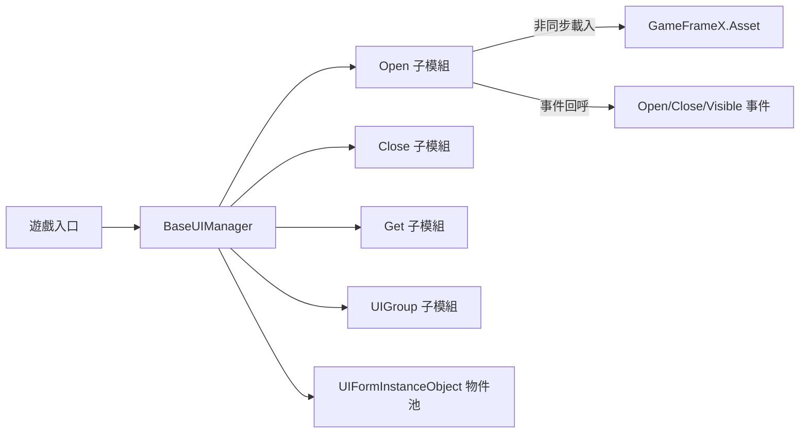

# 框架簡介

GameFrameX.UI 是 GameFrameX 遊戲開發框架的 UI 子模組，提供統一的介面管理功能，支援 UGUI 與 FairyGUI 兩種 UI 方案，內建介面分組、物件池與生命週期事件等常用功能，適合作為 Unity 商業專案的基礎 UI 層。

## 快速開始

完成以下三步即可在你的 Unity 專案中啟用 UI 模組。

1. 透過 Package Manager 新增套件：在 Unity 中選擇 **Window → Package Manager → + → Add package from git URL**,輸入：
   ```
   https://github.com/gameframex/com.gameframex.unity.ui.git
   ```
   或在專案 `Packages/manifest.json` 的 `dependencies` 中加入同一 URL。
2. 建立一個繼承 `BaseUIManager` 的管理器類別(或直接使用框架內建的 `UIManager`),在遊戲啟動入口完成模組註冊，框架會自動初始化 UI 子系統。
3. 為每個介面 Prefab 撰寫 `IUIForm` 實作腳本，透過 `[OptionUIGroup]` 等特性標註分組、顯隱動畫與多實例策略，然後呼叫 `OpenUIForm` 即可開啟介面。

## 工作原理速覽

核心入口是 `BaseUIManager`,它聚合了載入、回收、分組、事件四大子功能，對應四個分檔案：
[BaseUIManager.cs](https://github.com/GameFrameX/com.gameframex.unity.ui/blob/main/Runtime/BaseUIManager.cs#L39-L80) 定義管理器骨架；
[BaseUIManager.Open.cs](https://github.com/GameFrameX/com.gameframex.unity.ui/blob/main/Runtime/BaseUIManager.Open.cs#L36-L60) 提供開啟介面的事件與方法；
`BaseUIManager.Close.cs` 處理關閉；
`BaseUIManager.Get.cs` 負責依序列號取得介面；
`BaseUIManager.UIGroup.cs` 管理 UI 分組根節點。



介面實例透過 [BaseUIManager.UIFormInstanceObject.cs](https://github.com/GameFrameX/com.gameframex.unity.ui/blob/main/Runtime/BaseUIManager.UIFormInstanceObject.cs) 維持物件池，閒置實例依 `m_RecycleInterval`(預設 60 秒) 自動回收；載入中的實例由 `m_UIFormsBeingLoaded` 字典追蹤。

## 主要功能

| 功能 | 說明 | 關鍵檔案 |
|------|------|----------|
| 統一 UI 介面 | 一套 `IUIManager` 同時支援 UGUI 與 FairyGUI | [BaseUIManager.cs](https://github.com/GameFrameX/com.gameframex.unity.ui/blob/main/Runtime/BaseUIManager.cs#L39-L80) |
| 分組管理 | 透過特性宣告 UI 所在分組，自動建立對應根節點 | [Runtime/Attribute/OptionUIGroupAttribute.cs](https://github.com/GameFrameX/com.gameframex.unity.ui/blob/main/Runtime/Attribute/OptionUIGroupAttribute.cs) |
| 物件池 | 自動重複使用閒置實例，降低頻繁開關介面的開銷 | [BaseUIManager.UIFormInstanceObject.cs](https://github.com/GameFrameX/com.gameframex.unity.ui/blob/main/Runtime/BaseUIManager.UIFormInstanceObject.cs) |
| 顯隱動畫 | 透過特性設定開啟/關閉動畫 | [OptionUIShowAnimationAttribute.cs](https://github.com/GameFrameX/com.gameframex.unity.ui/blob/main/Runtime/Attribute/OptionUIShowAnimationAttribute.cs),[OptionUIHideAnimationAttribute.cs](https://github.com/GameFrameX/com.gameframex.unity.ui/blob/main/Runtime/Attribute/OptionUIHideAnimationAttribute.cs) |
| 多實例控制 | 透過特性宣告同一介面是否允許多個實例並存 | [OptionUIAllowMultiInstanceAttribute.cs](https://github.com/GameFrameX/com.gameframex.unity.ui/blob/main/Runtime/Attribute/OptionUIAllowMultiInstanceAttribute.cs) |
| 完整事件 | 提供開啟成功/失敗、關閉、可見變更等事件 | [EventArgs/OpenUIFormSuccessEventArgs.cs](https://github.com/GameFrameX/com.gameframex.unity.ui/blob/main/Runtime/EventArgs/OpenUIFormSuccessEventArgs.cs) 等 |

## 編輯器擴充

模組內建 Unity 編輯器檢查，自動注入腳本巨集定義，避免執行階段缺少元件而發生錯誤。詳見 [Editor/UISystemScriptingDefineSymbols.cs](https://github.com/GameFrameX/com.gameframex.unity.ui/blob/main/Editor/UISystemScriptingDefineSymbols.cs) 與 [Editor/UISystemScriptingDefineCheckHandler.cs](https://github.com/GameFrameX/com.gameframex.unity.ui/blob/main/Editor/UISystemScriptingDefineCheckHandler.cs)。
介面 Prefab 的自訂檢視器位於 [Editor/UIFormInspector.cs](https://github.com/GameFrameX/com.gameframex.unity.ui/blob/main/Editor/UIFormInspector.cs);UIComponent 檢視器詳見 [Editor/UIComponentInspector.cs](https://github.com/GameFrameX/com.gameframex.unity.ui/blob/main/Editor/UIComponentInspector.cs)。

## 版本

目前最新版本與變更記錄見 [CHANGELOG.md](https://github.com/GameFrameX/com.gameframex.unity.ui/blob/main/CHANGELOG.md)。

## 相關連結

- 關於 UI 分組的設定細節，見《UI 分組》
- 關於介面開啟與生命週期，見《開啟/關閉介面》
- 關於事件訂閱範例，見《UI 事件》
- 官方文件主站：https://gameframex.doc.alianblank.com/