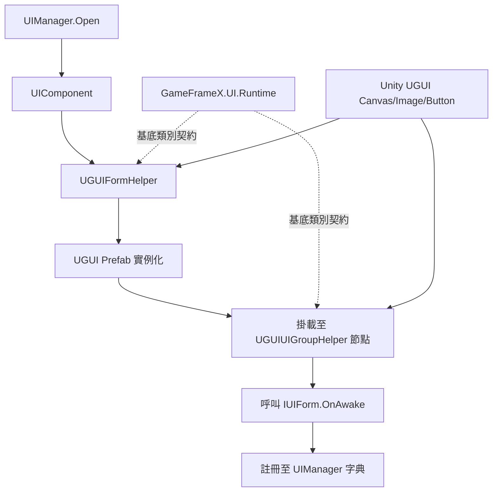

# 運作原理：UGUI 與 GameFrameX UI 系統的配接器關係

本套件是 GameFrameX UI Runtime 在 Unity UGUI 後端上運作的官方配接器層。它實作了 `UIFormHelperBase`、`UIGroupHelperBase` 等抽象基底類別，將 UGUI 的 `GameObject` / `Canvas` / `RectTransform` 連接到框架的 `UIComponent` / `UIManager` 生命週期。如此一來，無需修改遊戲業務程式碼，即可替換或共存不同的 UI 後端。

## 配接器層總覽

| 配接器類別 | 繼承的基底類別 | 職責 |
|--------|------------|------|
| `UGUIFormHelper` | `UIFormHelperBase` | 處理 UI 表單的實例化、建立與釋放；處理 UI 群組掛載與動畫開關 |
| `UGUIUIGroupHelper` | `UIGroupHelperBase` | 管理 UI 群組的深度（`z = depth * 1000`）與節點層級 |
| `UGUICodeGenerator` (Editor) | — | 一鍵產生 Prefab 欄位與綁定的 UI 程式碼 |
| `UGUIComponentInspector` (Editor) | — | 在 Inspector 中以視覺化方式綁定元件參照 |
| `UGUIButtonExtension` / `UGUIImageExtension` / `RectTransformExtension` | — | UGUI 原生元件的擴充方法 |
| `UIImage` | `Image` | 為 UGUI `Image` 加入非同步載入與替換功能 |
| `UIManager` / `UGUI` | — | 框架端的執行階段進入點與抽象 UI 基底類別 |

## 運作原理快速總覽



在整條鏈路中，框架端只看見 `IUIForm` 與 `IUIGroup` 這兩個抽象，UGUI 配接器層負責將 Unity 原生型別轉換為這些抽象。反過來，業務腳本只需繼承 `UGUI` 抽象基底類別，就能接收與後端無關的 OnAwake / OnShow / OnHide 等回呼。

## 核心配接器要點

### 1. UI 表單實例化

`UGUIFormHelper.InstantiateUIForm` 會原樣回傳資源物件，實際的 GameObject 則由上層資源管線以非同步方式載入並傳入。`CreateUIForm` 會將 `uiFormInstance as GameObject` 強制轉型為 UGUI 節點，並透過 `GetOrAddComponent` 附加業務腳本。

```csharp
// Source: Runtime/UGUIFormHelper.cs#L74-L78
[UnityEngine.Scripting.Preserve]
public override object InstantiateUIForm(object uiFormAsset)
{
    return (UnityEngine.Object)uiFormAsset;
}
```

### 2. UI 表單掛載與群組歸屬

`CreateUIForm` 會讀取型別上的 `OptionUIGroupAttribute`、`OptionUIShowAnimationAttribute`、`OptionUIHideAnimationAttribute`，若未標示則使用 `UIComponent` 的全域開關。最後會設定節點的 `Transform.SetParent(helper.transform)` 將其掛載到對應的 UI 群組，並將 `localScale` 歸一化。

```csharp
// Source: Runtime/UGUIFormHelper.cs#L91-L163
[UnityEngine.Scripting.Preserve]
public override IUIForm CreateUIForm(object uiFormInstance, Type uiFormType, object userData)
{
    var uiGameObject = uiFormInstance as GameObject;
    if (uiGameObject == null)
    {
        Log.Error($"UI form instance type {uiFormType} is invalid.");
        return null;
    }

    var componentType = uiGameObject.GetOrAddComponent(uiFormType);
    if (!(componentType is IUIForm uiForm))
    {
        Log.Error($"UI form instance type {uiFormType} is invalid.");
        return null;
    }

    if (uiForm.IsAwake == false)
    {
        uiForm.OnAwake();
    }
    // ... 省略群組掛載與動畫設定 ...
    uiTransform.SetParent(helper.transform);
    uiTransform.localScale = Vector3.one;
    return uiForm;
}
```

### 3. UI 群組深度控制

UGUI 透過 `Canvas` 的渲染順序或節點 Z 值控制前後層級，配接器層選擇了最直接的方式：設定 `localPosition.z = depth * 1000`，每個群組之間相隔 1000 個單位，因此不同群組之間不會發生相互遮擋。

```csharp
// Source: Runtime/UGUIUIGroupHelper.cs#L65-L70
[UnityEngine.Scripting.Preserve]
public override void SetDepth(int depth)
{
    Depth = depth;
    transform.localPosition = new Vector3(0, 0, depth * 1000);
}
```

### 4. 抽象 UI 基底類別

業務腳本繼承 `UGUI` 之後，會透過 `UGUIComponent` / `UGUIElementPropertyAttribute` 與 Prefab 中的 UGUI 控制項綁定。框架會在 `OnAwake` 階段完成欄位注入，並在執行階段呼叫 `OnShow`、`OnHide`、`OnClose` 等生命週期方法。

## 下一步

- 若想了解如何掛載並開啟第一個 UI，請參閱《快速入門》
- 若想在編輯器中一鍵產生與 Prefab 同步的 UI 程式碼，請參閱《做法：使用 UGUI 程式碼產生器》
- 若想要自訂 UI 後端（例如 FairyGUI / UI Toolkit），只需重複使用 `UIFormHelperBase` / `UIGroupHelperBase` 即可