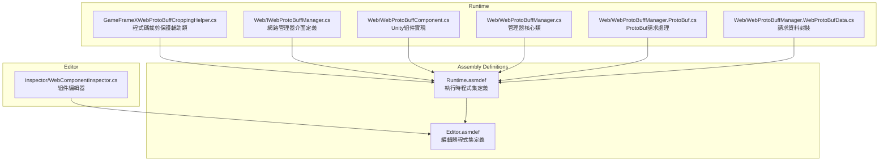
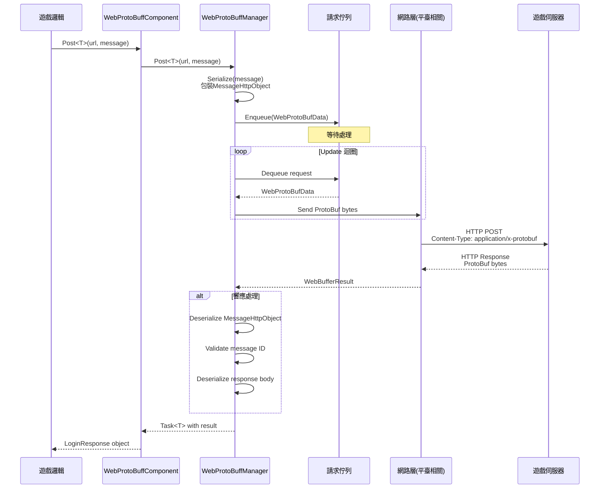
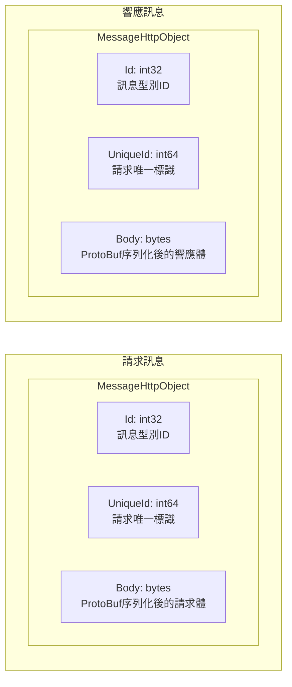

# 外掛介紹

GameFrameX Web ProtoBuff 外掛是一個專為 Unity 遊戲設計的網路請求組件，基於 Protocol Buffer（ProtoBuf）提供高效、型別安全的 HTTP 通訊功能。

## 概述

Web ProtoBuff 組件（WebProtoBuffComponent）是 GameFrameX 遊戲框架的核心網路模組之一，專門用於處理基於 Protocol Buffer 格式的網路請求。在現代遊戲開發中，ProtoBuf 因其高效的序列化能力和緊湊的資料傳輸格式，被廣泛應用於客戶端與伺服器之間的通訊。

該外掛的主要職責包括：

- **ProtoBuf 訊息序列化與反序列化**：自動將 C# 物件序列化為 ProtoBuf 位元組流，並從響應中反序列化出對應的訊息物件
- **非同步網路請求**：基於 `Task<T>` 的非同步 API，支援 async/await 模式，與 Unity 的協程系統無縫整合
- **請求佇列管理**：內部使用佇列機制管理待傳送的請求，支援連線數限制和請求優先順序
- **跨平臺支援**：針對不同平臺（WebGL、Standalone、移動端）提供相應的網路實現
- **超時控制**：可配置的超時時間，確保請求不會無限等待

### 核心價值

1. **型別安全**：透過泛型機制，在編譯時確保請求和響應型別的正確性
2. **高效傳輸**：ProtoBuf 的二進位制格式比 JSON 更緊湊，序列化/反序列化速度更快
3. **易於使用**：簡潔的 API 設計，開發者只需關注業務邏輯，無需處理底層網路細節
4. **框架整合**：深度整合到 GameFrameX 框架中，遵循框架的設計規範和生命週期管理

## 架構

### 組件架構

Web ProtoBuff 組件在 GameFrameX 框架中的架構層次如下：

```mermaid
flowchart TD
    subgraph Client["客戶端層"]
        GameLogic[遊戲邏輯程式碼]
    end

    subgraph Component["組件層"]
        WebProtoBuffComponent[WebProtoBuffComponent]
    end

    subgraph Module["模組層"]
        IWebProtoBuffManager[IWebProtoBuffManager 介面]
        WebProtoBuffManager[WebProtoBuffManager 實現]
    end

    subgraph Framework["框架層"]
        GameFrameworkEntry[GameFrameworkEntry]
        GameFrameworkModule[GameFrameworkModule 基類]
    end

    subgraph Network["網路層"]
        WebGL[UnityWebRequest<br/>WebGL平臺]
        HttpClient[HttpWebRequest<br/>其他平臺]
    end

    subgraph Data["資料層"]
        Serializer[SerializerHelper<br/>ProtoBuf序列化]
        ProtoHandler[ProtoMessageIdHandler<br/>訊息ID處理]
    end

    GameLogic --> WebProtoBuffComponent
    WebProtoBuffComponent --> IWebProtoBuffManager
    IWebProtoBuffManager <|.. WebProtoBuffManager
    WebProtoBuffManager --> GameFrameworkEntry
    WebProtoBuffManager --> GameFrameworkModule
    WebProtoBuffManager --> WebGL
    WebProtoBuffManager --> HttpClient
    WebProtoBuffManager --> Serializer
    WebProtoBuffManager --> ProtoHandler
```

**架構說明：**

1. **客戶端層**：遊戲業務邏輯程式碼呼叫 WebProtoBuffComponent 發起網路請求
2. **組件層**：WebProtoBuffComponent 作為 Unity 組件，提供面向業務的 API，是開發者直接互動的入口點
3. **模組層**：IWebProtoBuffManager 定義介面規範，WebProtoBuffManager 實現具體的網路請求邏輯
4. **框架層**：GameFrameworkEntry 負責模組的建立和初始化，GameFrameworkModule 提供模組的基礎功能
5. **網路層**：根據執行平臺選擇合適的網路實現（WebGL 使用 UnityWebRequest，其他平臺使用 HttpWebRequest）
6. **資料層**：負責 ProtoBuf 訊息的序列化/反序列化，以及訊息型別的 ID 對映

### 檔案結構

外掛的原始碼組織結構如下：



### 核心類說明

| 類名 | 職責 | 訪問級別 |
|------|------|----------|
| WebProtoBuffComponent | Unity 組件，對外提供網路請求 API | public sealed |
| WebProtoBuffManager | 網路請求的具體實現，管理請求佇列和處理邏輯 | public partial |
| WebProtoBufData | 封裝單個請求的資料（URL、資料、Task） | private sealed |
| IWebProtoBuffManager | 定義網路管理器的介面規範 | public interface |

## 核心流程

### 請求處理流程

當遊戲程式碼呼叫 `Post<T>` 方法傳送 ProtoBuf 請求時，整個處理流程如下：



### 訊息封裝格式

外掛使用統一的訊息封裝格式進行通訊：



1. **Id**: 訊息型別識別符號，用於路由到正確的解析器
2. **UniqueId**: 請求的唯一標識，用於關聯請求和響應
3. **Body**: 實際的業務資料，經過 ProtoBuf 序列化

## 功能特性

### 1. Protocol Buffer 原生支援

外掛原生支援 Protocol Buffer 訊息格式，使用 protobuf-net 庫進行序列化：

- 訊息類需繼承 `MessageObject` 基類
- 使用 `[ProtoContract]` 和 `[ProtoMember]` 屬性標記
- 支援複雜巢狀型別和集合型別

### 2. 非同步程式設計模型

基於 `Task<T>` 的非同步 API 設計：

- 使用 async/await 語法，程式碼簡潔易懂
- 支援取消操作（CancellationToken）
- 與 Unity 的生命週期完美整合

### 3. 超時控制

可配置的超時機制：

- 預設超時時間：5 秒
- 可透過組件屬性或程式碼動態設定
- 支援針對不同請求設定不同超時

### 4. 請求佇列管理

高效的請求佇列系統：

- 等待佇列（WaitingQueue）：儲存待傳送的請求
- 傳送列表（SendingList）：正在處理的請求
- 連線數限制：預設每伺服器最多 8 個併發連線

### 5. 跨平臺相容

針對不同平臺提供最優實現：

| 平臺 | 網路實現 | 特點 |
|------|----------|------|
| WebGL | UnityWebRequest | 瀏覽器相容，需處理非同步回呼 |
| Standalone | HttpWebRequest | .NET 標準實現，支援同步/非同步 |
| iOS | HttpWebRequest | .NET 標準實現 |
| Android | HttpWebRequest | .NET 標準實現 |

## 使用場景

Web ProtoBuff 組件適用於以下場景：

1. **登入認證**：傳送使用者名稱密碼請求，獲取認證令牌
2. **資料同步**：從伺服器同步遊戲配置、玩家資料
3. **排行榜**：獲取和提交玩家排行榜資料
4. **多人對戰**：請求匹配、提交遊戲結果
5. **內購驗證**：驗證應用內購買憑證
6. **社交功能**：獲取好友列表、傳送訊息

## 平臺要求

根據 `package.json` 的配置：

- **Unity 版本**：2019.4 及以上
- **.NET 標準**：2.1
- **依賴包**：
  - com.gameframex.unity (1.1.1+)
  - com.gameframex.unity.web (1.0.0+)
  - com.gameframex.unity.network (1.0.0+)
  - com.gameframex.unity.google.protobuf (1.0.0+)

## 相關連結

- [功能特性](./1-overview.features) - 詳細的功能特性說明
- [安裝方式](./2-installation.install-methods) - 外掛安裝教程
- [環境要求](./2-installation.requirements) - 開發環境配置
- [快速入門](./3-getting-started.quick-start) - 快速開始使用
- [基礎示例](./3-getting-started.basic-example) - 程式碼示例
- [組件架構](./4-core-concepts.architecture) - 架構設計詳解
- [訊息定義](./4-core-concepts.message-definition) - ProtoBuf 訊息定義指南
- [API 參考](./5-api-reference.webprotobuffcomponent) - 完整的 API 文件
- [組件配置](./6-configuration.component-config) - 配置選項說明
- [編譯宏定義](./6-configuration.compile-defines) - 條件編譯配置
- [平臺說明](./7-platforms.platform-info) - 各平臺特性說明
- [常見問題](./8-troubleshooting.faq) - 常見問題解答
