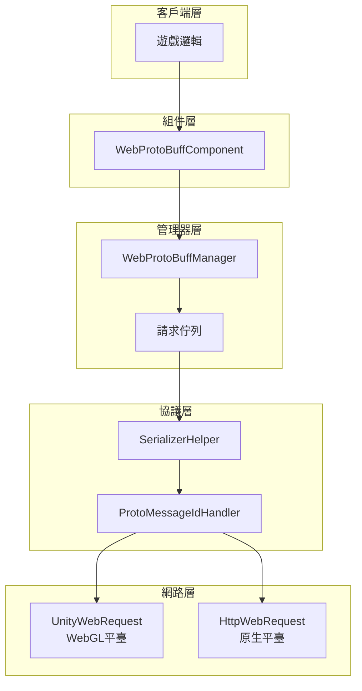
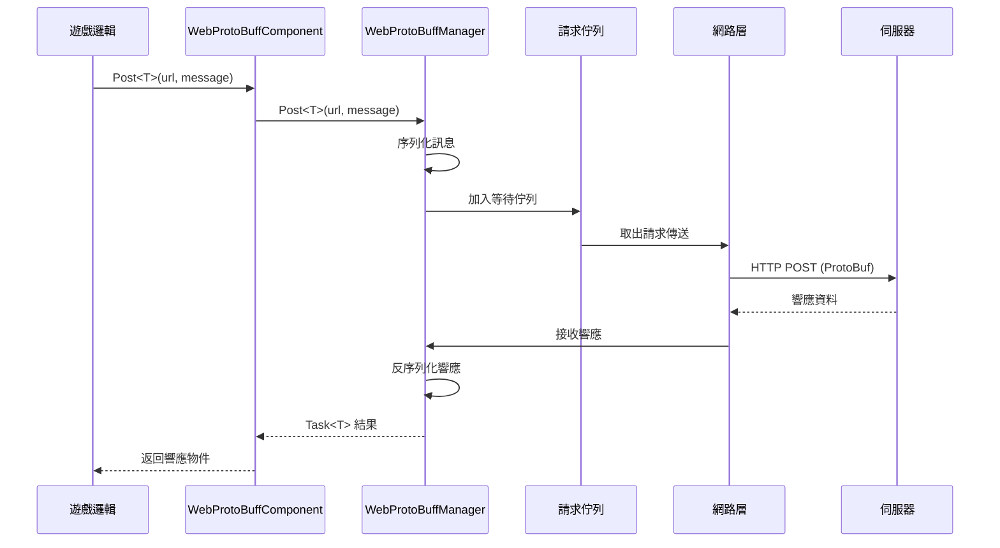

# 快速入門

Web ProtoBuff 組件是 GameFrameX 框架的網路模組，專門用於處理基於 Protocol Buffer 的 HTTP POST 請求。它提供非同步訊息傳送和接收功能，支援 ProtoBuf 訊息的序列化與反序列化。

## 概述

WebProtoBuffComponent 是 Unity 遊戲框架的網路請求組件，封裝了 Protocol Buffer 格式資料的網路傳輸能力。當你的遊戲需要與伺服器進行高效的資料交換時，特別是使用 ProtoBuf 作為序列化格式時，這個組件能夠大大簡化網路請求的實現。

### 核心功能

- **ProtoBuf 支援**：原生支援 Protocol Buffer 訊息格式的序列化與反序列化
- **非同步 API**：基於 `Task<T>` 的非同步程式設計模型，使用 async/await 模式
- **超時控制**：可配置的請求超時時間
- **跨平臺**：相容 Unity WebGL 及原生平臺（PC/iOS/Android）
- **佇列管理**：內建請求佇列和併發控制

### 使用場景

WebProtoBuffComponent 適用於以下場景：

1. **與 ProtoBuf 伺服器通訊**：伺服器使用 Protocol Buffer 作為資料交換格式
2. **高效能網路請求**：ProtoBuf 比 JSON 更緊湊，傳輸效率更高
3. **非同步資料獲取**：需要等待伺服器響應的遊戲邏輯
4. **跨平臺部署**：同一套程式碼同時支援 WebGL 和原生平臺

## 架構

WebProtoBuffComponent 採用分層架構設計，各層職責清晰：



### 組件說明

| 組件 | 說明 |
|------|------|
| WebProtoBuffComponent | Unity 組件，掛載在 GameObject 上使用 |
| WebProtoBuffManager | 核心管理器，處理請求佇列和併發控制 |
| WebProtoBufData | 請求資料封裝，包含 URL、序列化資料、TaskCompletionSource |
| SerializerHelper | 序列化/反序列化工具 |
| ProtoMessageIdHandler | 訊息 ID 處理器 |

## 工作流程

組件的請求處理流程如下：



### 流程說明

1. **請求發起**：遊戲邏輯呼叫組件的 `Post<T>` 方法
2. **訊息封裝**：將 MessageObject 序列化為 ProtoBuf 位元組陣列，包裝在 MessageHttpObject 中
3. **佇列管理**：請求加入等待佇列，等待傳送
4. **併發控制**：同時最多傳送 MaxConnectionPerServer (預設8) 個請求
5. **網路傳送**：根據平臺選擇 UnityWebRequest (WebGL) 或 HttpWebRequest (原生)
6. **響應處理**：接收伺服器響應，反序列化為對應的 MessageObject

## 前置條件

### 1. 安裝依賴

確保你的 Unity 專案已安裝以下依賴：

- `com.gameframex.unity` (1.1.1+)
- `com.gameframex.unity.web` (1.0.0+)
- `com.gameframex.unity.network` (1.0.0+)
- `com.gameframex.unity.google.protobuf` (1.0.0+)

### 2. 啟用編譯宏

在 Unity 編輯器中，開啟 **Edit > Project Settings > Player**，在 **Scripting Define Symbols** 中新增：

```
ENABLE_GAME_FRAME_X_WEB_PROTOBUF_NETWORK
```

> **注意**：如果不新增此宏定義，`Post<T>` 方法將不可用。

### 3. 新增組件

在 Unity 場景中建立一個空的 GameObject，然後新增 **Web ProtoBuff** 組件：

```csharp
// 或者透過程式碼新增
var gameObject = new GameObject("WebProtoBuff");
var webComponent = gameObject.AddComponent<WebProtoBuffComponent>();
```

組件會自動依賴 GameFrameXWebProtoBuffCroppingHelper，用於防止 IL2CPP 編譯時型別被裁剪。

## 訊息定義

在使用組件之前，需要定義請求和響應的訊息型別。訊息類必須繼承自 MessageObject，響應類還需要實現 IResponseMessage 介面：

```csharp
using ProtoBuf;
using GameFrameX.Network.Runtime;

[ProtoContract]
public class LoginRequest : MessageObject
{
    [ProtoMember(1)]
    public string Username { get; set; }
    
    [ProtoMember(2)]
    public string Password { get; set; }
}

[ProtoContract]
public class LoginResponse : MessageObject, IResponseMessage
{
    [ProtoMember(1)]
    public bool Success { get; set; }
    
    [ProtoMember(2)]
    public string Token { get; set; }
}
```

> Source: [README.md](https://github.com/GameFrameX/com.gameframex.unity.web.protobuff/blob/main/README.md#L60-L88)

## 傳送請求

獲取組件例項後，即可傳送 ProtoBuf 請求：

```csharp
using UnityEngine;
using GameFrameX.Web.ProtoBuff.Runtime;

public class LoginController : MonoBehaviour
{
    public WebProtoBuffComponent WebComponent;

    private async void Start()
    {
        var request = new LoginRequest 
        { 
            Username = "user", 
            Password = "password" 
        };
        
        string url = "http://api.example.com/login";

        try
        {
            LoginResponse response = await WebComponent.Post<LoginResponse>(url, request);
            
            if (response != null)
            {
                Debug.Log($"Login Result: {response.Success}, Token: {response.Token}");
            }
        }
        catch (System.Exception e)
        {
            Debug.LogError($"Request Failed: {e.Message}");
        }
    }
}
```

> Source: [README.md](https://github.com/GameFrameX/com.gameframex.unity.web.protobuff/blob/main/README.md#L94-L128)

## 配置選項

WebProtoBuffComponent 提供以下可配置屬性：

| 屬性 | 型別 | 預設值 | 說明 |
|------|------|--------|------|
| Timeout | float | 5.0 | 請求超時時間（秒） |

可以透過 Inspector 面板或程式碼配置：

```csharp
// 透過程式碼配置超時時間
webComponent.Timeout = 10f;
```

## 平臺差異

組件會自動根據目標平臺選擇合適的網路實現：

| 平臺 | 網路實現 | 說明 |
|------|----------|------|
| WebGL | UnityWebRequest | Unity 原生 WebGL 支援 |
| 其他平臺 | HttpWebRequest | .NET 標準 HTTP 請求 |

兩種實現使用相同的 API 介面和訊息格式，程式碼無需修改。

## 相關連結

- [基礎示例](./3-getting-started.basic-example) - 完整的程式碼示例
- [組件架構](./4-core-concepts.architecture) - 深入瞭解架構設計
- [API 參考](./5-api-reference.webprotobuffcomponent) - 完整的 API 文件
- [編譯宏定義](./6-configuration.compile-defines) - 宏定義配置詳解
- [平臺說明](./7-platforms.platform-info) - 各平臺支援詳情
