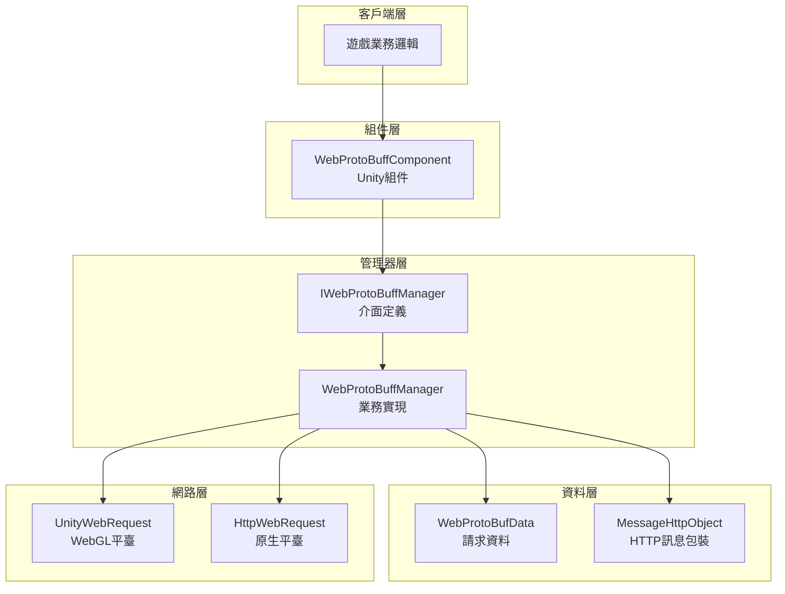
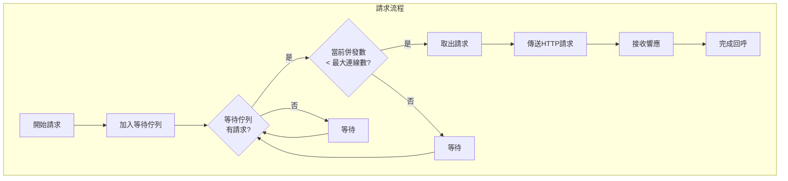
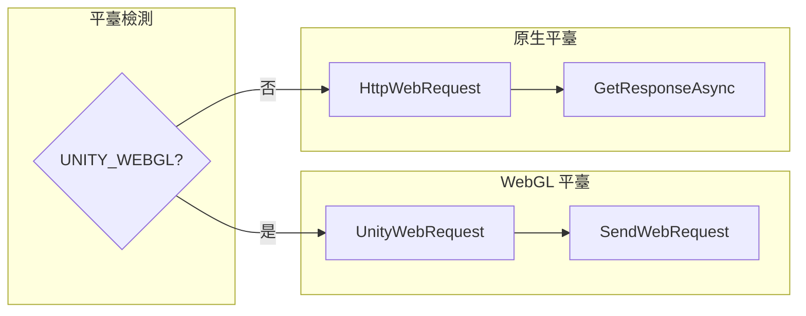

# 功能特性

GameFrameX Web ProtoBuff 組件提供基於 Protocol Buffer 的 HTTP 網路請求功能，支援非同步傳送和接收 ProtoBuf 訊息，是 Unity 遊戲與後端伺服器通訊的輕量級解決方案。

## 概述

Web ProtoBuff 組件是 GameFrameX 遊戲框架的網路模組擴充套件，專門用於處理基於 **Protocol Buffer** 格式的網路通訊。與傳統的 JSON/XML 相比，Protocol Buffer 具有更高的序列化效率和更小的資料體積，非常適合移動遊戲場景下的網路通訊。

該組件提供了完整的請求管理功能，包括請求佇列、超時控制、非同步響應處理等特性，同時支援 Unity WebGL 平臺和原生平臺（PC/Android/iOS）的網路請求呼叫。

## 架構設計

組件採用分層架構設計，將 Unity 組件層、業務邏輯層和網路請求層分離，確保程式碼結構清晰且易於維護。



### 核心組件說明

| 組件 | 職責 | 檔案位置 |
|------|------|----------|
| WebProtoBuffComponent | Unity 組件層，提供 Inspector 配置和對外 API | Runtime/Web/WebProtoBuffComponent.cs |
| IWebProtoBuffManager | 定義網路管理器的介面規範 | Runtime/Web/IWebProtoBuffManager.cs |
| WebProtoBuffManager | 實現具體的 ProtoBuf 請求處理邏輯 | Runtime/Web/WebProtoBuffManager.cs |
| WebProtoBufData | 封裝請求資料和相關狀態 | Runtime/Web/WebProtoBuffManager.WebProtoBufData.cs |

## 核心功能

### 1. Protocol Buffer 訊息支援

組件原生支援 Protocol Buffer 訊息格式的序列化與反序列化。請求訊息和響應訊息都採用 ProtoBuf 格式傳輸，相比 JSON 可節省 30%-70% 的頻寬。

訊息結構採用 `MessageObject` 基類，配合 `[ProtoContract]` 和 `[ProtoMember]` 屬性標記實現自動序列化：

```csharp
[ProtoContract]
public class LoginRequest : MessageObject
{
    [ProtoMember(1)]
    public string Username { get; set; }
    
    [ProtoMember(2)]
    public string Password { get; set; }
}

[ProtoContract]
public class LoginResponse : MessageObject, IResponseMessage
{
    [ProtoMember(1)]
    public bool Success { get; set; }
    
    [ProtoMember(2)]
    public string Token { get; set; }
}
```
> Source: [WebProtoBuffManager.ProtoBuf.cs](https://github.com/GameFrameX/com.gameframex.unity.web.protobuff/blob/main/Runtime/Web/WebProtoBuffManager.ProtoBuf.cs#L178-L201)

組件使用專用的 `application/x-protobuf` Content-Type 進行請求，確保服務端能夠正確識別 ProtoBuf 格式資料：

```csharp
private const string ProtoBufContentType = "application/x-protobuf";
```
> Source: [WebProtoBuffManager.ProtoBuf.cs](https://github.com/GameFrameX/com.gameframex.unity.web.protobuff/blob/main/Runtime/Web/WebProtoBuffManager.ProtoBuf.cs#L32)

### 2. 非同步請求處理

組件採用基於 `Task<T>` 的非同步程式設計模式，支援 `async/await` 語法糖，使網路請求程式碼簡潔易讀：

```csharp
public async void Login()
{
    var request = new LoginRequest 
    { 
        Username = "user", 
        Password = "password" 
    };
    
    string url = "http://api.example.com/login";
    
    try
    {
        LoginResponse response = await WebComponent.Post<LoginResponse>(url, request);
        
        if (response != null)
        {
            Debug.Log($"Login Result: {response.Success}, Token: {response.Token}");
        }
    }
    catch (System.Exception e)
    {
        Debug.LogError($"Request Failed: {e.Message}");
    }
}
```
> Source: [WebProtoBuffComponent.cs](https://github.com/GameFrameX/com.gameframex.unity.web.protobuff/blob/main/Runtime/Web/WebProtoBuffComponent.cs#L105-L108)

### 3. 請求佇列管理

組件內部維護請求佇列，支援併發控制和請求優先順序管理，確保網路請求有序進行：



核心佇列管理邏輯：

```csharp
private readonly Queue<WebProtoBufData> m_WaitingProtoBufQueue = new Queue<WebProtoBufData>(256);
private readonly List<WebProtoBufData> m_SendingProtoBufList = new List<WebProtoBufData>(16);
```
> Source: [WebProtoBuffManager.ProtoBuf.cs](https://github.com/GameFrameX/com.gameframex.unity.web.protobuff/blob/main/Runtime/Web/WebProtoBuffManager.ProtoBuf.cs#L22-L27)

預設最大併發連線數為 8 個：

```csharp
public WebProtoBuffManager()
{
    MaxConnectionPerServer = 8;
    m_MemoryStream = new MemoryStream();
    Timeout = 5f;
}
```
> Source: [WebProtoBuffManager.cs](https://github.com/GameFrameX/com.gameframex.unity.web.protobuff/blob/main/Runtime/Web/WebProtoBuffManager.cs#L31-L36)

### 4. 超時控制

組件提供靈活的超時配置機制，支援在 Inspector 面板或程式碼中動態設定超時時間：

```csharp
[SerializeField] [Tooltip("超時時間.單位：秒")]
private float m_Timeout = 5f;

public float Timeout
{
    get { return m_WebProtoBuffManager.Timeout; }
    set { m_WebProtoBuffManager.Timeout = m_Timeout = value; }
}
```
> Source: [WebProtoBuffComponent.cs](https://github.com/GameFrameX/com.gameframex.unity.web.protobuff/blob/main/Runtime/Web/WebProtoBuffComponent.cs#L60-L71)

Inspector 面板支援 0-120 秒的超時滑塊設定：

```csharp
float timeout = EditorGUILayout.Slider("Timeout", m_Timeout.floatValue, 0f, 120f);
```
> Source: [WebComponentInspector.cs](https://github.com/GameFrameX/com.gameframex.unity.web.protobuff/blob/main/Editor/Inspector/WebComponentInspector.cs#L23)

### 5. 除錯日誌

組件提供可選的除錯日誌功能，幫助開發者追蹤網路請求的傳送和接收過程：

```csharp
private void DebugSendLog(MessageObject messageObject)
{
#if ENABLE_GAMEFRAMEX_WEB_SEND_LOG
    var messageId = ProtoMessageIdHandler.GetReqMessageIdByType(messageObject.GetType());
    Log.Debug($"傳送訊息 ID:[{messageId},{messageObject.UniqueId},{messageObject.GetType().Name}] 訊息內容:{GameFrameX.Runtime.Utility.Json.ToJson(messageObject)}");
#endif
}

private void DebugReceiveLog(MessageObject messageObject)
{
#if ENABLE_GAMEFRAMEX_WEB_RECEIVE_LOG
    var messageId = ProtoMessageIdHandler.GetReqMessageIdByType(messageObject.GetType());
    Log.Debug($"接收訊息 ID:[{messageId},{messageObject.UniqueId},{messageObject.GetType().Name}] 訊息內容:{GameFrameX.Runtime.Utility.Json.ToJson(messageObject)}");
#endif
}
```
> Source: [WebProtoBuffManager.ProtoBuf.cs](https://github.com/GameFrameX/com.gameframex.unity.web.protobuff/blob/main/Runtime/Web/WebProtoBuffManager.ProtoBuf.cs#L227-L241)

啟用日誌需要在 Unity Player Settings 中新增編譯宏：
- `ENABLE_GAMEFRAMEX_WEB_SEND_LOG` - 啟用傳送日誌
- `ENABLE_GAMEFRAMEX_WEB_RECEIVE_LOG` - 啟用接收日誌

### 6. 跨平臺支援

組件針對不同 Unity 平臺提供了差異化的網路實現：



WebGL 平臺使用 Unity 內建的 `UnityWebRequest`：

```csharp
#if UNITY_WEBGL
UnityEngine.Networking.UnityWebRequest unityWebRequest;
if (webData.IsGet)
{
    unityWebRequest = UnityEngine.Networking.UnityWebRequest.Get(webData.URL);
}
else
{
    unityWebRequest = UnityEngine.Networking.UnityWebRequest.Post(webData.URL, string.Empty);
}

unityWebRequest.timeout = (int)RequestTimeout.TotalSeconds;
unityWebRequest.SetRequestHeader("Content-Type", ProtoBufContentType);
byte[] postData = webData.SendData;
unityWebRequest.uploadHandler = new UnityEngine.Networking.UploadHandlerRaw(postData);
```
> Source: [WebProtoBuffManager.ProtoBuf.cs](https://github.com/GameFrameX/com.gameframex.unity.web.protobuff/blob/main/Runtime/Web/WebProtoBuffManager.ProtoBuf.cs#L87-L103)

原生平臺使用 .NET 的 `HttpWebRequest`：

```csharp
#else
try
{
    HttpWebRequest request = WebRequest.CreateHttp(webData.URL);
    request.Method = webData.IsGet ? WebRequestMethods.Http.Get : WebRequestMethods.Http.Post;
    request.Timeout = (int)RequestTimeout.TotalMilliseconds;
    request.ContentType = ProtoBufContentType;
    // ... 傳送和接收邏輯
}
```
> Source: [WebProtoBuffManager.ProtoBuf.cs](https://github.com/GameFrameX/com.gameframex.unity.web.protobuff/blob/main/Runtime/Web/WebProtoBuffManager.ProtoBuf.cs#L118-L130)

### 7. 訊息 ID 對映

組件透過 `ProtoMessageIdHandler` 實現訊息型別與 ID 的對映，確保客戶端和服務端使用統一的協議標識：

```csharp
var id = ProtoMessageIdHandler.GetReqMessageIdByType(message.GetType());
MessageHttpObject messageHttpObject = new MessageHttpObject
{
    Id = id,
    UniqueId = message.UniqueId,
    Body = SerializerHelper.Serialize(message),
};
```
> Source: [WebProtoBuffManager.ProtoBuf.cs](https://github.com/GameFrameX/com.gameframex.unity.web.protobuff/blob/main/Runtime/Web/WebProtoBuffManager.ProtoBuf.cs#L214-L221)

## 訊息封裝格式

組件使用 `MessageHttpObject` 對 ProtoBuf 訊息進行封裝，包含訊息 ID、唯一標識和訊息體：

```csharp
MessageHttpObject messageHttpObject = new MessageHttpObject
{
    Id = id,
    UniqueId = message.UniqueId,
    Body = SerializerHelper.Serialize(message),
};
var sendData = SerializerHelper.Serialize(messageHttpObject);
```
> Source: [WebProtoBuffManager.ProtoBuf.cs](https://github.com/GameFrameX/com.gameframex.unity.web.protobuff/blob/main/Runtime/Web/WebProtoBuffManager.ProtoBuf.cs#L215-L221)

這種封裝格式便於服務端路由和訊息分發，同時支援請求的唯一定位（UniqueId）。

## 使用限制

組件的 ProtoBuf 功能需要透過編譯宏來啟用。在 Unity Player Settings 中需要新增以下宏定義：

```
ENABLE_GAME_FRAME_X_WEB_PROTOBUF_NETWORK
```

未定義此宏時，`Post<T>` 方法將被禁用，確保不會在生產環境中意外呼叫未配置的功能。

```csharp
#if ENABLE_GAME_FRAME_X_WEB_PROTOBUF_NETWORK
public Task<T> Post<T>(string url, GameFrameX.Network.Runtime.MessageObject message) where T : GameFrameX.Network.Runtime.MessageObject, GameFrameX.Network.Runtime.IResponseMessage
{
    return m_WebProtoBuffManager.Post<T>(url, message);
}
#endif
```
> Source: [WebProtoBuffComponent.cs](https://github.com/GameFrameX/com.gameframex.unity.web.protobuff/blob/main/Runtime/Web/WebProtoBuffComponent.cs#L92-L109)

## 資源清理

組件在關閉時會自動清理所有請求資源，防止記憶體洩漏：

```csharp
protected override void Shutdown()
{
    ShutdownProtoBuf();
    m_MemoryStream.Dispose();
}

private void ShutdownProtoBuf()
{
    while (m_WaitingProtoBufQueue.Count > 0)
    {
        var webData = m_WaitingProtoBufQueue.Dequeue();
        webData.Dispose();
    }
    // ... 清理傳送中的請求
}
```
> Source: [WebProtoBuffManager.cs](https://github.com/GameFrameX/com.gameframex.unity.web.protobuff/blob/main/Runtime/Web/WebProtoBuffManager.cs#L75-L79) 和 [WebProtoBuffManager.ProtoBuf.cs](https://github.com/GameFrameX/com.gameframex.unity.web.protobuff/blob/main/Runtime/Web/WebProtoBuffManager.ProtoBuf.cs#L60-L79)

## 相關連結

- [外掛介紹](./1-overview.introduction) - 瞭解外掛的基本資訊
- [快速入門](./3-getting-started.quick-start) - 開始使用組件
- [基礎示例](./3-getting-started.basic-example) - 檢視完整程式碼示例
- [組件架構](./4-core-concepts.architecture) - 深入瞭解架構設計
- [API 參考](./5-api-reference.webprotobuffcomponent) - 完整的 API 文件
- [組件配置](./6-configuration.component-config) - 配置選項詳解
- [編譯宏定義](./6-configuration.compile-defines) - 編譯宏使用說明
- [平臺說明](./7-platforms.platform-info) - 平臺相容性說明
