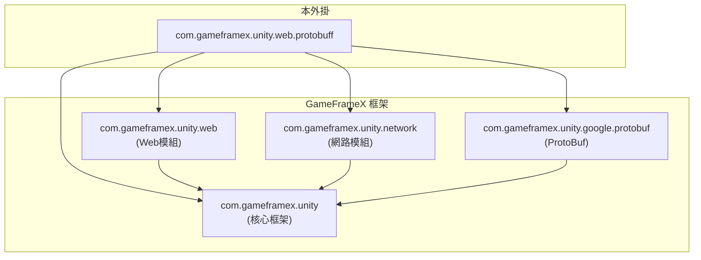
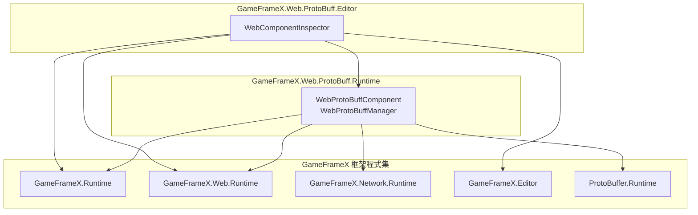
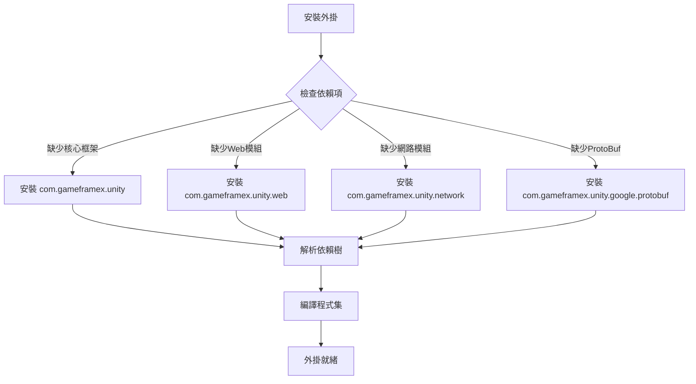

# 依賴項

本文件介紹 GameFrameX Web ProtoBuff 外掛的依賴項，包括執行時依賴、開發依賴以及程式集引用關係。

## 概述

Web ProtoBuff 外掛是 GameFrameX 框架生態系統中的一員，它依賴於框架的其他核心模組來實現基於 Protocol Buffer 的 HTTP 網路請求功能。瞭解這些依賴項對於正確安裝、配置和排查問題非常重要。

## 執行時依賴

外掛的執行時依賴在 `package.json` 檔案中定義，透過 Unity Package Manager 自動解析和安裝。

```json
{
  "dependencies": {
    "com.gameframex.unity": "1.1.1",
    "com.gameframex.unity.web": "1.0.0",
    "com.gameframex.unity.network": "1.0.0",
    "com.gameframex.unity.google.protobuf": "1.0.0"
  }
}
```

> Source: [package.json](https://github.com/GameFrameX/com.gameframex.unity.web.protobuff/blob/main/package.json#L23-L28)

### 依賴項說明

| 依賴包 | 版本 | 說明 |
|--------|------|------|
| `com.gameframex.unity` | 1.1.1 | GameFrameX 核心框架，提供基礎組件系統和模組管理功能 |
| `com.gameframex.unity.web` | 1.0.0 | Web 網路基礎模組，提供 HTTP 請求的底層實現 |
| `com.gameframex.unity.network` | 1.0.0 | 網路訊息模組，提供 `MessageObject` 基類和訊息序列化支援 |
| `com.gameframex.unity.google.protobuf` | 1.0.0 | Google Protocol Buffers 支援，提供 ProtoBuf 訊息的序列化與反序列化功能 |

### 依賴關係圖



**設計意圖**：外掛採用分層架構，底層依賴核心框架，上層依賴 Web 和 Network 模組來實現具體的網路請求功能。這種依賴設計確保了程式碼的模組化和可複用性。

## 程式集引用

除了 Unity Package Manager 管理的包依賴外，外掛還透過 Assembly Definition 檔案定義程式集級別的引用關係。

### Runtime 程式集

`Runtime/GameFrameX.Web.ProtoBuff.Runtime.asmdef` 檔案定義了執行時程式集的引用：

```json
{
  "name": "GameFrameX.Web.ProtoBuff.Runtime",
  "references": [
    "GameFrameX.Runtime",
    "GameFrameX.Web.Runtime",
    "GameFrameX.Network.Runtime",
    "ProtoBuffer.Runtime"
  ],
  "versionDefines": [
    {
      "name": "com.gameframex.unity.network",
      "define": "ENABLE_GAME_FRAME_X_WEB_PROTOBUF_NETWORK"
    }
  ]
}
```

> Source: [Runtime/GameFrameX.Web.ProtoBuff.Runtime.asmdef](https://github.com/GameFrameX/com.gameframex.unity.web.protobuff/blob/main/Runtime/GameFrameX.Web.ProtoBuff.Runtime.asmdef#L1-L25)

### Editor 程式集

`Editor/GameFrameX.Web.ProtoBuff.Editor.asmdef` 檔案定義了編輯器程式集的引用：

```json
{
  "name": "GameFrameX.Web.ProtoBuff.Editor",
  "references": [
    "GameFrameX.Web.Runtime",
    "GameFrameX.Web.ProtoBuff.Runtime",
    "GameFrameX.Editor",
    "GameFrameX.Runtime"
  ],
  "includePlatforms": ["Editor"]
}
```

> Source: [Editor/GameFrameX.Web.ProtoBuff.Editor.asmdef](https://github.com/GameFrameX/com.gameframex.unity.web.protobuff/blob/main/Editor/GameFrameX.Web.ProtoBuff.Editor.asmdef#L1-L11)

### 程式集引用關係



## 編譯宏定義

外掛使用條件編譯來控制 ProtoBuf 網路功能的啟用。以下宏定義控制著外掛功能的可用性：

| 宏定義 | 控制包 | 說明 |
|--------|--------|------|
| `ENABLE_GAME_FRAME_X_WEB_PROTOBUF_NETWORK` | com.gameframex.unity.network | 啟用 ProtoBuf 網路請求功能 |

### 宏定義配置方法

在 Unity 中配置編譯宏定義的步驟：

1. 開啟 Unity 編輯器
2. 導航到 **Edit** → **Project Settings** → **Player**
3. 在 **Player Settings** 視窗中，選擇 **Other Settings** 標籤
4. 找到 **Scripting Define Symbols** 選項
5. 新增宏定義：`ENABLE_GAME_FRAME_X_WEB_PROTOBUF_NETWORK`

> **注意**：如果不新增此宏定義，`WebProtoBuffComponent` 的 `Post<T>` 方法將不可用。

```csharp
#if ENABLE_GAME_FRAME_X_WEB_PROTOBUF_NETWORK
/// <summary>
/// 傳送Post請求，用於傳送和接收Protocol Buffer訊息。
/// 此方法僅在啟用ENABLE_GAME_FRAME_X_WEB_PROTOBUF_NETWORK宏定義時可用。
/// </summary>
public Task<T> Post<T>(string url, GameFrameX.Network.Runtime.MessageObject message) 
    where T : GameFrameX.Network.Runtime.MessageObject, GameFrameX.Network.Runtime.IResponseMessage
{
    return m_WebProtoBuffManager.Post<T>(url, message);
}
#endif
```

> Source: [Runtime/Web/WebProtoBuffComponent.cs](https://github.com/GameFrameX/com.gameframex.unity.web.protobuff/blob/main/Runtime/Web/WebProtoBuffComponent.cs#L92-L109)

## 依賴安裝流程

當您在專案中安裝 Web ProtoBuff 外掛時，Unity Package Manager 會自動解析並安裝所有必要的依賴項：



## 依賴版本相容性

外掛依賴的版本要求如下：

| 依賴項 | 最低版本 | 推薦版本 | 相容 Unity 版本 |
|--------|----------|----------|-----------------|
| com.gameframex.unity | 1.1.0 | 1.1.1 | 2019.4+ |
| com.gameframex.unity.web | 1.0.0 | 1.0.0 | 2019.4+ |
| com.gameframex.unity.network | 1.0.0 | 1.0.0 | 2019.4+ |
| com.gameframex.unity.google.protobuf | 1.0.0 | 1.0.0 | 2019.4+ |

> **提示**：建議使用 `package.json` 中指定的版本以確保最佳相容性。

## 常見依賴問題

### 問題：找不到 GameFrameX.Runtime

**症狀**：編譯錯誤提示找不到 `GameFrameX.Runtime` 名稱空間

**解決方案**：確保已正確安裝 `com.gameframex.unity` 核心包

### 問題：Post 方法不可用

**症狀**：`WebProtoBuffComponent.Post<T>` 方法顯示為灰色或不可呼叫

**解決方案**：
1. 確認已在 Player Settings 中新增 `ENABLE_GAME_FRAME_X_WEB_PROTOBUF_NETWORK` 宏定義
2. 確認已安裝 `com.gameframex.unity.network` 包

### 問題：ProtoBuf 序列化失敗

**症狀**：請求或響應資料無法正確序列化/反序列化

**解決方案**：
1. 確認已安裝 `com.gameframex.unity.google.protobuf` 包
2. 檢查訊息類是否正確使用 `[ProtoContract]` 和 `[ProtoMember]` 屬性修飾

## 相關連結

- [安裝方式](./2-installation.install-methods) - 瞭解不同的外掛安裝方法
- [環境要求](./2-installation.requirements) - 檢視 Unity 版本和其他環境要求
- [功能特性](./1-overview.features) - 瞭解更多外掛功能
- [組件架構](./4-core-concepts.architecture) - 瞭解組件內部架構
