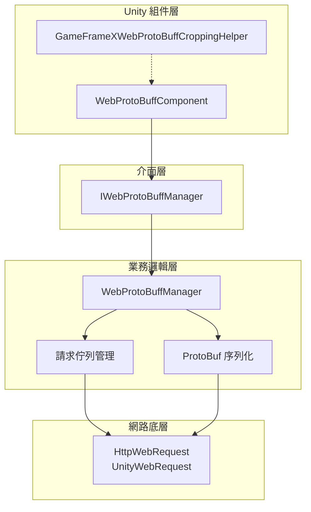
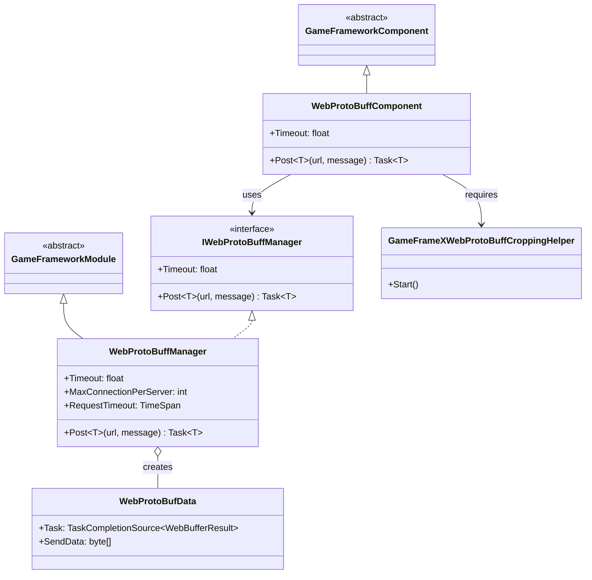
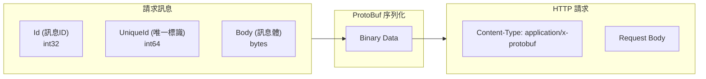
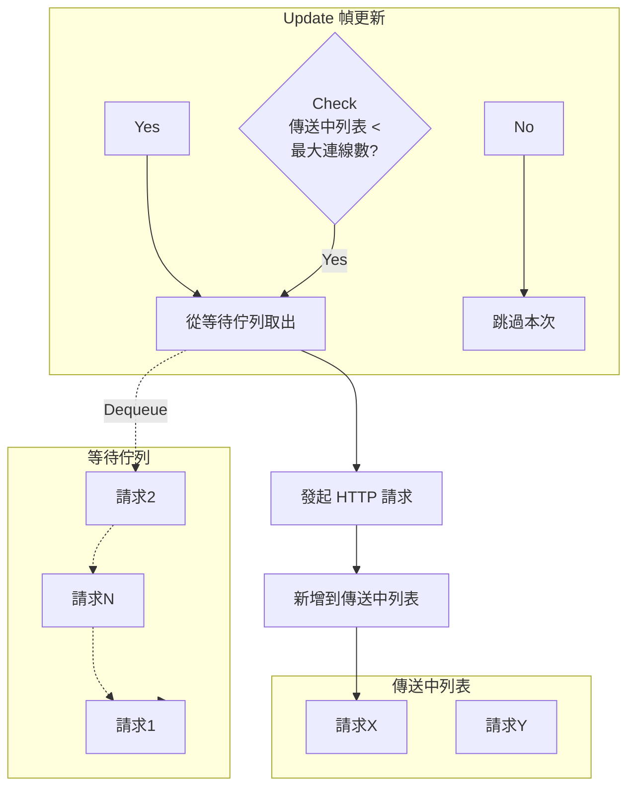

# 組件架構

Web ProtoBuff 組件是 GameFrameX 框架中專門用於處理 HTTP 請求與 Protocol Buffer 訊息序列化的核心模組。該組件提供了高效、易用的網路通訊功能，支援在 Unity 專案中與支援 ProtoBuf 協議的後端伺服器進行資料互動。

## 概述

GameFrameX Web ProtoBuff 組件採用分層架構設計，將 Unity 組件層、業務邏輯層和網路底層實現分離，以實現更好的可維護性和擴充套件性。

該組件的核心功能包括：

- **Protocol Buffer 訊息序列化/反序列化**：使用 ProtoBuf 庫高效處理二進位制資料
- **HTTP POST 請求**：支援向伺服器傳送 ProtoBuf 格式的請求訊息
- **非同步處理**：基於 Task 非同步模式，避免阻塞主執行緒
- **佇列管理**：請求佇列機制，支援高併發場景
- **平臺適配**：支援 WebGL 平臺和其他 Unity 平臺

## 架構設計

組件採用典型的三層架構設計，各層職責清晰：



### 核心組件說明

| 組件 | 型別 | 職責 |
|------|------|------|
| WebProtoBuffComponent | Unity 組件 | 作為 Unity GameObject 組件，提供對外 API 入口 |
| IWebProtoBuffManager | 介面 | 定義 Web 請求管理器的抽象介面 |
| WebProtoBuffManager | 模組類 | 實現核心業務邏輯，包括請求佇列、ProtoBuf 處理 |
| WebProtoBufData | 內部類 | 封裝單個請求的資料（URL、資料、Task） |
| GameFrameXWebProtoBuffCroppingHelper | 輔助類 | IL2CPP/AOT 程式碼裁剪支援 |

## 類圖關係



## 請求處理流程

當客戶端傳送 ProtoBuf 請求時，組件按照以下流程處理：

```mermaid
sequenceDiagram
    participant Client as 呼叫方
    participant Component as WebProtoBuffComponent
    participant Manager as WebProtoBuffManager
    participant Queue as 請求佇列
    participant Network as 網路層
    participant Server as 伺服器

    Client->>Component: Post&lt;T&gt;(url, message)
    Component->>Manager: Post&lt;T&gt;(url, message)
    
    Note over Manager: 1. 序列化訊息
    
    Manager->>Manager: SerializerHelper.Serialize(message)
    
    Note over Manager: 2. 構建 HTTP 包裝物件
    
    Manager->>Manager: 建立 MessageHttpObject<br/>(Id + UniqueId + Body)
    
    Note over Manager: 3. 再次序列化
    
    Manager->>Manager: SerializerHelper.Serialize(messageHttpObject)
    
    Note over Manager: 4. 加入請求佇列
    
    Manager->>Queue: Enqueue(WebProtoBufData)
    Queue-->>Manager: 已加入佇列
    
    Manager->>Network: 非同步傳送請求
    
    Note over Network: 5. HTTP 請求處理
    
    Network->>Server: POST /url<br/>Content-Type: application/x-protobuf
    Server-->>Network: HTTP Response (ProtoBuf)
    Network-->>Manager: WebBufferResult
    
    Note over Manager: 6. 反序列化響應
    
    Manager->>Manager: Deserialize&lt;MessageHttpObject&gt;()
    Manager->>Manager: Deserialize&lt;T&gt;(Body)
    
    Manager-->>Component: Task&lt;T&gt; Result
    Component-->>Client: Response Object
```

### 訊息封裝格式

組件使用 `MessageHttpObject` 對 ProtoBuf 訊息進行二次封裝：



## 請求佇列管理

組件使用雙佇列模式管理網路請求：



**佇列管理規則：**

- **等待佇列（m_WaitingProtoBufQueue）**：儲存所有待傳送的請求，FIFO 順序處理
- **傳送中列表（m_SendingProtoBufList）**：儲存正在處理的請求
- **最大併發數（MaxConnectionPerServer）**：預設 8 個併發連線

## 平臺適配

組件針對不同平臺使用不同的網路實現：

| 平臺 | 網路實現 | 說明 |
|------|----------|------|
| WebGL | UnityWebRequest | Unity 原生 WebGL 網路庫 |
| 其他平臺 | HttpWebRequest | .NET 標準網路庫 |

```csharp
#if UNITY_WEBGL
        // WebGL 平臺：使用 UnityWebRequest
        unityWebRequest = UnityEngine.Networking.UnityWebRequest.Post(url, string.Empty);
#else
        // 其他平臺：使用 HttpWebRequest
        var request = WebRequest.CreateHttp(url);
#endif
```
> Source: [WebProtoBuffManager.ProtoBuf.cs](https://github.com/GameFrameX/com.gameframex.unity.web.protobuff/blob/main/Runtime/Web/WebProtoBuffManager.ProtoBuf.cs#L87-L120)

## 編譯宏定義

組件功能受以下編譯宏控制：

| 宏定義 | 功能 |
|--------|------|
| ENABLE_GAME_FRAME_X_WEB_PROTOBUF_NETWORK | 啟用 ProtoBuf 網路功能 |
| ENABLE_GAMEFRAMEX_WEB_SEND_LOG | 啟用傳送日誌 |
| ENABLE_GAMEFRAMEX_WEB_RECEIVE_LOG | 啟用接收日誌 |

## 使用示例

### 基本用法

在 Unity 場景中新增 WebProtoBuffComponent 組件後，可以透過以下方式傳送請求：

```csharp
// 獲取組件
var webComponent = UnityEngine.SceneManagement.SceneManager
    .GetActiveScene()
    .GetRootGameObjects()
    .SelectMany(go => go.GetComponentsInChildren<WebProtoBuffComponent>())
    .FirstOrDefault();

// 傳送 ProtoBuf 請求
var request = new LoginRequest { Username = "test", Password = "123456" };
var response = await webComponent.Post<LoginResponse>("http://localhost:8080/api/login", request);
```
> Source: [WebProtoBuffComponent.cs](https://github.com/GameFrameX/com.gameframex.unity.web.protobuff/blob/main/Runtime/Web/WebProtoBuffComponent.cs#L105-L108)

### 組件初始化

組件在 Awake 階段完成初始化：

```csharp
protected override void Awake()
{
    // 設定實現類型別
    ImplementationComponentType = Utility.Assembly.GetType(componentType);
    InterfaceComponentType = typeof(IWebProtoBuffManager);
    
    base.Awake();
    
    // 獲取管理器例項
    m_WebProtoBuffManager = GameFrameworkEntry.GetModule<IWebProtoBuffManager>();
    
    // 設定超時時間
    m_WebProtoBuffManager.Timeout = m_Timeout;
}
```
> Source: [WebProtoBuffComponent.cs](https://github.com/GameFrameX/com.gameframex.unity.web.protobuff/blob/main/Runtime/Web/WebProtoBuffComponent.cs#L77-L90)

## 配置選項

| 配置項 | 型別 | 預設值 | 說明 |
|--------|------|--------|------|
| Timeout | float | 5.0 | 請求超時時間（秒） |
| MaxConnectionPerServer | int | 8 | 單伺服器最大併發連線數 |

## 相關連結

- [外掛介紹](../1-overview.introduction)
- [功能特性](../1-overview.features)
- [WebProtoBuffComponent API 參考](../5-api-reference.webprotobuffcomponent)
- [IWebProtoBuffManager API 參考](../5-api-reference.iwebprotobuffmanager)
- [訊息定義](./4-core-concepts.message-definition)
- [組件配置](./6-configuration.component-config)
- [編譯宏定義](./6-configuration.compile-defines)
