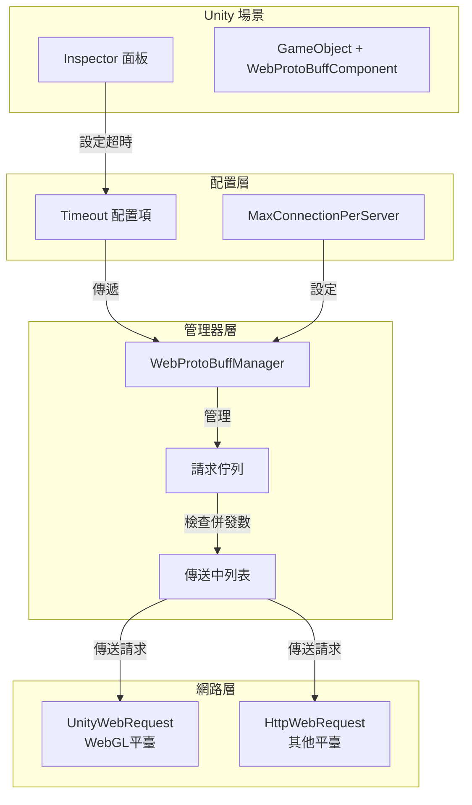

# 組件配置

本文件詳細介紹 WebProtoBuffComponent 組件的各個配置項及其使用方法。

## 概述

WebProtoBuffComponent 是 GameFrameX 框架中負責處理 Web 請求的核心組件，支援 HTTP POST 請求並使用 Protocol Buffer 進行訊息序列化。該組件繼承自 GameFrameworkComponent，可作為 Unity 組件新增到場景中，並透過 WebProtoBuffManager 實現具體的網路請求邏輯。

組件配置主要分為兩類：
1. **執行時配置** - 透過程式碼在執行時設定
2. **編輯器配置** - 透過 Unity Inspector 面板在編輯器中配置

## 配置選項詳解

### Timeout（超時時間）

| 屬性 | 說明 |
|------|------|
| 型別 | float |
| 預設值 | 5 秒 |
| 有效範圍 | 0 - 120 秒 |
| 配置位置 | Inspector 面板 / 程式碼 |

**功能說明：**
Timeout 配置用於設定網路請求的超時時間。當請求超過指定時間未完成時，系統會自動終止該請求並返回超時錯誤。這對於防止網路請求無限期等待至關重要。

**在 Inspector 中配置：**

```csharp
// WebComponentInspector.cs 中的配置 UI
float timeout = EditorGUILayout.Slider("Timeout", m_Timeout.floatValue, 0f, 120f);
```
> Source: [WebComponentInspector.cs](https://github.com/GameFrameX/com.gameframex.unity.web.protobuff/blob/main/Editor/Inspector/WebComponentInspector.cs#L23)

**透過程式碼配置：**

```csharp
// 透過組件屬性設定超時時間
var webComponent = gameObject.GetComponent<WebProtoBuffComponent>();
webComponent.Timeout = 10f; // 設定為 10 秒
```
> Source: [WebProtoBuffComponent.cs](https://github.com/GameFrameX/com.gameframex.unity.web.protobuff/blob/main/Runtime/Web/WebProtoBuffComponent.cs#L67-L71)

**內部實現：**

```csharp
// WebProtoBuffManager.cs 中的超時設定
public float Timeout
{
    get { return m_Timeout; }
    set
    {
        m_Timeout = value;
        RequestTimeout = TimeSpan.FromSeconds(value);
    }
}
```
> Source: [WebProtoBuffManager.cs](https://github.com/GameFrameX/com.gameframex.unity.web.protobuff/blob/main/Runtime/Web/WebProtoBuffManager.cs#L41-L49)

### MaxConnectionPerServer（最大連線數）

| 屬性 | 說明 |
|------|------|
| 型別 | int |
| 預設值 | 8 |
| 配置位置 | 程式碼 |

**功能說明：**
MaxConnectionPerServer 用於控制單個伺服器的最大併發連線數。該配置影響請求佇列的處理策略，當已有連線數小於此值時，才會從等待佇列中取出新請求進行處理。

**內部實現：**

```csharp
// 建構函式中設定預設值
public WebProtoBuffManager()
{
    MaxConnectionPerServer = 8;
    m_MemoryStream = new MemoryStream();
    Timeout = 5f;
}
```
> Source: [WebProtoBuffManager.cs](https://github.com/GameFrameX/com.gameframex.unity.web.protobuff/blob/main/Runtime/Web/WebProtoBuffManager.cs#L30-L36)

**佇列處理邏輯：**

```csharp
// 更新處理 ProtoBuf 請求佇列
void UpdateProtoBuf(float elapseSeconds, float realElapseSeconds)
{
    lock (m_StringBuilder)
    {
        if (m_SendingProtoBufList.Count < MaxConnectionPerServer)
        {
            if (m_WaitingProtoBufQueue.Count > 0)
            {
                var webProtoBufData = m_WaitingProtoBufQueue.Dequeue();
                MakeProtoBufBytesRequest(webProtoBufData);
                m_SendingProtoBufList.Add(webProtoBufData);
            }
        }
    }
}
```
> Source: [WebProtoBuffManager.ProtoBuf.cs](https://github.com/GameFrameX/com.gameframex.unity.web.protobuff/blob/main/Runtime/Web/WebProtoBuffManager.ProtoBuf.cs#L39-L55)

### Content-Type（內容型別）

| 屬性 | 說明 |
|------|------|
| 型別 | string |
| 值 | application/x-protobuf |
| 配置位置 | 程式碼（固定） |

**功能說明：**
組件使用固定的內容型別 `application/x-protobuf` 進行 ProtoBuf 訊息傳輸。這是 ProtoBuf 的標準內容型別，用於告知伺服器請求體採用 Protocol Buffer 格式。

**內部實現：**

```csharp
// ProtoBuf 內容型別常量
private const string ProtoBufContentType = "application/x-protobuf";
```
> Source: [WebProtoBuffManager.ProtoBuf.cs](https://github.com/GameFrameX/com.gameframex.unity.web.protobuff/blob/main/Runtime/Web/WebProtoBuffManager.ProtoBuf.cs#L32)

## 配置架構



## 在 Unity Editor 中配置

### 新增組件

1. 在 Unity 場景中建立一個空 GameObject 或選擇現有 GameObject
2. 在 Inspector 面板中點選 **Add Component** 按鈕
3. 搜尋 "Web ProtoBuff" 並選擇新增
4. 組件會自動新增依賴的 GameFrameXWebProtoBuffCroppingHelper

### 配置超時時間

組件新增後，可以在 Inspector 面板中看到 Timeout 滑塊：

```csharp
// 組件定義
[DisallowMultipleComponent]
[AddComponentMenu("GameFrameX/Web ProtoBuff")]
[UnityEngine.Scripting.Preserve]
[RequireComponent(typeof(GameFrameXWebProtoBuffCroppingHelper))]
public sealed class WebProtoBuffComponent : GameFrameworkComponent
```
> Source: [WebProtoBuffComponent.cs](https://github.com/GameFrameX/com.gameframex.unity.web.protobuff/blob/main/Runtime/Web/WebProtoBuffComponent.cs#L46-L49)

Inspector 中的配置介面允許在執行時動態修改超時時間：

```csharp
public override void OnInspectorGUI()
{
    base.OnInspectorGUI();
    serializedObject.Update();

    WebProtoBuffComponent t = (WebProtoBuffComponent)target;
    float timeout = EditorGUILayout.Slider("Timeout", m_Timeout.floatValue, 0f, 120f);
    if (timeout != m_Timeout.floatValue)
    {
        if (EditorApplication.isPlaying)
        {
            t.Timeout = timeout;  // 執行時動態修改
        }
        else
        {
            m_Timeout.floatValue = timeout;  // 編輯器中修改
        }
    }
    // ...
}
```
> Source: [WebComponentInspector.cs](https://github.com/GameFrameX/com.gameframex.unity.web.protobuff/blob/main/Editor/Inspector/WebComponentInspector.cs#L17-L37)

## 執行時配置示例

### 透過程式碼設定超時

```csharp
using GameFrameX.Web.ProtoBuff.Runtime;

// 獲取組件例項
var webComponent = gameObject.GetComponent<WebProtoBuffComponent>();

// 設定超時時間（秒）
webComponent.Timeout = 15f;

// 獲取當前超時配置
float currentTimeout = webComponent.Timeout;
Debug.Log($"當前超時時間: {currentTimeout} 秒");
```
> Source: [WebProtoBuffComponent.cs](https://github.com/GameFrameX/com.gameframex.unity.web.protobuff/blob/main/Runtime/Web/WebProtoBuffComponent.cs#L67-L71)

### 透過 Manager 直接配置

```csharp
using GameFrameX.Web.ProtoBuff.Runtime;

// 透過框架獲取管理器
var manager = GameFrameworkEntry.GetModule<IWebProtoBuffManager>();

// 設定超時時間
manager.Timeout = 30f;

// 獲取管理器例項
var webManager = manager as WebProtoBuffManager;

// 設定最大連線數
webManager.MaxConnectionPerServer = 16;
```
> Source: [WebProtoBuffManager.cs](https://github.com/GameFrameX/com.gameframex.unity.web.protobuff/blob/main/Runtime/Web/WebProtoBuffManager.cs#L41-L54)

## 配置預設值彙總

| 配置項 | 型別 | 預設值 | 說明 |
|--------|------|--------|------|
| Timeout | float | 5f | 請求超時時間（秒） |
| MaxConnectionPerServer | int | 8 | 單伺服器最大併發數 |
| RequestTimeout | TimeSpan | 5秒 | 內部使用的超時物件 |
| ContentType | string | application/x-protobuf | 請求內容型別 |

## 配置最佳實踐

### 1. 超時時間選擇

- **短超時（1-5秒）**：適用於實時性要求高的遊戲操作請求
- **中等超時（5-15秒）**：適用於常規遊戲資料同步
- **長超時（15-30秒）**：適用於大檔案下載或複雜資料請求

### 2. 併發連線數設定

- **低併發（4-8）**：適用於移動裝置或網路環境不穩定的情況
- **中等併發（8-16）**：適用於大多數場景
- **高併發（16+）**：需要伺服器支援，適合高速網路環境

### 3. 動態調整

組件支援在執行時動態調整超時時間：

```csharp
public class NetworkConfigManager
{
    private WebProtoBuffComponent _webComponent;
    
    // 根據網路狀態動態調整超時
    public void AdjustTimeoutForNetworkCondition(bool isPoorNetwork)
    {
        if (_webComponent == null) return;
        
        // 網路狀況差時增加超時時間
        _webComponent.Timeout = isPoorNetwork ? 30f : 10f;
    }
}
```

## 相關連結

- [快速入門](../3-getting-started.quick-start)
- [基礎示例](../3-getting-started.basic-example)
- [組件架構](../4-core-concepts.architecture)
- [API 參考 - WebProtoBuffComponent](../5-api-reference.webprotobuffcomponent)
- [API 參考 - IWebProtoBuffManager](../5-api-reference.iwebprotobuffmanager)
- [編譯宏定義](./6-configuration.compile-defines)
