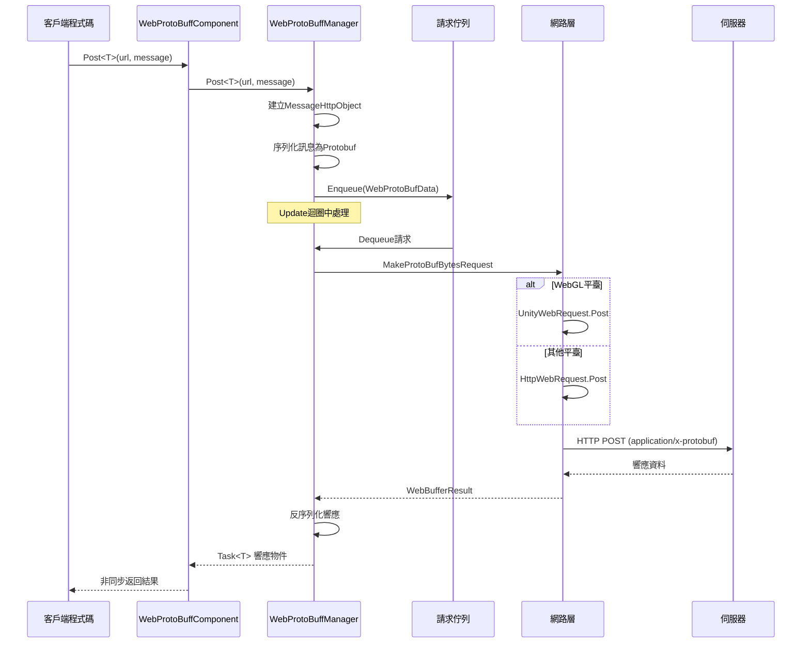

# IWebProtoBuffManager

WebProtoBuffManager 介面定義了 Web 請求的 Protobuf 網路通訊功能，提供 HTTP POST 請求的傳送和接收支援。

## 概述

`IWebProtoBuffManager` 是 GameFrameX Web ProtoBuff 模組的核心介面，負責處理基於 Protocol Buffer 序列化格式的 HTTP 網路請求。該介面繼承自 GameFramework 的模組系統，提供了統一的網路請求抽象。

**設計意圖**：該介面封裝了底層網路請求的複雜性，提供了簡潔的泛型方法用於傳送 Protobuf 訊息並接收對應型別的響應。透過佇列管理機制實現了請求的批次處理，同時支援 WebGL 和其他平臺的差異化實現。

## 架構

```mermaid
graph TD
    subgraph Client["客戶端層"]
        WebProtoBuffComponent["WebProtoBuffComponent<br/>組件包裝器"]
    end

    subgraph Manager["管理層"]
        IWebProtoBuffManager["IWebProtoBuffManager<br/>介面定義"]
        WebProtoBuffManager["WebProtoBuffManager<br///>實現類"]
    end

    subgraph Data["資料層"]
        MessageObject["MessageObject<br///>訊息基類"]
        MessageHttpObject["MessageHttpObject<br/>HTTP訊息封裝"]
        WebProtoBufData["WebProtoBufData<br/>請求資料"]
    end

    subgraph Network["網路層"]
        Queue["請求佇列<br/>m_WaitingProtoBufQueue"]
        SendingList["傳送中列表<br/>m_SendingProtoBufList"]
        UnityWebRequest["UnityWebRequest<br/>WebGL平臺"]
        HttpWebRequest["HttpWebRequest<br/>其他平臺"]
    end

    WebProtoBuffComponent -->|呼叫| IWebProtoBuffManager
    IWebProtoBuffManager <|--|實現| WebProtoBuffManager
    WebProtoBuffManager -->|序列化/反序列化| MessageObject
    WebProtoBuffManager -->|管理| WebProtoBufData
    WebProtoBuffManager -->|入隊| Queue
    WebProtoBuffManager -->|傳送| SendingList
    WebProtoBuffManager -->|平臺判斷| UnityWebRequest
    WebProtoBuffManager -->|平臺判斷| HttpWebRequest
```

### 組件說明

| 組件 | 角色 | 說明 |
|------|------|------|
| WebProtoBuffComponent | 組件包裝器 | Unity 組件，封裝 IWebProtoBuffManager 的訪問 |
| IWebProtoBuffManager | 介面定義 | 定義 Protobuf 網路請求的核心 API |
| WebProtoBuffManager | 實現類 | 具體實現，包含佇列管理和平臺適配 |
| MessageObject | 訊息基類 | 所有 Protobuf 訊息的基型別 |
| MessageHttpObject | HTTP 封裝 | 包含訊息 ID、UniqueId、Body 的封裝 |

## 核心流程



### 請求處理流程

1. **請求建立**：客戶端呼叫 `Post<T>` 方法，傳入 URL 和訊息物件
2. **訊息封裝**：將使用者訊息包裝為 `MessageHttpObject`，包含訊息 ID 和序列化的 Body
3. **佇列管理**：請求進入等待佇列，由 Update 迴圈按併發限制處理
4. **網路傳送**：根據平臺選擇 `UnityWebRequest`（WebGL）或 `HttpWebRequest`（其他平臺）
5. **響應處理**：接收伺服器響應後，反序列化為對應的 Protobuf 物件並返回

## 介面定義

### `Post<T>(string url, MessageObject message): Task<T>`

傳送 Protobuf 訊息的 POST 請求，並接收指定型別的響應。

**注意**：此方法僅在定義 `ENABLE_GAME_FRAME_X_WEB_PROTOBUF_NETWORK` 宏時可用。

**引數：**
- `url` (string): 目標伺服器的 URL 地址
- `message` (MessageObject): 要傳送的 Protobuf 訊息物件，必須繼承自 MessageObject

**泛型引數：**
- `T`: 返回的資料型別，必須繼承自 MessageObject 並且實現 IResponseMessage 介面

**返回：** `Task<T>` - 非同步任務，完成時包含從伺服器接收到的響應資料

**實現程式碼示例：**

```csharp
// 來自 Runtime/Web/WebProtoBuffManager.ProtoBuf.cs#L178-L201
public async Task<T> Post<T>(string url, MessageObject message) where T : MessageObject, IResponseMessage
{
    DebugSendLog(message);
    var webBufferResult = await PostInner(url, message);
    if (webBufferResult.IsNotNull())
    {
        var messageObjectHttp = SerializerHelper.Deserialize<MessageHttpObject>(webBufferResult.Result);
        if (messageObjectHttp.IsNotNull() && messageObjectHttp.Id != default)
        {
            var messageType = ProtoMessageIdHandler.GetRespTypeById(messageObjectHttp.Id);
            if (messageType != typeof(T))
            {
                Log.Error($"Response message type is invalid. Expected '{typeof(T).FullName}', actual '{messageType.FullName}'.");
                return default;
            }

            var messageObject = SerializerHelper.Deserialize<T>(messageObjectHttp.Body);
            DebugReceiveLog(messageObject);
            return messageObject;
        }
    }

    return default;
}
```
> Source: [WebProtoBuffManager.ProtoBuf.cs](https://github.com/GameFrameX/com.gameframex.unity.web.protobuff/blob/main/Runtime/Web/WebProtoBuffManager.ProtoBuf.cs#L178-L201)

### `Timeout: float`

獲取或設定 POST 請求的超時時間（單位：秒）。

**屬性型別：** `float`

**預設值：** `5f` (5秒)

**說明：** 設定請求的超時時間後，實際的 `RequestTimeout` 屬性會同步更新為對應的 `TimeSpan` 值。

**實現程式碼示例：**

```csharp
// 來自 Runtime/Web/WebProtoBuffManager.cs#L41-L49
public float Timeout
{
    get { return m_Timeout; }
    set
    {
        m_Timeout = value;
        RequestTimeout = TimeSpan.FromSeconds(value);
    }
}
```
> Source: [WebProtoBuffManager.cs](https://github.com/GameFrameX/com.gameframex.unity.web.protobuff/blob/main/Runtime/Web/WebProtoBuffManager.cs#L41-L49)

## 屬性參考

| 屬性 | 型別 | 預設值 | 說明 |
|------|------|--------|------|
| Timeout | float | 5f | 請求超時時間（秒） |
| MaxConnectionPerServer | int | 8 | 每個伺服器的最大併發連線數 |
| RequestTimeout | TimeSpan | 5秒 | 實際的請求超時時間物件 |

## 使用示例

### 基礎用法

透過 WebProtoBuffComponent 傳送 Protobuf 請求：

```csharp
// 定義請求訊息
public class LoginRequest : MessageObject
{
    public string Username { get; set; }
    public string Password { get; set; }
}

// 定義響應訊息
public class LoginResponse : MessageObject, IResponseMessage
{
    public int ErrorCode { get; set; }
    public string Token { get; set; }
}

// 傳送請求
var webComponent = UnityEngine.GameObject.FindObjectOfType<WebProtoBuffComponent>();
var request = new LoginRequest { Username = "user", Password = "pass" };
LoginResponse response = await webComponent.Post<LoginResponse>("http://example.com/api/login", request);
```
> Source: [WebProtoBuffComponent.cs](https://github.com/GameFrameX/com.gameframex.unity.web.protobuff/blob/main/Runtime/Web/WebProtoBuffComponent.cs#L105-L108)

### 超時設定

```csharp
// 設定超時時間為 10 秒
var webComponent = UnityEngine.GameObject.FindObjectOfType<WebProtoBuffComponent>();
webComponent.Timeout = 10f;
```

### 併發控制

WebProtoBuffManager 使用佇列管理請求，預設最大併發數為 8：

```csharp
// 透過管理器設定最大連線數
var manager = GameFrameworkEntry.GetModule<IWebProtoBuffManager>();
// MaxConnectionPerServer 屬性在實現類中可見
if (manager is WebProtoBuffManager webManager)
{
    webManager.MaxConnectionPerServer = 16;
}
```

## 平臺差異

### WebGL 平臺

在 WebGL 平臺上，使用 Unity 的 `UnityWebRequest` 進行網路請求：

```csharp
// 來自 Runtime/Web/WebProtoBuffManager.ProtoBuf.cs#L87-L116
UnityEngine.Networking.UnityWebRequest unityWebRequest;
if (webData.IsGet)
{
    unityWebRequest = UnityEngine.Networking.UnityWebRequest.Get(webData.URL);
}
else
{
    unityWebRequest = UnityEngine.Networking.UnityWebRequest.Post(webData.URL, string.Empty);
}

unityWebRequest.timeout = (int)RequestTimeout.TotalSeconds;
unityWebRequest.SetRequestHeader("Content-Type", ProtoBufContentType);
byte[] postData = webData.SendData;
unityWebRequest.uploadHandler = new UnityEngine.Networking.UploadHandlerRaw(postData);
```
> Source: [WebProtoBuffManager.ProtoBuf.cs](https://github.com/GameFrameX/com.gameframex.unity.web.protobuff/blob/main/Runtime/Web/WebProtoBuffManager.ProtoBuf.cs#L87-L116)

### 其他平臺

在非 WebGL 平臺上，使用 .NET 的 `HttpWebRequest`：

```csharp
// 來自 Runtime/Web/WebProtoBuffManager.ProtoBuf.cs#L118-L164
HttpWebRequest request = WebRequest.CreateHttp(webData.URL);
request.Method = webData.IsGet ? WebRequestMethods.Http.Get : WebRequestMethods.Http.Post;
request.Timeout = (int)RequestTimeout.TotalMilliseconds;
request.ContentType = ProtoBufContentType;
byte[] postData = webData.SendData;
request.ContentLength = postData.Length;
using (Stream requestStream = request.GetRequestStream())
{
    await requestStream.WriteAsync(postData, 0, postData.Length);
}
```
> Source: [WebProtoBuffManager.ProtoBuf.cs](https://github.com/GameFrameX/com.gameframex.unity.web.protobuff/blob/main/Runtime/Web/WebProtoBuffManager.ProtoBuf.cs#L118-L164)

## 編譯宏定義

使用 `Post<T>` 方法需要定義以下編譯宏：

| 宏名稱 | 說明 |
|--------|------|
| ENABLE_GAME_FRAME_X_WEB_PROTOBUF_NETWORK | 啟用 Protobuf 網路功能 |

在 Unity 的 **Player Settings** → **Scripting Define Symbols** 中新增該宏定義即可使用完整的 Protobuf 網路功能。

## 相關連結

- [WebProtoBuffComponent](./5-api-reference.webprotobuffcomponent) - Unity 組件封裝
- [組件配置](./6-configuration.component-config) - 配置選項說明
- [編譯宏定義](./6-configuration.compile-defines) - 宏定義詳細說明
- [快速入門](./3-getting-started.quick-start) - 快速開始指南
