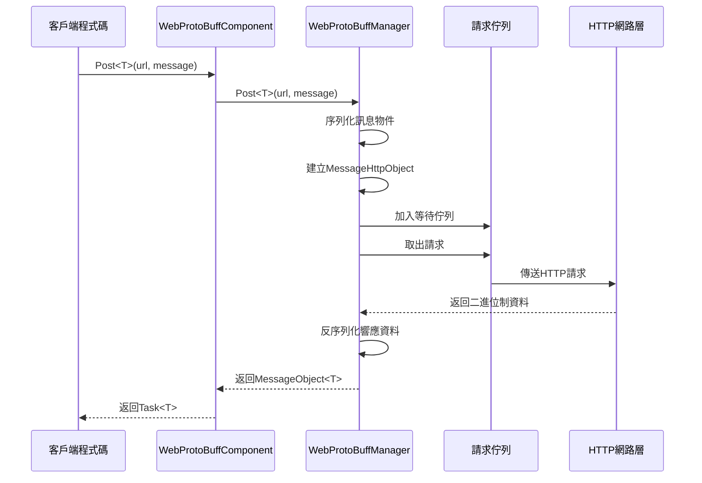
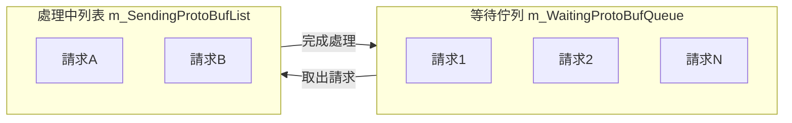

# WebProtoBuffComponent

WebProtoBuffComponent 是 GameFrameX 框架的網路請求組件，專門用於處理基於 Protocol Buffer（ProtoBuf）的 HTTP POST 請求。它提供了完整的 ProtoBuf 訊息序列化與反序列化功能，支援非同步請求處理和超時控制。

## 概述

WebProtoBuffComponent 繼承自 GameFrameworkComponent，是 Unity Game Framework 中處理 ProtoBuf 網路通訊的核心組件。該組件封裝了 HTTP 請求的底層實現，提供了簡潔的 `Post<T>` 方法用於傳送 ProtoBuf 格式的請求並接收響應。

**主要職責：**
- 管理 ProtoBuf 網路請求的生命週期
- 處理請求訊息的序列化和響應訊息的反序列化
- 提供非同步請求處理能力
- 控制請求超時時間

**使用場景：**
- 與後端伺服器進行 ProtoBuf 格式的資料互動
- 需要高效序列化/反序列化的網路通訊
- Unity WebGL 平臺的網路請求

## 架構

```mermaid
flowchart TD
    subgraph Client["客戶端層"]
        GameObject[Unity GameObject]
    end

    subgraph Component["組件層"]
        WebProtoBuff[WebProtoBuffComponent]
    end

    subgraph Manager["管理層"]
        IWebProtoBuff[IWebProtoBuffManager]
        WebProtoBuffMgr[WebProtoBuffManager]
    end

    subgraph Data["資料層"]
        MessageObject[MessageObject]
        IResponse[IResponseMessage]
        WebProtoBufData[WebProtoBufData]
    end

    subgraph Network["網路層"]
        UnityWeb[UnityWebRequest<br/>WebGL平臺]
        HttpWeb[HttpWebRequest<br/>其他平臺]
    end

    GameObject --> WebProtoBuff
    WebProtoBuff --> IWebProtoBuff
    IWebProtoBuff <|.. WebProtoBuffMgr
    WebProtoBuffMgr --> MessageObject
    WebProtoBuffMgr --> IResponse
    WebProtoBuffMgr --> WebProtoBufData
    WebProtoBufData --> UnityWeb
    WebProtoBufData --> HttpWeb
```

**架構說明：**
- **組件層（WebProtoBuffComponent）**：Unity 組件，負責初始化管理器並暴露公共 API
- **管理層（IWebProtoBuffManager/WebProtoBuffManager）**：實現請求的佇列管理、序列化/反序列化處理
- **資料層**：定義請求和響應的資料結構
- **網路層**：根據平臺選擇不同的 HTTP 請求實現（WebGL 使用 UnityWebRequest，其他平臺使用 HttpWebRequest）

## 核心流程



**流程說明：**
1. 客戶端呼叫 `Post<T>` 方法發起請求
2. 組件將請求傳遞給管理器
3. 管理器將訊息物件序列化為 ProtoBuf 格式
4. 建立 HTTP 包裝物件並加入請求佇列
5. Update 迴圈從佇列中取出請求併傳送
6. 接收響應後進行反序列化
7. 返回泛型型別的訊息物件

## API 參考

### 屬性

#### `Timeout`

```csharp
public float Timeout { get; set; }
```

獲取或設定請求超時時間（單位：秒）。當請求超過此時間未完成時會自動終止。

**預設值：** 5f

**示例：**
```csharp
var component = gameObject.GetComponent<WebProtoBuffComponent>();
component.Timeout = 10f; // 設定10秒超時
```

> Source: [WebProtoBuffComponent.cs](https://github.com/GameFrameX/com.gameframex.unity.web.protobuff/blob/main/Runtime/Web/WebProtoBuffComponent.cs#L67-L71)

---

### 方法

#### `Post<T>`

```csharp
public Task<T> Post<T>(string url, GameFrameX.Network.Runtime.MessageObject message) 
    where T : GameFrameX.Network.Runtime.MessageObject, GameFrameX.Network.Runtime.IResponseMessage
```

傳送 POST 請求，用於傳送和接收 Protocol Buffer 訊息。

**引數：**
- `url` (string): 目標伺服器的 URL 地址
- `message` (MessageObject): 要傳送的 Protocol Buffer 訊息物件，必須繼承自 MessageObject

**返回：** `Task<T>` - 非同步任務，完成時包含從伺服器接收到的 ProtoBuf 響應資料

**型別引數：**
- `T`: 返回的資料型別，必須繼承自 MessageObject 並且實現 IResponseMessage 介面

**使用條件：** 僅在啟用 `ENABLE_GAME_FRAME_X_WEB_PROTOBUF_NETWORK` 宏定義時可用

**示例：**
```csharp
// 定義請求訊息
[ProtoContract]
public class LoginRequest : MessageObject
{
    [ProtoMember(1)]
    public string Username { get; set; }
    
    [ProtoMember(2)]
    public string Password { get; set; }
}

// 定義響應訊息
[ProtoContract]
public class LoginResponse : MessageObject, IResponseMessage
{
    [ProtoMember(1)]
    public bool Success { get; set; }
    
    [ProtoMember(2)]
    public string Token { get; set; }
}

// 傳送請求
var request = new LoginRequest 
{ 
    Username = "user", 
    Password = "password" 
};

var response = await webComponent.Post<LoginResponse>("http://api.example.com/login", request);
if (response?.Success == true)
{
    Debug.Log($"登入成功，Token: {response.Token}");
}
```

> Source: [WebProtoBuffComponent.cs](https://github.com/GameFrameX/com.gameframex.unity.web.protobuff/blob/main/Runtime/Web/WebProtoBuffComponent.cs#L105-L108)

---

### 內部方法

#### `Awake`

```csharp
protected override void Awake()
```

組件初始化方法。在遊戲物件載入時呼叫，用於初始化 Web 管理器並設定超時時間。

> Source: [WebProtoBuffComponent.cs](https://github.com/GameFrameX/com.gameframex.unity.web.protobuff/blob/main/Runtime/Web/WebProtoBuffComponent.cs#L77-L90)

---

## 內部實現詳解

### 請求佇列管理

WebProtoBuffManager 使用兩個佇列管理請求：



- **m_WaitingProtoBufQueue**: 儲存等待處理的請求（初始容量 256）
- **m_SendingProtoBufList**: 儲存正在處理的請求（初始容量 16）

**處理邏輯：**
```csharp
// 當處理中請求數小於最大連線數時，從等待佇列取出請求
if (m_SendingProtoBufList.Count < MaxConnectionPerServer)
{
    if (m_WaitingProtoBufQueue.Count > 0)
    {
        var webProtoBufData = m_WaitingProtoBufQueue.Dequeue();
        MakeProtoBufBytesRequest(webProtoBufData);
        m_SendingProtoBufList.Add(webProtoBufData);
    }
}
```

> Source: [WebProtoBuffManager.ProtoBuf.cs](https://github.com/GameFrameX/com.gameframex.unity.web.protobuff/blob/main/Runtime/Web/WebProtoBuffManager.ProtoBuf.cs#L39-L55)

### 平臺差異化處理

組件根據不同平臺使用不同的 HTTP 實現：

| 平臺 | HTTP 實現 | 特點 |
|------|-----------|------|
| WebGL | UnityWebRequest | 瀏覽器安全限制，使用 Unity 的非同步 API |
| 其他平臺 | HttpWebRequest | 完整的 .NET HttpWebRequest 支援 |

**WebGL 實現：**
```csharp
#if UNITY_WEBGL
UnityEngine.Networking.UnityWebRequest unityWebRequest = UnityEngine.Networking.UnityWebRequest.Post(url, string.Empty);
unityWebRequest.timeout = (int)RequestTimeout.TotalSeconds;
unityWebRequest.SetRequestHeader("Content-Type", ProtoBufContentType);
byte[] postData = webData.SendData;
unityWebRequest.uploadHandler = new UnityEngine.Networking.UploadHandlerRaw(postData);
```

> Source: [WebProtoBuffManager.ProtoBuf.cs](https://github.com/GameFrameX/com.gameframex.unity.web.protobuff/blob/main/Runtime/Web/WebProtoBuffManager.ProtoBuf.cs#L87-L116)

### ProtoBuf 序列化流程

1. 客戶端傳入 MessageObject
2. 透過 ProtoMessageIdHandler 獲取訊息 ID
3. 建立 MessageHttpObject 包裝物件（包含 ID、UniqueId、Body）
4. 使用 SerializerHelper 序列化整個物件為位元組陣列
5. 傳送 HTTP 請求

**響應處理：**
1. 接收伺服器返回的二進位制資料
2. 反序列化為 MessageHttpObject
3. 驗證訊息 ID 與預期型別匹配
4. 反序列化 Body 為目標型別 T

> Source: [WebProtoBuffManager.ProtoBuf.cs](https://github.com/GameFrameX/com.gameframex.unity.web.protobuff/blob/main/Runtime/Web/WebProtoBuffManager.ProtoBuf.cs#L178-L201)

---

## 相關連結

- [IWebProtoBuffManager](./5-api-reference.iwebprotobuffmanager) - Web ProtoBuff 管理器介面
- [組件配置](./6-configuration.component-config) - WebProtoBuffComponent 配置說明
- [編譯宏定義](./6-configuration.compile-defines) - ENABLE_GAME_FRAME_X_WEB_PROTOBUF_NETWORK 宏定義說明
- [平臺說明](./7-platforms.platform-info) - 平臺支援說明
- [快速入門](./3-getting-started.quick-start) - 快速開始使用
