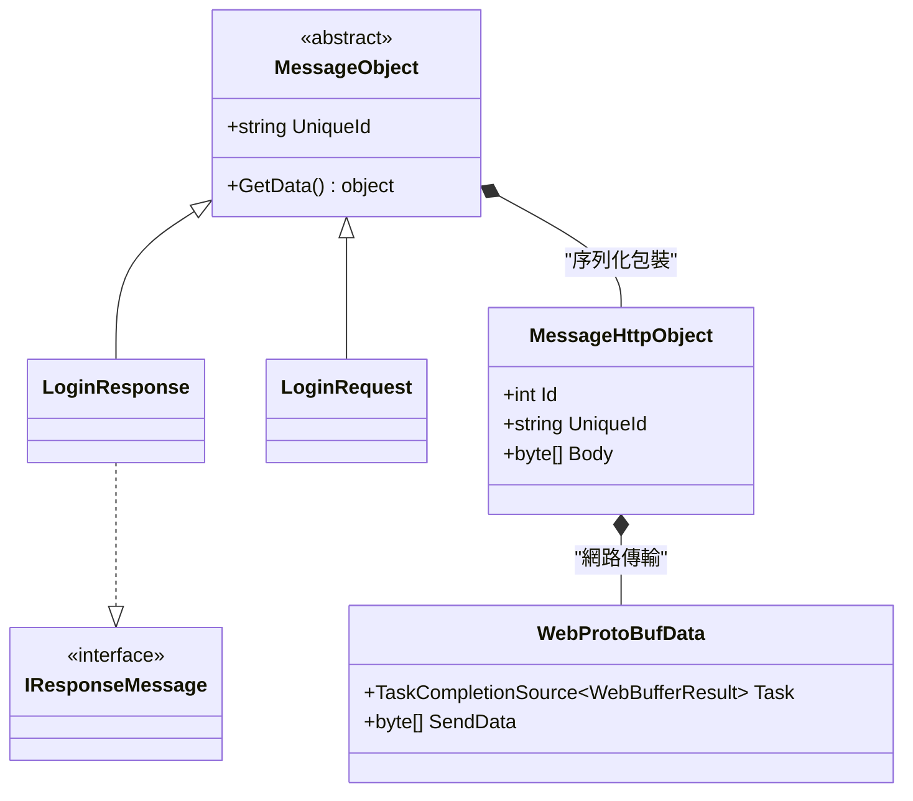
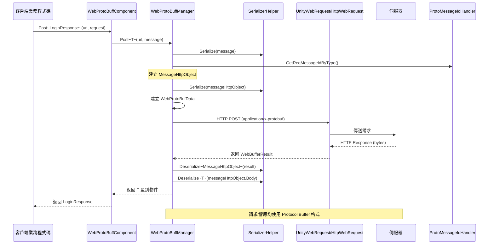

# 訊息定義

本文件介紹 GameFrameX Web ProtoBuff 外掛中的訊息定義機制，包括訊息基類、HTTP 訊息包裝器以及 Protocol Buffer 訊息的結構定義。

## 概述

Web ProtoBuff 外掛基於 **protobuf-net** 庫實現 Protocol Buffer 訊息的序列化和反序列化。訊息系統採用分層設計：

- **基礎層**：`MessageObject` - 所有訊息的基類
- **傳輸層**：`MessageHttpObject` - HTTP 傳輸的訊息包裝器
- **應用層**：使用者自定義的業務訊息類

這種設計實現了業務邏輯與網路傳輸的解耦，使得開發者可以專注於業務訊息的定義，而無需關心底層的網路通訊細節。

## 訊息架構



### 核心組件說明

| 組件 | 名稱空間 | 說明 |
|------|----------|------|
| `MessageObject` | GameFrameX.Network.Runtime | 所有 ProtoBuf 訊息的抽象基類 |
| `IResponseMessage` | GameFrameX.Network.Runtime | 響應訊息介面，標識訊息型別為響應 |
| `MessageHttpObject` | GameFrameX.Network.Runtime | HTTP 傳輸包裝器，包含訊息 ID 和訊息體 |
| `WebProtoBufData` | GameFrameX.Web.ProtoBuff.Runtime | 內部請求資料類，管理請求佇列 |

## 訊息序列化流程



### 流程說明

1. **訊息建立**：客戶端建立繼承自 `MessageObject` 的請求訊息物件
2. **訊息包裝**：將業務訊息序列化為位元組陣列，幷包裝到 `MessageHttpObject` 中
3. **訊息 ID**：透過 `ProtoMessageIdHandler` 獲取訊息型別對應的唯一 ID
4. **網路傳輸**：使用 HTTP POST 方法，Content-Type 設定為 `application/x-protobuf`
5. **響應處理**：伺服器返回的資料先反序列化為 `MessageHttpObject`，再從中提取業務響應訊息

## 訊息定義示例

### 定義請求訊息

請求訊息需要繼承自 `MessageObject` 基類，並使用 `ProtoContract` 和 `ProtoMember` 特性標記：

```csharp
using ProtoBuf;
using GameFrameX.Network.Runtime;

[ProtoContract]
public class LoginRequest : MessageObject
{
    [ProtoMember(1)]
    public string Username { get; set; }
    
    [ProtoMember(2)]
    public string Password { get; set; }
    
    [ProtoMember(3)]
    public string DeviceId { get; set; }
}
```
> Source: [README.md](https://github.com/GameFrameX/com.gameframex.unity.web.protobuff/blob/main/README.md#L66-L77)

### 定義響應訊息

響應訊息除了繼承 `MessageObject` 外，還需要實現 `IResponseMessage` 介面：

```csharp
using ProtoBuf;
using GameFrameX.Network.Runtime;

[ProtoMember(1)]
public bool Success { get; set; }

[ProtoMember(2)]
public string Token { get; set; }

[ProtoMember(3)]
public string Message { get; set; }
}
```
> Source: [README.md](https://github.com/GameFrameX/com.gameframex.unity.web.protobuff/blob/main/README.md#L79-L88)

### 完整使用示例

```csharp
using UnityEngine;
using GameFrameX.Web.ProtoBuff.Runtime;

public class LoginController : MonoBehaviour
{
    public WebProtoBuffComponent WebComponent;

    private async void Start()
    {
        var request = new LoginRequest 
        { 
            Username = "user", 
            Password = "password" 
        };
        
        string url = "http://api.example.com/login";

        try
        {
            // 傳送請求並等待結果
            LoginResponse response = await WebComponent.Post<LoginResponse>(url, request);
            
            if (response != null)
            {
                Debug.Log($"Login Result: {response.Success}, Token: {response.Token}");
            }
        }
        catch (System.Exception e)
        {
            Debug.LogError($"Request Failed: {e.Message}");
        }
    }
}
```
> Source: [README.md](https://github.com/GameFrameX/com.gameframex.unity.web.protobuff/blob/main/README.md#L98-L127)

## ProtoBuf 特性說明

### 常用特性

| 特性 | 作用 | 注意事項 |
|------|------|----------|
| `[ProtoContract]` | 標記類為 ProtoBuf 序列化目標 | 必須新增在類宣告上方 |
| `[ProtoMember(n)]` | 標記屬性為序列化成員，n 為欄位編號 | 編號必須唯一，建議從 1 開始連續編號 |
| `[ProtoIgnore]` | 標記屬性不參與序列化 | 用於不需要網路傳輸的屬性 |

### 訊息設計原則

1. **欄位編號唯一性**：每個 `[ProtoMember]` 的編號必須在類內唯一
2. **編號連續性**：建議使用從 1 開始的連續編號，便於擴充套件
3. **型別相容性**：欄位型別變更後需要保持向後相容
4. **命名規範**：使用 PascalCase 命名屬性，ProtoBuf 會自動轉換

## HTTP 訊息包裝

`MessageHttpObject` 是用於 HTTP 傳輸的訊息包裝類，其結構如下：

```csharp
public class MessageHttpObject
{
    /// <summary>
    /// 訊息型別 ID，用於標識訊息種類
    /// </summary>
    public int Id { get; set; }
    
    /// <summary>
    /// 訊息唯一標識，用於請求/響應配對
    /// </summary>
    public string UniqueId { get; set; }
    
    /// <summary>
    /// 訊息體位元組陣列，包含實際業務資料
    /// </summary>
    public byte[] Body { get; set; }
}
```

在傳送請求時，外掛執行以下序列化步驟：

```csharp
// 來自 WebProtoBuffManager.ProtoBuf.cs
var id = ProtoMessageIdHandler.GetReqMessageIdByType(message.GetType());
MessageHttpObject messageHttpObject = new MessageHttpObject
{
    Id = id,
    UniqueId = message.UniqueId,
    Body = SerializerHelper.Serialize(message),
};
var sendData = SerializerHelper.Serialize(messageHttpObject);
```
> Source: [Runtime/Web/WebProtoBuffManager.ProtoBuf.cs#L214-L221](https://github.com/GameFrameX/com.gameframex.unity.web.protobuff/blob/main/Runtime/Web/WebProtoBuffManager.ProtoBuf.cs#L214-L221)

## 相關連結

- [組件架構](./4-core-concepts.architecture) - 瞭解 WebProtoBuffComponent 的架構設計
- [快速入門](./3-getting-started.quick-start) - 開始使用 Web ProtoBuff 組件
- [API 參考 - WebProtoBuffComponent](./5-api-reference.webprotobuffcomponent) - 組件完整 API 文件
- [API 參考 - IWebProtoBuffManager](./5-api-reference.iwebprotobuffmanager) - 管理器介面文件
- [編譯宏定義](./6-configuration.compile-defines) - 如何啟用 ProtoBuf 網路功能
