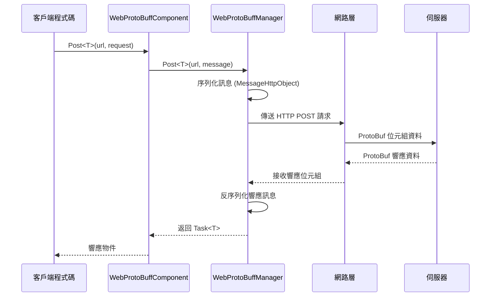

# 基礎示例

本節提供 Web ProtoBuff 外掛的基礎使用示例，幫助開發者快速上手並理解核心用法。

## 概述

Web ProtoBuff 組件是基於 GameFrameX 框架的網路請求模組，專門用於處理基於 Protocol Buffer 格式的 HTTP POST 請求。該組件提供以下核心功能：

- **ProtoBuf 序列化**：自動將訊息物件序列化為位元組資料進行傳送
- **非同步請求**：基於 Task<T> 的非同步 API，支援 async/await 模式
- **跨平臺支援**：相容 Unity WebGL 及原生平臺
- **超時控制**：可配置請求超時時間

## 快速流程

以下流程圖展示了使用 WebProtoBuffComponent 傳送請求的基本流程：



## 訊息定義示例

在使用 Web ProtoBuff 之前，需要定義請求和響應的 ProtoBuf 訊息型別。

### 請求訊息定義

```csharp
using ProtoBuf;
using GameFrameX.Network.Runtime;

[ProtoContract]
public class LoginRequest : MessageObject
{
    [ProtoMember(1)]
    public string Username { get; set; }
    
    [ProtoMember(2)]
    public string Password { get; set; }
}
```
> Source: [README.md](https://github.com/GameFrameX/com.gameframex.unity.web.protobuff/blob/main/README.md#L65-L77)

### 響應訊息定義

```csharp
using ProtoBuf;
using GameFrameX.Network.Runtime;

[ProtoContract]
public class LoginResponse : MessageObject, IResponseMessage
{
    [ProtoMember(1)]
    public bool Success { get; set; }
    
    [ProtoMember(2)]
    public string Token { get; set; }
}
```
> Source: [README.md](https://github.com/GameFrameX/com.gameframex.unity.web.protobuff/blob/main/README.md#L79-L88)

**關鍵要點：**
- 使用 `[ProtoContract]` 屬性標記類為 ProtoBuf 契約
- 使用 `[ProtoMember(N)]` 屬性標記需要序列化的屬性
- 請求訊息只需繼承 `MessageObject`
- 響應訊息需要繼承 `MessageObject` 並實現 `IResponseMessage` 介面

## 傳送請求示例

### 完整使用示例

以下是在 Unity 指令碼中使用 WebProtoBuffComponent 傳送登入請求的完整示例：

```csharp
using UnityEngine;
using GameFrameX.Web.ProtoBuff.Runtime;

public class LoginController : MonoBehaviour
{
    public WebProtoBuffComponent WebComponent;

    private async void Start()
    {
        var request = new LoginRequest 
        { 
            Username = "user", 
            Password = "password" 
        };
        
        string url = "http://api.example.com/login";

        try
        {
            // 傳送請求並等待結果
            LoginResponse response = await WebComponent.Post<LoginResponse>(url, request);
            
            if (response != null)
            {
                Debug.Log($"Login Result: {response.Success}, Token: {response.Token}");
            }
        }
        catch (System.Exception e)
        {
            Debug.LogError($"Request Failed: {e.Message}");
        }
    }
}
```
> Source: [README.md](https://github.com/GameFrameX/com.gameframex.unity.web.protobuff/blob/main/README.md#L94-L128)

### 獲取組件例項

在 Unity 場景中，WebProtoBuffComponent 作為遊戲框架組件使用。通常透過以下方式獲取：

```csharp
// 方式1：透過場景中的組件引用（需要在 Inspector 中配置）
public WebProtoBuffComponent webProtoBuffComponent;

// 方式2：透過框架獲取
var webComponent = UnityGameFramework.Runtime.GameEntry.GetComponent<WebProtoBuffComponent>();
```

### 超時設定

可以透過組件的 Timeout 屬性設定請求超時時間（單位：秒）：

```csharp
// 設定超時為 10 秒
webProtoBuffComponent.Timeout = 10f;
```
> Source: [WebProtoBuffComponent.cs](https://github.com/GameFrameX/com.gameframex.unity.web.protobuff/blob/main/Runtime/Web/WebProtoBuffComponent.cs#L67-L71)

## 啟用功能

### 編譯宏定義

使用 ProtoBuff 網路功能需要在 Unity 中啟用編譯宏。開啟 **Edit > Project Settings > Player**，在 **Scripting Define Symbols** 中新增：

```
ENABLE_GAME_FRAME_X_WEB_PROTOBUF_NETWORK
```

> **注意**：此宏定義是可選的。如果未新增宏定義，Post<T> 方法將被禁用，組件僅保留基礎功能。

該宏定義也可以透過程式集定義檔案自動定義，當專案依賴 `com.gameframex.unity.network` 包時會自動啟用。

## 資料格式說明

### 請求資料格式

傳送的請求資料採用 `MessageHttpObject` 包裝格式：

```csharp
MessageHttpObject messageHttpObject = new MessageHttpObject
{
    Id = messageId,           // 訊息型別標識
    UniqueId = uniqueId,      // 唯一請求標識
    Body = serializedBody    // 序列化後的訊息體
};
```
> Source: [WebProtoBuffManager.ProtoBuf.cs](https://github.com/GameFrameX/com.gameframex.unity.web.protobuff/blob/main/Runtime/Web/WebProtoBuffManager.ProtoBuf.cs#L214-L221)

### HTTP 請求頭

- **Content-Type**: `application/x-protobuf`
- **請求方法**: POST
- **超時控制**: 透過 RequestTimeout 屬性設定

## 錯誤處理

在實際應用中，應當處理以下常見錯誤：

```csharp
try
{
    var response = await WebComponent.Post<LoginResponse>(url, request);
    
    if (response == null)
    {
        Debug.LogWarning("Response is null - server may be unreachable");
        return;
    }
    
    // 處理業務邏輯
}
catch (TimeoutException e)
{
    Debug.LogError($"Request timeout: {e.Message}");
}
catch (WebException e)
{
    Debug.LogError($"Network error: {e.Status} - {e.Message}");
}
catch (System.Exception e)
{
    Debug.LogError($"Unexpected error: {e.Message}");
}
```

## 除錯日誌

外掛支援傳送和接收訊息的除錯日誌，便於開發除錯：

- **傳送日誌**：啟用 `ENABLE_GAMEFRAMEX_WEB_SEND_LOG` 宏定義
- **接收日誌**：啟用 `ENABLE_GAMEFRAMEX_WEB_RECEIVE_LOG` 宏定義

日誌輸出格式示例：
```
傳送訊息 ID:[1001,uuid123,LoginRequest] 訊息內容:{...}
接收訊息 ID:[1001,uuid123,LoginResponse] 訊息內容:{...}
```
> Source: [WebProtoBuffManager.ProtoBuf.cs](https://github.com/GameFrameX/com.gameframex.unity.web.protobuff/blob/main/Runtime/Web/WebProtoBuffManager.ProtoBuf.cs#L227-L241)

## 相關連結

- [快速入門](../3-getting-started.quick-start) - 瞭解快速開始步驟
- [組件架構](../4-core-concepts.architecture) - 深入瞭解架構設計
- [訊息定義](../4-core-concepts.message-definition) - ProtoBuf 訊息詳解
- [API 參考 - WebProtoBuffComponent](../5-api-reference.webprotobuffcomponent) - 完整 API 文件
- [編譯宏定義](../6-configuration.compile-defines) - 配置編譯選項
