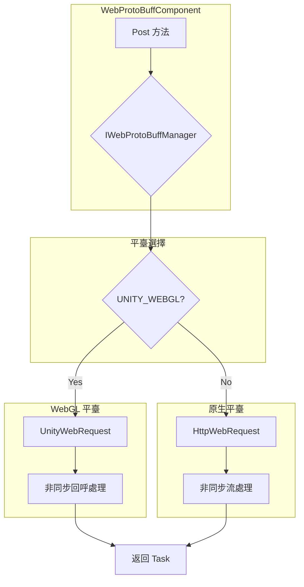

# 平臺說明

本文件詳細介紹 GameFrameX Web ProtoBuff 組件在不同 Unity 平臺上的支援情況、平臺特定的實現差異以及各平臺的配置要求。

## 概述

GameFrameX Web ProtoBuff 組件是一個跨平臺的 HTTP 網路請求組件，專門用於處理基於 Protocol Buffer 格式的網路通訊。該組件設計為在多個 Unity 平臺上無縫執行，根據目標平臺自動選擇最合適的網路請求實現方式。

組件的核心設計理念是提供統一的 API 介面，同時利用各平臺原生的網路能力，以獲得最佳的效能和相容性。

## 支援的平臺

該組件支援以下 Unity 平臺：

| 平臺 | 支援狀態 | 網路實現方式 | 說明 |
|------|---------|-------------|------|
| **WebGL** | ✅ 完全支援 | UnityWebRequest | 瀏覽器環境專用實現 |
| **Windows** | ✅ 完全支援 | HttpWebRequest | .NET 標準 HTTP 客戶端 |
| **macOS** | ✅ 完全支援 | HttpWebRequest | .NET 標準 HTTP 客戶端 |
| **Linux** | ✅ 完全支援 | HttpWebRequest | .NET 標準 HTTP 客戶端 |
| **Android** | ✅ 完全支援 | HttpWebRequest | .NET 標準 HTTP 客戶端 |
| **iOS** | ✅ 完全支援 | HttpWebRequest | .NET 標準 HTTP 客戶端 |
| **Switch** | ✅ 完全支援 | HttpWebRequest | .NET 標準 HTTP 客戶端 |
| **PS4/PS5** | ✅ 完全支援 | HttpWebRequest | .NET 標準 HTTP 客戶端 |
| **Xbox** | ✅ 完全支援 | HttpWebRequest | .NET 標準 HTTP 客戶端 |

## 平臺架構

該組件採用條件編譯的方式實現跨平臺支援，透過檢測 `UNITY_WEBGL` 宏來區分 WebGL 平臺和其他平臺。



### 平臺選擇邏輯說明

組件在執行時透過編譯期的條件編譯指令選擇合適的網路實現：

- **WebGL 平臺**：使用 `UnityEngine.Networking.UnityWebRequest`，這是 Unity 官方提供的 WebGL 環境網路請求 API
- **其他所有平臺**：使用 `System.Net.HttpWebRequest`，這是 .NET 標準的 HTTP 請求實現

## 平臺特定實現差異

### WebGL 平臺實現

WebGL 平臺的實現位於 `Runtime/Web/WebProtoBuffManager.ProtoBuf.cs` 檔案的第 87-116 行。該實現使用 Unity 提供的 `UnityWebRequest` 類，這是 WebGL 平臺上唯一可用的 HTTP 請求方式。

```csharp
#if UNITY_WEBGL
    UnityEngine.Networking.UnityWebRequest unityWebRequest;
    if (webData.IsGet)
    {
        unityWebRequest = UnityEngine.Networking.UnityWebRequest.Get(webData.URL);
    }
    else
    {
        unityWebRequest = UnityEngine.Networking.UnityWebRequest.Post(webData.URL, string.Empty);
    }

    unityWebRequest.timeout = (int)RequestTimeout.TotalSeconds;
    {
        unityWebRequest.SetRequestHeader("Content-Type", ProtoBufContentType);
        byte[] postData = webData.SendData;
        unityWebRequest.uploadHandler = new UnityEngine.Networking.UploadHandlerRaw(postData);
    }

    var asyncOperation = unityWebRequest.SendWebRequest();
    asyncOperation.completed += (asyncOperation2) =>
    {
        m_SendingProtoBufList.Remove(webData);
        if (unityWebRequest.isNetworkError || unityWebRequest.isHttpError || unityWebRequest.error != null)
        {
            webData.Task.TrySetException(new Exception(unityWebRequest.error));
            return;
        }

        webData.Task.SetResult(new WebBufferResult(webData.UserData, unityWebRequest.downloadHandler.data));
    };
#endif
```
> Source: [WebProtoBuffManager.ProtoBuf.cs](https://github.com/GameFrameX/com.gameframex.unity.web.protobuff/blob/main/Runtime/Web/WebProtoBuffManager.ProtoBuf.cs#L87-L116)

**WebGL 實現特點：**
- 使用回呼函式處理非同步完成事件
- 透過 `SendWebRequest()` 方法傳送請求
- 錯誤檢測使用 `isNetworkError`、`isHttpError` 和 `error` 屬性
- 內容型別設定為 `application/x-protobuf`

### 原生平臺實現

原生平臺的實現位於同一檔案的第 117-165 行，使用 .NET 的 `HttpWebRequest` 類：

```csharp
#else
    try
    {
        HttpWebRequest request = WebRequest.CreateHttp(webData.URL);
        request.Method = webData.IsGet ? WebRequestMethods.Http.Get : WebRequestMethods.Http.Post;
        request.Timeout = (int)RequestTimeout.TotalMilliseconds;
        request.ContentType = ProtoBufContentType;
        byte[] postData = webData.SendData;
        request.ContentLength = postData.Length;
        using (Stream requestStream = request.GetRequestStream())
        {
            await requestStream.WriteAsync(postData, 0, postData.Length);
        }

        using (HttpWebResponse response = (HttpWebResponse)await request.GetResponseAsync())
        {
            using (Stream responseStream = response.GetResponseStream())
            {
                m_MemoryStream.SetLength(response.ContentLength);
                m_MemoryStream.Position = 0;
                await responseStream.CopyToAsync(m_MemoryStream);
                webData.Task.SetResult(new WebBufferResult(webData.UserData, m_MemoryStream.ToArray()));
            }
        }
    }
    catch (WebException e)
    {
        if (e.Status == WebExceptionStatus.Timeout)
        {
            webData.Task.SetException(new TimeoutException(e.Message));
            return;
        }
        webData.Task.SetException(e);
    }
    // ... 更多異常處理
#endif
```
> Source: [WebProtoBuffManager.ProtoBuf.cs](https://github.com/GameFrameX/com.gameframex.unity.web.protobuff/blob/main/Runtime/Web/WebProtoBuffManager.ProtoBuf.cs#L117-L165)

**原生平臺實現特點：**
- 使用 async/await 模式處理非同步操作
- 支援完整的 .NET 異常處理機制
- 包含超時異常（TimeoutException）的專門處理
- 使用記憶體流處理響應資料

## 內容型別

無論在哪個平臺上執行，組件都使用相同的內容型別 `application/x-protobuf`：

```csharp
private const string ProtoBufContentType = "application/x-protobuf";
```
> Source: [WebProtoBuffManager.ProtoBuf.cs](https://github.com/GameFrameX/com.gameframex.unity.web.protobuff/blob/main/Runtime/Web/WebProtoBuffManager.ProtoBuf.cs#L32)

這個內容型別是 Protocol Buffer 標準的 HTTP 傳輸型別，確保伺服器能夠正確識別和處理 ProtoBuf 格式的請求和響應資料。

## 編譯宏定義

組件透過 `versionDefines` 自動管理編譯宏，無需手動配置：

```json
{
  "versionDefines": [
    {
      "name": "com.gameframex.unity.network",
      "expression": "",
      "define": "ENABLE_GAME_FRAME_X_WEB_PROTOBUF_NETWORK"
    }
  ]
}
```
> Source: [GameFrameX.Web.ProtoBuff.Runtime.asmdef](https://github.com/GameFrameX/com.gameframex.unity.web.protobuff/blob/main/Runtime/GameFrameX.Web.ProtoBuff.Runtime.asmdef#L17-L23)

當專案安裝 `com.gameframex.unity.network` 包後，系統會自動定義 `ENABLE_GAME_FRAME_X_WEB_PROTOBUF_NETWORK` 宏，從而啟用 ProtoBuff 網路功能。

## 平臺特定注意事項

### WebGL 平臺

1. **瀏覽器限制**：WebGL 執行在瀏覽器環境中，受到瀏覽器的同源策略 (Same-Origin Policy) 限制
2. **非同步模式**：WebGL 不支援多執行緒，組件使用回呼函式模式處理非同步完成事件
3. **超時行為**：UnityWebRequest 的超時設定在 WebGL 平臺上可能受到瀏覽器實現的限制
4. **HTTPS 支援**：WebGL 完全支援 HTTPS 協議，但需要伺服器配置有效的 SSL 證書

### 原生平臺

1. **執行緒安全**：原生平臺支援完整的多執行緒操作，使用 async/await 模式
2. **超時處理**：支援更精確的超時控制，包括連線超時和讀取超時
3. **代理支援**：支援透過系統代理進行網路請求
4. **SSL/TLS**：支援完整的 SSL/TLS 協議棧

## 依賴項

各平臺共享以下核心依賴：

| 依賴包 | 版本 | 說明 |
|--------|------|------|
| com.gameframex.unity | 1.1.1 | 核心框架 |
| com.gameframex.unity.web | 1.0.0 | Web 基礎組件 |
| com.gameframex.unity.network | 1.0.0 | 網路模組（啟用 ProtoBuff 功能） |
| com.gameframex.unity.google.protobuf | 1.0.0 | Google Protobuf 序列化庫 |

> 詳細依賴資訊請參見 [依賴項](./2-installation.dependencies) 文件。

## 平臺選擇建議

根據專案需求選擇合適的目標平臺：

| 場景 | 推薦平臺 | 理由 |
|------|---------|------|
| **Web 網頁遊戲** | WebGL | 直接在瀏覽器中執行，無需外掛 |
| **移動端遊戲** | Android/iOS | 效能最優，完整的網路功能 |
| **PC 客戶端** | Windows/macOS/Linux | 開發除錯方便 |
| **主機遊戲** | PS4/PS5/Xbox/Switch | 商業主機平臺支援 |

## 相關連結

- [組件配置](./6-configuration.component-config)
- [編譯宏定義](./6-configuration.compile-defines)
- [快速入門](./3-getting-started.quick-start)
- [API 參考 - WebProtoBuffComponent](./5-api-reference.webprotobuffcomponent)
- [API 參考 - IWebProtoBuffManager](./5-api-reference.iwebprotobuffmanager)
- [GitHub 倉庫](https://github.com/GameFrameX/com.gameframex.unity.web.protobuff.git)
