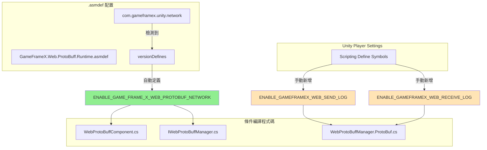

# 編譯宏定義

編譯宏定義（Compile Defines）是用於控制程式碼編譯行為的重要機制，透過前處理器指令實現程式碼的條件編譯。本文件詳細介紹 Web ProtoBuff 組件中使用的所有編譯宏定義及其配置方法。

## 概述

Web ProtoBuff 組件使用編譯宏定義來控制功能模組的啟用與禁用，這種設計具有以下優勢：

- **條件編譯**：根據不同的編譯環境啟用或禁用特定功能
- **依賴管理**：透過版本定義（versionDefines）自動管理功能依賴
- **除錯支援**：提供獨立的除錯日誌開關，不影響正式釋出版本

## 編譯宏定義詳解

### ENABLE_GAME_FRAME_X_WEB_PROTOBUF_NETWORK

**功能說明**

這是 Web ProtoBuff 組件的核心編譯宏定義，用於控制 Protocol Buffer 網路請求功能的可用性。當啟用此宏時，組件將暴露 `Post<T>` 方法，允許開發者傳送和接收 Protocol Buffer 格式的訊息。

> 此宏定義在 `Runtime/GameFrameX.Web.ProtoBuff.Runtime.asmdef` 檔案中透過版本定義（versionDefines）自動管理：
> Source: [GameFrameX.Web.ProtoBuff.Runtime.asmdef](https://github.com/GameFrameX/com.gameframex.unity.web.protobuff/blob/main/Runtime/GameFrameX.Web.ProtoBuff.Runtime.asmdef#L17-L22)

**依賴條件**

該宏的啟用依賴於 `com.gameframex.unity.network` 包的存在。當專案中引用了 GameFrameX Network 執行時包時，asmdef 會自動定義此宏：

```json
"versionDefines": [
    {
      "name": "com.gameframex.unity.network",
      "expression": "",
      "define": "ENABLE_GAME_FRAME_X_WEB_PROTOBUF_NETWORK"
    }
]
```

**受影響的程式碼**

以下程式碼片段展示了條件編譯的使用方式：

```csharp
// WebProtoBuffComponent.cs
#if ENABLE_GAME_FRAME_X_WEB_PROTOBUF_NETWORK
        /// <summary>
        /// 傳送Post請求，用於傳送和接收Protocol Buffer訊息。
        /// 此方法僅在啟用ENABLE_GAME_FRAME_X_WEB_PROTOBUF_NETWORK宏定義時可用。
        /// </summary>
        public Task<T> Post<T>(string url, GameFrameX.Network.Runtime.MessageObject message) 
            where T : GameFrameX.Network.Runtime.MessageObject, GameFrameX.Network.Runtime.IResponseMessage
        {
            return m_WebProtoBuffManager.Post<T>(url, message);
        }
#endif
```
> Source: [WebProtoBuffComponent.cs](https://github.com/GameFrameX/com.gameframex.unity.web.protobuff/blob/main/Runtime/Web/WebProtoBuffComponent.cs#L92-L109)

```csharp
// IWebProtoBuffManager.cs
#if ENABLE_GAME_FRAME_X_WEB_PROTOBUF_NETWORK
        /// <summary>
        /// 傳送Protobuf訊息的Post請求，並接收指定型別的響應
        /// </summary>
        Task<T> Post<T>(string url, GameFrameX.Network.Runtime.MessageObject message) 
            where T : GameFrameX.Network.Runtime.MessageObject, GameFrameX.Network.Runtime.IResponseMessage;
#endif
```
> Source: [IWebProtoBuffManager.cs](https://github.com/GameFrameX/com.gameframex.unity.web.protobuff/blob/main/Runtime/Web/IWebProtoBuffManager.cs#L11-L24)

### ENABLE_GAMEFRAMEX_WEB_RECEIVE_LOG

**功能說明**

除錯日誌宏，用於在執行時輸出接收到的 Protocol Buffer 訊息日誌。啟用後，當組件接收到伺服器響應時，會自動記錄訊息的 ID、唯一識別符號、型別名稱以及訊息內容。

**使用方法**

在 Unity 的 **Player Settings** → **Scripting Define Symbols** 中新增此宏定義即可啟用接收日誌功能：

```
ENABLE_GAMEFRAMEX_WEB_RECEIVE_LOG
```

**程式碼實現**

```csharp
private void DebugReceiveLog(MessageObject messageObject)
{
#if ENABLE_GAMEFRAMEX_WEB_RECEIVE_LOG
            var messageId = ProtoMessageIdHandler.GetReqMessageIdByType(messageObject.GetType());
            Log.Debug($"接收訊息 ID:[{messageId},{messageObject.UniqueId},{messageObject.GetType().Name}] 訊息內容:{GameFrameX.Runtime.Utility.Json.ToJson(messageObject)}");
#endif
}
```
> Source: [WebProtoBuffManager.ProtoBuf.cs](https://github.com/GameFrameX/com.gameframex.unity.web.protobuff/blob/main/Runtime/Web/WebProtoBuffManager.ProtoBuf.cs#L227-L233)

### ENABLE_GAMEFRAMEX_WEB_SEND_LOG

**功能說明**

除錯日誌宏，用於在執行時輸出傳送的 Protocol Buffer 訊息日誌。啟用後，當組件傳送請求時，會自動記錄訊息的 ID、唯一識別符號、型別名稱以及訊息內容。

**使用方法**

在 Unity 的 **Player Settings** → **Scripting Define Symbols** 中新增此宏定義即可啟用傳送日誌功能：

```
ENABLE_GAMEFRAMEX_WEB_SEND_LOG
```

**程式碼實現**

```csharp
private void DebugSendLog(MessageObject messageObject)
{
#if ENABLE_GAMEFRAMEX_WEB_SEND_LOG
            var messageId = ProtoMessageIdHandler.GetReqMessageIdByType(messageObject.GetType());
            Log.Debug($"傳送訊息 ID:[{messageId},{messageObject.UniqueId},{messageObject.GetType().Name}] 訊息內容:{GameFrameX.Runtime.Utility.Json.ToJson(messageObject)}");
#endif
}
```
> Source: [WebProtoBuffManager.ProtoBuf.cs](https://github.com/GameFrameX/com.gameframex.unity.web.protobuff/blob/main/Runtime/Web/WebProtoBuffManager.ProtoBuf.cs#L235-L241)

## 編譯宏定義架構

以下 Mermaid 圖表展示了編譯宏定義與程式碼模組之間的關係：



## 配置指南

### 自動管理宏定義

核心功能宏 `ENABLE_GAME_FRAME_X_WEB_PROTOBUF_NETWORK` 由 asmdef 自動管理，只需確保專案中已正確安裝 `com.gameframex.unity.network` 包即可。

安裝步驟：
1. 在 `manifest.json` 的 `dependencies` 中新增：
   ```json
   "com.gameframex.unity.network": "https://github.com/GameFrameX/com.gameframex.unity.network.git"
   ```
2. 等待 Unity Package Manager 完成安裝
3. 編譯專案，宏定義將自動生效

### 手動新增宏定義

對於除錯日誌宏，需要手動在 Unity 中配置：

1. 開啟 Unity 編輯器
2. 選單欄選擇 **Edit** → **Project Settings** → **Player**
3. 在 **Player Settings** 視窗中，選擇 **Other Settings** 選項卡
4. 找到 **Scripting Define Symbols** 欄位
5. 新增所需的宏定義（多個宏用分號分隔）

```text
ENABLE_GAMEFRAMEX_WEB_SEND_LOG;ENABLE_GAMEFRAMEX_WEB_RECEIVE_LOG
```

### 推薦的宏定義配置

| 構建型別 | 推薦的宏定義 |
|----------|-------------|
| 開發除錯 | `ENABLE_GAMEFRAMEX_WEB_SEND_LOG;ENABLE_GAMEFRAMEX_WEB_RECEIVE_LOG` |
| 測試釋出 | （僅核心宏，由 asmdef 自動管理） |
| 正式釋出 | （無額外宏定義） |

## 編譯宏定義彙總表

| 宏定義名稱 | 作用範圍 | 管理方式 | 用途 |
|------------|----------|----------|------|
| `ENABLE_GAME_FRAME_X_WEB_PROTOBUF_NETWORK` | 核心功能 | asmdef 自動管理 | 啟用 Protocol Buffer 網路請求功能 |
| `ENABLE_GAMEFRAMEX_WEB_SEND_LOG` | 除錯功能 | 手動配置 | 啟用傳送訊息日誌 |
| `ENABLE_GAMEFRAMEX_WEB_RECEIVE_LOG` | 除錯功能 | 手動配置 | 啟用接收訊息日誌 |
| `UNITY_WEBGL` | 平臺特定 | Unity 自動定義 | WebGL 平臺專用程式碼 |

## 常見問題

### Q: 新增宏定義後程式碼沒有生效？

**解決方案**：
1. 確保在正確的平臺（Platform）下新增宏定義
2. 新增後需要重新編譯專案（選單：**Build Settings** → **Build** 或 **Compile**）
3. 檢查是否有多層巢狀的 `#if` 條件，可能被外層條件阻止

### Q: 除錯日誌沒有輸出？

**解決方案**：
1. 確認已在 Player Settings 中正確新增 `ENABLE_GAMEFRAMEX_WEB_SEND_LOG` 或 `ENABLE_GAMEFRAMEX_WEB_RECEIVE_LOG`
2. 檢查 Unity 的 Log 級別設定，確保 Debug 日誌可見
3. 確認網路請求確實在傳送/接收中

### Q: Post<T> 方法不可用？

**解決方案**：
1. 確認 `com.gameframex.unity.network` 包已正確安裝
2. 檢查是否啟用了 `ENABLE_GAME_FRAME_X_WEB_PROTOBUF_NETWORK` 宏
3. 確保 WebProtoBuffComponent 組件已正確新增到場景中

## 相關連結

- [組件配置](./6-configuration.component-config)
- [平臺說明](./7-platforms.platform-info)
- [外掛介紹](./1-overview.introduction)
- [快速入門](./3-getting-started.quick-start)
